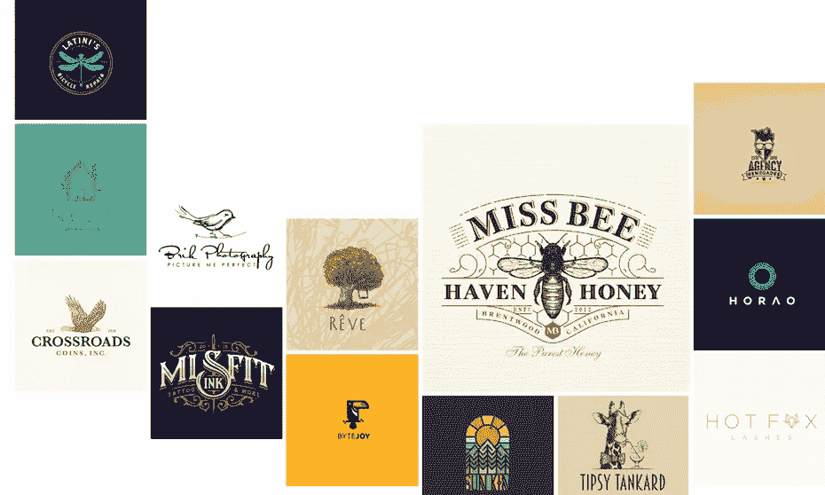
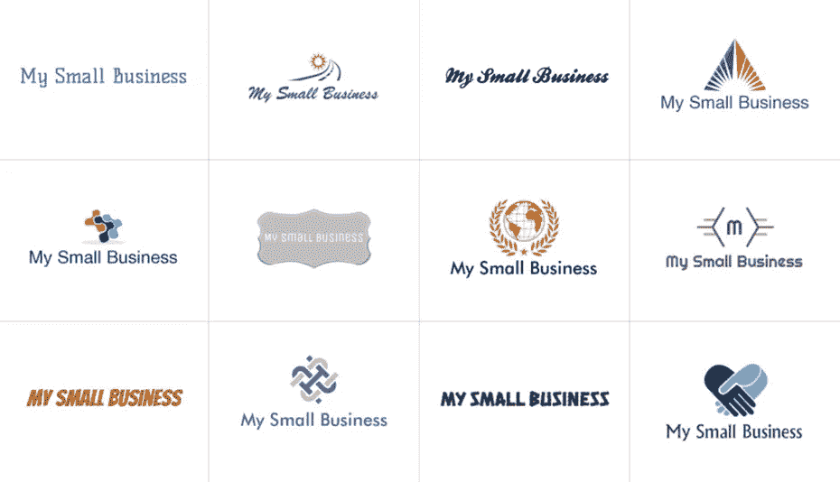
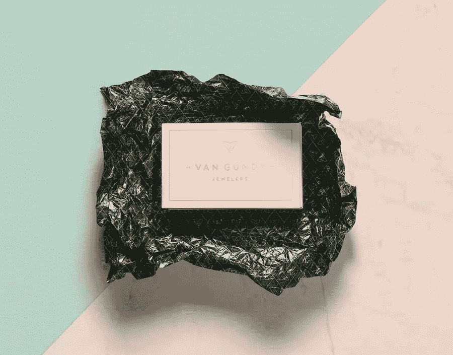
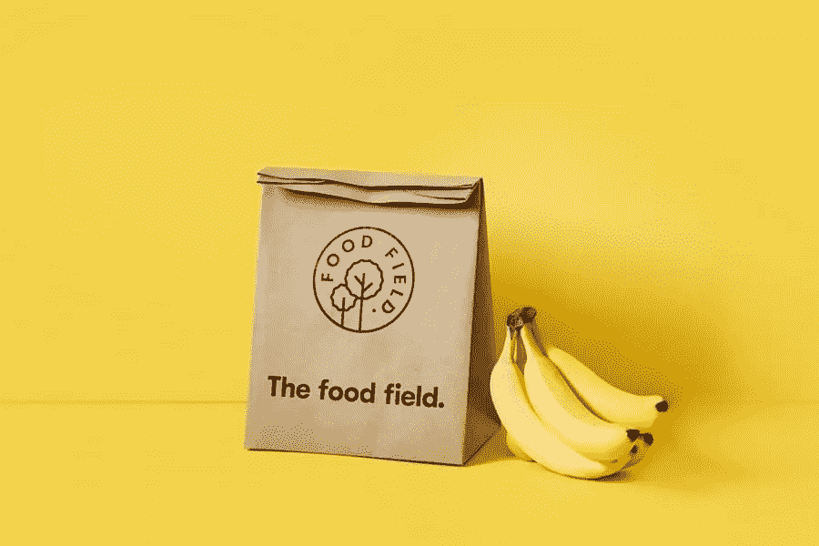
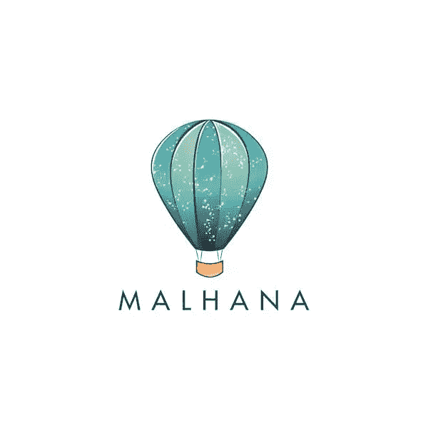
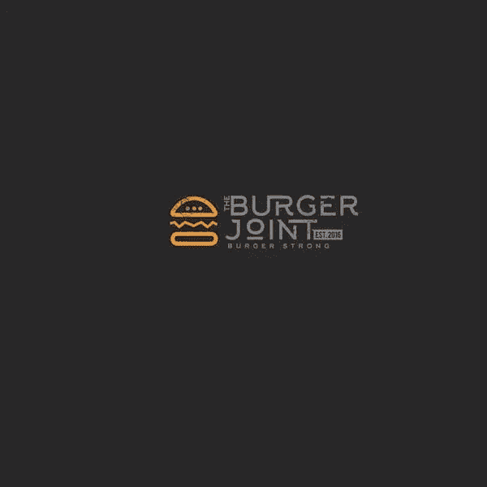
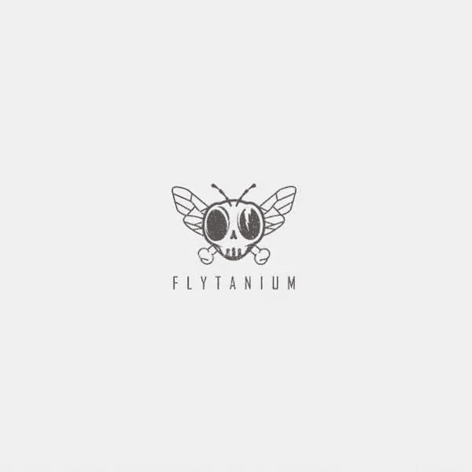
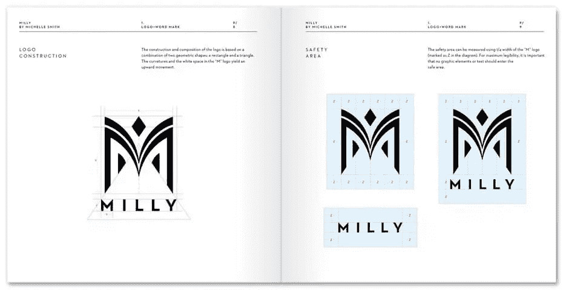

# 你的 Logo 设计应该花多少钱？

> 原文：<https://www.sitepoint.com/logo-design-cost/>

这篇文章之前发表在 [99designs 博客](https://99designs.com/blog/business/logo-design-cost/?utm_source=partner&utm_medium=paid-referral&utm_campaign=sitepoint&utm_content=interview-post)上。想要最好的设计来改造你的企业吗？[考虑发起一场 99 设计的设计大赛！](https://99designs.com/launch/?utm_source=partner&utm_medium=paid-referral&utm_campaign=sitepoint&utm_content=interview-post)

标志是任何品牌身份的重要组成部分——它通常是潜在客户看到的第一件东西，使用从竞争中脱颖而出的标志至关重要。和所有的商业支出一样，你需要权衡标志设计的成本和你将获得的质量和价值。

聘请专业设计师或设计公司有助于确保你的最终标志设计将是独特的，并传达你的品牌信息。像任何服务一样，标志设计有一系列的价格点和套餐，了解你的钱得到了什么或没有得到什么是很重要的。

### 那么，logo 设计要花多少钱呢？

一个 logo 的价格从 0 美元到数万美元不等，但是如果你是一个寻求高质量设计的小企业或初创公司，一个好的 logo 设计应该在 300-1300 美元之间。

看看你的预算，让我们根据你的需求帮助你决定最佳的消费方式。

|  | 

#### $10-$50

 | 

#### $100-$800

 | 

#### $800-$2，500

 | 

#### $2，500+

 |
| 

#### Logo design option

 | 标志制造商 | 自由设计师或设计竞赛 | 自由设计师或设计竞赛 | 设计机构 |
| 

#### Quality

 | 使用精选的库存图标和字体构建的基本和通用徽标。周转时间非常快。 | 有前途但经验有限的设计师或较小的投资组合。 | 经验丰富的设计师和专业的服务和建议。 | 由创意策略师组成的全方位服务团队保证高质量的设计。 |
| 

#### Who should use it

 | 对预算和时间非常敏感的企业可以接受通用设计 | 对设计过程有很好理解并且宁愿花时间也不愿花钱的企业 | 希望以中等预算获得高质量的企业 | 想要一个完整的、自上而下的品牌包装的资源充足的企业 |

### 低成本:低于 300 美元

#### 标志制造商

获得商标最便宜的选择是自己制作。如果你是一名训练有素的设计师，并且对 Illustrator 了如指掌，那就来吧。如果你不是，这将引导你到一个标志生成器。

虽然徽标生成器是最便宜的选择(使用该服务只需 0 美元，购买你的设计只需 10-50 美元)，但它们只提供有限的通用图标和字体选项。如果你走这条路，并且你有一个相当成熟的设计美学，你可能会得到一个有用的(如果[通用的](https://99designs.com/blog/tips/generic-logos/?utm_source=partner&utm_medium=paid-referral&utm_campaign=sitepoint&utm_content=interview-post))标志。如果你没有接受过任何设计培训，你可能最终会得到一些感觉有点差的东西。

标志制作者根据你的企业的名称和行业产生数百个概念。图片来自 LogoMaker.com

你可能会发现自由职业者愿意给你一个低于 300 美元的标志。这可能是一笔大交易，但像所有大交易一样，你应该问问自己为什么得到它…如果是因为你为设计师的妈妈做了一件好事，那就给你一分吧！如果你在一个匿名网站上找到他们，他们很有可能会给你一些你可以自己制作的普通东西。(或者设计可能被盗！我们不断看到在 99designs 上创作的设计出现在低成本的自由职业者网站上。)

### 中档:300-2500 美元

如果你有几百到几千美元的预算，你已经找到了标志设计成本的最佳点:你可能会得到一个非常好的设计，而且不会破产。

在这个价格范围内，你有两种选择来获得设计:与自由职业者合作或者参加[标志设计比赛。](https://99designs.com/logo-design/contests/?utm_source=partner&utm_medium=paid-referral&utm_campaign=sitepoint&utm_content=interview-post)

我们知道:300 美元和 2000 美元有很大的区别。请不要担心，我们已确保详细说明您希望支付更多费用的原因和时间。

#### 自由设计师

通过 Behance

使用自由设计师会是一个很好的体验——你会得到一个专家根据你的反馈定制你的标志。然而，有一个非常广泛的经验，这意味着广泛的成本和工作质量。如果你想一对一地工作，审查未来的设计师是很重要的。查看他们的投资组合和证明是必要的，从你信任的人那里获得直接推荐更好。

选择自由职业者时，你需要考虑:

1.  他们如何计费(每小时还是每个项目)
2.  他们有多少经验

一般来说，你会从有良好记录的人那里得到更高的报价。他们还会给你一份详细的清单，说明你花了多少钱得到了什么(或者他们预计你的项目要花多长时间)。

如果你打算花 300-800 美元，你可能会选择一个不太受考验的平面设计师。如果你有一个清晰的愿景，对设计工作有反馈的经验，并且有时间解决问题，这将是非常好的。如果你在得到你想要的东西时需要更多的支持，并且你没有时间来来回回，你可能应该考虑花费 800-2000 美元。

通过 Behance

#### 徽标竞赛

标志设计大赛将固定费用定价的稳定性与您的标志的广泛设计选项相结合，委托来自全球设计师社区的多个设计创意，为您的公司标志提供几十个独特的创意。在比赛期间(通常需要一到两周时间完成)，你有机会与设计师互动，并对他们不同版本的设计提供反馈，这样你就可以帮助塑造最终产品。

由迪娅·♥为玛哈娜创作

由迪娅·♥为玛哈娜创作

由 ludibes 为 Flytanium 创作

在 99designs，logo 包从 299 美元到 1299 美元不等，所以任何预算的企业都可以投资专业设计的 logo。

就像自由职业者一样，你可以以任何价格得到一个好的设计，但是如果你付更多的钱，这样做就更容易了。当你付更多的钱时，获奖设计师的奖金也更高。更多有经验的设计师参与你的比赛，所以你得到更多高质量的设计可供选择。通过 99designs 黄金和白金套餐，您还将获得一名客户经理，帮助您撰写创意简报并向设计师提供反馈，从而简化设计流程。

当选择你的应用程序竞赛包时，想想你有多少时间，你有什么经验写简报和与设计师合作。如果您仍然不确定，请联系我们进行设计咨询。

### 高端:2500 美元以上

当你购买一个标志设计时，你最终得到的是…一个标志！但是如果你愿意并且有能力支付更多，你可以得到更多。通常，这意味着与设计机构合作。这也意味着价格标签是 10，000 美元以上。

#### 设计机构

专业的设计或品牌代理是另一个选择，通常包括一个自上而下的品牌包。设计机构经常进行市场调查和竞争对手分析，以找出你的品牌如何以一种好的方式脱颖而出。代理机构雇佣创意团队，从各个角度接近你的项目，确保有商业数据支持的全面工作。

当然，聘请设计公司的最大障碍之一是成本。品牌标识包(包括一个标志)从一家代理公司的 10，000 美元起，通常会超出小品牌的预算。此外，并非所有机构都是平等的。就像雇佣自由设计师一样，你应该对他们的工作、风格和客户满意度进行研究。

关于不同标志设计选项的更多信息，请查看我们关于设计标志的最佳方法的帖子。请务必阅读[如何创建品牌风格指南](https://99designs.com/blog/tips/how-to-create-a-brand-style-guide/?utm_source=partner&utm_medium=paid-referral&utm_campaign=sitepoint&utm_content=interview-post)来开始定义你的品牌，这将帮助你与你的设计师一起开发一个伟大的标志。

通过五角星

### 我的钱能换来什么？

不管你为你的标志设计项目选择什么方向，重要的是你确切地知道你应该为你的钱得到什么。无论你是选择雇佣一名自由设计师，发起一场设计竞赛，还是选择一家代理公司，请确保以下清单是你协议的一部分:

**多种格式的最终标志设计:**

*   多种格式的最终标志设计
*   用于打印的高分辨率矢量格式
*   针对网站、社交媒体和其他数字需求的网络优化格式

**完全合法版权:**

 ***   这确保了你的标志设计是专属于你的
*   在 99designs，设计师将在最终付款前发布版权** 

## **分享这篇文章**