# 标志设计趋势:彩虹

> 原文：<https://www.sitepoint.com/logo-design-trends-the-rainbow/>

最近在设计节上，我发表了关于立体主义作为标志设计趋势的文章，在 SitePoint 上，你可以看到我写的关于标志设计趋势的[像素](https://www.sitepoint.com/logo-design-trends-pixels/)和[转变](https://www.sitepoint.com/logo-design-trends-the-shift/)的一些早期文章，但是今天我将继续关注彩虹的使用，或者彩虹颜色在标识中的应用。

当我在教室里教授标志设计时，我要求我的学生做的“测试”之一是检查他们的标志设计在黑白色中是否有效。如果他们发现他们的标志因为缺乏色彩而受损或变得无法辨认，这通常是一种重新开始的情况。我们做这个测试的原因之一是为了看看这个标志在除了网络和电视之外的媒体上使用时是否有效。例如，徽标可以用在黑白新闻印刷中，也可以用在单色刺绣中。

尽管如此，我们越来越生活在一个 RGB 世界，而不是 CMYK 的印刷世界。多色身份已经变得非常流行。在符号中使用彩虹色可以让一个极小的、通常过于简单的设计看起来像一场充满活力的色彩盛宴。众所周知，颜色是吸引注意力的好方法，这也是为什么这种趋势受到设计师的欢迎。彩虹，或颜色的尺度相互渗透，可以传达一种清新感和运动感，这在单一颜色下是不明显的。

因此，这里有一个小汇编的标志使用鲜艳的彩虹色，为您的观赏乐趣和灵感。这些标志来自[标志池](http://www.logopond.com)、 [creattica](http://creattica.com/) 和[behance](http://www.behance.net/)——都是设计灵感的伟大来源。

[24 偶数](http://logopond.com/gallery/detail/60019)

[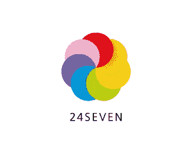](https://www.sitepoint.com/wp-content/uploads/2011/02/24Seven.png)

[生动的方式](http://logopond.com/gallery/detail/56224)

[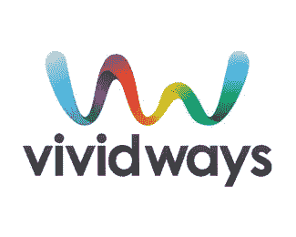](https://www.sitepoint.com/wp-content/uploads/2011/02/vividways.png)

[身份验证](http://www.behance.net/gallery/Autentika-Corporate-Identity/298551)

[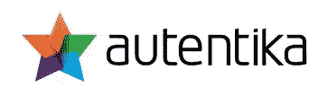](https://www.sitepoint.com/wp-content/uploads/2011/02/Autentika.jpg)

[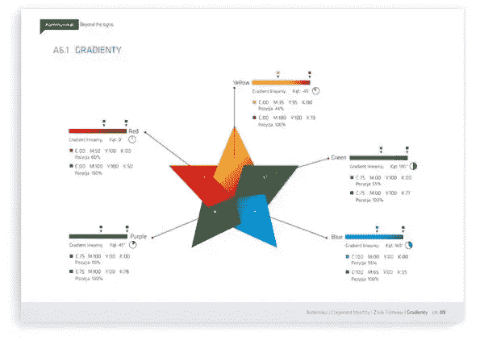](https://www.sitepoint.com/wp-content/uploads/2011/02/Autentika2.jpg)

[癌症疗法](http://logopond.com/gallery/detail/75876)

[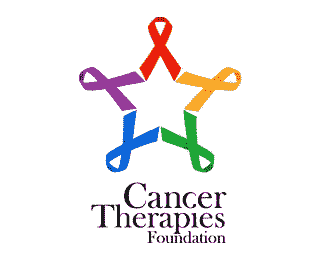](https://www.sitepoint.com/wp-content/uploads/2011/02/CancerTherapies.png)

[明星创意](http://logopond.com/gallery/detail/98690)

[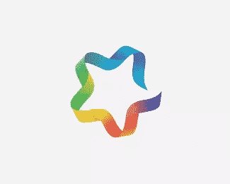](https://www.sitepoint.com/wp-content/uploads/2011/02/StarCreative.png)

[辣椒 Con Color](http://logopond.com/gallery/detail/91633)

[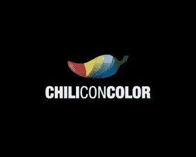](https://www.sitepoint.com/wp-content/uploads/2011/02/ChiliConColor.png)

[平稳的节日](http://www.behance.net/gallery/SMOOTH-FESTIVAL-2009/339881)

[Dotfish](http://creattica.com/logos/dotfish/49333)

[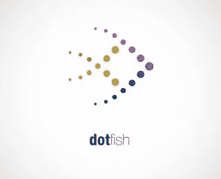](https://www.sitepoint.com/wp-content/uploads/2011/02/dotfishm.jpg)

[我们的社会](http://creattica.com/logos/our-society/49253)

[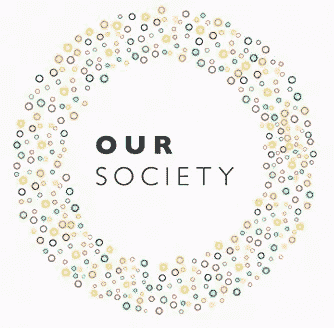](https://www.sitepoint.com/wp-content/uploads/2011/02/OS_Logo.jpg)

[米创意工作室](http://creattica.com/logos/mi-creative-studio/47373)

[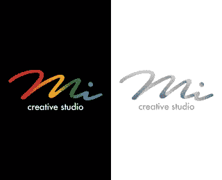](https://www.sitepoint.com/wp-content/uploads/2011/02/mi_small.png)

[高市文具](http://creattica.com/logos/papeterie-haute-ville/47342)

[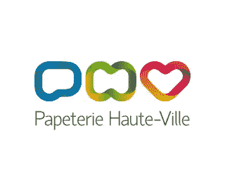](https://www.sitepoint.com/wp-content/uploads/2011/02/Papeterie_Haute-Ville.png)

你认为这些标志怎么样？你喜欢它们吗？它们中有没有哪一个让你觉得特别，或者彩虹色的符号让它们看起来都很普通？

## 分享这篇文章