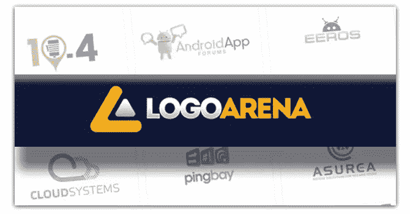
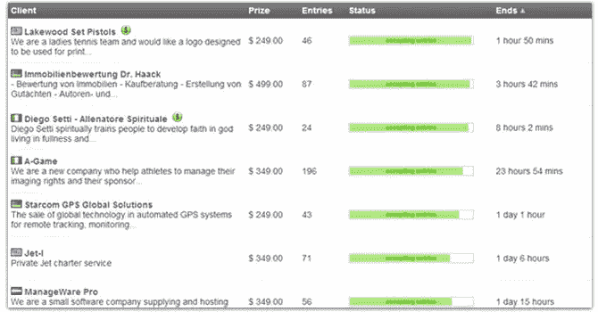
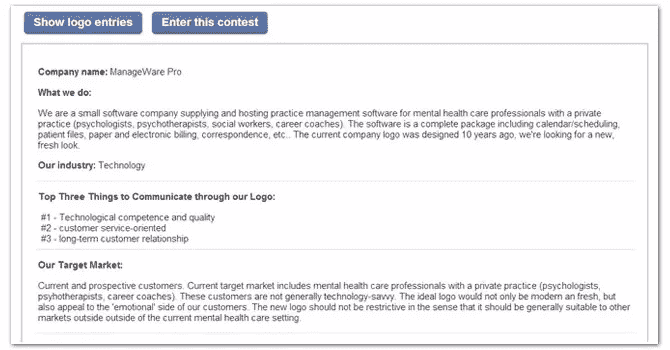
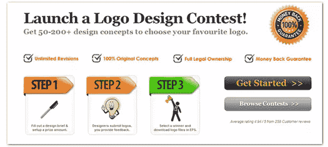
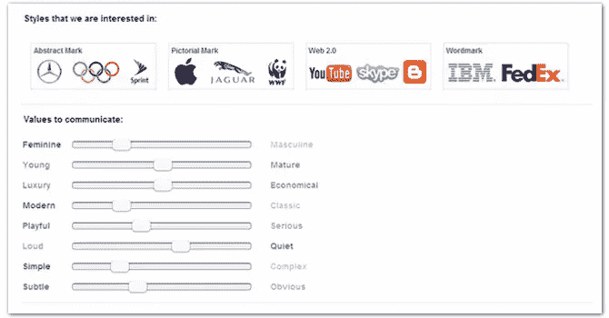
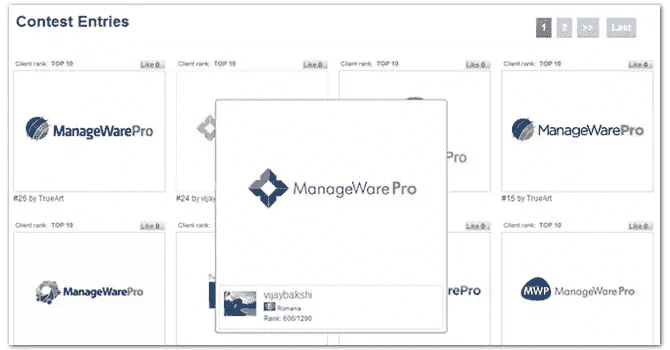

# Logo Arena–众包你的 Logo 设计，获得最佳效果

> 原文：<https://www.sitepoint.com/logoarena-review/>

你能想象一个没有 logo 的品牌或者公司吗？我想不会。这可能就像一个没有身份的人。众所周知，所有的顶级品牌/公司都有一个共同点:伟大的标志设计。设计完美的形象非常重要，可以让你的品牌和/或公司在竞争对手中脱颖而出。但是你是怎么做到的呢？你会从哪里开始？当然，你会雇一个艺术家或者联系一个平面设计师来画一个出来，但是如果全世界的设计师真的能为你做这件事，听起来怎么样？很棒，对吧？这就是 **[Logo Arena](http://www.logoarena.com)** 为你和任何试图为他们的下一个大创意设计最佳 Logo 的人所提供的。

### 标志设计师是如何工作的？

以下是正在进行的徽标比赛列表，几十名才华横溢的设计师竞相为您带来最高质量的徽标**,价格低至 249 美元！**竞赛举办者必须提供他们的信息，例如:公司名称，他们做什么，他们的业务类型，目标市场和他们的首选颜色，以满足公司的主题。

然后你得到他们想要什么的信息。

### 如何得到一个标志？

**第一步**:填写设计简介，设置奖励金额。
竞赛持有者通过填写徽标问卷来完成信息。通过信用卡或 PayPal 预付奖金。

选择您的徽标类型。

**第二步**:提交和反馈
设计师将提交他们的标志概念，直到比赛结束。竞赛举办者将尽可能地提供反馈，并对徽标参赛作品进行排名。

**第三步**:评选获奖者
竞赛结束后，竞赛主办方将评选出获奖设计师，并通过邮件通知。

选择一个获胜者。

### 结论

LogoArena 的设计师很棒，乐于助人，愿意按照建议做出改变。你不仅可以从世界各地一些伟大的艺术家那里获得最有创意的选择，而且最重要的是，这很容易做到，也不贵。更不用说他们的“退款保证”功能规定，如果你的比赛没有产生超过 50 个设计，那么钱将被退还给客户。

所以不用担心，现在就开始你的比赛吧！

## 分享这篇文章