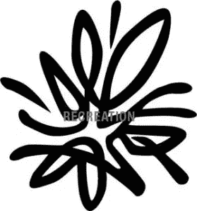

# 徽标:为商标做好准备

> 原文：<https://www.sitepoint.com/logos-getting-ready-for-trademarking/>

这个世界是一个标识的漩涡，试图引起公众的注意。有太多的企业和组织试图抓住你——有些有精心设计的标志，有些则没有经过深思熟虑。不幸的是，有些是仿冒品——有意或无意。

著名的德国平面设计师 Olaf Leu 说:

> 哥伦比亚广播公司改编了无数威廉·戈登的《天眼》。在每个城镇，都有一家眼镜商吹嘘自己有一个“相似”的标志。

如果这么高调的 logo 都能这么容易就被“打掉”，还有什么保护的希望？

作为一名平面设计师，你无法阻止抄袭你研究和设计的商标——这个领域需要律师来证明。然而，您可以从一开始就为注册准备一个标志，甚至在您提供给客户的标志样式指南中包含一个商标版本的标志。

任何徽标所有者在他们的徽标上添加都是合法的，这提供了一些保护。然而，这种保护确实取决于它在公共领域的知名度。如果您要推出一个新的徽标，您应该始终在徽标上添加，以便标记一个日期并为其设定一个角色。

### 把律师带进来！

重要的是从一开始就要说，在这个问题上，你能得到的最好和最强有力的建议是来自精通商标法的律师——他们将能够就特定的标志及其特定的注册需求提出建议。例如，可能需要的特定颜色或徽标系列。这篇文章可以被视为一般信息和一个起点。

### 简单与复杂

看看光谱的两端，有简单的标志和复杂的标志——它不是真正的争论的战场，但它肯定是一个讨论的话题，保护标志可以被视为更容易或更困难。

这里的想法是能够为商标注册准备任何标志。

下面是两个例子(一个简单，一个复杂),我们将使用它们作为例子，尝试为商标注册做准备。

### 必和必拓公司

必和必拓彩色标志

当必和必拓和必拓合并时，这是该公司重新营销和重新塑造自己的机会，其中包括一个新的标志。这个标志由液态金属的四个元素组成。这个标志背后的含义是——两家矿业公司合并为一家。虽然这个含义现在已经失去了，但这个标志的熔融金属的含义仍然与该公司密切相关。

准备一个标志的一个重要方面是开始剥离标志，留下你设计的标志的最基本的本质。

灰度 BHP Billiton 标志

去除颜色是非常重要的，如果你留下颜色，你仍然可能被复制，不同的颜色可能足以证明你的原件和仿制品之间的差异！

带有简化元素的必和必拓标志

我们所做的工作看起来很基础，但对注册商标来说却很重要。

### 安培

带效果的放大器标志

最新的 AMP 标志是一个相当复杂的标志的例子，有许多形式。复杂的设计搭配标志各部分的渐变色高光，在电视广告背景的光线下非常漂亮。这个符号代表一个火花。火花可以在许多情况下出现——生命的火花，灵感的火花，等等。

可打印的甚至普通媒体版本不包括这种光线，所以从“视频”形式到常规形式的复杂性已经降低了。然而，规则的形式确实有许多不同的味道——有些有不同的颜色，有些有渐变，有些没有。

AMP 标志草图

正如我们对必和必拓标志所做的那样，我们去掉了标志的颜色，这样标志现在可以代表任何颜色。徽标已经简化，但仍然复杂(我们的例子是黑色表面上的火花。我已经把它反转了，所以火花在一个白色或空白的表面上，呈现灰度)。

简化的 AMP 徽标

最后一步是通过把标志放在 sillouette 中来减少任何最后的复杂性和简化形状。通过这样做，标志的最基本的形状实际上受到了保护，任何建立在这个基本形状上的颜色或效果变化都会侵犯这种保护。上面的例子是在 Illustrator 中创建的传真。如果公司决定改变他们的文字标记的字体，最好将符号与文字标记分开注册，以提供一些额外的灵活性。

简单说明一下:对你来说,“逆向设计”你的标志是很可笑的，但是我们这样做是为了说明去除装饰，获得标志最基本形状的想法。

### 为保护而设计？

虽然看起来简单的标志更容易保护，但对所有设计师来说，标志的首要目标是传达意义和背景。如果一个设计者开始设计一个以保护为主要思想的标志，它可能会偏离实际的标志本身，如果它太简单，或者包含一个不够独特的文字标记，你的注册申请可能会被拒绝！

### 最大限度的保护

标志保护的重要性始于平面设计师。将 little 添加到您交付给客户的任何徽标中非常重要，无论是大徽标还是小徽标。同样重要的是，你要在你的商标样式指南中提供一个简化的商标版本。确保你包括一个非常重要的信息行，说明虽然标志已经准备好注册，客户需要咨询商标律师。如果你的客户确实注册了你设计的标志，在你的对开本中有一个你的设计旁边的小标志是非常好的！

如果你被要求帮助客户注册商标，互联网上有大量的信息，如果在美国，可以从[美国专利商标局](http://www.uspto.gov/)开始，如果在澳大利亚，可以从[澳大利亚知识产权局](http://www.ipaustralia.gov.au)开始。

## 分享这篇文章