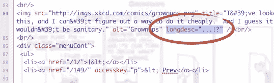

# Longdesc 和其他长图像描述解决方案—第 1 部分:问题

> 原文：<https://www.sitepoint.com/longdesc-and-other-long-image-description-solutions-part-1-the-issues/>

你可能听说过最近关于“longdesc”的一些讨论，当关于是否将它保留在 [HTML5 规范](https://www.w3.org/TR/html5/)中的[争论爆发](http://www.brucelawson.co.uk/2011/longdesc-in-html5/)时，这种讨论达到高潮。除非你是一个“资深”的网络专家，否则你可能连“longdesc”都没听说过。你会问，它是什么，你应该使用它吗？我们来检查一下。

## 什么是 Longdesc？

正如您可能知道的， [`alt`属性](https://www.w3.org/TR/html401/struct/objects.html#adef-alt)旨在为网页上的图像提供一个简短的基于文本的可选描述。此外， [`longdesc`属性](https://www.w3.org/TR/html401/struct/objects.html#adef-longdesc-IMG)被设计成指向一个网页，该网页在需要时提供一个更长的、详细的图像描述。它补充了图像元素的 alt 属性；当一个描述比使用`alt`可行的要长时，将使用`longdesc`。正如我们将要讨论的，`longdesc`还有其他潜在的用途，但是它的主要用途是为盲人和弱视用户，他们使用屏幕阅读器，看不到内容丰富的图像。有许多长描述的用例，包括描述徽标、漫画、艺术品、图表、信息图和照片。(注意`longdesc`被指定支持[框架](https://www.w3.org/TR/html4/present/frames.html#h-16.2.2)和 [iframe](https://www.w3.org/TR/html4/present/frames.html#edef-IFRAME) 元素，但是几乎没有人知道这一点，更不用说实现它了！)

## 争议

从表面上看，`longdesc`属性似乎是提供图像详细文本描述的好方法。但不幸的是，至少可以说，这项技术从未发挥其全部潜力。以至于许多人认为`longdesc`应该被完全遗忘，并且在许多资源中[不再是推荐的技术](https://reference.sitepoint.com/html/img/longdesc)。

几年前，有人写过一篇文章，记录了正确实现了`longdesc`的图像的极小比例[(大约十万分之一的图像；100 个尝试者中有 1 个)。最近，为了捍卫这一属性，许多关于](http://blog.whatwg.org/the-longdesc-lottery)[正确的`longdesc`实现](http://www.d.umn.edu/~lcarlson/research/ld.html)的例子被记录下来(由各种实体，如博物馆、大学、个人博客、政府机构等等)。不管你怎么看，大家都同意*提供图像长描述的整个过程被破坏了*，必须做些什么。

### 作者的问题

那么为什么`longdesc`很少被执行或者经常被错误地执行呢？一个原因，就像许多其他与易访问性相关的概念和技术一样，是无知；如果网页作者(设计者、开发者、所有者)不明白他们为什么要做某事(在这种情况下提供替代文本)，他们很可能不会去做。另一个原因是缺乏适当的培训；作者只是没有被教导如何使用`longdesc`。

一些人宣称“longdesc”这个名字本身就是一个问题，但我不同意。理由是这个名字容易让人误解，这就是为什么很多时候文本描述本身会被错误地输入到属性值中，而不是定义的 <abbr title="Uniform Resource Identifier">URI</abbr> (基本上是一个 <abbr title="Uniform Resource Locator">URL</abbr> )。虽然这种错误确实经常发生，但是训练仍然是这个问题的根源，而不是属性的名称。

此外，一些 [<abbr title="Web Accessibility Initiative">围</abbr>–<abbr title="Accessible Rich Internet Application">咏叹调</abbr>](https://www.w3.org/TR/wai-aria/) 的拥护者坚持认为`[aria-describedby](https://www.w3.org/WAI/PF/aria/states_and_properties#aria-describedby)`属性解决了这个问题。但是有许多反对这种替代的论点，许多在一个 HTML5 变更提议中有所概述。最重要的几点是:

*   `aria-describedby`属性不能指向页面外的内容(像`longdesc`那样指向 URI)；它只能指向页内定位点(IDREF)。这样做的负面结果是它不能为在不同页面上重复的相同图像提供一个公共的外部描述。
*   屏幕阅读器遇到`aria-describedby`不停顿；它像`alt`属性一样被直接大声读出，并强迫用户接受更长的描述，不管他们是否想要。(`longdesc`本质上是插入一个停顿，用户可以选择是否跟随链接。)
*   `aria-describedby`属性不是向后兼容的。

### 浏览器(非)支持

另一个为什么`longdesc`很难实现的原因是[主流浏览器在支持 longdesc](http://www.d.umn.edu/~lcarlson/research/ld.html#browsers) 方面做得很差。如果一个作者的作品不能在浏览器中呈现，他或她就不太可能这样做。尤其是当最后期限临近，有压力要尽快完成工作的时候，这种情况太常见了。当今顶级浏览器中，只有 [Opera 10.10+支持](http://www.iheni.com/londesc-support-opera-1010/)。为了帮助其他浏览器，Patrick Lauke 开发了一个 [Firefox longdesc 插件](https://addons.mozilla.org/en-US/firefox/addon/longdesc/),可以通过图片的上下文菜单访问长描述，比如 Opera。Charles McCathieNevile 也为 Opera 开发了一个扩展[，TellMeMore](https://addons.opera.com/addons/extensions/details/tellmemore/1.2/) ，它提供了一个视觉提示，Firefox 插件也是如此。我听说 Chrome 的扩展正在进行中。

提供图像长描述的问题不是`longdesc`；*主要是浏览器没有通知用户属性的存在。*

## longdesc 的案例

如果浏览器让更多的数据“被发现”而不是“被隐藏”,这种属性会更有益，特别是包括视力正常的用户。像`alt`属性一样，当图像变得不可用时，例如在图像链接中断的情况下，或者在低频段互联网连接的情况下(包括移动设备，我们不要忘记在发展中国家，移动设备可能是唯一的网上冲浪方式)，向视力正常的用户提供详细的描述会很有帮助。

而且除了可视化备份还有其他用途。详细的描述有助于理解信息，尤其是对于那些有认知障碍的人。此外，像音频抄本和视频字幕一样，图像的长文本描述可以成为国际化的一种手段，因为文本可以通过诸如 [Google Translate](http://translate.google.com) 之类的服务翻译成不同的语言(与图像中不能翻译的文本相反(不可行，至少目前还不能)。

事实是,`longdesc`有许多用例，并且一致认为需要一种提供图像长描述的机制。目前，`longdesc`还没有完全的“功能替代品”。它目前运行良好，因为它是由许多辅助技术支持的[，包括流行的屏幕阅读器，如 JAWS 和 Window-Eyes。](http://www.d.umn.edu/~lcarlson/research/ld.html#at)

此外，还有一段与`longdesc`的历史；关于向后兼容性，有一些事情要说。有许多[指导方针、法律、政策和标准](http://www.d.umn.edu/~lcarlson/research/ld.html#glps)引用`longdesc`作为解决方案。这些出现在 IBM、美国邮政署​和加州大学等组织中。`longdesc`属性有一个关键的支持基础，已经花了十几年的时间来构建，并且很可能要花同样多的时间用一个新的属性/方法来重新构建它。还要注意的是`longdesc`是 [ISO HTML](http://www.scss.tcd.ie/misc/15445/15445.html#DTD) 的一部分(参见附录 B 下的 IMG)。

## 摘要

`longdesc`图像属性是为需要它的图像提供详细描述的好方法。但是由于大多数网络作者没有了解过它，大多数浏览器也不支持它，所以这种技术非常不受欢迎。ARIA 等其他方法也可以实现类似的目标，但可能也不完全受支持，也不是真正的替代品。直到浏览器厂商做好他们的工作，直到`longdesc`在网络社区中重新焕发活力，提供图像的长描述的解决方案将继续只得到部分支持。

哦，如果你想知道它的命运，目前看来，`[longdesc](https://www.w3.org/TR/html5/obsolete.html#dom-img-longdesc)` [在 HTML5](https://www.w3.org/TR/html5/obsolete.html#dom-img-longdesc) 中被定义为“过时”。

[查看第 2 部分](https://www.sitepoint.com/longdesc2/ "DesignFestival.com: Longdesc & Other Long Image Description Solutions — Part 2 of 2: The Solutions")，在那里我们将讨论如何实现`longdesc`并研究各种其他解决方案和想法。

## 分享这篇文章