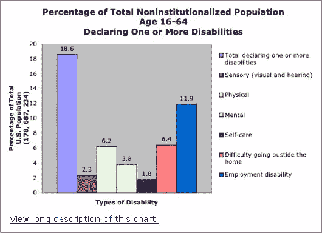
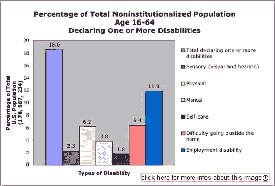
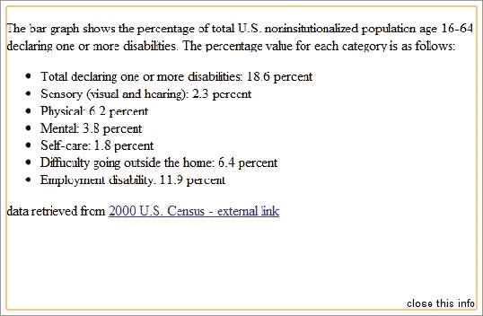
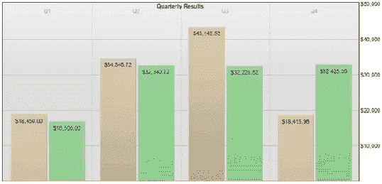
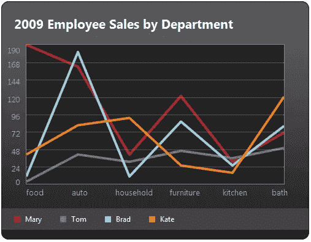

# Longdesc 和其他长图像描述解决方案—第 2 部分，共 2 部分:解决方案

> 原文：<https://www.sitepoint.com/longdesc2/>

在这个两部分系列的[第一部分](https://www.sitepoint.com/longdesc-and-other-long-image-description-solutions-part-1-the-issues/)中，检查了 [`longdesc`属性](https://www.w3.org/TR/html401/struct/objects.html#adef-longdesc-IMG)，包括其定义、批评和支持，以及缺乏浏览器支持。在第 2 部分中，现在让我们讨论如何实现`longdesc`、一些替代方案和一些其他想法来为图像提供一个长描述。

## 实施它

### 基础知识

使用`longdesc`的基础非常简单。属性被添加到图像元素中，值是描述的链接。

```
<code></code>
```

为了使这个过程更容易，有一个新的服务 [ObjectDescription](http://objectdescription.org/) 将免费托管包含描述的 HTML 页面。

注意，由于`longdesc`将 <acronym title="Universal Resource Indicator">URI</acronym> 作为一个值，所以像`#description`这样的锚应该是有效值，就像`href="#description"`是有效的一样。但是，千万不要在值中输入描述文本本身。

### 标准文本链接

另一种提供长描述并避免`longdesc`支持问题的方法是简单地在图片后面添加一个常规的文本链接。文本链接指向外部描述，类似于`longdesc`。

```
<code> 

<a href="description.htm">View long description of this chart.</a></code>
```

这里的缺点是文本链接在视觉上非常明显；这可能有利于可访问性和可用性，但在设计师和网站所有者看来可能是不必要的(可能被认为会分散注意力)。这种方法的另一个问题是，它没有在语义上或编程上将描述与图像关联起来(不是“[编程确定的](http://www.accessibleculture.org/blog/2011/01/programmatically-determined/)”)。当谈到使用辅助技术时，这是一个巨大的漏洞。

如果你想知道， [D-link](http://webaim.org/techniquimg/longdesc#d) 是一种老派的方法，其中“D”代表描述。这与标准文本链接的技术基本相同，但链接文本只有字符“D”，而不是更详细的文本链接，如示例中的“查看该图表的详细描述”这也可以使用[链接的 1 像素透明图像](https://www.w3.org/TR/WCAG10-HTML-TECHS/#img-dlink-invis)和属性为“D”或“描述”的`alt`来完成。不再推荐使用 D-link 方法。

### 咏叹调描述者

[`aria-describedby`属性](https://www.w3.org/WAI/PF/aria/states_and_properties#aria-describedby)是用于定义长描述的选项，但是正如[第 1 部分](https://www.sitepoint.com/longdesc-and-other-long-image-description-solutions-part-1-the-issues/)中指出的，这种方法存在问题。为了实现它，一个`aria-describedby`属性被添加到图像中。属性的值被设置为长描述文本的容器的`id`,在描述和图像之间创建一个关联。这类似于将一个`label`与一个表单元素相关联的方法。

```
 
<p id="desc">[content of long description here]</p>
```

这里的一个主要问题是文本描述必须在页面上。解决这个问题的一个技巧是将详细描述内容替换为指向外部详细描述页面的文本链接，这个链接与您在`longdesc`属性中使用的链接相同。这样就不需要在同一个页面上长篇大论的内容了。

```
 

<a id="desc" href="description.htm">View long description of this chart.</a></code>
```

### 混血儿是理想的

以上技术的混合似乎是一个理想的解决方案，至少目前是这样。使用了`longdesc`属性，并添加了标准文本链接，实现了`aria-describedby`属性。所以让我们以上面的第二个咏叹调为例，加上`longdesc`。结果是长描述适用于所有情况:浏览器是否支持`longdesc`，技术是否支持 ARIA，盲人或视力正常的用户，鼠标或键盘用户，等等。

```
 
<a id="desc" href="description.htm">View long description of this chart.</a>
```



现在，如果需要，你可以用 CSS 对视力正常的用户隐藏页面外的链接。 [CSSquirrel](http://cssquirrel.com/comic/) 在漫画中也是这样做的(阅读 CSSSquirrel 的[独自在漆黑的黑暗中](http://cssquirrel.com/2010/08/16/comic-update-alone-in-the-pitch-black-dark/))。

## 其他解决方案

### 在代码中添加缺失的行为

由[德克·吉纳德](http://blog.ginader.de/)开发的 [jQuery 可访问的 Longdesc 插件](http://blog.ginader.de/dev/jquery/longdesc/examples/webaim/index.php)展示了一个解决浏览器缺乏`longdesc`支持的优秀方案。(可以在 GitHub 上找到 [Ginader 的源代码。)当`longdesc`可用时，脚本创建可视指示和链接。当激活时，它用长描述替换图像；这样就不需要打开新的页面或窗口。然后可以关闭描述，恢复图像。它很容易实现，JavaScript 不引人注目，链接可以通过键盘访问；太棒了。](https://github.com/ginader/Accessible-Longdesc)





注意:图片截图的大小已被稍微调整以适应文章。

### 使用 CSS 而不是图像

避免整个长描述问题的一个方法是首先不要使用图像。例如，如果您计划显示一个图形图表，一个选项是标记一个数据表或定义列表，然后使用 CSS 技术创建一个与图形相似的时尚外观。CSS 传奇人物 Eric Meyer 几年前提供了这种方法的例子；用[表格标记](http://meyerweb.com/eric/css/edge/bargraph/demo-table.html)和[定义列表](http://meyerweb.com/eric/css/edge/bargraph/demo.html)查看他的伟大例子。



### 可视化插件

在 Nomensa 博客的文章[创建可访问的图表](http://www.nomensa.com/blog/2011/creating-accessible-charts/)中， [Dan Stringer](http://www.nomensa.com/blog/author/dstringer/ "Posts by Dan Stringer") 解释了图表和图形的另一种解决方案，但方法不同。我们从一个正确标记的数据表开始，就像上面 Meyer 的 CSS 例子一样，但是相似之处仅此而已。

灯丝组用一个巧妙的 jQuery 插件 [jQuery Visualize](http://filamentgroup.com/lab/update_to_jquery_visualize_accessible_charts_with_html5_from_designing_with/) 生成了一个图形图表。该图表是用 [HTML5 画布](https://www.w3.org/TR/html5/the-canvas-element.html)构建的，并提供了一个谷歌/ [<abbr title="Vector Markup Language">VML</abbr>](http://en.wikipedia.org/wiki/Vector_Markup_Language) 解决方案作为后备。现在我们显示了一个表格和一个图表。图表本身是不可访问的，但是表格是可访问的。为了对视力正常的用户隐藏表格，当 JavaScript 不可用时(因为需要 JavaScript 来生成图表)，使用了经典的 CSS 技术和类似于 [Modernizr](http://www.modernizr.com/) 的方法来显示数据表。Visualize 还注入了一些 ARIA 属性(role 和 aria-label)来帮助屏幕阅读器用户确定什么是什么。



## 摘要

图像属性很容易实现，但是没有得到很好的支持。诸如文本链接和 ARIA 之类的其他方法可以用来实现类似的结果，但是可能不被完全支持或者可能不美观。今天，当需要时，实现图像长描述的最佳方式是使用文本链接、longdesc 和 ARIA 的混合技术。其他技术已经浮出水面(特别是对于图表)，但是在 W3C、浏览器供应商和 web 作者合作之前，将会继续存在不完整和部分支持的解决方案，这对每个人来说都是损失。

## 进一步阅读

*   HTML5:提供有用文本选项的技术
*   劳拉·卡尔森的《野外实例》
*   [龙在 WCAG 2.0](https://www.w3.org/WAI/GL/WCAG20-TECHS/H45.html)
*   [龙在 WCAG 1.0](https://www.w3.org/TR/WCAG10-HTML-TECHS/#long-descriptions)
*   [龙德斯克死了！龙德斯克万岁！](http://www.cfit.ie/news-and-commentary-archive/525-longdesc-rip)

## 分享这篇文章