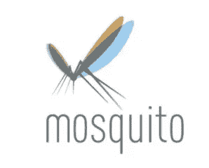
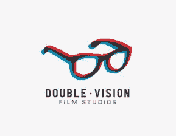
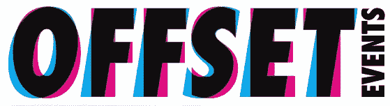
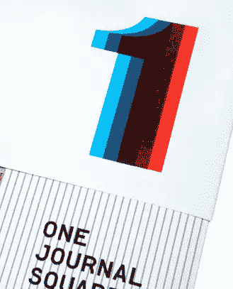
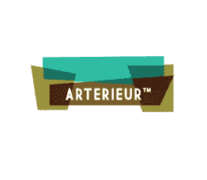
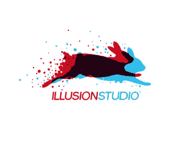
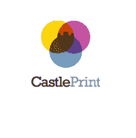
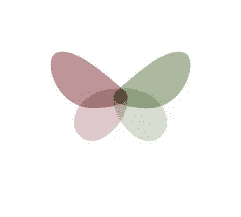

# 查看班次标识

> 原文：<https://www.sitepoint.com/looking-at-shift-logos/>

转变标志风格的根源在于印刷，而不是网页设计，它们表现为透明的颜色覆盖。偏移外观显示为 RGB 或 CMYK 中的字母或对象，看起来好像它们套准错误或打印不正确。尽管有重叠的层，这些标志往往有有限的颜色和非常干净的外观。在使用柔和颜色的情况下，标志看起来温和和平，而使用红色和暗粉红色的标志有一种三维质量。那就是不戴 3D 眼镜的 3D。

虽然标志中的图像显然是静态的，但变化的外观给了它们一种引人注目的运动感。乍一看，这些身份看起来像几个元素融合成一个，或者相反，一个元素分裂成几个部分。

因此，为了你的设计灵感和视觉享受，让我们来看几个例子，看看是什么使这些标志独一无二，但又适合一个类别。

*蚊子乘*[贾森 ](http://logopond.com/gallery/detail/41142)

*双视觉由 J*[加纳设计 ](http://logopond.com/members/profile/showcase/24687)

*[胶印设计与插图发布会](http://www.iloveoffset.com/welcome/)*

*某期刊方由[艾米莉·施瓦茨曼](http://emilyschwartzman.com/?cat=7)*

 

安娜·科维塞斯的《艺术与形状》

亚历克斯·塔斯社

阿德里安·克诺皮克的幻觉工作室

肖恩·奥格雷迪的城堡版画

逃脱由[博扬斯蒂法诺维奇](http://www.logoholik.com/)

你觉得这些 logo 设计怎么样？你见过其他你喜欢的标志吗？

## 分享这篇文章