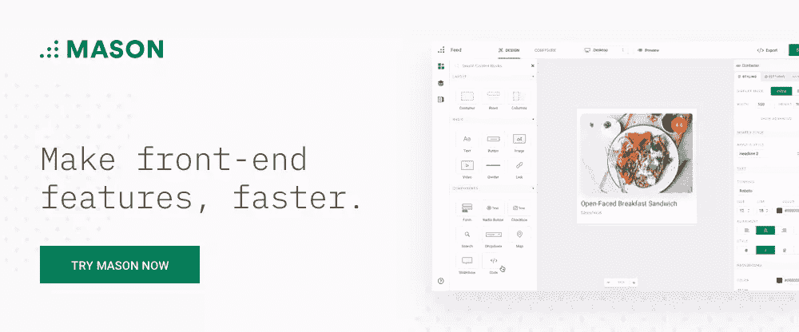
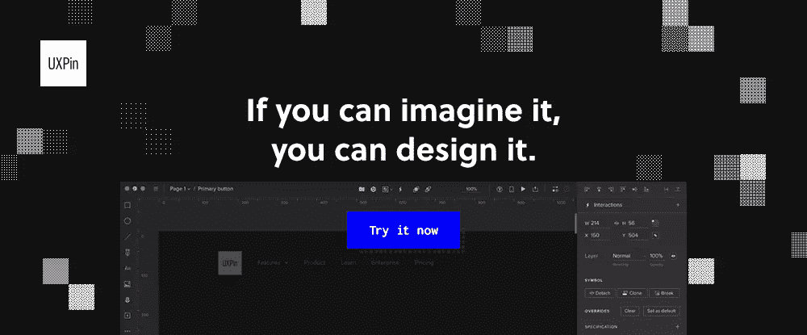
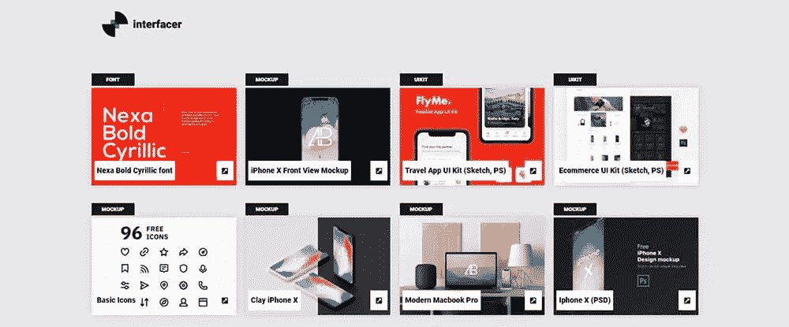
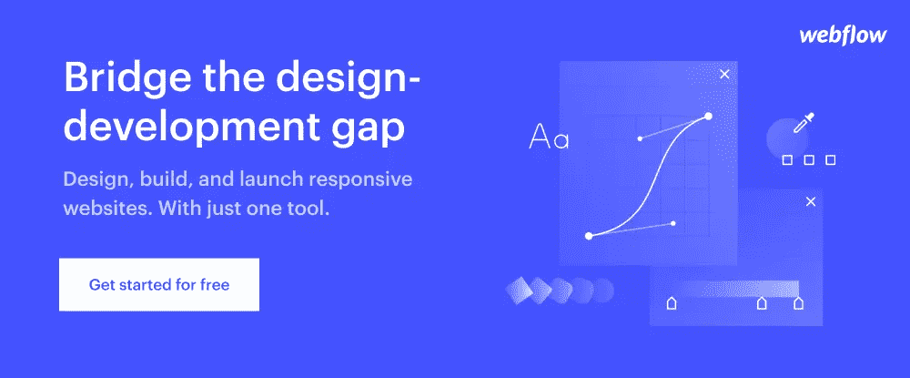

# 寻找完美的 UX/用户界面工具？看看这些伟大的

> 原文：<https://www.sitepoint.com/looking-for-the-perfect-ux-ui-tools-check-out-these-great-ones/>

*这篇赞助文章由我们的内容合作伙伴 [BAW 媒体](https://bawmedia.com)创作。感谢您对使 SitePoint 成为可能的合作伙伴的支持。*

俗话说:“一盎司的预防抵得上一磅的治疗”。越来越多的公司开始注意到这个建议。他们意识到做额外的努力来避免可用性问题是可以的。这比以后再解决问题要便宜得多。

在启动之前调试软件应用程序是标准的操作过程。任何设法溜进来的虫子都可能成为潜在的麻烦制造者。用户遇到的大多数问题都是可用性问题。这些问题可以而且应该在最初的原型设计阶段解决。

在设计阶段早期检查潜在的可用性问题。尽管这通常需要额外的时间和预算，但从长远来看，这是省钱的。设计师和项目经理需要考虑投资回报率。这不是为了满足短期目标。

正确的工具和资源对于把事情做好是非常宝贵的。所有这些都是以最小的额外费用。

我们来看几个最好的。

## 1.梅森

Mason 提供了卓越的前端功能构建体验。它专为现代团队设计，使他们能够高效、经济地为他们的应用程序创建前端功能。

使用 Mason，您可以绕过额外的原型制作、线框制作或额外的编码来完成工作。Mason 无缝集成到您现有的代码库，从而显著缩短开发和部署周期。它还使团队能够以闪电般的速度对事件的特性构建状态做出反应和适应，通常在这个过程中会节省大量资金。

最重要的是，Mason 的特性构建能力允许团队立即对用户或客户需求做出响应。团队可以为用户提供可靠、可扩展、安全和可靠的解决方案；并允许团队的开发人员从事更复杂或优先级更高的项目。

梅森不会贬低你的网站或应用。当团队负责维护一个或多个软件产品或解决方案时，这是一个非常有价值的工具。它会在需要的时候被触发，而且只在需要的时候。

## 2. [UXPin](https://www.uxpin.com/?utm_source=bawmedia-group&utm_medium=partner&utm_campaign=toptools2019)

UXPin 是设计师的梦想。这种根本不同的设计工具在 PayPal 和微软等公司中使用，以构建现实的原型，具有代码组件、逻辑、状态和设计系统的能力。凭借其丰富的设计组件库，UXPin 可用于创建外观和感觉都像真实产品的原型，从开始到结束，无需离开应用程序。

UXPin 还提供强大的团队协作和产品交付功能。因为它是基于云的，所以你可以在 Mac OS 和 Windows 上通过浏览器和桌面应用程序进行原型制作和协作。无需任何其他工具，即可轻松地从低保真度原型迭代到高保真度原型，这些原型具有复杂的交互，看起来很真实。

借助这款一体化的 web 和应用设计工具，您可以确保各产品线的一致性，同时减少设计、开发和部署的时间和成本。

## 3.[接口](https://interfacer.xyz/)

Interfacer 是一个很好的免费设计资源来源，触手可及。他们收集了 300 多种资源，包括 web 模板库、电子商务、区块链、旅游应用和其他 UI 套件、80 多种不同的图标迷你库，以及近 100 种实体模型解决方案。

请随意在商业项目中使用这些高质量的免费设计工具。

## 4.[网络流量](https://webflow.com/?utm_source=article2019&utm_medium=baw&utm_campaign=uxui)

如果你在市场上寻找一个一体化的工具来设计、构建和发布完全定制和响应的网站，Webflow 是一个很好的选择。

使用 Webflow，您还可以为每个网站创建一个定制的、客户端友好的 CMS，并享受超快、托管的托管，所有这些都无需编码或麻烦的设置问题。Webflow 也是原型开发和构建电子商务解决方案的理想解决方案——同样无需编码。

### 你为什么要关心 UX 和这些工具？

设计良好的用户界面有助于提高转化率

你以前去过那里，可能去过很多次。比方说，你正在比较购买一种产品或服务。您遇到了几个解决您的问题的网站。

很明显，有一个脱颖而出。

你很容易就找到了你需要的信息。事实上，你的经历是如此的愉快，以至于你把这个网站加入了书签。

如果能设计出那样的网站或应用，岂不是很好？

**通过 UX 设计提高您的品牌忠诚度**

良好的用户体验对企业来说意义重大。你网站的 UX 可以极大地帮助建立对你的品牌、产品或服务的信任。在与客户建立关系的过程中，它可以发挥至关重要的作用。

一个友好的 UX 鼓励顾客激活并培养对你品牌的忠诚度。你的产品和服务也是如此。

**不要忘记口碑推荐的重要性**

无论是一本书，一部电影，一个 YouTube 视频，还是一个网站，人们都喜欢与他人分享他们喜欢的东西。人们购买好的体验，如果你提供它们，他们会告诉全世界。

你不仅要让购买过程变得简单，还要尽可能让顾客感到简单。客户会记住它，并推荐给他人体验。

## 结论

你想从一个顶级的 UX 或者 UI 工具或者资源中得到什么，自然取决于你的需求。但是我们在这里展示的这些有几个共同点，应该会吸引你。

他们可以节省你的时间和金钱，工具是快速，高效，可靠的。设计辅助资源可以让你不必重新发明轮子。

## 分享这篇文章