# 带外部系统的低代码移动基础

> 原文：<https://www.sitepoint.com/low-code-mobile-basics-with-outsystems/>

*本文由[外部系统](https://www.outsystems.com/?utm_source=sitepoint&utm_medium=top_of_article&utm_term=OutSystems&utm_content=Low-Code%20Mobile%20Basics%20with%20OutSystems&utm_campaign=sitepoint#)赞助。感谢您对使 SitePoint 成为可能的合作伙伴的支持。*

如果你以前从未听说过低代码的公司，加入这个俱乐部吧。2016 年 7 月，OutSystems 让我审查他们低代码工具的预发布版本。我不知道什么是低代码，也不知道为什么这些人会跟我说话。

事实证明，低代码平台本质上是拖放式 ide。它们旨在帮助开发人员轻松完成大量的样板工作，专注于 web 产品的核心部分。OutSystems 即将升级他们的产品，以包括移动应用程序。

他们提醒我，我是一个原生的移动开发者，这时候我就明白了。他们想知道他们的政纲是否符合标准。我只想说，虽然我喜欢低代码的速度，但我发现他们的产品中有很多有问题的遗漏以及性能问题。

他们竭尽全力在发布前及时做出改进，并解决了许多我最初关注的问题。我过去和现在都对最终产品印象深刻。我想向 SitePoint 社区展示如何使用像 OutSystems 这样的低代码平台来实现常见的移动模式。

虽然这些技术只适用于 OutSystems，但竞争对手如 Mendix、AppGyver 和其他公司也提供了类似的功能，这些功能与您将要看到的功能大致对应。

## 建立本地数据库

如果您在 iOS 上处理过核心数据，那么对 ORM 的低代码方法应该很熟悉。对于那些在 Android 上的人来说，如果你还在手工编写 SQL 查询，我也经历过。我推荐试试 [ormlite](https://github.com/j256/ormlite-android) 、[绿岛](https://github.com/greenrobot/greenDAO)、 [SugarORM](https://github.com/satyan/sugar) ，或者类似的。

在低代码中，您的后端和前端合并到一个编辑器中，因此它们小心翼翼地描绘了云和本地存储之间的边界。

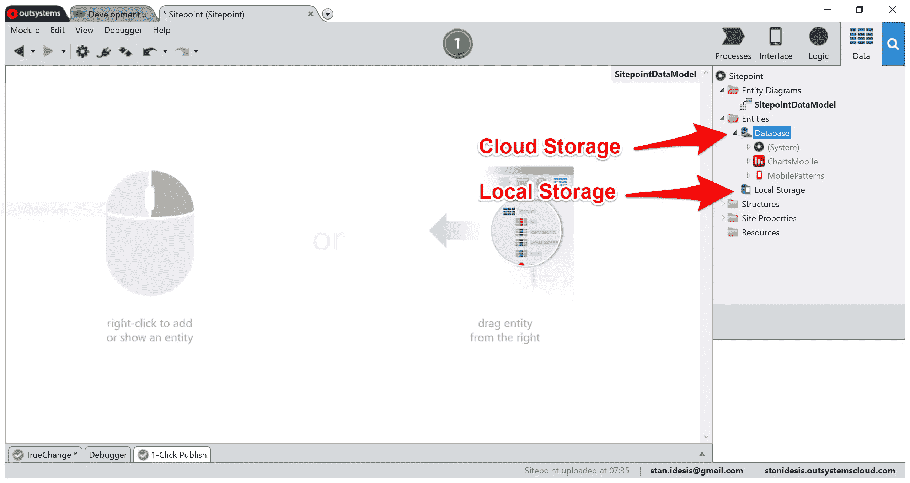

我创建了一个数据库实体`Book`，并用一些属性填充它。OutSystems 自动为我生成 CRUD 操作:

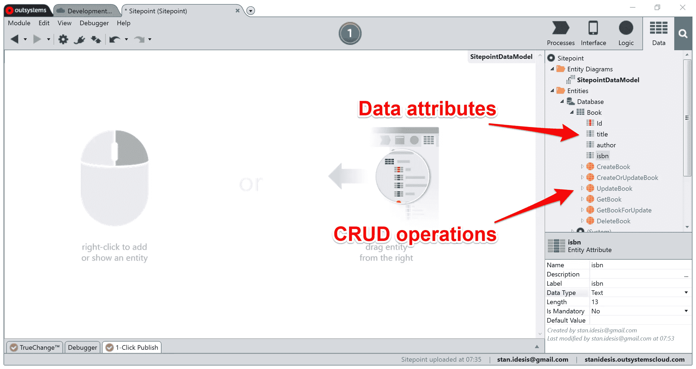

橙色圆圈图标代表服务器端操作，稍后您将看到它们是如何发挥作用的。因此，我有一个存在于云中的`Book`实体，它可以用标题、作者和 ISBN 来表示一部作品。

如果您已经在客户端领域工作了足够长的时间，那么您应该知道客户端不会复制中央数据库。而且它们也不总是需要每个模型的镜像。一些数据可以保留在服务器上，以减小响应大小。

在 OutSystems 中，我可以通过两次点击，基于现有的云实体创建一个本地实体。当我这样做时，IDE 为我自动执行了一些额外的步骤:

IDE 将`Local`添加到实体名称的前面。这个术语帮助我跟踪我正在接触的数据库:服务器还是客户机。IDE 还生成了类似于服务器上可用的 CRUD 操作，除了这些白橙色图标表示本地操作。

我通过添加一个`Author`实体并在`Book`和`Author`之间形成一个关系来充实我的数据模型。这是当前的地图:

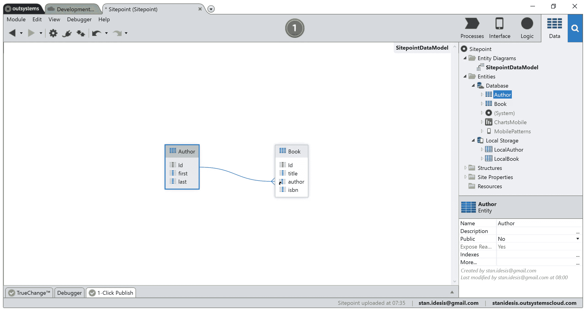

为了使用数据，IDE 允许我定义自定义操作来检索数据，将其缓存到本地数据库，然后将这些值读入本地变量。下面是一个本地操作的示例，它从中央数据库获取图书，然后将它们缓存为本地版本:

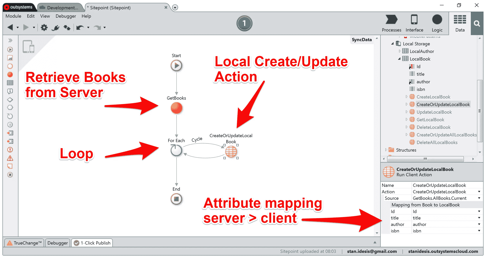

他们的工具还支持开发人员使用离线同步范例实现离线功能。在离开电网一段时间后，该应用程序将在检测到互联网连接时执行自定义的本地同步操作。

谢天谢地，我们可以自己实现同步逻辑。但是这种方法可能像刷新缓存一样简单，也可能像带有冲突解决的数据合并一样高级。

## 处理通用布局

作为移动开发者，我们有两种方法来支持多种屏幕尺寸:平板电脑和手机的独立应用程序或通用应用程序。OutSystems 处理两种策略:

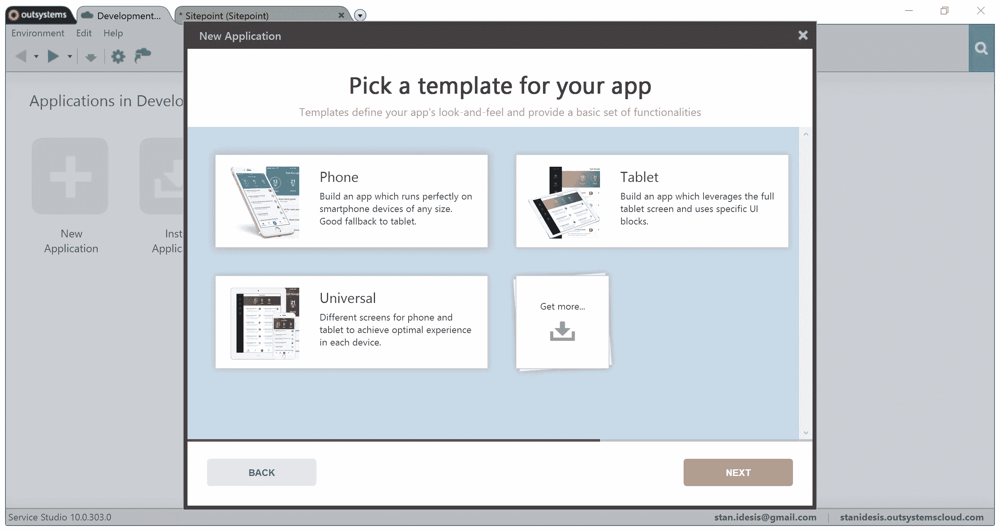

在通用应用中，平台提供了两种客户端方法，`isTablet()`和`isPhone()`。这些允许我们将用户导航到我们为他们的设备优化的界面。起始模板中的逻辑如下:

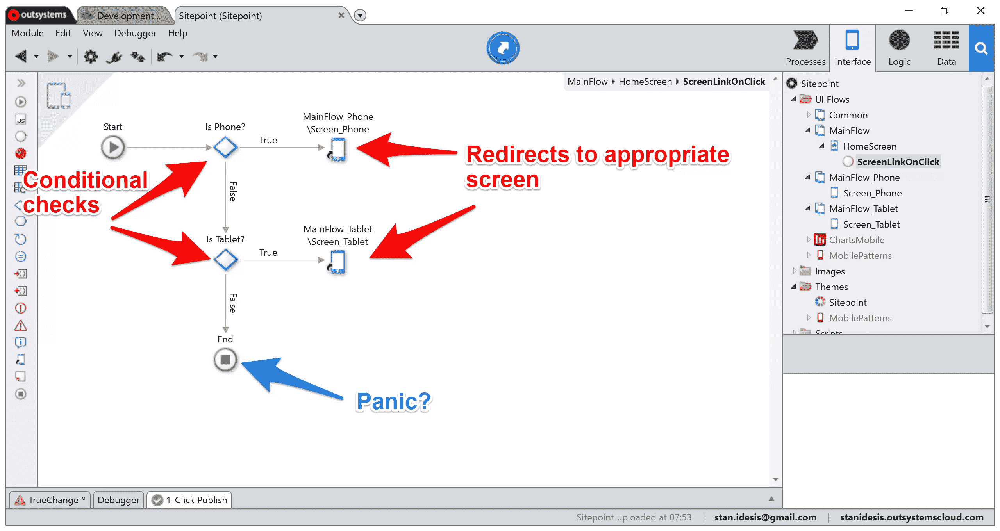

既不是手机也不是平板？点燃你的头发。

这是一个关于这种逻辑的视频:

[https://www.youtube.com/embed/EiMg3KA_ECs?rel=0](https://www.youtube.com/embed/EiMg3KA_ECs?rel=0)

看不到视频？在 Dropbox 上查看。

或者，我们可以通过使用条件逻辑隐藏设备上不适合的元素来避免重复的界面工作。比方说，我想隐藏平板电脑上的逻辑图，因为图像在拉伸时会恶化……而且我也懒得去打扰设计师设计一个高分辨率的替代品。

为此，我需要修改包装图像的容器(`div`)的`Visible`属性。默认情况下，`Visible`被设置为`True`，但是我可以编辑定义该属性的表达式:

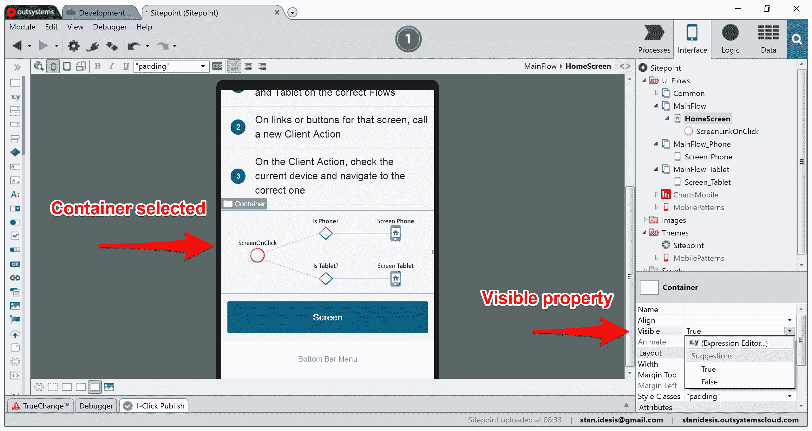

在我点击了 **x.y** 符号之后，IDE 显示了表达式编辑器:

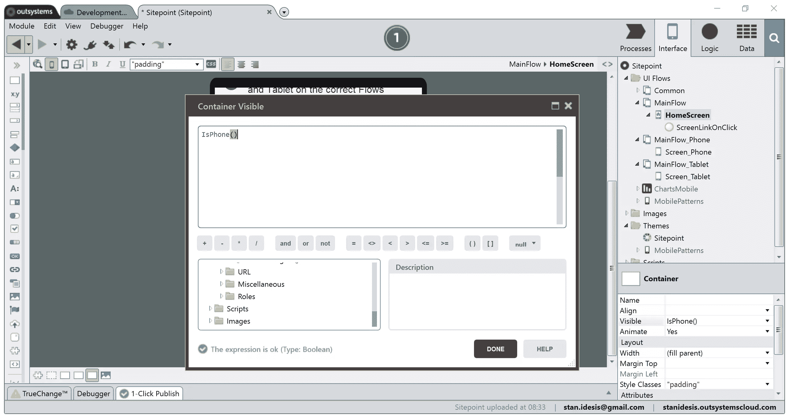

我输入了`IsPhone()`，当且仅当函数在手机大小的框架中执行时，它返回`True`。表达式编辑器允许开发人员在适当的地方用 JavaScript 编写一行 return 语句。

当我部署并运行浏览器内演示时，模拟 iPad 时图像不在，这是意料之中的:

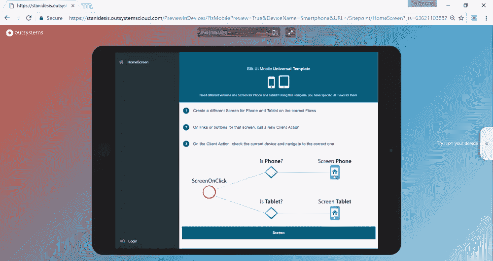
之前

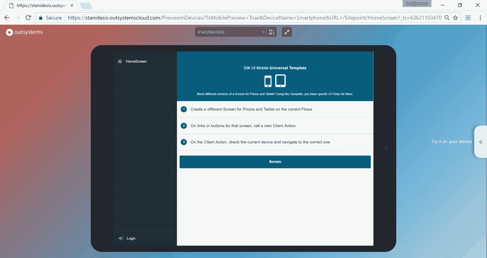后

## 打开摄像机

因为 OutSystems 应用程序是基于 web 的混合解决方案，所以它们依赖 Apache Cordova 进行本机集成，如摄像头、GPS 和通知。当我创建应用程序时，IDE 默认没有捆绑任何插件，所以我必须自己添加它们。

这一部分有很多小步骤，但我保证这是值得的，因为令人惊讶的是，最后还有一只小狗🐕。

为了增加一个摄像头集成，我浏览了铁匠铺。这是 OutSystems 的开源插件库。这是它在 IDE 中的样子:

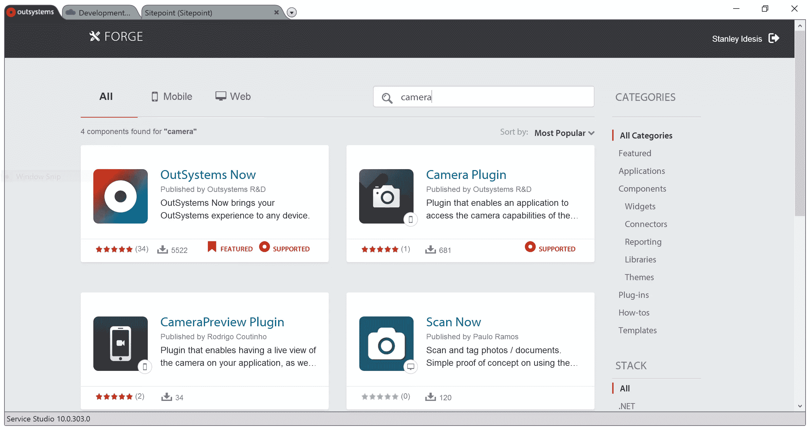

这是一个嵌入式框架，所以你也可以在他们的网站上浏览。我点击了**相机插件**，发现它是围绕[阿帕奇·科尔多瓦的基本相机插件](https://www.npmjs.com/package/cordova-plugin-camera)的外部系统包装。在 Forge 上，他们提供了一些更多的细节，比如评论、使用说明，偶尔还有截图:

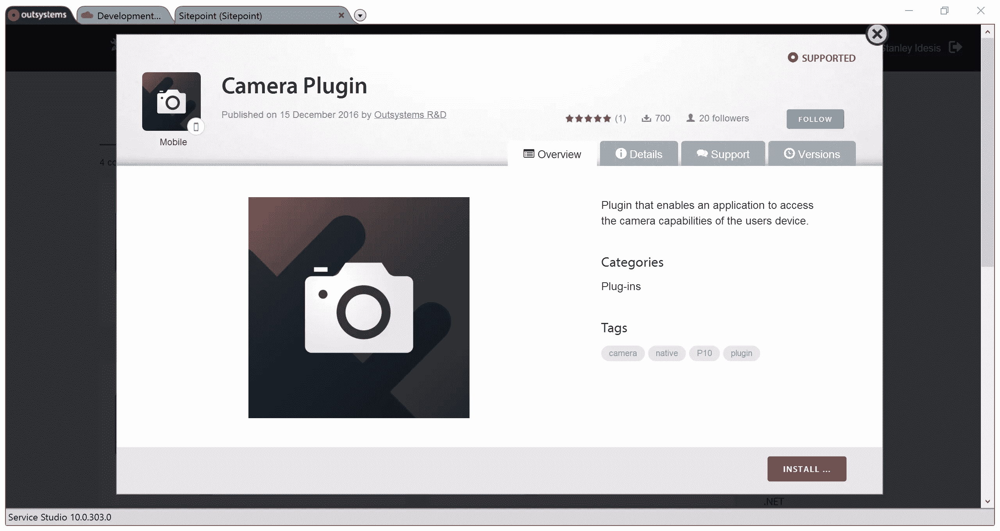

我点击了 **INSTALL** ，它显示了一个进度条，显示了下载到我的本地环境的插件:

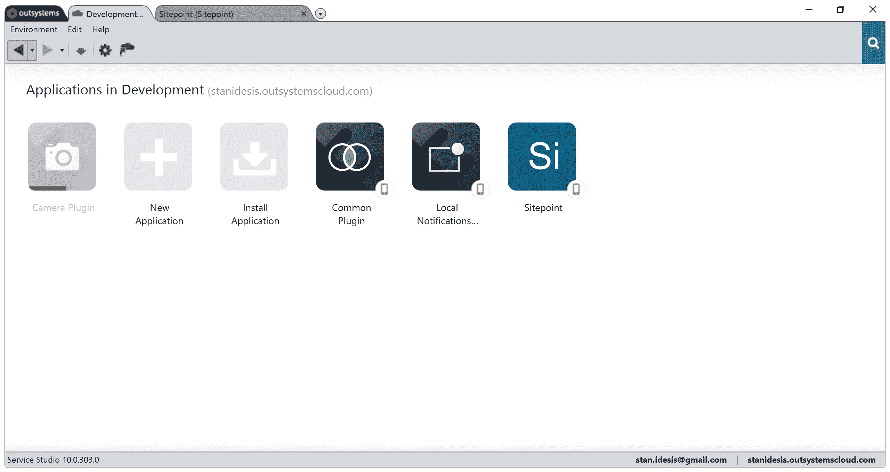

随着**相机插件**的安装，我需要将它链接到我的移动应用程序。为此，我修改了应用程序的依赖关系:

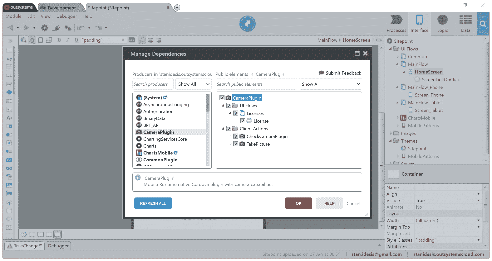

我选中了最上面的框来包含插件提供的所有东西。它带有一个移动屏幕和两个客户端操作。我当然需要这些操作，但是可能会将许可证视图留在后面。没人有时间读驾照。

我需要的下一件东西是一个经典的相机按钮。这个按钮将启动拍照动作。我将一个图标小部件拖到右上方的操作区域，然后通过查询过滤图标:

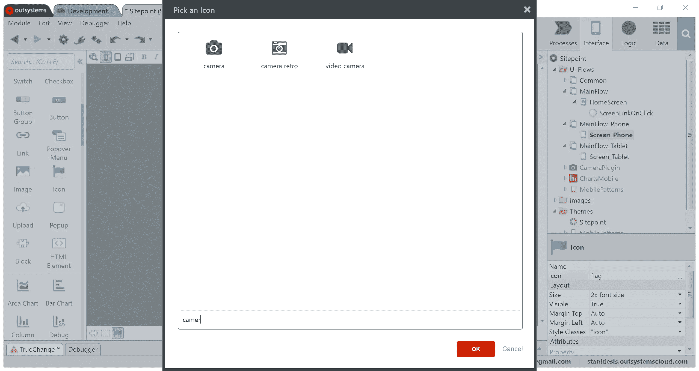

我可以将一个动作分配给所有常见的 JavaScript 事件，如`onclick`、`onhover`，以及一些独特的事件，如`ondoubleclick`。

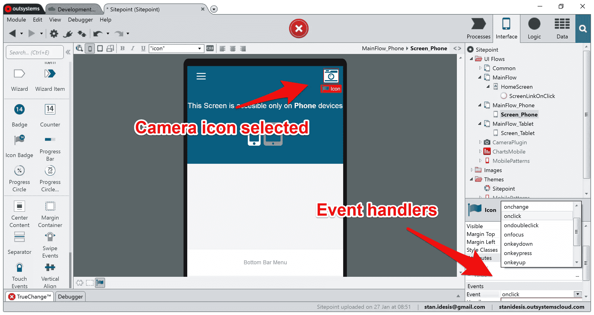

我创建了一个新的动作来处理 click 事件，并用以下逻辑填充它:

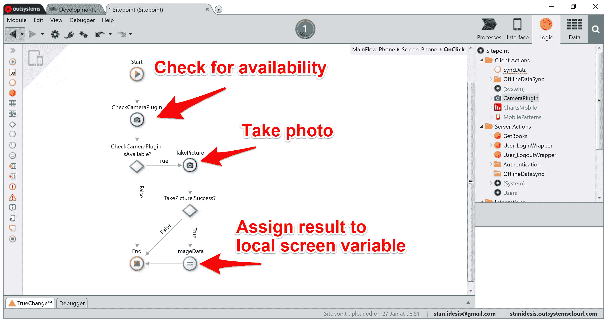

为了看到最终的照片，我需要一个 UI 元素在屏幕上显示它。我将一个图像小部件拖到布局中，并将本地屏幕变量指定为图像数据源。

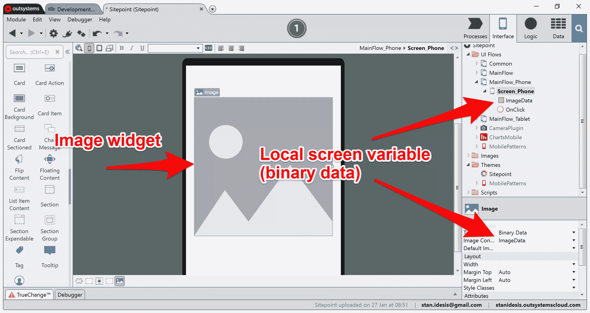

一切就绪后，我准备测试应用程序。我无法在浏览器中测试这个功能，所以我必须在我的设备上运行这个应用程序。OutSystems 提供了两种方法来实现这一点:我可以生成一个调试版本，并将 APK 下载到我的 Android 设备上，或者我可以在他们的移动伴侣中运行该应用程序。

这些选项如下所示:

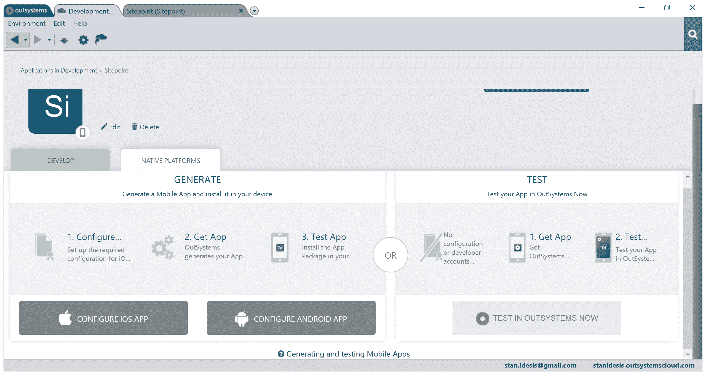

为了加快这个过程，而且因为我现在已经安装了 OutSystems，我启动了配套的应用程序，并在我的手机上运行 Sitepoint。最终的结果在下面可爱的视频中捕捉到了。

[https://www.youtube.com/embed/-0EtMxxrRvI?rel=0](https://www.youtube.com/embed/-0EtMxxrRvI?rel=0)

看不到视频？在 Dropbox 上查看。

## 更多

我不喜欢听起来像一个销售人员，但是还有很多我没有在这里详述的关于低代码的事情。你所看到的也不仅限于外部系统。竞争对手也提供类似的功能和工作流程。然而，这些工具主要面向企业组织。

如果你想尝试一下，你可以像我一样，用 OutSystems 的[免费个人版](https://www.outsystems.com/home/GetStartedForFree.aspx?utm_source=sitepoint&utm_medium=end_of_article&utm_term=OutSystems%E2%80%99%20free%20personal%20edition&utm_content=Low-Code%20Mobile%20Basics%20with%20OutSystems&utm_campaign=sitepoint)开发一个应用。

你认为低代码值得你花时间吗？请在评论中告诉我。

## 分享这篇文章