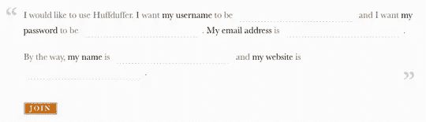

# Madlib 风格的表单增加 30%的转化率？嗯，也许…

> 原文：<https://www.sitepoint.com/madlib-style-forms-increase-conversion-by-30-well-maybe/>

不久前，当我写关于谷歌社交图 API 的文章时，我提到了杰里米·基思的音频分享网络应用 Huffduffer 及其非常规的注册形式。如果你没看过，下面是它的样子:

如你所见，与传统的网络注册表格不同，它要求你在一小段或一句话的空白处填入所需的信息。在它发布的时候，它更多地被视为一种新奇和好奇，而不是网页表单设计的创新，但最近 Vast.com 团队对一种类似的表单和一种更传统的表单进行了 A/B 测试，正如卢克·乌鲁布莱夫斯基在博客中所写的那样，这应该让你三思而行。该测试明显显示，与传统的堆积场形式相比，讲故事形式的转化率增加了 25-40%。你可以在 Vast.com 这里看到一个新的 madlib 形式[的例子。](http://www.vast.com/detail/cars/ob-N7sTu5m7i7S5yLm2u7BBDbZ7e23d0RAHbbu7k8YMNsOLTw==/?pl=0&csearch=0&v_ref=aHR0cDovL3d3dy52YXN0LmNvbS9jYXJzL2xvY2F0aW9uLTk0MTE0L3ZlaGljbGVfY29uZGl0aW9uLUFsbA%3D%3D&v_user=dmFzdF92Mw%3D%3D)

杰里米·基思在博客中写道:

> 这似乎是一个具有统计学意义的结果，即使考虑到 Cennydd 对 A/B 测试的现实核查。

链接是 Cennyd Bowles 的一篇精彩文章，内容是关于在进行 A/B 测试时，基本统计数据经常被忽略的事实。这篇文章的一个快速摘录(尽管我强烈建议你阅读全文):

> 上周我掷了一百次硬币。49 个头。然后我换上一件红色 t 恤，又把同一个硬币扔了一百次。51 头。由此，我得出结论:穿红色球衣的**在投掷人头时会使转化率**增加 4.1%。

这个例子只是部分开玩笑:许多 A/B 测试从相似的样本量中得出相似的结论。然而，我没有看到的是 Keith 所看到的被“解释”的东西:Luke 的帖子没有提到样本大小，或者测试运行的持续时间，或者陈述的数字是绝对百分比还是相对百分比。

那么，目前，我们能从中得到什么呢？还不确定这种形式是否会在每一种网站上创造奇迹，也不确定它的表现是否仅仅是因为它的新颖性(在这种情况下，随着越来越多的网站开始使用类似的形式，这种优势会逐渐减少)。另一方面，看看卢克帖子中的并排截图，新风格的形式确实感觉更有风度和吸引力，不那么冷酷和机器化，所以也许有一些东西。

你怎么想呢?我们会在网上看到大量的故事形式吗？除了注册表单之外，你还能看到它们的其他用途吗？

## 分享这篇文章