# Magento 2 翻译:国际化如何运作

> 原文：<https://www.sitepoint.com/magento-2-translation-how-internationalization-works/>

使用 Magento 2 创建电子商务网站的最重要的功能之一是能够为你的商店添加多种语言。在本教程中，我们将涵盖以下 Magento 2 翻译主题:

*   什么是国际化，为什么它很重要
*   我们如何在 Magento 2 中添加更多的语言
*   如何翻译 CMS 内容，包括页面
*   如何国际化模块和主题，包括添加翻译、更改资产以及更改模块或主题的样式

Magento 2 是目前最受欢迎的电子商务平台之一。它提供了大量开箱即用的功能和严密的安全性。除了内置模块之外，使用 Magento 2，您可以创建自己的模块和主题，以创建符合您或您的客户需求的自定义功能和设计。

本教程假设你已经安装并运行了 Magento 2。如果没有，请遵循 [Magento 2 的官方文档](https://devdocs.magento.com/guides/v2.4/install-gde/composer.html)中的指南。

## 为什么要国际化

国际化(通常缩写为 i18n)既包括翻译您的网站，也包括根据所选语言改变网站的设计或风格。根据您的项目和您使用的编程语言或框架，它可以通过各种方式完成，但总有一些工具可以使它变得更容易。

国际化吸引了更多的用户到你的网站，因为增加不同的语言迎合了不同国籍或世界不同地区的用户。

这对于电子商务尤其重要。确保您的商店了解其用户并能够将他们转化为客户的一种方法是提供更多语言，使商店在全球范围内可用。

## Magento 2 网站结构

在我们进入如何在 Magento 2 中添加语言之前，让我们先来看看 Magento 2 网站是如何构建的。

在 Magento 2 中，你至少需要一个网站。在这个网站上，你可以创建几个商店，但你也需要至少一个。然后，在每个商店中，你至少需要一个商店视图。

默认情况下，每个 Magento 2 安装都有一个网站、网站中的商店和商店中的商店视图。

该网站仅用于组织同一网站下的多个商店。把它想象成一个团体。

商店用于指定商店中销售哪些类别，最终意味着商店中销售哪些产品。例如，你可以将一个网站分成两个商店，一个卖男装，一个卖女装。

最后，我们有属于商店的商店视图。商店视图是用户实际看到的。商店视图可以有自己的主题、页面、产品等等。

有了这个结构，你可以将你的电子商务网站分成不同的部分，甚至不同的网站。例如，你可以把所有的产品放在同一个 Magento 实例中，但是把这些产品放在不同的网站上，或者放在网站的不同商店里。

这种分离还允许您在 Magento 实例中为不同的网站、商店或商店视图设置不同的设置。您可以更改整个网站的设置，这将影响网站中的所有商店，并进而影响这些商店中的所有商店视图。

您也可以更改网站内商店的设置，这将仅更改此商店及其商店视图的设置，而不会影响其他商店或主网站。

或者，您可以更改商店视图的设置，这不会影响其父商店或父网站。

## 在 Magento 2 中添加语言

语言依赖于商店视图。每个商店视图可以有自己的语言。因此，当您想要添加一种新语言时，您实际上需要添加一个具有不同语言的新商店视图。

商店视图可以具有与其父商店或网站相同的设置。因此，不需要额外的配置，除非您需要对该语言进行不同的设置。

## 添加商店视图

在这一节中，我们将看到如何使用管理面板在 Magento 2 中添加一个新的商店视图，以及如何选择商店视图的语言。

### 添加新的商店视图

首先，进入你的 Magento 2 管理门户。URL 路径应该以`/admin_`开头。然而，它可能会有一个不同的后缀，您已经在安装过程中设置。

一旦你进入管理面板并登录，从工具条中选择*商店*，然后选择*所有商店*。

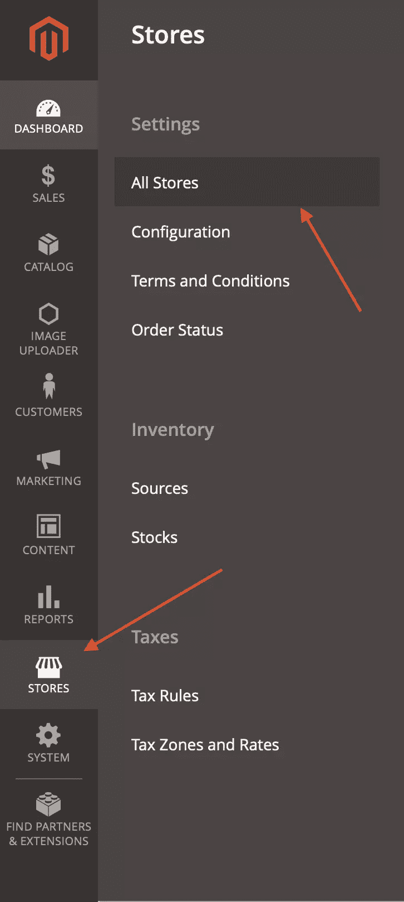

在此页面中，点击*创建商店视图*。

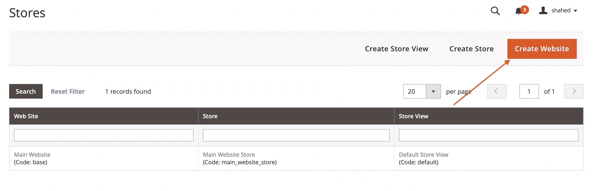

然后你会看到一个需要填写的表格。如果您有多个商店，您必须首先选择该商店视图所属的商店。

然后，你需要输入商店的名称。请注意，名称是用户在选择商店时将在您的网站前端看到的内容。所以，你可以根据你添加的语言来命名它。

您还需要添加新商店的代码。您可以选择任何想要的代码，但是根据语言设置代码会很有帮助。例如，`en`为英文。

最后，您需要将状态更改为 *Enabled* 以确保用户看到商店视图。

您也可以选择排序顺序。如果您正在添加一种新语言，但您希望该语言成为用户访问您的网站时看到的默认语言，这将很有帮助。如果是这样，您可以在这里通过设置一个数字来更改排序顺序，最低值(表示顺序中的最高值)为 0。

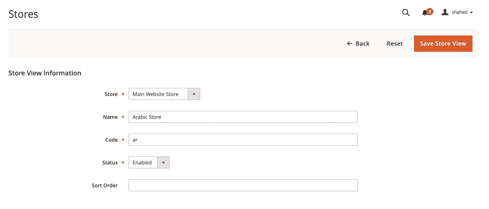

完成后，点击*保存商店视图*，你的商店视图将被添加。

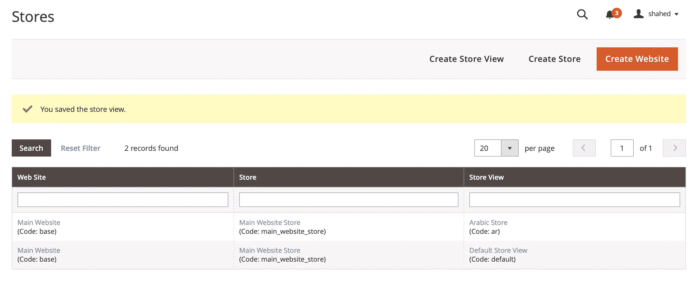

此时，您可能需要清除缓存。你可以点击侧边栏中的*存储*，然后点击*缓存管理*。

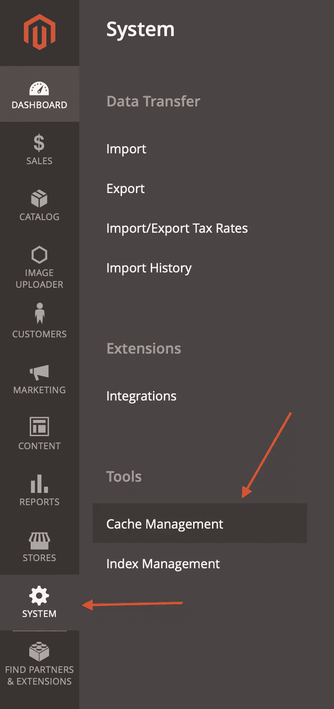

然后，选择*从下拉列表中选择所有*并点击*提交*。这将清除缓存。

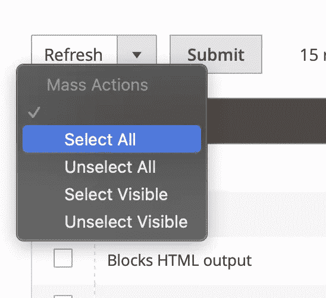

现在，去你的网站。根据你的主题，你应该在网站的标题上看到一个下拉菜单，允许你在商店视图之间切换。

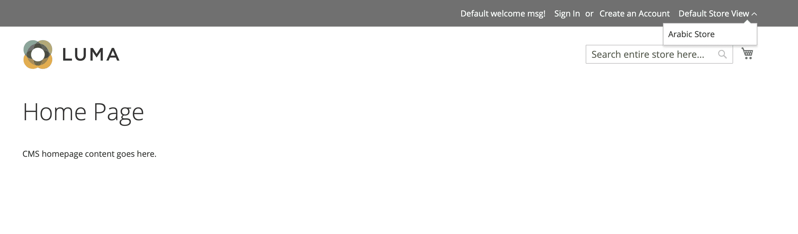

请注意，这将根据你的主题看起来不同。Magento 的亮度主题中的截图主题，默认情况下安装在 Magento 2 中。

### 选择商店视图的语言

接下来，我们将选择商店视图的语言。为此，在管理面板上点击工具条中的*存储*，然后点击*配置*。

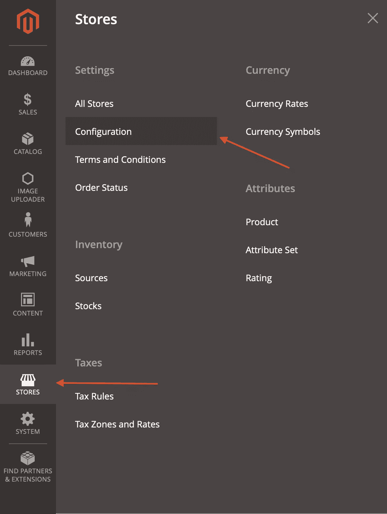

请注意，在管理门户上，您会在几乎每个页面的左上方看到一个带有标签*范围*的下拉菜单，允许您更改网站、商店或商店视图。当您想要更改特定网站、商店或商店视图的设置，而不是应用于所有网站、商店和商店视图的默认设置时，可以使用此选项。

因此，在配置页面上，从下拉列表中选择您刚刚创建的商店视图。您将被要求确认您的操作。点击弹出窗口中的*确定*。

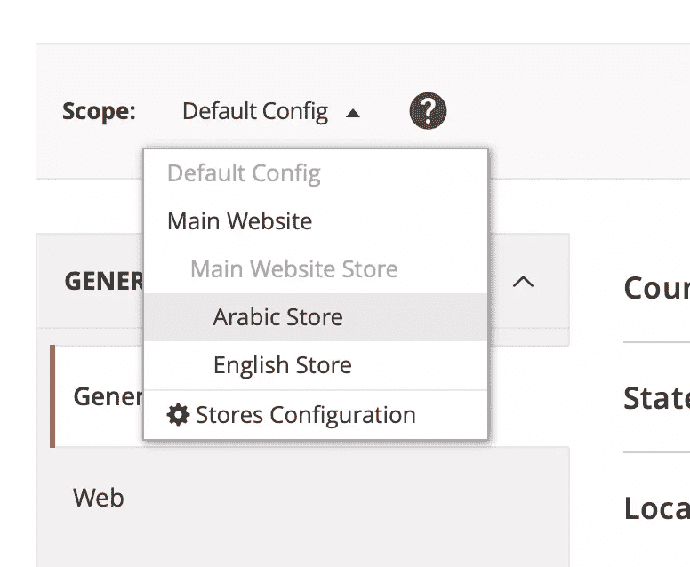

然后，选择侧边栏中*常规*部分下的*常规*选项卡(如果尚未选择)。打开标题为*的可折叠区域设置选项*。在可折叠栏下，取消选中第一个字段右侧的*使用网站*，应该是*区域设置*，然后从下拉列表中选择您要添加的语言。

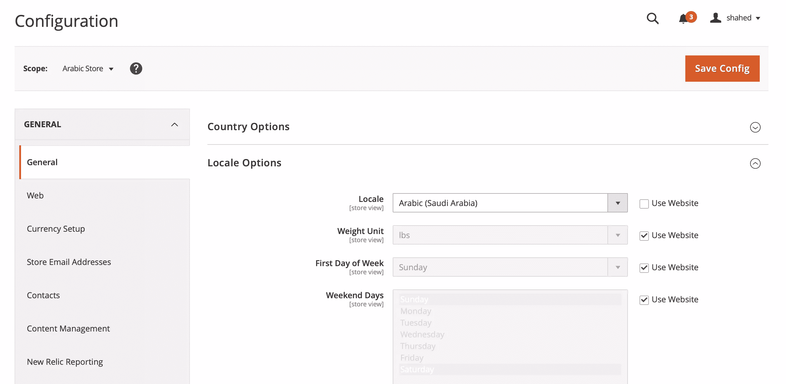

在本教程中，我们将添加阿拉伯语。

完成后，点击右上角的*保存配置*。这将改变你的网站的语言。然而，当您打开刚刚添加的商店时，您会注意到什么都没有改变。这是因为我们仍然需要为我们添加的语言添加翻译，并且在必要时更改样式。

## 安装 Magento 2 语言包

由于 Magento 2 中的字符串很常见，所以除了字符串和文本之外，还有免费的开源 Magento 2 语言包，允许您轻松地将翻译添加到 Magento 2 网站。

你可以在 Magento 的市场上找到语言包，尽管大多数都不是免费的。

Mageplaza 提供了一系列你可以安装的免费开源语言包。他们有 55 个 Magento 2 语言包，你可以免费使用。

在本教程中，我们将安装他们的[阿拉伯语语言包](https://www.mageplaza.com/magento-2-arabic-language-pack.html)。您可以选择任何语言包；无论使用何种语言，任何语言包的流程都是相同的。

如果您从不同的提供商那里选择 Magento 2 语言包，步骤也应该相同，除非您的提供商规定了不同的步骤。

打开终端，切换到 Magento 项目的根目录。在该目录中，运行以下命令:

```
composer require mageplaza/magento-2-<LANGUAGE>-language-pack:dev-master mageplaza/module-smtp 
```

请注意，您应该用您正在安装的语言替换`<LANGUAGE>`。在我们的例子中，它将是`arabic`。您也可以通过访问该语言的 GitHub 页面(如果您是从 Mageplaza 下载的)并检查存储库的名称来找到包的名称。

完成后，你可以登录你的网站，选择你的新语言，如果还没有选择的话，你会看到网页已经被翻译成那种语言了。

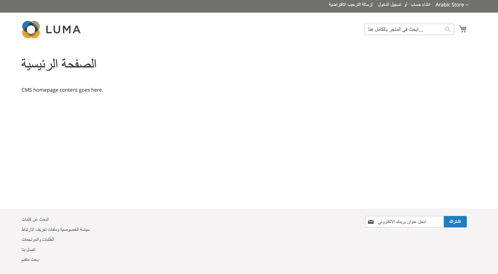

如果页面没有翻译，或者页面样式有问题，请执行以下操作。

运行以下命令为添加的新语言生成静态内容:

```
php bin/magento setup:static-content:deploy ar_SA 
```

请确保将`ar_SA`替换为您正在添加的语言。如果你的 Magento 2 实例设置为开发者模式，你还需要添加选项`-f`。

之后，执行以下命令来触发重新索引并清除缓存:

```
php bin/magento indexer:reindex
php bin/magento cache:clean
php bin/magento cache:flush 
```

## CMS 内容的 Magento 2 翻译

在 Magento 2 中，CMS 页面和区块可以包含在特定的商店视图中，而不是整个网站。这意味着页面可以根据它所在的商店翻译成多种语言。

在本节中，我们将了解如何将同一页面翻译成不同的语言，并将页面添加到所需语言的商店视图中。

目前，我们有默认的主页，上面只写着“CMS 主页内容在这里”。无论使用何种语言，该主页都会显示这两种商店视图。

我们将首先更改显示此页面的商店视图。在管理面板中，点击侧面板中的*内容*，然后点击*页面*。

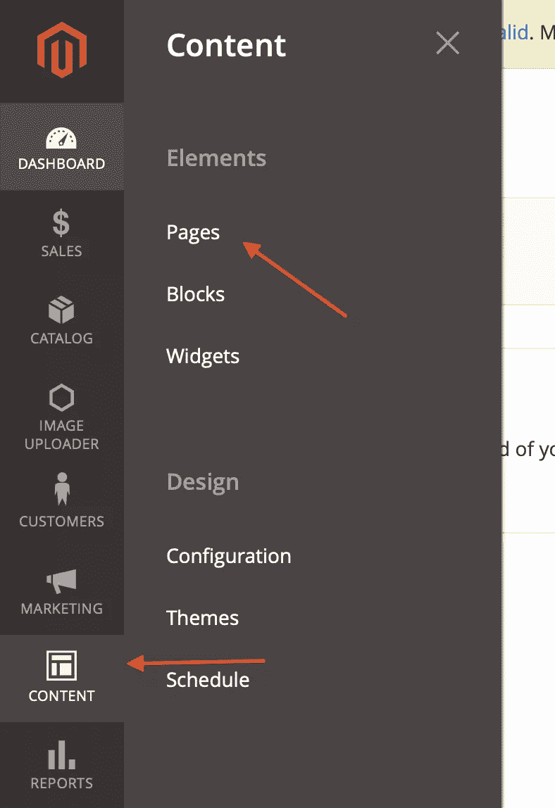

你会看到你的网站上所有网页的网格。找到主页，然后点击*动作*栏中的*选择*下拉菜单，然后*编辑*。

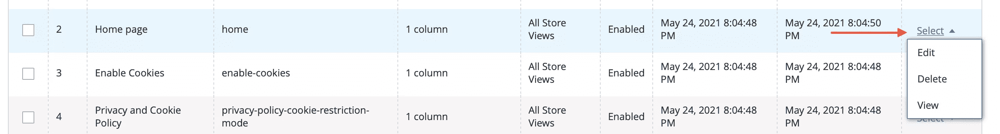

然后，向下滚动到可折叠网站中的*页面，将其展开，并选择您希望该页面出现的网站。由于这是默认页面，并且是英文的，我们将选择把它保存在英文商店中。*

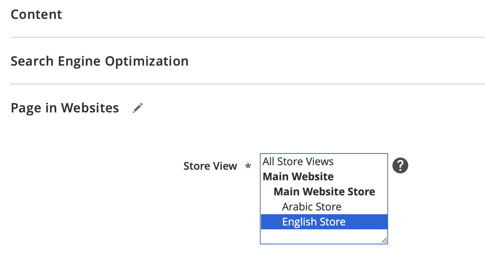

完成后，点击*保存*。

现在，以前的主页只是出现在英文商店上。我们将创建一个新的出现在阿拉伯语商店。

返回到*页面*，点击*添加新页面*。


首先在*内容*下输入页面标题和你想要的内容。

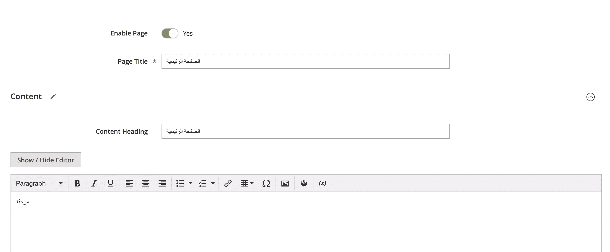

然后，打开折叠部分*搜索引擎优化*，在*网址键*字段输入`home`。这对主页很重要，因为主页是由 URL 键`home`决定的。


之后，向下滚动到可折叠网站中的*页面，选择您添加的新商店视图。*

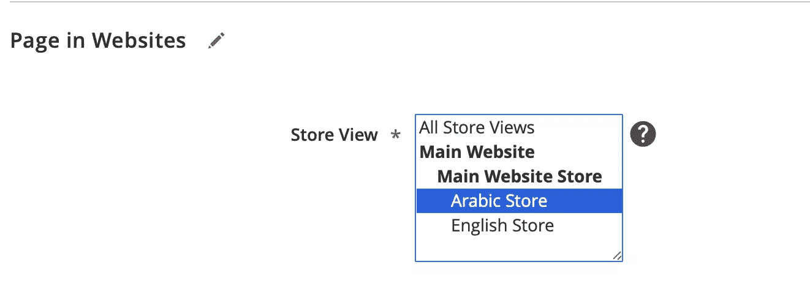

完成后，点击*保存*。然后，去你的网站。根据您选择的语言，您应该会在主页上看到不同的内容。

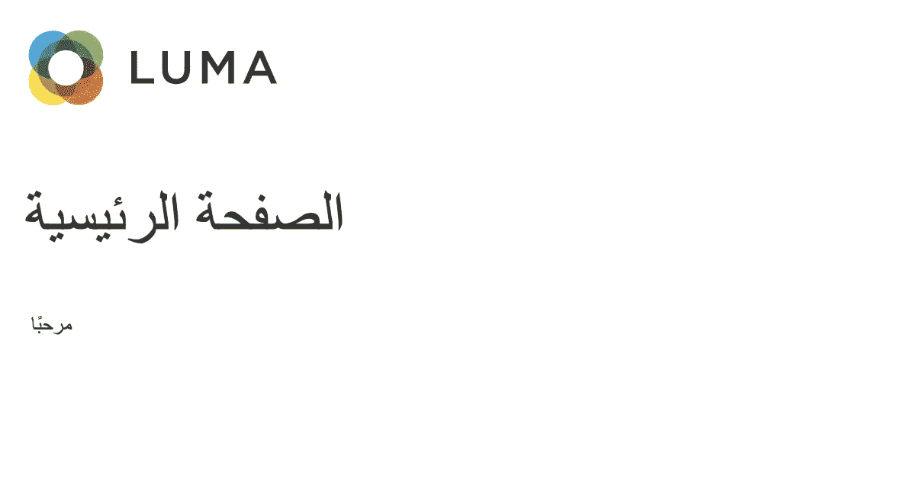

## 国际化模块和主题

在这一节中，我们将看到如何国际化我们创建的定制模块和主题。这包括翻译模块和主题中的字符串，并根据地区更改 CSS 样式。

本节假设您已经创建了一个模块或主题。如果你需要更多这方面的信息，你可以查看 Magento 2 的文档关于如何创建一个模块和如何 T2 创建一个主题。

### 使用 Magento 2 翻译功能

基于文件的编程语言，有一些 Magento 2 翻译函数或方法可供您使用。这些函数将把作为参数传递的字符串翻译成当前商店视图的语言。

#### PHP 和 PHTML

在 PHP 和 PHTML 模板文件中，可以使用`__()`函数来翻译字符串。例如:

```
__('Hello'); 
```

这将根据当前商店视图的语言翻译字符串。

您也可以传递一个不希望被翻译的参数:

```
__('Hello, %1', $name); 
```

#### Java Script 语言

在 JavaScript 文件中，首先需要添加`'mage/translate'`库:

```
require(['jquery', 'mage/translate'], function ($, $t) {...}); 
```

然后，在您的代码中，您可以按如下方式翻译字符串:

```
$.mage.__('Hello'); 
```

或者，您可以使用`$t`，它在您添加了`mage/translate`库之后可用:

```
$t('Hello'); 
```

要传递参数，需要使用 JavaScript 的 [replace](https://developer.mozilla.org/en-US/docs/Web/JavaScript/Reference/Global_Objects/String/replace) 函数:

```
$t('Hello, %1').replace('%1', name); 
```

#### 电子邮件模板

要翻译电子邮件模板中的字符串，您可以使用`trans`指令。例如:

```
{{ trans "Hello" }} 
```

您也可以传递一个参数:

```
{{ trans "Hello, %name" name="World" }} 
```

#### UI 组件的模板

要翻译 UI 组件的模板，即`.html`文件，您可以使用`i18n`:

```
<p data-bind="i18n: 'Hello'"></p> 
```

或者，您可以使用 [Knockout](https://knockoutjs.com) 注释:

```
<!-- ko i18n: 'Hello' --><!-- /ko --> 
```

或者您可以使用`translate`指令:

```
<translate args="Hello" /> 
```

#### UI 组件布局

要翻译 UI 组件布局中的字符串，可以将`translate`属性添加到任何元素中，并将其设置为 true。例如:

```
<item name="label" xsi:type="string" translate="true">Hello</item> 
```

### 添加 Magento 2 翻译词典

模块和主题都可以有翻译词典。这些 Magento 2 翻译词典类似于语言包。您可以使用它们来翻译您自己的模块，或者修改和覆盖来自其他模块或语言包的翻译。

在一个[模块的结构](https://blog.shahednasser.com/beginners-guide-to-magento-2-understanding-the-structure/#modules)中，模块的每个部分都有不同的目录。Magento 2 翻译词典位于目录`i18n`中。该目录是模块的可选目录。

类似地，在主题的结构中，翻译词典也位于目录`i18n`中。

在这个目录中，存放着您想要将模块或主题翻译成每种语言的 CSV 文件。因此，举例来说，如果我们想要将我们自己的模块翻译成阿拉伯语，因为我们已经添加了阿拉伯语，我们在模块的`i18n`目录中添加 CSV 文件`ar_SA.csv`。

添加新的翻译后，你可能需要清空 Magento 的缓存。您可以使用命令行来完成:

```
php bin/magento cache:clean
php bin/magento cache:flush 
```

您也可以从管理面板中完成，方法是转到*系统*，然后转到*缓存管理*，并像我们之前所做的那样从那里清除它。

#### 用 Magento 的 i18n 工具创建字典

创建字典的一种方法是使用 Magento 的 i18n 工具。但是，这要求您在使用该工具之前已经使用了 Magento 2 翻译功能。所以，在使用这个工具之前一定要这样做，因为它会从使用翻译函数的代码中提取字符串。

要使用该工具，请运行以下命令:

```
php bin/magento i18n:collect-phrases -o="<PATH>/i18n/<LANGUAGE>.csv" <TRANSLATE_PATH> 
```

这里，`<PATH>`是从 Magento 2 项目的根开始，通向你的模块或主题的路径；`<LANGUAGE>`是您要翻译的语言，在我们的例子中是`ar_SA`；而`<TRANSLATE_PATH>`是我们正在翻译的路径，也是应该从中提取字符串的路径，它可以是模块、主题的路径，或者只是 Magento 的全部，如果你想自己翻译所有东西的话。

请注意，这个工具不会为您做翻译；它只是在你的模块中累积 Magento 2 翻译函数中的所有字符串，并把它们放在一个 CSV 文件中，以备你翻译。

#### 手动创建字典

或者，您可以手动创建词典。您只需要在您的模块或主题中的`i18n`目录下创建语言 CSV 文件。如上所述，文件的名称应该基于文件所代表的语言。所以，如果你翻译成阿拉伯语，它将是`ar_SA.csv`。

然后，在文件中，您需要在每一行添加由逗号分隔的字符串及其翻译。例如:

```
"Hello","مرحبا" 
```

每个字符串应该在新的一行。

### 基于区域设置更改资产

在您的模块和主题中，您还可以基于区域设置更改资产。资产是目录`views/<AREA>/web`中你的模块内的所有文件，其中`<AREA>`可以是`frontend`或`adminhtml`，或者是目录`web`中你的主题内的所有文件。

例如，假设你有一个图片，当商店是英文的时候，你想要显示，而你有其他语言的对应图片。Magento 允许您轻松地为该图像指定不同地区的替代图像。

在你的模块中的`views/<AREA>/web`或者你的主题中的`web`里面，你只需要添加目录`i18n`。然后，在`i18n`中，您需要添加一个目录，其中包含您想要更改的语言环境的名称。

因此，在我们的例子中，如果我们在模块中的`views/frontend/wimg/test.png`处有一个图像，并且我们想用阿拉伯语添加一个替换图像，我们需要在`views/frontend/web`中创建目录`i18n`。然后，在`i18n`中，我们创建目录`ar_SA`。

在每个语言环境目录中(在这个例子中是`ar_SA`)，当添加替换时，结构应该类似于`views/frontend/web`。

因此，在本例中，为了替换阿拉伯商店视图中的`views/frontend/wimg/test.png`，我们将添加`views/frontend/web/i18n/ar_img/test.png`作为替换。

然后，要检索模板`phtml`文件中的图像，我们可以执行以下操作:

```
getViewFileUrl('VENDOR_MODULE::images/test.png') ?>" /> 
```

这里，`VENDOR_MODULE`是模块及其供应商的名称。

因此，当区域设置是默认的(在我们的例子中是英语)时，将使用模块中位于`views/frontend/wimg/test.png`的图像。但是，当区域设置为阿拉伯语时，将使用位于`views/frontend/web/i18n/ar_img/test.png`的图像。

这不仅适用于图像，也适用于`web`中的所有文件。因此，它也适用于 CSS、JavaScript 或 HTML 文件。

## 具有不同脚本方向的 Magento 主题的最佳实践

当您的网站国际化以支持两种语言时，其中一种是从左到右(LTR)或从右到左(RTL)，最佳实践是首先创建一个基于主要语言提供样式的主题。

所以，如果主要语言是 LTR，那么你可以创建一个主题来支持这个网站所需的所有样式。

然后，为了支持 RTL，您创建了另一个扩展主主题的主题。在这个新的子主题中，您可以根据需要对样式进行任何更改。

这消除了在两个 CSS 文件中重复修改的需要——只要您使用上一节中详细介绍的基于区域设置修改资产的方法。

考虑到在大多数情况下，你的网站在两种语言下看起来是一样的，但是可能会有细微的差别，最好是两者共享相同的样式，然后覆盖你的子主题中的更改。

创建这两个主题后，您可以从管理面板为每个商店视图分配支持其区域设置和文本方向的主题。

## 结论

有了 Magento 2，您可以为您的电子商务商店准备好许多开箱即用的功能。这使得它成为一个非常有用的电子商务框架。

它的优势之一是为你的用户提供多种语言，以吸引更多来自不同语言和国家的用户。Magento 2 使管理每种语言的不同内容变得容易，还可以添加 Magento 2 翻译词典，根据地区更改资产和样式。

你还可以做更多的事情来国际化你的 Magento 2 商店，比如翻译产品描述或者根据地区改变类别名称等等。请务必查看 Magento 2 翻译文档[以获取更多信息。](https://devdocs.magento.com/guides/v2.4/frontend-dev-guide/translations/xlate.html)

## 分享这篇文章