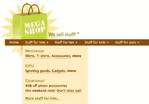

# 用 jQuery 制作一个大型下拉菜单

> 原文：<https://www.sitepoint.com/make-a-mega-drop-down-menu-with-jquery/>

这篇文章写于 2009 年，至今仍是我们最受欢迎的帖子之一。如果你热衷于学习更多关于 jQuery 的知识，你可能会对这篇关于 jQuery 插件注册中心的文章很感兴趣。

巨型下拉菜单到处出现，现在[可用性专家 Jakob Nielsen 认为它们非常好](http://www.useit.com/alertbox/mega-dropdown-menus.html)，你可以期待很快看到更多这样的菜单。

以下是他对这一趋势的看法:

> 鉴于[常规下拉菜单充斥着可用性问题，](http://www.useit.com/alertbox/20001112.html)我花了很大力气推荐一种新形式的下拉菜单。但是，正如我们的测试视频所示，大型下拉菜单克服了常规下拉菜单的缺点。因此，我可以推荐一个，同时警告另一个。

当然，尼尔森的文章包括了一些关于实现这些的最有用的方法的可靠建议。简而言之，他的建议如下:

*   最好的巨型下拉菜单包含简单的、逻辑的信息组——因此它们易于浏览和导航。
*   保持简单——避免使用复杂的 GUI 项目或其他复杂的交互元素。
*   一个巨大的下拉菜单应该只在用户悬停 0.5 秒后出现。如果菜单被设置为立即显示，当用户不经意地在菜单上滚动鼠标时，他们会看到一堆菜单在闪烁——这很讨厌。
*   如果用户将鼠标从菜单项或大下拉菜单上移开，下拉菜单应该保持 0.5 秒——以防用户不小心将鼠标滚出框外。

那么，我们该如何实施这些计划呢？虽然在纯 HTML 和 CSS 中完成所有这些很棒，但目前不可能获得这些漂亮的半秒延迟——当然，Internet Explorer 6 有一个令人讨厌的问题，它只支持锚元素上的`:hover`。相反，我已经用 jQuery 和一个非常漂亮的插件 hoverIntent 找到了一个解决方案。

## 设计

假设我们有一个客户，超级商店。他们的设计师给了我们一个模型，其中包括一些大型下拉菜单。你可以在下面看到模型的相关部分([点击](https://www.sitepoint.com/wp-content/uploads/2009/03/mega-shop-mockup.png)查看完整版本)。

[](https://www.sitepoint.com/wp-content/uploads/2009/03/mega-shop-mockup.png)

## 加价

第一:标记。我从一个基于无序列表的相当简单的菜单开始。标记如下所示:

```
<ul id="menu">
  <li><a href="#">Home</a></li>
  <li><a href="#">Stuff for him</a></li>
  <li><a href="#">Stuff for her</a></li>
  <li><a href="#">Stuff for kids</a></li>
  <li><a href="#">Stuff for pets</a></li>
</ul>
```

我将在每个下拉链接后添加一个`div`——它们将包含菜单的内容。此外，我希望有一种方法来指示这些项目上有一个下拉选择，所以我还将向这些列表项目添加一个类，`.mega`。最后，我想确保这个菜单在没有样式的情况下是有意义的，因为每个类别将充当一种标题，所以我将向项目添加一些标题标记。这里有一个列表项:

```
<li class="mega">
  <h2>
    <a href="#">Stuff for him</a>
  </h2>
  <div>
      <!-- Contents here -->
  </div>
</li>
```

接下来，让我们给这些`div`添加一些内容。这里有一个:

```
<li class="mega">
  <h2>
    <a href="#">Stuff for him</a>
  </h2>
  <div>
      <h3>
        Menswear
      </h3>
      <p>
        <a href="#">Shirts</a>, 
        <a href="#">T-shirts</a>, 
        <a href="#">Accessories</a>,
        <a href="#">More...</a>
      </p>
      <h3>
        Gifts
      </h3>
      <p>
        <a href="#">Sporting goods</a>, 
        <a href="#">Gadgets</a>, 
        <a href="#">More...</a>
      </p>
      <h3>
        Clearance!
      </h3>
      <p>
        40% off all photo accessories 
        this weekend only. 
        <a href="#">Don't miss out!</a>
      </p>
    <a href="#" class="more">
      More stuff for him...</a>
  </div>
</li>
```

当然，我需要添加标记来表示网站的标题。不幸的是，我们没有时间详细讨论这个问题，但是你可以看看我在第一个例子中做了什么，[unstyled.html](https://www.sitepoint.com/examples/megadropdowns/unstyled.html)。

## 风格

接下来，我要设计一些风格。现在，我们将只关注列表元素和下拉列表样式中最相关的部分。但是，如果您想看完整的样式表，可以在我们的第二个例子中查看完整的样式表。

每个大型列表项都设置为内联显示，以实现漂亮的水平栏。我们希望下拉菜单覆盖页面，直接在列表项下；为了实现这一点，我们将在每个大型列表项目上使用`position: relative`，稍后我们将在`div`上使用`position: absolute`:

```
ul#menu li {
  display: inline;
  position: relative;
}
```

每个`div`都被设计成类似我们从设计师那里收到的模型。我在这里使用了`position: absolute`将它们与每个列表项左对齐，并将它们放在正下方。我还使用`display: none`作为该菜单的所有`div`的总称，这将有助于隐藏位于主页链接下方的菜单:

```
ul#menu div {
  display: none;
}

ul#menu li.mega div {
  width: 18em;
  position: absolute;
  top: 1.6em;
  left: 0em;
}
```

我将为这些列表项添加另一个类`.hovering`，并通过`display: block`使其子元素`div`可见。稍后，使用 JavaScript，当鼠标悬停在列表项上时，我将把`.hovering class`添加到列表项中，当鼠标离开该区域时，删除该类:

```
ul#menu li.hovering div {
  display: block;
}
```

## 脚本

现在，让我们添加 JavaScript。对于这个例子，我选择使用 jQuery 当然，欢迎您编写自己的脚本或使用不同的框架。您可能会认为将一个巨大的库的所有开销用于一个小小的菜单有点过分了。然而，这只是我们假设的电子商务网站的一部分，我几乎肯定会计划将 jQuery 用于界面的其他部分。

首先，当然，我将包括 jQuery 库。接下来，我还将包含一个非常漂亮的插件，名为 [hoverIntent](http://plugins.jquery.com/project/hoverIntent) 。jQuery 有自己的悬停事件，但是鼠标一接触到目标区域，它就会触发。相反，我们希望实现 Jakob Nielsen 推荐的延迟效果:也就是说，我们希望等待用户停止移动鼠标。hoverIntent 插件通过考虑鼠标移动速度来实现这一点。

首先，我们需要编写几个函数来添加和删除`.hovering` 类——这是打开大型项目显示的类:

```
function addMega(){
  $(this).addClass("hovering");
  }

function removeMega(){
  $(this).removeClass("hovering");
  }
```

然后，当我们将鼠标悬停在某个项目上或离开它时，我们将使用`hoverIntent`函数来启动这些函数。首先，我们需要设置一些配置变量:

```
var megaConfig = {    
     interval: 500,
     sensitivity: 4,
```

interval 参数指定 hoverIntent 用来检查鼠标移动的毫秒数(即千分之一秒)。“敏感度”参数指定鼠标在“间隔”参数期间移动的像素数，以便被视为移动。如果鼠标移动的距离小于该距离，则认为鼠标处于悬停状态。

```
 over: addMega,
```

over 参数指定鼠标停止时将调用的函数。

```
 timeout: 500,
     out: removeMega
     };
```

timeout 参数指定在执行鼠标离开功能之前，我们希望等待多长时间(毫秒)。out 参数指定了延迟过后要做什么——因此在本例中，将在 500 毫秒后调用`hideMega`函数。

最后，我们将把`hoverIntent`函数附加到`.mega`列表项，告诉它使用我们设置的配置开始寻找悬停和鼠标释放:

```
$("li.mega").hoverIntent(megaConfig)
```

也就这样了！

## 测试时间

是时候测试我们的菜单了！您可以在我们的最后一个示例[completed.html](https://www.sitepoint.com/examples/megadropdowns/completed.html)中看到带有标记、样式和脚本的完整演示。

## 现在怎么办？

这里还可以添加更多的功能——例如，一个下拉菜单可能会有一些明显的可访问性问题，所以最好能找到一种方法在这个菜单中添加键盘操作。给这些菜单添加一些更有趣的设计元素也不错，比如图标、阴影或列排列。不过现在，我们有了一个坚实的开端！

如果你喜欢读这篇文章，你会爱上[可学的](https://learnable.com?utm_source=sitepoint&utm_medium=link&utm_campaign=learnablelink)；向大师们学习新技能和技术的地方。会员可以即时访问 SitePoint 的所有电子书和交互式在线课程，如 [jQuery Fundamentals](https://learnable.com/courses/jquery-fundamentals-1132?utm_source=sitepoint&utm_medium=link&utm_campaign=learnablelink) 。

对这篇文章的评论已经关闭。有关于 jQuery 的问题吗？为什么不在我们的[论坛](https://www.sitepoint.com/forums/forumdisplay.php?15-JavaScript-amp-jQuery?utm_source=sitepoint&utm_medium=link&utm_campaign=forumlink)上问呢？

## 分享这篇文章