# 在 Photoshop 中制作美味的甜甜圈

> 原文：<https://www.sitepoint.com/make-delicious-donut-icon-photoshop/>

插图是平面设计不可或缺的一部分。风格化的插图可以有比现实生活更大的吸引力，这远远超出了现实照片所能提供的，特别是当涉及到食物的时候。一个放纵的可食用食物的插图可以获得令人难以置信的关注，并引发观众的本能反应。

在本教程中，我将带你通过 Photoshop 制作一个美味的甜甜圈的过程。我们将使用钢笔工具，画笔工具，加深工具，减淡工具，涂抹工具，以及各种滤镜和图层样式技术来实现最终的效果。希望你能学到一些有用的技巧，同时激发食欲。所以，让我们开始吧！

### 资源:

[自由模糊背景](http://bit.ly/14PBcAi "Free Blurred Backgrounds")

### 最终结果:

[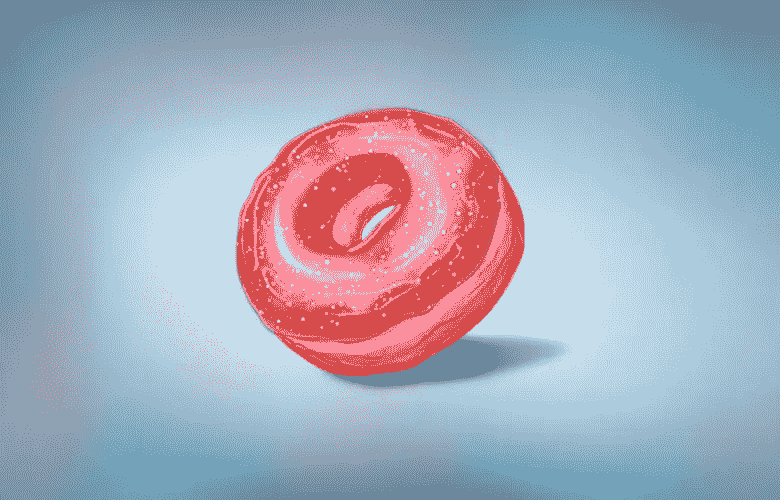](https://www.sitepoint.com/wp-content/uploads/2013/09/Final-outcome.jpg)

**( [下载完成的，分层的 PSD 文件](https://www.dropbox.com/s/5nynwl87h3cr4oy/Donut%20Icon.zip)。)**

### 第一步

在 Photoshop 中创建一个宽度为 700 像素、高度为 500 像素的新文档。
[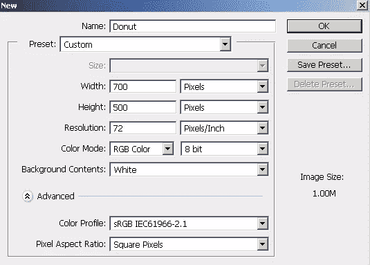](https://www.sitepoint.com/wp-content/uploads/2013/09/image1.jpg)

### 第二步

首先，我们将画出甜甜圈的基本形状。选择#f7b569 作为你的前景色，选择钢笔工具(工具模式:“形状”)绘制如下图所示的形状。将其标记为“Base1”。
[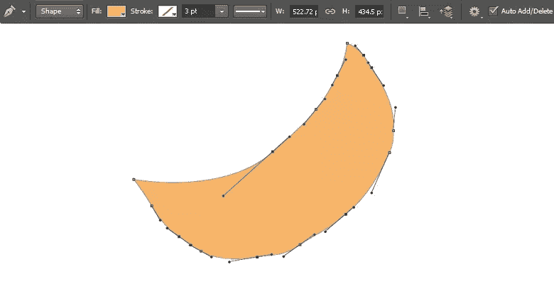](https://www.sitepoint.com/wp-content/uploads/2013/09/image2.jpg)

### 第三步

现在，选择颜色#fe4258 并画出形状来制作糖衣。甜甜圈上的糖衣从来都不是完美的，所以尽量让它有点不规则。贴上“糖衣”的标签。
[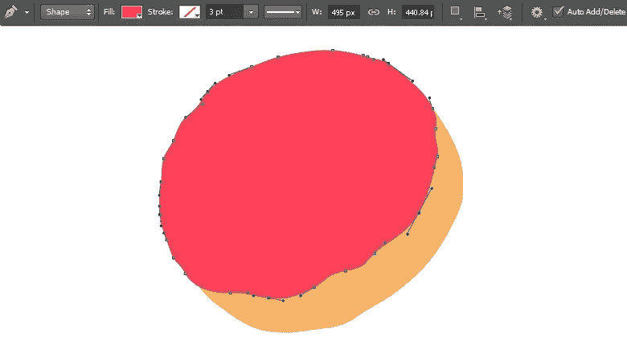](https://www.sitepoint.com/wp-content/uploads/2013/09/image3.jpg)

如下图所示，画另一个覆盖糖衣中心的形状。贴上“洞”的标签。
[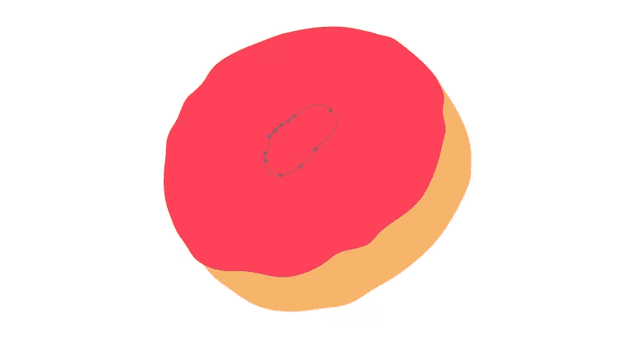](https://www.sitepoint.com/wp-content/uploads/2013/09/image3b.jpg)

### 第四步

通过按“Shift”键选择孔和结冰层。然后，进入“图层”>“组合形状”>“减去前面的形状”。将生成的形状标记为“糖衣”。
[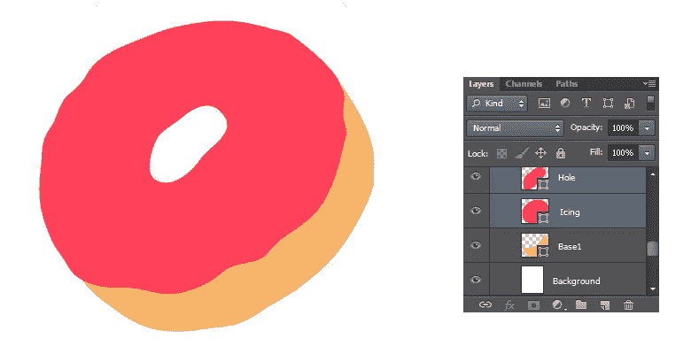](https://www.sitepoint.com/wp-content/uploads/2013/09/image4.jpg)

### 第五步

再次选择#f7b569 作为你的颜色，用钢笔工具在糖衣层下面画一个形状(工具模式:形状)。将其标记为“Base2”。
[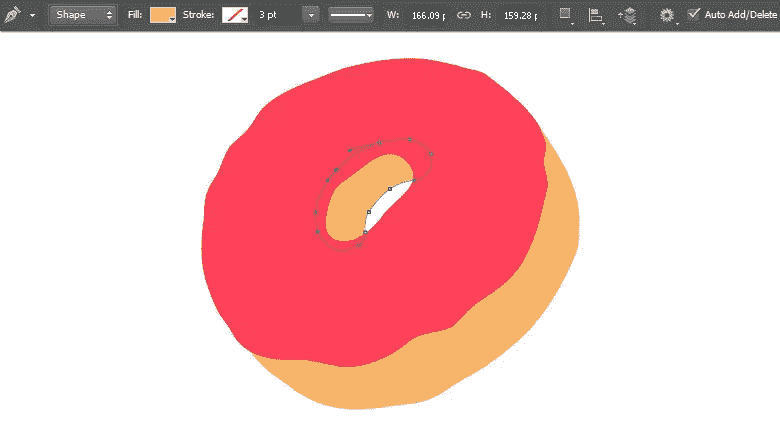](https://www.sitepoint.com/wp-content/uploads/2013/09/image5.jpg)

### 第六步

接下来，我们将通过图层样式给这些形状一些体积。双击“Base1”层打开图层样式窗口，应用下面的内阴影设置。
[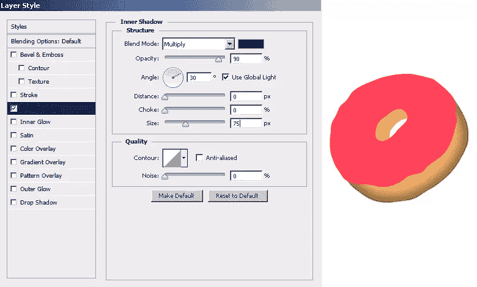](https://www.sitepoint.com/wp-content/uploads/2013/09/image6.jpg)

### 第七步

双击糖衣层，应用下面的内阴影、缎面和投影设置，得到和我一样的效果。

[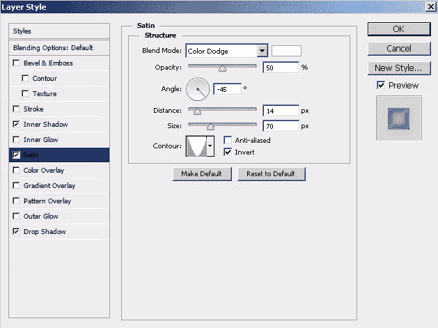](https://www.sitepoint.com/wp-content/uploads/2013/09/image7b.jpg)

[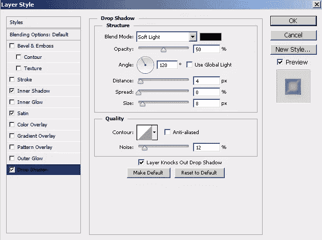](https://www.sitepoint.com/wp-content/uploads/2013/09/image7c.jpg)

[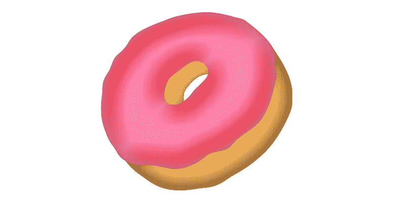](https://www.sitepoint.com/wp-content/uploads/2013/09/image7d.jpg)

### 第八步

现在，我们将添加细节的基础 1 层。选择#ae7533 作为你的颜色，并选择一个软圆刷。按 Ctrl + <click on="" the="" layer="">在它周围进行选择。现在，在它上面新建一层，用笔刷(30-40px 大小)大致如下图所示。红色区域是我使用画笔的地方。
[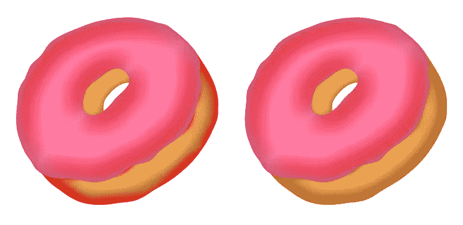](https://www.sitepoint.com/wp-content/uploads/2013/09/image8.jpg)</click>

当选择仍然活跃，选择#cf8d42 作为你的颜色，并使用 15-20px 软圆刷(60%不透明度)在一个新的图层上画一条不规则的线，如下所示。
[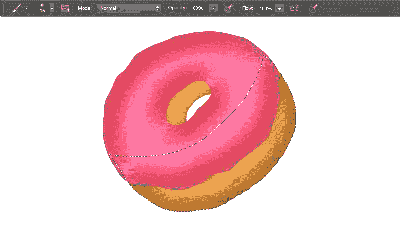](https://www.sitepoint.com/wp-content/uploads/2013/09/image8b.jpg)

创建一个新层，选择#fed8ac 作为你的颜色。如下图所示，使用软圆刷(30-40px 大小)。减少这一层的不透明度为 50%。
[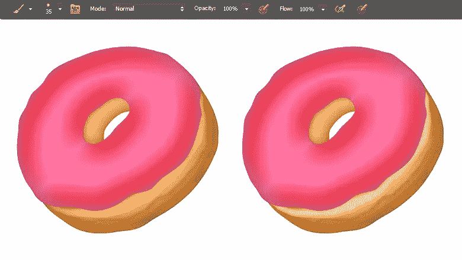](https://www.sitepoint.com/wp-content/uploads/2013/09/image8c.jpg)

### 第九步

现在，选择一个 1-2px 的软圆刷，在一个新图层上随机绘制明暗线条。
[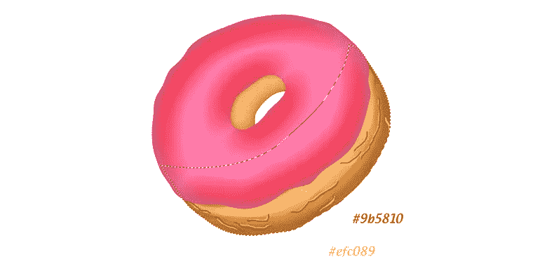](https://www.sitepoint.com/wp-content/uploads/2013/09/image9.jpg)

选择涂抹工具(强度:15%)，将其应用到这些笔画上，将它们混合在一起。完成后，将笔画层的不透明度降低到 50%。
[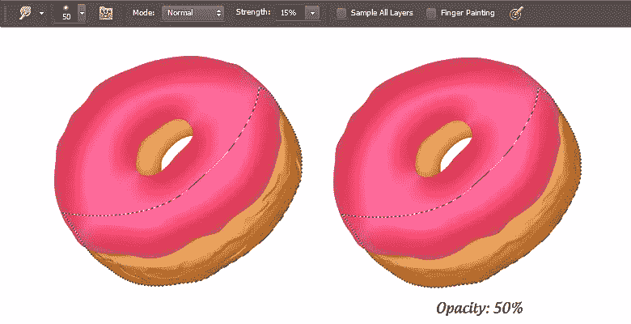](https://www.sitepoint.com/wp-content/uploads/2013/09/image9b.jpg)

### 第十步

当选择仍然活跃，创建一个新的层，并前往“编辑”>“填充”>“使用 50%灰色”。改变其混合模式为“叠加”。选择加深工具，并选择一个 40-50px 大小的软圆形笔刷工具，范围:“中间色调”和曝光:“20%”。把它涂在边缘上。现在，选择一个 2-3px 大小的笔刷，在步骤 9 创建的细节上应用加深工具。之后选择减淡工具，范围:“中间调”，曝光:“20%”。在细节上应用减淡来突出它们。
[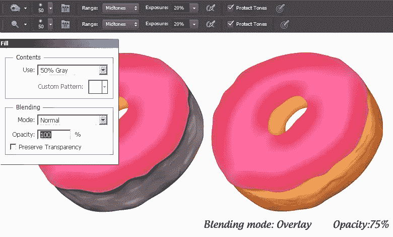](https://www.sitepoint.com/wp-content/uploads/2013/09/image10.jpg)

### 步骤 11

接下来，我们将在基底 1 上应用纹理。要制作纹理，新建一个图层，填充颜色 d19956。之后，进入“滤镜”>“噪波”>“添加噪波”，在这里使用以下值。
 
现在，进入“滤镜”>“滤镜库”>“笔刷笔画”>“重音边缘”，在这里应用以下设置。
[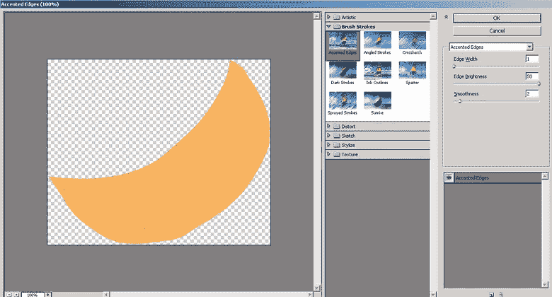](https://www.sitepoint.com/wp-content/uploads/2013/09/image11b.jpg)

改变其混合模式为“柔光”，并设置 75%的不透明度。

### 步骤 12

按 Ctrl + <click on="" the="" layer="">在它周围进行选择。现在，使用在步骤 8-11 中解释的同样的技术给“Base2”层添加细节和纹理。
[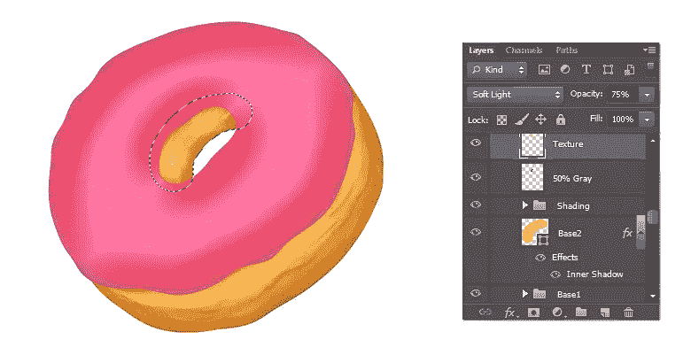](https://www.sitepoint.com/wp-content/uploads/2013/09/image12.jpg)</click>

### 第十三步

接下来，我们将应用阴影的糖衣。按 Ctrl + <click on="" icing="" layer="">选中它，挑#ffc0cc 作为你的颜色，选择软圆刷(40-50px 大小)。现在，在一个新的图层上使用这个笔刷来突出糖衣。
[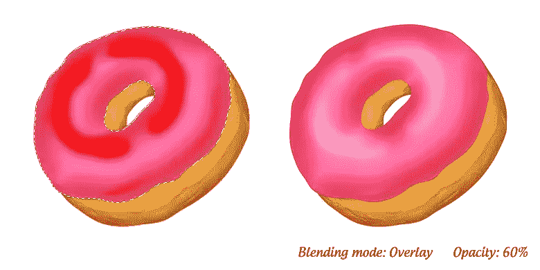](https://www.sitepoint.com/wp-content/uploads/2013/09/image13.jpg)</click>

### 步骤 14

选择#a33d41 作为你的颜色，使用软圆形笔刷工具在新图层上应用一些阴影(不透明度:50-60%)。一旦你完成了，改变这一层的混合模式为“强光”，设置不透明度为 75%。
[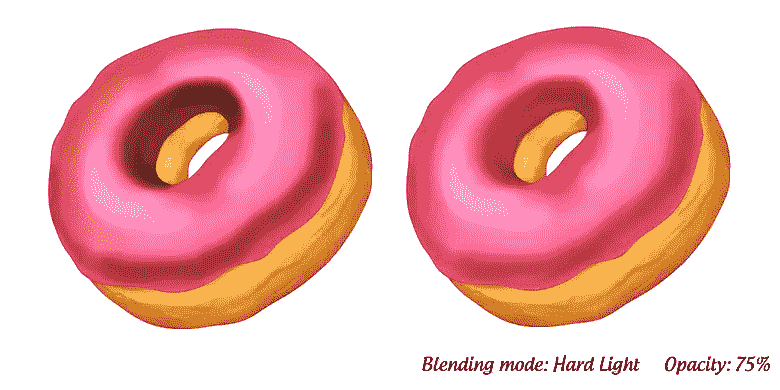](https://www.sitepoint.com/wp-content/uploads/2013/09/image14.jpg)

### 第十五步

现在，创建一个新层，并在选区内填充“50%灰色”。应用加深和减淡工具，使用步骤 10 中使用的相同设置。
[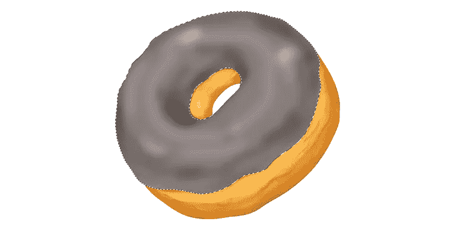](https://www.sitepoint.com/wp-content/uploads/2013/09/image15.jpg)

[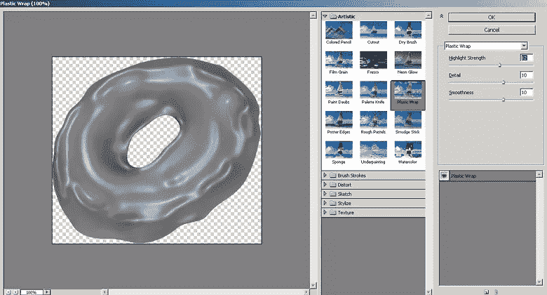](https://www.sitepoint.com/wp-content/uploads/2013/09/image15b.jpg)

[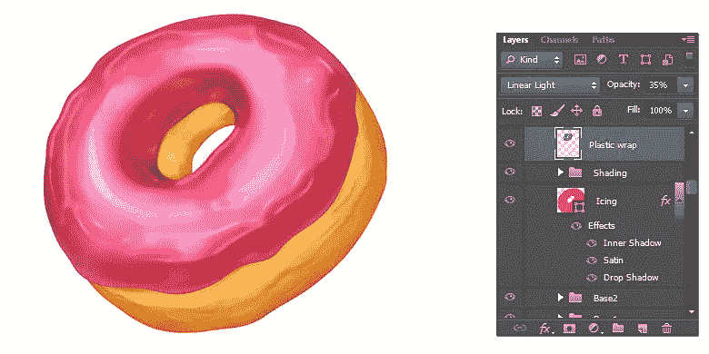](https://www.sitepoint.com/wp-content/uploads/2013/09/image15c.jpg)

### 第十六步

选择红色作为你的前景，蓝色作为你的背景色。选择画笔工具，然后按“F5”打开画笔面板。在此应用以下设置。
[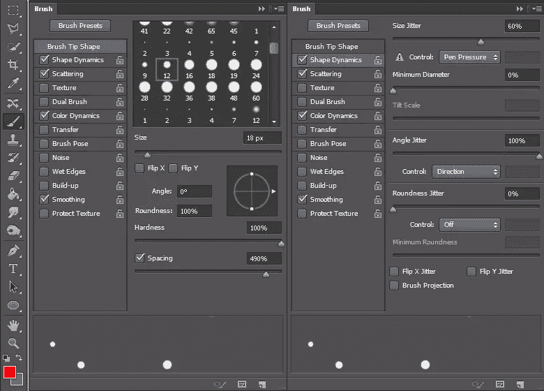](https://www.sitepoint.com/wp-content/uploads/2013/09/image16.jpg)

[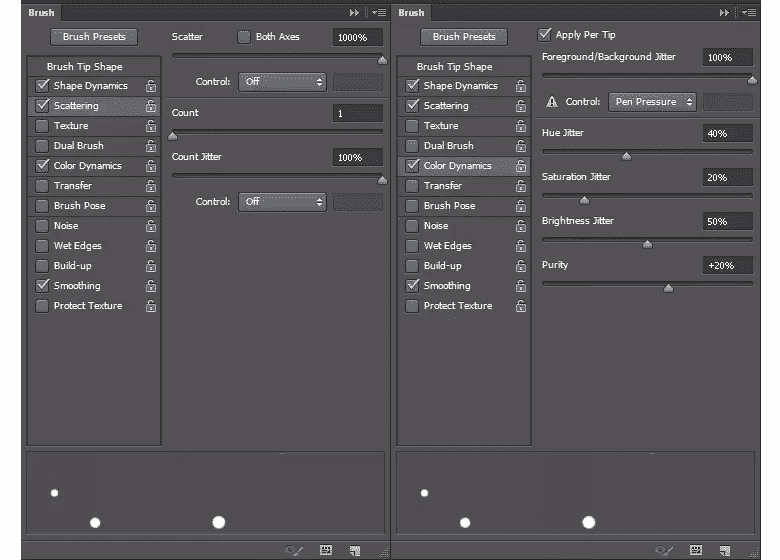](https://www.sitepoint.com/wp-content/uploads/2013/09/image16b.jpg)

现在，将这个笔刷应用到一个新的图层上，并将混合模式改为“线性减淡”。
[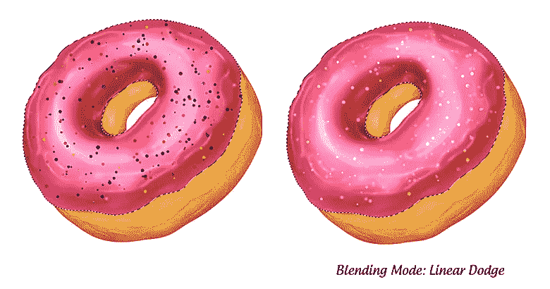](https://www.sitepoint.com/wp-content/uploads/2013/09/image16c.jpg)

### 步骤 17

接下来，我们将在糖衣上添加一些噪声。新建一个图层，用黑色填充选区，进入“滤镜”>“杂色”>“添加杂色”。在此应用以下设置。改变其混合模式为“屏幕”，设置不透明度为 30%。
[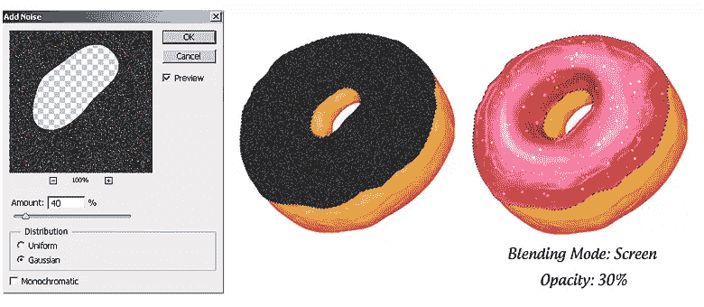](https://www.sitepoint.com/wp-content/uploads/2013/09/image17.jpg)

### 步骤 18

锐化细节，收集所有的层形成一个单一的群体，复制它，并将其合并。现在，进入“过滤器”>“其他”>“高通”。这里使用 3px 值。将高通图层的混合模式改为“叠加”。
[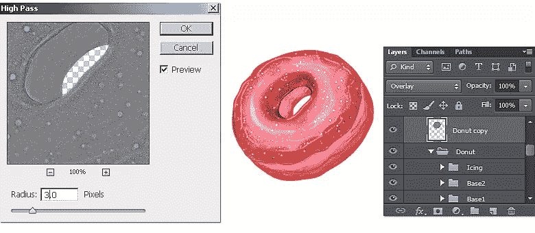](https://www.sitepoint.com/wp-content/uploads/2013/09/image18.jpg)

### 步骤 19

点击图层面板底部的图标“创建新的填充或调整图层”,然后选择“图层”。在此应用以下设置。
[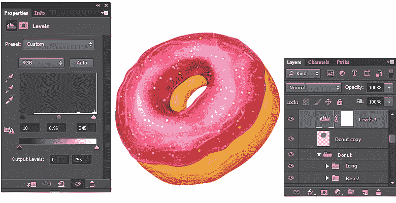](https://www.sitepoint.com/wp-content/uploads/2013/09/image19.jpg)

### 步骤 20

要制作阴影，在其余图层下面的新图层上使用一个大的软圆形笔刷。现在，使用涂抹工具涂抹它，得到如下所示的效果。
[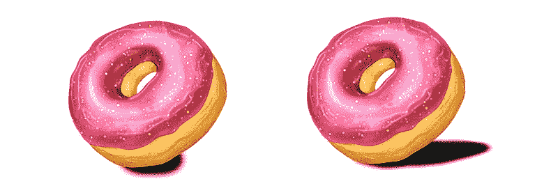](https://www.sitepoint.com/wp-content/uploads/2013/09/image20.jpg)

减少其不透明度为 25%,并应用“黑色到透明”的梯度，使用以下设置。

### 最终结果:

 
就是这些家伙。我希望你玩得开心并学到了一些有用的技巧。享受你美味的甜甜圈。

## 分享这篇文章