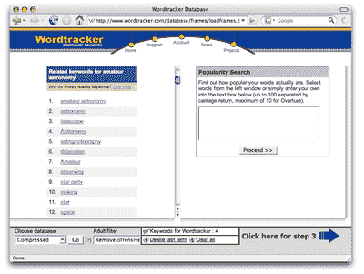
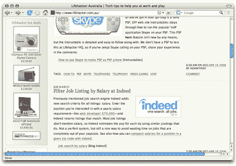
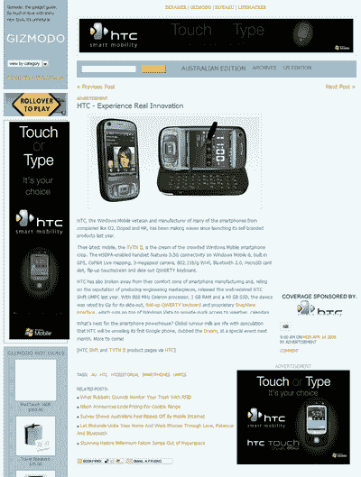
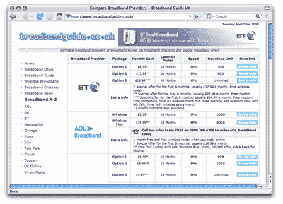
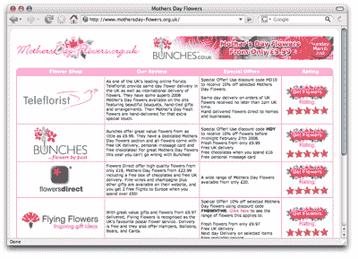

# 通过联盟营销留下您的印记

> 原文：<https://www.sitepoint.com/make-mark-affiliate-marketing/>

联盟营销为在线广告提供了一个不同的概念。从联盟营销的回报可以很大，但工作可能会很难！然而，正如俗话所说，联盟营销不是火箭科学。成为某个商家的会员，将该商家的广告放在你的网站上，你将从每一个推荐到该商家网站的付费客户那里获得佣金。

本章旨在帮助你在通往联盟营销成功的道路上走捷径。节选自 [*网站收入最大化器*](https://www.sitepoint.com/kits/revenue1/) ，共包含[十章](https://www.sitepoint.com/kits/revenue1/toc.php)。当然，你可以[下载这一章，还有另外两章](https://www.sitepoint.com/kits/revenue1/)，在闲暇时阅读。

我们首先调查什么是真正的网上代销商，以及如何访问各种各样的代销商计划。接下来，我们一步一步地通过你的网站与联盟计划赚钱的过程。我们在这里发现的建议同样适用于现有的网站，也适用于你决定专门为联盟营销目的建立的网站。本章的后半部分让我们有机会研究一些技术的细节，你可以使用这些技术来优化你的网站进行代销商的销售，并先发制人，防止粗心的代销商陷入陷阱

你准备好从你的内容网站中赚取更多了吗？好吧，我们开始吧。

##### 联盟营销 101

成为代销商就像成为一家企业的好朋友——事实上，这是一个非常好的朋友，以至于当你把付费客户推荐给那家企业时，那家企业会付给你销售额的一定比例——佣金。例如，假设你是 SitePoint，你刚刚发布了一个非常棒的新工具包，它是关于网站收入最大化的。作为营销计划的一部分，你决定鼓励所有的网站管理员向他们的读者推销你的工具包。现在，这些网站所有者知道金钱的价值，所以你决定向他们提供直接付款——假设是 25 美元——每当访问者点击他们网站的广告，到达 sitepoint.com，并进行购买。这就是成为代销商的意义所在。

加入代销商计划和加入广告网络的区别在于，代销商的收入是通过*销售*或**行为**产生的，而正如我们在第 6 章中看到的，将你的内容货币化，你可以通过向你网站的访问者展示广告来获得在线广告收入。如果你认为这让在线广告看起来更有吸引力，请记住这样一个事实，即附属**商家**，或广告商，按销售付费(这就是首字母缩略词 CPA——每行动成本——的由来)。因此，虽然你不会从展示广告本身中赚到任何钱，但联盟广告让你有机会从更少、更有针对性的访客那里赚到更多的钱，这些访客想要你所属的产品或服务。当然，商家能够接触到更广泛的客户，从广泛的其他网站获得合格的线索。

***加盟网络如何运作***

联盟网络与广告网络略有不同，因为大多数给你，出版商，节目的选择。你可以选择你想加入的联盟计划，并预先知道每笔销售你会得到多少佣金

比较受欢迎的联盟网络有:

*   http://www.commissionjunction.com/的[委员会汇合点](http://www.commissionjunction.com/)
*   在[http://www.clixgalore.com/](http://www.clixgalore.com/)
*   分享销售，在[http://www.shareasale.com/](http://www.shareasale.com/)
*   Linkshare，位于[http://www.linkshare.com/](http://www.linkshare.com/)
*   在[http://www.incentaclick.com/](http://www.incentaclick.com/)的 CX 数字媒体(前身为 Incentaclick)

一旦你注册了代销商服务，并选择了一个或两个你感兴趣的代销商项目，你可能要等着看你是否被接受。当然，商家的标准各不相同，但一旦你听说你被接受了，你就会收到一个特殊的联盟代码，或联盟链接，你可以在你的网站上为该广告商的联盟产品放置的所有广告中使用。通常，商家会提供各种格式的广告，你可以直接放入你的网站，但你也可以选择制作适合你的网站、内容和受众的广告。

大多数联盟网络和程序做的另一件事是把用户发送到他们的网站:他们在用户的电脑上放一个小文件，或 cookie，让商家的网站知道你把那个用户转到了网站。cookie 确保如果用户在给定的时间范围内(通常是 30 天、60 天或 90 天，但这取决于所讨论的产品)返回并购买，您将获得销售佣金。

联盟网络显然比直接的广告网络更灵活，但请记住，你必须创造销售来获得收入。这实际上意味着什么？这意味着你需要采取一种与 CPC 或 CPM 广告网络略有不同的方式来使用联盟网络。如果你想从注册会计师广告中赚钱，你的网站需要服务于一个强大的利基市场，吸引目标受众。我们将在标题为“用代销商营销网站赚钱”的章节中更详细地介绍建立代销商营销网站的过程。

***超越加盟网络***

联盟网络并不垄断联盟节目。许多网站——包括亚马逊、谷歌和其他网站——提供自己的联盟项目，出版商可以通过在广告商网站上填写表格来加入。

直接接触广告商提供了许多潜在的好处:你可以直接接触到广告商，所以如果你想调整广告格式或使用不同的推广文本，你可以直接问他们。你还可以从每笔交易中获得更高的百分比，因为没有中间人(或网络)需要从每笔交易中提成。

然而，潜在的陷阱比比皆是。广告商的网站可能不会提供一个界面来跟踪你的印象、点击和行为。它可能没有一些大型网络的声誉，所以你没有支付的保证。个人网站通常比网络网站更不可能制定详细的服务条款，所以尽管你可能已经遵循了广告商写下的所有准则，他或她仍然可能会因为一个完全意想不到的原因禁止你加入联盟计划。即使一切顺利，独立联盟计划比联盟网络更难达到最低支付额，在联盟网络中，你从许多计划中获得的收入结合起来，帮助你更快达到基本支付水平。

在一天结束的时候，你需要评估在你的网站上建立独立联盟的潜力，权衡风险和可能的收益。确保你对协议感到满意。请记住，您可能希望避免将整个网站的收入建立在某个特定的广告客户身上。最初，你可能不确定该公司是否真实可靠；即使你和一个商家相处得很好，这个企业也有可能破产或被收购，顾客对零售商的信心可能会下降，或者市场可能会陷入低迷。在多个商家和联盟网络中分散风险的方法可能是最安全的。

##### 通过联盟营销实现网站盈利

现在你已经掌握了会员制营销背后的基本概念，让我们更深入地研究一下你可以通过会员制营销销售网站赚钱的过程。

本节分为两部分。

在第一部分中，我们假设您已经有了一个内容网站，或者正在考虑创建一个内容网站；你心中有一个特定的受众；你已经决定你想赚钱的网站使用联盟营销。我们将通过您需要采取的步骤来评估您的受众，进行关键字研究，并找到适合您的网站及其用户的合适的联盟网络和计划。

本节的第二部分将着眼于无数有经验的联盟营销者所采用的联盟营销方法。在这里，我们将假设你有第一手的经验，与联盟网络和节目，并善于创造联盟收入。这一部分将解释另一种通过联盟网络赚钱的方法:从程序开始，然后反向操作。

***将现有网站货币化***

像网上成千上万的人一样，你有一个内容网站，或者你有一个想法，你想通过联盟营销来赚钱。太好了！这是一个很好的方法，为新手从属营销谁有很少或没有经验的行业，并希望学习的绳索。为了在这样的网站上有效地使用联盟广告，我们需要完成的任务是:

*   确定一个利基市场。
*   进行关键词研究。
*   规划场地。
*   选择代销商网络、企业和产品。

我们开始吧！

**确定利基**

关于确定你的网站的目标受众的重要性的建议——以及联盟营销的努力——各不相同。通常，联盟营销是最适合利基业务战略。正如我们在第 2 章“规划”中对该主题的讨论中所看到的，利基营销使您可以根据一组非常特殊的标准，针对潜在客户的需求提供产品。通常，利基市场比更广泛的细分市场要小，但你所知道的关于受众的信息可能更具体，因此从营销的角度来看更有价值。

在联盟营销的背景下，追求利基可以让你在**购买决策过程**中的精确点锁定具有非常具体需求或兴趣的用户，购买决策过程是个人购买满足确定需求的产品的步骤(我们稍后将更详细地讨论这一过程)。因此，这是一个伟大的想法，花一些时间研究和确定利基，你的联盟营销企业将重点放在。请记住，当你开始任何新的冒险时，你可能会发现瞄准一个你充满热情和感兴趣的利基市场是最容易的。

如果你已经有一个网站成功地满足了目标用户群的需求，你可以试着瞄准这些用户的一个细分市场。例如，如果你有一个网站，专注于报道天文学相关的发展和新闻，你可能已经有了一个相当具体的读者群，可以针对众多的附属产品。但是在这个群体中，你可能有一个对后院天文学特别感兴趣的细分用户，并且访问你的站点来获取与这个兴趣直接相关的信息。这些后院天文学家可能代表了你现有用户群中的一个利基，考虑到你现有的市场曝光率和(我们希望！)感兴趣甚至激情的领域。

一旦你确立了自己的定位，是时候更仔细地观察一下观众本身了。这些人是谁？他们的动机是什么？他们要在自己的爱好上花多少钱？随着他们越来越多地参与到这项爱好中，是否有一个渐进的过程或过程可以让他们前进？你的用户目前在这个轨迹的哪个点上？特别是最后两个问题，在缩小你可以推广的潜在产品范围，以及你需要做多少工作才能把用户推向购买点的时候，会对你有所帮助。毕竟，向一个 13 岁的孩子宣传一个 5000 美元的望远镜是没有意义的，你也不太可能把这个望远镜卖给一个迄今为止整个天文学经历都是仰面躺在星空地图上，试图找出北斗七星在哪里的人。另一方面，一个已经打印出四张 PDF 格式的单星座地图的用户可能会很容易购买一张完整的、带注释的、夜光夜空地图或地图册。

人口统计学和心理统计学的结合应该有助于你对你的目标受众有一个坚实的概念，并有可能将这些用户细分成更多的目标群体。**人口统计分析**包括整理目标受众的人口统计或身体特征信息，如他们的年龄、性别、所在地、收入、家庭规模、职业等。**心理特征分析**的任务是收集受众成员认知或心理方面的信息——相关偏好、偏见、行为、反应等。你的目标受众档案可以包含你喜欢的任何类型的信息，只要与他们和你的营销相关。你将如何获得这些信息？嗯，如果你有一个现有的网站用户群，你可以很容易地在线调查他们——一系列精心策划的相关问题可以产生一些对你的用户的深刻见解。(好的免费在线调查工具有 [SurveyMonkey](http://www.surveymonkey.com/) 和 [SurveyPro](http://www.esurveyspro.com/) 。)

如果你没有用户群，你也许可以通过一系列的来源获得关于你的目标用户的信息，并使用这些信息来创建这些用户的更完整的图片。这些来源可能包括:

*   媒体工具包可在网站上找到，为这个利基市场服务
*   由市场研究公司进行的更广泛的研究，例如，针对你的目标人群，即这一代人或从事这一行业的人
*   在您计划进入的市场空间中，可通过行业或利益相关机构获得研究、报告和白皮书
*   与企业主或导师进行访谈或讨论，他们的组织以你想要接触的用户为目标

当你完成的时候，你应该有一个简介，用几句简短的话准确地描述你的目标是谁。

**进行关键词研究**

再一次，网上商业成功的方法归结起来——至少是部分！—敬优秀的关键词研究。使用你最喜欢的单词跟踪工具——单词跟踪器、利基检测器等——来查看与你选择的利基相关的关键词。这里的目标是找到一些有高度针对性的词，很好地搜索，并有你能处理的那种竞争。简单吧？嗯，这是一个目标！

当我使用 Wordtracker 研究我们的天文学例子时，我最初使用“业余天文学”作为我的搜索词。下图显示了该搜索的主要结果。

列表中有类似“望远镜”、“天文摄影”和“天文产品”的结果。但在更常见的结果中，Wordtracker 还出现了行星的名称，以及“行星状星云”、“北方星座”、“光污染”等术语，这些都非常具体——它们可能不是你家后院崭露头角的天文学家可能会搜索的主题。因此，你可以看到你的利基研究是多么重要，将在确定适当的网站关键词。你可能会选择一些利基供考虑，然后在你把你的月球车挂在任何特定的流星上之前，看看你的关键词研究将每个利基引向哪里…

当你完成研究时，你应该有两样东西:

1.  目标利基，以及对该群体中的个人的透彻了解

3.  有可能吸引这些受众访问您的网站的关键词列表

在回顾了我们的观众资料后，我们决定把目标锁定在业余天文爱好者身上。我们的目标用户——我们现有网站受众中的一个细分市场——年龄在 18 岁以上(毕竟，我们希望他们能够在线购物),男性比例略高于女性。这些用户可能有不同程度的天文学经验，尽管他们都是业余爱好者，我们知道他们为自己的爱好感到自豪。他们渴望信息(毕竟，他们每两三天就要使用我们的新闻网站)，但他们也热衷于行动——他们喜欢在周末花时间涉猎天文学、观星等等。

我们使用 Wordtracker 进行的关键词研究结果非常有趣。“业余天文学”一词预计在之前的 90 天里会在主要搜索引擎上被搜索 12 次。另一方面，“天文学”被预测为大约 3951 次搜索中使用的术语。但是，随着我们对搜索词的深入研究，我们发现了一个共同的主题:许多更通用的搜索词最终成为与图片、图表和照片相关的搜索词。我们运行了一个竞争搜索，发现术语“太阳系图表”和“太阳系图片”是最没有竞争力的术语，并且具有良好的 KEI 因子。稍微在网上搜索一下也证明了有许多与天文学和空间图像相关的附属项目，所以我们决定把它作为我们网站的焦点。

*保持跟踪*
*对你渴望锁定的关键词进行竞争搜索应该只是竞争对手研究的一个方面。一旦你有了网站的概念，投资一些时间在网上进行竞争对手的研究。看看垂直行业或行业中的其他网站，尝试确定他们的目标受众群，他们如何向这些用户推广他们的产品，等等。在一开始就做这种调查是很重要的，因为现在仔细的研究可以看到你为一个与你最初计划略有不同的利基市场创建了一个网站——但是一个更有利可图的网站。*

我们对其他在线空间图像网站进行了一些研究，我们发现了很多。有包含照片的博客；一位业余天文学家拍摄的恒星、星系和太阳系的照片，她还出售自己照片的冲印本；股票摄影网站；还有更多。我们发现的两个主要竞争对手是[欢迎来到行星](http://pds.jpl.nasa.gov/planets/)，这是一个美国宇航局的网站，包含每个行星的图片和简介，基本上是一个 CD-ROM 的促销网站，上次更新是在 2001 年，还有[九大行星](http://www.nineplanets.org/)，“太阳系在线旅游”，提供每个行星的图片、历史和其他信息。九行星是我们最大的竞争对手。该网站是信息和照片包装，照片链接到更多的信息，所以当你点击一个给定页面上的缩略图，你就可以访问欢迎来到行星网站上解释那张照片的页面。《九大行星》的信息写得很好，也很清晰，但我们注意到了该网站的一些可用性问题(例如，该网站没有文件夹上方的导航，页面左上角没有主页链接——这是公认的可用性标准)。我们也注意到这个网站，尽管它有一个太阳系的图表，但没有强调这个事实或者在这个页面上提供非常好的视觉效果。此外，该网站似乎没有太多的重点放在寻找行星自己，在你自己的后院。这些只是一些差距，可以为我们的网站提供明显的机会。

如果你已经有了一个针对特定受众的网站，你就已经有了一套完善的关键词，这将使这项工作容易得多。你可能想使用我上面提到的工具来研究你当前的关键词，只是为了确保没有任何额外的变化可以使你的网站吸引那些对特定产品、解决方案或购买有明确需求的受众。

**规划你的网站**

很难将这一步放在下一步——选择你的代销商和产品——之前，除非你已经有了一个网站，因为这两个任务可能会同时发生。

如果你的潜在动机是从你的网站赚取代销商佣金，你会想知道你创建的网站、结构和内容将提供许多最佳机会来推广与你网站中给定点的用户需求极其相关的代销商产品。因此，你要确保合适的产品可以通过联盟计划和网络获得。也就是说，一个仅仅是基于内容的联盟产品广告聚合的网站有着分散、不集中和缺乏激情的风险，这使得你很难在用户群中发展任何类型的忠诚度或培养关系。

首先想想你的观众，你觉得他们需要什么。接下来，对你可以从事的工作进行一些调查。勾画出产品如何满足需求的粗略计划。然后回到你的用户需求，再充实他们，创建一个结构，让你的内容(和联盟广告)与用户需求相匹配。觉得这个过程听起来有点模糊？让我们再来看看我们的天文学站点示例。

我们知道我们的用户是热情的业余天文爱好者，他们渴望信息。我们也知道他们对使用网络感到舒适。我们希望从我们的天文新闻网站吸引一些用户，同时也通过搜索引擎。他们可能需要关于天文学不同方面的相当基本的信息是有道理的——太阳系、每个行星、夜空、天文现象等等。我们的信息不仅应该支持他们对研究的兴趣，还应该支持他们积极观察星星的兴趣，以及他们对自己爱好的自豪感。

网上搜索表明，这个领域的许多企业通过他们的网站或通过联盟广告网络提供他们自己的独立联盟节目。有追踪行星的软件、照片、日历、拼图和 t 恤、古怪的玩具、书籍、DVD 等等；当然，不要忘记过多的观星技术设备。我们认为，被我们的关键词吸引的目标受众将主要对与我们的太阳系和其中的行星相关的图像感兴趣，所以我们决定重点关注这个主题，尽管我们也考虑加入一些其他的联系。

我们决定首先根据太阳系中的行星来划分我们的站点，但是我们决定我们的页面将解释如何最好地观察太阳系中的每个行星，以及传递任何与该行星有关的新闻，而不是简单地创建提供每个行星信息的页面，我们可以从我们的占星新闻站点联合这些新闻。我们决定在每个星球的页面中加入一个链接，链接到我们看过的太阳系图像联盟项目。我们还会在每一页上包括一些精选的广告，如观察我们太阳系的印刷指南、天空地图册、天文学杂志的订阅优惠、天空制图软件等等。

我们还可以提供详细介绍流星雨、太阳耀斑等现象的页面，同样包括相关图像、来自我们天文学新闻网站的新闻，并提供我们找到的相关附属产品的链接(一套关于星星的 DVD，或许还有一套关于宇宙奥秘的 DVD)。也许我们会包括一个部分，提供空间探索的时间线，每个任务的图像和书籍和 DVD 的链接(可能还有模型！)游客可以购买以了解更多信息。

正如你所看到的，研究你的受众和潜在商家的过程提供了将产品与需求紧密匹配的机会。这正是你所需要的，如果你的从属关系是成功的。

*选择加盟网络、企业和产品*

现在你有了一个观众，和一个网站(或网站平面图！)，是时候选择你要加入的商家、产品和网络了。显然，这不是一个一劳永逸的命题。你需要监控每个节目、广告创意和产品对你的受众的成功，并考虑根据统计数据显示成功和不太成功的产品来改进你的产品。

但是让我们从头开始。选择代销商网络与选择广告网络有一些相同的考虑，但两者之间有所不同。在对提供的网络进行初步评估时，请考虑以下几点:

*   代表哪些市场或行业？每个网络提供不同的商家套件，他们通常专注于在特定行业或垂直行业建立广告客户，因此他们有一系列针对这些细分市场中出版商的产品。因此，一些网络会为你的网站提供合理数量的潜在商家，而其他网络可能提供的却很少。
*   哪些商家在打折？一些网络会列出一些使用他们服务的商家的名字。同样，这可以帮助你确定该网络擅长的市场类型，以及它与优秀广告客户建立关系的能力。
*   费用是多少？在你注册之前，一些网络可能会给你一个概念，告诉你你可以从他们的商家那里得到什么样的注册会计师费用。还要看看网络本身是否会从你的每笔销售中抽取一定比例的利润。独立于代销商网络运行自己的代销商计划的商家可以提供一些有趣的费率变化——我见过一个这样的例子，它按照代销商每月总销售额的一定比例奖励代销商，这样代销商卖得越多，赚得越多——所以仔细看看细则，清楚地了解你可以期望得到什么报酬。
*   服务的灵活性如何？网络是否提供多种广告形式，至少其中一些对你有吸引力，这些形式是否适合你的网站？在使用链接的方式上有灵活性吗(例如，你能把你的会员链接作为你网站时事通讯中的文本链接吗)？灵活性越大，你就有越大的空间以一种创造性的方式向你的观众展示促销活动，这一点非常重要。
*   该服务的建立程度如何？与广告网络一样，在联盟营销领域，网络时代在某种程度上等同于可信度。这意味着更高的可靠性、更强的客户响应能力和更好的商家。
*   **网络接口是什么样的？**检查您正在考虑的每个网络的接口，确保它具有您想要的基本功能，以及任何额外功能。跟踪和报告功能在 CPA 游戏中与在 CPC 和 CPM 广告中一样重要，因为小的改进可以对你的底线产生巨大的影响。
*   实施和维护营销活动有多容易？同样，服务背后的技术应该使活动在你的网站上非常容易实施——一些链接代码，一个图形，你应该准备好了。
*   **网络的要求或服务条款是什么？**联盟网络对其网络中的出版商提出要求。在注册之前，请确保您对服务条款感到满意。

*接受这些服务条款*
*确保你阅读、理解并适应商家的服务条款。许多商家限制你的网站与他们的网站的相似程度，限制你通过电子邮件提及或推广他们的组织的方式，等等——毕竟，他们希望保持独立于他们的分支机构，并避免一些棘手的问题，如让分支机构发送垃圾邮件来推广他们的服务。提前了解商家的要求将有助于你确保你不会被你选择加入你的网站的服务所禁止或拒绝支付。我们将在“附属问题”一节中更详细地讨论这些问题。*

*   最低支出是多少？最低支出越低，您就能越早获得收益。
*   **付款方式是什么？**还要看支付方式——例如，对于使用美国网络的非美国出版商来说，通过 PayPal 支付可能比通过支票支付更有吸引力。

这是一个基本的列表，但它应该为您评估网络本身提供了一个坚实的起点。当然，一旦你注册了，你就必须查看你所在行业的各种商家的产品，并选择最适合你的。以下是您在查看提供的课程时应该考虑的一些方面:

*   广告商的网站是什么样的？用户到达商家网站后会得到的印象确实值得思考；你的代销商链接指向的登陆页面至关重要。如果你的网站设计时尚，包含高质量的内容，并有一种优雅的感觉，用户可能会不寒而栗，如果点击你网站的链接，他们到达一个看起来廉价的网站，使他们不确定是否泄露他们的信用卡号码。如果用户习惯于访问与你的商家网站竞争的网站，这可能更为重要。好的登陆页面有助于提高转换率，所以在你注册之前，一定要评估每个商家的产品。
*   **广告创意是什么样的？**如果你在展示商家信息的方式上没有任何灵活性，或者，例如，你想使用图形横幅，但不想花费时间和金钱去重新发明轮子，那么商家广告的外观对你来说就很重要。广告会补充你的网站吗？它所呈现的信息(通过图形和文本)支持你所推广的信息吗？在你的页面上显示广告，你会感到高兴甚至自豪吗？
*   产品是什么样的？产品真的适合你的目标受众吗？他们有可能看到其中的价值并有能力购买吗？*你*觉得这个产品怎么样？你准备好支持它了吗？你自己会用吗？如果需要产品支持，是否提供？这看起来是一种高质量的支持服务，还是一种骗局？诚实，因为这些问题的答案对你成功推广你选择的代销商产品至关重要。将任何旧产品的代销商横幅放到你的网站上是很容易的，但是要为一个你觉得自己不能亲自推荐的产品写一篇热情洋溢的、创造销售的评论(包括相关的代销商链接)却很难。
*   **挂钩是什么？**你能看到产品、你的网站和你的观众之间自然的、合乎逻辑的契合吗？你能在你的网站计划中找到一个机会或者一系列机会，作为链接到广告商网站的最佳位置吗？有没有一个自然的地方——和一种方式——你可以推广这个产品，使它对你的观众不可抗拒？

*自己试试吧！*
*当你找到一个你想加入其联盟计划的产品时，自己尝试一下(如果你负担得起的话)。在网上购买，注意店面的性质，你收到的售后跟进，以及产品发货和交付的速度。如有疑问或投诉，请联系公司的客户支持团队。只有亲身体验广告商的产品和服务，你才能与目标受众进行明智而清晰的沟通。这种体验也会让你了解到什么样的客户(比如你！)对产品或服务的期望，以及商家将在何种程度上满足或超过这些期望。在撰写促销内容、评论和其他在线销售宣传材料时，这些信息将是有用的素材。*

正如我上面解释的，这一部分的目标是创建一个网站结构，确保我们发现的联盟计划在我们内容的使用过程中针对我们的受众。在每一点上，我们都会为他们提供适合他们需求的产品。但这些不仅仅是旧的产品——我们决定在我们的天文学网站上推广的产品可以通过有吸引力的、专业的、可信的店面购买。这些网站被公认为各自领域的权威(我们评估的网站包括 Astronomy.com、探索频道网站、Telescopes.com 等等)——我们可以自豪地向我们尊贵的用户推广这些网站。

一旦你选择了你的联盟网络并注册，加入特定的计划通常就像注册你的兴趣并提供联盟代码进入你的网站一样简单。从那时起，你将能够通过网络的界面跟踪你的成功，并使用它提供的信息来调整你的方法和提高你的转化率。

*life hacker 网络上的高级联盟营销*

[Lifehacker.com.au](http://www.lifehacker.com.au)网站是一个国际流行的博客，提供“帮助你工作和娱乐的技术技巧”，是一个包括诽谤者(来自澳大利亚和好莱坞的名人、八卦和流行文化)、Gizmodo(小工具指南)和 Kotaku(博客游戏、新闻、八卦、欺骗、观点、设计、预测)的网络的一部分。这个网络结合使用广告和联盟营销来创收。

该网络的澳大利亚商务总监 Cameron Curtis 说:“联盟伙伴关系为我们的网络提供了一个更令人兴奋的增长机会。鉴于我们网站上的受众之间有一些相似之处，我们在整个网络上推广一些附属机构。当然，我们的每个网站也有一个非常具体的内容倾斜。因此，如果有一个合作伙伴适合，比如说，游戏，但不适合软件生产，那么我们将把合作伙伴限制在最相关的网站上。”

Lifehacker 团队通过三种主要方式获得合作伙伴。一些潜在的合作伙伴在评估了网站、内容和受众后，与团队进行了接洽。网站内容的编辑性质也使团队成员接触到可能成为附属合作伙伴的组织的产品和服务。最后，该网络的销售团队积极确定并寻求与潜在合作伙伴的合作可能性，通常是为了联盟营销和展示广告机会。

代销商优惠在整个网站推广。在 Lifehacker 页面的左侧有一个专门的展示单元，展示了一个重要的合作伙伴关系，如图 2 所示。卡梅伦说:“Get Price Direct 是一个网站，访问者可以用它来搜索某种产品的最佳价格和销售渠道。这种特殊模块的设计使得所推广的产品与展示该模块的网站相适应。”例如，当模块显示在 Kotaku 上时，它可能会显示与游戏、硬件附件或外设相关的产品。同时出现在 Defamer 上的相同模块可能以香水、美容产品或娱乐单元为特色

然而，这并不是联盟推广的唯一形式。从历史上看，该网络的用户并不喜欢在博客帖子中包含代销商链接，因此该团队不得不进行创新，以成功整合网络上的代销商服务。图 3 显示了最近在 Gizmodo 网站上使用的 HTC 的集成推广。

现在，这些内容并没有在 Gizmodo 上以标准帖子的形式出现。“我们给关注这类手机技术的标准社论贴上标签，这样读者就可以点击进入这类广告风格的帖子，”卡梅伦解释道。如你所见，这篇文章被标记为广告，所以没有混淆——读者确切地知道他们在看什么。“这些明确标明的帖子为用户提供了了解产品更多信息，甚至购买 HTC 手机的机会。”

这篇文章是以该网站通常的聊天风格的稍微克制的版本写的，它包括各种链接，带用户到关于该产品功能的更详细的信息。显然，页面上的广告强化了产品的品牌，并进一步促进了所提供的产品。对于 Gizmodo 和网络中的其他网站来说，这已经被证明是一种非常连贯的推广风格，成功而不会惹恼或误导用户——正是这种开放、诚实的方法帮助网络在世界各地建立了忠实的用户群。

***创建一个货币化的网站:一种替代方法***

如果你已经熟悉了联盟营销的基本原理，并且你想尝试一些不同的东西，这种替代方法可以很好地让你的收入最大化，就像你在现有网站上投入的一样多。

用这种方法，而不是从寻找潜在的观众开始，并从那里工作，你的第一站是从属节目。下面是我们将使用的基本流程:

*   评估可用的联盟计划。
*   进行关键词研究。
*   制定现场平面图。
*   围绕联盟计划创建一个网站。
*   加入联盟计划并启动网站。

**评估加盟计划:寻找产品**

你已经有了你喜欢的联盟网络的想法，所以你的第一步是访问这些联盟计划，并访问他们的最佳支付商家列表。例如，ClixGalore 提供了一份清单，列出了它所谓的“表现最佳的项目”——平均来说，上个月向其附属机构支付最多的项目。其他程序也提供类似的列表。仔细查看它们，了解哪些程序执行得最好。当然，你会想考虑他们的利率，cookie 的有效期，支付的基础，以及我们在选择联盟网络，企业和产品一节中讨论的其他因素。

*查看代销商批准率！*
这有助于解释为什么该商家的平均收入如此之高:该商家很可能对允许加入该程序的网站类型特别挑剔，选择那些非常适合销售其产品的网站。如果你有兴趣加入这样的项目，如果可以的话，在建立你的网站之前联系商家是个好主意，试着确定他们到底在找什么。然后，您可以专门设计您的网站来满足这些需求。

这种评估的结果将是你认为有潜力特别有利可图的几个项目。你可以选择当场申请加入这些计划，但大多数网络要求你准备好一个网站，商家可以查看它是否适合正在讨论的联盟计划。但是在你离开并开始与开发者交谈(或者自己开发网站)之前。)，你需要确保有一个合适的利基市场来销售你选择的产品。

**关键词研究:寻找利基**

这个过程中的下一步是确定一个利基市场，这个市场需要你将要尝试销售的产品，当然，找到这个利基市场的方法是通过关键词研究。同样，这里的想法是从宽泛的关键词开始，努力缩小选择范围，专注于既与你的产品相关又容易被搜索到，但几乎没有(或至少是可管理的)竞争的关键词。

这里的关键是识别准备购买的搜索者使用的关键词；当然，问题是，与购买产品最明显相关的关键词很可能成为激烈竞争的焦点。你必须搜索，不断完善你的搜索，找到最适合你的理想的关键字组合。

**制定场地概念**

一旦你有了产品和目标受众，你需要一个工具将他们联系起来:你的网站。

有了这种方法，你就有了一张白纸，你可以在上面发展你的网站。但有一点是肯定的:你需要一个像样的网站概念。一去不复返的日子，你可以拍了一个单页的附属“网站”，简单地将用户通过与你有关联的商家，然后称之为一天。谷歌表示，它需要其索引的登陆页面的“相关和原创内容、透明度和可导航性”。所以，你需要考虑一下你要创建什么样的网站。

举个例子，假设你已经决定成为一个卖世界各地茶的凉茶商人的会员。你可以通过一个评论网站、一个凉茶信息网站、一个简单的网上商店、一个专注于茶的博客来推广这些茶……这样的例子不胜枚举。

你如何缩小你的选择范围？简单:看看你的利基受众，让他们决定你建立的网站类型。例如，假设你已经确定你的目标受众对草药茶的健康品质感兴趣，并且喜欢与他人分享他们的草药茶(毕竟，喝茶通常是一种社交活动！).这将向你暗示，个人化的方法可能是你的网站应该走的路——口口相传、推荐等等，很可能会引起这些受众的共鸣。这种认识似乎表明博客或评论网站可能是一个不错的选择。但是如果你建立这个网站纯粹是为了商业冒险，并且你自己对凉茶没有真正的兴趣，你可能需要雇佣一个人来写你的内容——这笔费用可能很快变得不可行。你可能也不想经常更新你不感兴趣的内容。

如果你看看商家的网站，你可能会发现它为代销商提供了很多关于它销售的茶叶的信息——这将使你的工作容易得多。你可以很容易地改变或重写这些内容，以满足读者的期望和需求。你决定提供一个信息网站，解释不同草药的好处，以及一个链接到商家网站的小型在线目录。你知道观众会喜欢个人风格，所以你决定为网站上的每个信息页面撰写个人介绍性文字，并为目录中的每个产品提供聊天但直接的促销文字，以及给企业起一个像 Tessa's Teas 这样的人性化名称。也许一份电子时事通讯，强调每个月不同的茶(也许是正在出售的茶),既容易创建——由于商家提供的副本——又能有效地吸引用户回到你的网站。

如你所见，这里的想法是创造一个概念，将你选择的产品销售给你确定的受众。商家的网站很可能会给你一些提示，告诉你什么适合他们的目标受众，但你必须特别关注你的目标利基成员，以设计一个适合他们的网站概念和计划。购买茶叶希望减轻病痛的目标受众将会被不同类型的网站所吸引，而不像喜欢尝试不同茶叶口味的受众。

一旦你为你的网站设计了概念，规划它的结构，确保每一页都合乎逻辑地引导购买。在准备你的站点地图的时候，想想当你的用户到达你的站点的时候，他们会是什么样的心态，他们想做什么:他们想阅读详细的信息吗？他们会知道自己对什么产品感兴趣吗？他们心中是否有特别想买的东西——并且毫不迟疑地购买？你的受众和关键词研究将会给你一个强有力的指示，告诉你如何构建网站及其内容，以及在哪里放置你的附属链接。

**创建网站，加入计划，优化**

一旦你有了一个网站地图，你就可以创建网站，并在你申请加入联盟计划时把它展示给商家。如果你的请求被拒绝，尽你所能找出原因——做一些小调整，你的网站可能会被接受。当然，一旦网站上线运行，你推广网站的方式将对其收入产生重大影响。有了这样的网站，最好是建立一个可以自我运行的网站，把你的精力放在推广和优化吸引用户访问联盟网站的过程上——毕竟，这是赚钱的地方！正如代销商专家 Kieron Donoghue 在下面的例子中解释的那样，当你有一个好的代销商网站时，推广就变得容易多了。

*以另类方式创建代销商网站*

[Broadbandguide.co.uk](http://www.broadbandguide.co.uk/)是由资深代销商基隆·多诺霍创建的代销商网站，他经营[UKOffer.com](http://www.ukoffer.com/)，并在[http://www.here.org.uk/](http://www.here.org.uk/)撰写关于代销商营销的博客。该网站的主页如图 4 所示。

Broadbandguide.co.uk 是一个比较网站，为用户提供英国电信公司提供的计划和报价的一目了然的比较。因此，尽管 Kieron 使用了我们在这里概述的过程来创建这个特殊的代销商，但他必须比其他人更少选择。“因为我正在创建一个比较网站，”他说，“为了让它对用户真正有用，我必须包括所有的宽带联盟项目，而不是选择一个特定的群体。”

当然，大多数联盟营销人员会挑选和选择最好的网站。那么 Kieron 是如何回避这个问题的呢？“我以这样一种方式展示它们，提供最高注册会计师和/或最佳转换率的项目比其他项目更突出。有时候你知道哪些程序转换得最好，比如说某个供应商提供的产品比市场上其他供应商便宜 50%。你知道它会转化得很好，所以你相应地推广它。”对于那些你无法预测转化率的时候呢？“这些程序需要在你的网站上展示和测试，这样你就可以看到它们是如何转换的，”Kieron 说。“一旦你有一些统计销售数据要分析，你就可以改变布局等等。随着优惠和促销活动的变化，有必要调整网站的布局来推广表现最好的商家。如果另一家商家推出更好的消费者优惠，上个月的最佳表现者很容易被淘汰。”

在评估新网站的联盟计划时，Kieron 会考虑一系列因素，包括饼干长度和佣金率。“接下来，我看网站本身。令人惊讶的是，许多分支机构从来不这样做！我会看看他们的价格和报价如何，是否有竞争力。”这一点至关重要:如果商家提供 20%的佣金水平，而该细分市场的平均水平是 10%，那么该商家的计划可能看起来是一个有吸引力的提议。但是，如果他们的价格贵 50%，那么转换当然会受到影响。“我还会检查商家是否会在网站上显示电话号码，因为那会导致信息泄露。”有了这项研究，Kieron 对该领域的不同项目的表现有了一个很好的想法。

从那里，这是一个创建，启动和调整联盟网站的问题。正如 Kieron 在这篇博客文章中解释的那样，他现在采用了一种与过去略有不同的方法来创建联盟网站。“几年前，当谷歌决定禁止直营页面时，我被迫寻找从直营项目中赚钱的替代方法。我决定投入更多的资源来建立完整的网站，而不是简单的附属页面。”

这些完整的网站包括任何网站都应该携带的一系列基本信息——隐私政策、网站地图、联系我们表格等等——以及原创的和与用户相关的信息，如谷歌的[登录页面和网站质量指南](http://adwords.google.com/support/bin/answer.py?answer=46675)所规定的。这种方法有一个意想不到的好处:正如 Kieron 解释的那样，“我以前的登陆页面除了把它们推给我推广的商家之外，几乎没有给用户带来任何好处，现在我建立了完整的网站，比如 UKoffer.com 和 Bingo.org.uk，它们在自然搜索结果中表现很好。那太好了，我不习惯免费获取流量！”

*追踪你的代销商点击量*
*如果你想计算你的投资回报率，追踪你网站上的代销商链接的点击量是必不可少的。一些大的网络和内部程序使这变得非常容易——它们提供了一种方法来标记你的页面中包含的各个链接，这样你就可以跟踪每个链接在产生销售方面的成功。例如，Commission Junction 为发布者提供了一个`sid`参数，该参数可以附加到他们的跟踪 URL，并将在 commission detail 报告中显示为一个单独的列。作为一个出版商，你可以使用这个参数来确定哪些联盟页面，甚至是你在搜索引擎上运行的哪些广告会带来销售。*

建立一个完整的网站，满足搜索引擎的指导方针，显然对你的成功至关重要，但你可以使用什么其他技术来优化你的网站呢？嗯，很高兴你问了！下一部分适用于我们这些拥有联盟网站的人——不管我们是用什么方法创建的。现在让我们来学习优化联盟网站的细节。

##### 为代销商销售优化你的网站

你可以在你的网站上打几个联盟广告，然后希望人们看到它们。你甚至可以改变它们的位置或展示方式——这是我们在第 6 章《内容货币化》中讨论过的技巧。但是要真正充分利用加盟机会，有一些方法是你不能错过的。首先是预售你提供的代销商产品。第二，这建立了一个额外的层到你的预售努力，是使用 PPC 广告来推动你的子公司推广。第三是努力推广你的网站——即使它完全是为了销售联盟产品而建立的——就像你推广其他内容网站一样。现在让我们来研究一下这些技术。

*遵循指南！*
*正如我在上一节中提到的，如果你的网站想成功地被列入 SERPs，满足搜索引擎的内容和其他对联盟网页的要求是必不可少的。谷歌登陆页面和网站质量指南页面准确地解释了这个搜索引擎期望[在一个好的联盟页面](http://adwords.google.com/support/bin/answer.py?answer=46675)中找到什么；检查你所针对的各种搜索引擎的具体要求。*

***预售加盟产品***

正如我们在上一节中看到的，代销商产品的常见故事是这样的:你注册了代销商计划，在你的网站上添加链接或广告，然后把访问者送到代销商网站，希望他们会购买。这一切都很好，但是有很多方法可以帮助你提高你发送到联盟网站的用户是合格的，并准备购买的可能性。预售是关键。

从本质上来说，**预售**包括创建内容，帮助确保你的用户在到达代销商网站时已经准备好购买。我们可以通过我们的普通页面内容进行预售(例如，如此生动地描述土星，以及我们观看这个星球的奇妙体验，以至于当他们阅读我们的内容时，他们希望亲自看到它，并购买将帮助他们做到这一点的资源)，通过提供或编写我们自己的评论内容(可以包括在网站上或时事通讯中)，通过简单地编写一个宣传页面，在用户前往联盟营销商的网站之前向他们解释产品的好处和功能，等等。一旦访问您的预售内容的用户消化了这些信息，然后对购买您推广的产品表现出兴趣，他们将代表真正合格的销售线索，而不是潜在的感兴趣方，他们可能准备好了，也可能没有准备好，或者有能力购买。

成功的代销商预售内容通常可以实现以下目标:

*   它包括一个吸引观众注意力的强有力的标题，并暗示该产品可能是满足他们需求的解决方案。
*   它宣传代销商产品的好处，解释它将向你的用户提供什么，以及为什么这很重要。
*   它包括一个突出的，引人注目的行动呼吁，将促使用户点击并购买附属产品。
*   它没有太紧密地反映商家自己网站的信息或设计。

它们是最基本的。但有一个关键点对你的预售成功至关重要:如果你不想让它听起来像更多的广告宣传，你需要个性化它。个性化提供了可信度，如果你的用户发现他们可以依赖你，他们更有可能将你的推荐视为必备产品。

**使用证明和评论**

提供可信度的一个方法是包括产品的证明，但是如果你找不到客户证明，横向思考。例如，在我们的天文学网站上，一句简单的“这是地球上最受欢迎的天文学杂志”为我们选择的一个广告客户提供了微妙的证明— *天文学*杂志。

另一个选择是在你网站的时事通讯、博客或文章中加入一个“本周产品”栏目，在这个栏目中你可以回顾你所属的产品。当然，你会想:“但这不会看起来像是我只是在推销我能拿到现金的产品吗？”答案取决于你的执行力。如果你相信这个产品，就说出来——你甚至可以在你的评论中说一些类似于“这个入门天文学软件包给我留下了深刻的印象，我决定帮助创造者销售它。”也许你会经常评论与你无关的产品，以表明你的观点是平衡的，你的最终目标是给读者提供有价值的建议。也许你对代销商产品的评论也会包括一些负面的方面——对你的目标受众来说无关紧要的小点——来再次创造一种平衡感。

简而言之，你写评论的方式将决定它是成功还是尴尬，所以花时间创造性地思考如何才能写既满足你的需求又满足你的观众的需求的评论。图 5 显示了一个成功使用评论内容来推广产品的代销商预售页面的示例。

**使用样本**

你也可以考虑使用产品的样品或图片——任何你认为能在目标受众中产生购买欲望的东西。这就是为什么，对于太阳系中的每一颗行星，我们在天文学网站上的简介都将包括该行星的图像，以及从 Astrographics 购买类似图像的链接，astro graphics 是我们的天文学图像附属营销商。也许我们也不应该排除获得在线天文学软件演示的机会…

你有这个权利吗？
*当你准备预售内容时——无论是单页、时事通讯文章还是整个网站——确保你有权复制你使用的每一部分内容。如果你自己写所有的内容，这不会是一个问题，但当涉及到图像，或从你的商家的网站或宣传材料复制内容(功能列表，技术解释，等等)，请确保你在使用内容前书面请求许可。许多商家鼓励分支机构重复使用他们的内容，但可能会对你展示内容的方式或你使用的具体内容加以限制。采取与商家合作的方式可以帮助你避免法律问题和被怀疑发送代销商垃圾邮件的可能性，我们将在“代销商问题*一节中讨论

**提供免费赠品**

你也可以考虑向通过你的代销商链接购买产品的用户提供你自己的赠品或奖金。一点额外的激励可以走很长的路，不仅仅是让用户觉得他们买到了便宜货，还可以建立对你的品牌的忠诚度。但是这项技术不仅仅是关于激励。如果你准备向购买特定产品的用户免费提供一些东西，这又会增加该产品的可信度。你实际上是在说，“它太棒了，为了给你另一个尝试它的理由，我会放弃一些东西。”这让我非常非常安心。

例如，假设我们的天文学网站鼓励用户从我们的一个合作伙伴那里购买一本天空地图。对于每一位向我们发送购买确认电子邮件的客户，我们都会提供基于短信的天文活动新闻服务，这是我们的天文新闻网站提供的一项折扣或免费订阅服务。

不过，使用这种技术很重要——太多的消息可能会变得混乱，让用户不知所措。如果发生这种情况，他们会关闭浏览器，或者转到另一个网站，在这个过程中你会很没面子。因此，要注意让交叉促销优惠清晰明了，并在合适的时间(当你认为用户对所提供的产品感兴趣时)和合适的背景下提供——也就是说，要让你有机会清楚地传达你的优惠。

当谈到预售附属产品，你有自由的范围。想怎么创意就怎么创意；对同一产品测试不同的方法，并监控结果，看看哪种方法最适合你。预售可以对你的网站提供的代销商产品的销售产生很大的影响。

***利用 PPC 带动代销商销售***

到目前为止，我们的讨论都集中在你的网站上——它的用户，它的结构，以及你选择的产品和商家。这些问题对你作为在线代销商的成功至关重要。但是一旦你创造、磨砺并整合了这些方面，你还可以采取一个步骤来充分利用这些工作:提升。

一旦你创建了一个伟大的网站，你会希望它吸引尽可能多的用户，而要做到这一点，你需要考虑一系列的机制。当你创建网站的时候，你已经为有机搜索结果进行了优化，但是你也可以使用其他的技术。最常见的，也是最快速实施、监控和改进的，是 PPC，即点击付费广告。我们在第 6 章中讨论了 PPC 广告，从出版商的角度来看你的内容货币化，所以我们在这里假设你已经了解了广告网络是如何运作的，以及它们潜在的利弊。

要使用 PPC 广告来推动你的联盟活动，你需要从出版商的角色转换到广告商的角色。这个过程并不复杂:你为有问题的代销商产品制作一些广告，确保你的代销商预售页面内容围绕与你想让你的广告出现的搜索词相对应的关键词进行优化，并在关键词相关的搜索结果旁边竞价广告位置。搜索者在搜索结果旁边看到你的广告，点击广告，进入你的预售页面。他们接受它，并假设他们发现它令人信服，他们从那里点击到联盟营销商的网站，在那里，我们希望，他们采取行动，将为你创造收入。

当然，关键是要确保你花在购买点击上的钱不超过广告活动和你的预售页面产生的佣金。你需要密切监控你的活动成本和代销商佣金，比较 PPC 广告点击和产生的行动，以确保比率对你有利。

*这不是关联套利！*
*如果你在第 6 章“内容货币化”的“点击付费套利”一节中读到了点击付费套利，你可能不会惊讶于从属节目也经常被当作同样的剥削目标。**代销商套利**类似于 PPC 套利，尽管这个过程实际上根本不需要出版商的网站。*

*在代销商套利中，代销商通过 Google AdWords 竞标给定的关键词，并为该关键词创建一个出现在 Google SERPs 右侧窗格中的广告。他们发布的广告包含他们的代销商链接，所以当谷歌用户点击广告时，他们会被直接带到商家的网站，而不是代销商的网站。*

谷歌极力反对这种做法，但在 2008 年 2 月，雅虎宣布，在与 Commission Junction 合作六年后解决了这一问题，现在它允许出版商直接与代销商链接。在接下来的几个月和几年里，这一政策变化对搜索广告和联盟市场空间的影响将会很有趣。

虽然这个过程本身相当简单，你可以使用一些策略来提高你的 PPC 活动的成功。现在让我们来看看它们。

**从你的目标受众开始**

当你在处理代销商产品时，很容易变得太专注于产品本身，以至于忘记了你想把它卖给谁。这是一个特别的陷阱，当你写售前文案和广告，旨在把重点放在产品提供什么。

但是在你所有的努力中，从目标受众开始。你选择这个代销商产品主要是因为你认为你的目标受众会喜欢它。所以在你开始之前，确保你对这些人有一个很强的概念——他们的人口统计学、心理学、购买和其他相关特征。然后，问自己以下问题:

*   本产品可以满足我的目标受众的哪些需求？单一产品可以满足不同人群的不同需求。例如，我们的天文网站用户可能会对关联商家 Astrographics.com 提供的画廊版画特别感兴趣，因为他们恰好是喜欢在家里或工作场所展示版画和图片的人。他们可能还会找到天体图网站的日历部分，这是另一种将行星挂在墙上的方式。
*   产品在哪些方面满足了这种需求？单一产品可以满足不同的需求，也可以因为不同的原因而满足。Astrographics 打印产品满足我们的目标受众的需求，例如，因为他们的生产质量。我们的目标用户不是那种想在墙上贴海报的人——他们更可能想要那种专业安装、外观精美的照片级产品，Astrographics 在这方面做得很好。也许我们的用户是“现在”一代的一部分，他们想要立即购买。同样，Astrographics 通过在一周内运送定制框架印刷品来满足这一需求——这将受到我们特定目标受众的欢迎。
*   产品如何超越我的目标受众的期望？它是否为特定的受众提供了额外的或次要的好处？如果要让你的目标受众考虑，每个产品都必须满足一个基本需求。但是，如果你要展示一个真正令人信服的销售主张，你会希望产品不只是做基本的事情——理想情况下，你会希望它超越用户认为他们想要的，提供可能意想不到但受欢迎的额外好处。例如，如上所述，Astrographics 网站提供定制框架。他们只使用*手工制作的*模型和透明的树脂玻璃。木材和金属线脚可用，打印可以在一个巨大的尺寸范围内订购。因此，如果我们的网站访问者开始阅读印刷品，并期望在收到订单后自己给它们装框，这些信息可能会远远超出最初的预期。
*   **我的目标用户将如何通过搜索引擎搜索该解决方案？**既然你对产品将如何满足并超越目标用户的基本和次要需求有了概念，你可以考虑用户开始在网上寻找这类产品时的心态。我们已经通过 Wordtracker 确定了一些真正有潜力的关键词，但我们希望为更多的关键词优化我们的内容。正如我们所知，关键词越具体，受众就越有针对性，也越有可能成为合格的受众。因此，对于我们的天文网站的潜在用户，我们可以考虑将“行星照片”、“天文照片”等术语纳入我们的关键词列表，如果它们在搜索引擎中提供足够的机会，以及在我们的 PPC 广告和预售页面中使用选定的术语。

在准备 PPC 活动时，请牢记您的目标受众——使用您的广告文本和关键词选择来锁定他们，并准备您的预售页面来满足他们的信息要求，回答他们的问题，并将产品展示为适合他们个人需求的产品。

**谨慎选择关键词**

上面，我们看了这个过程，通过这个过程，你可以确定关键词，围绕这些关键词创建一个联盟网站，以你的受众为基础，并确保你可以向这些访问者销售高质量、高针对性的联盟产品。

关键词的选择对于吸引正确的受众至关重要，无论是对你的网站还是通过你的 PPC 广告。你必须确保你选择的关键词确实反映了你的目标受众通常搜索的术语。还要确保你优化预售页面和广告的条件反映了目标受众在决策过程中已经达到的要点。例如，如果我们的天文网站页面的目标是后院的天文学家，他们还不熟悉他们需要的不同类型的设备，因此在购买望远镜之前还没有做他们自然想要做的研究，那么为关键词“购买天文望远镜”优化该页面就没有意义。

您可能已经知道潜在客户走向购买的四个阶段如下:

*   意识到需求
*   *对潜在解决方案的兴趣*
*   *期望*获得首选解决方案
*   *动作*获取解决方案

重要的是要搞清楚你的目标人群已经到达了这个过程的哪个阶段，并确保你为网站内容优化选择的关键词反映了这一点。没有必要优化你的广告来吸引那些准备购买特定解决方案的搜索者的目光，然后在你的预售页面上，回到需求识别阶段。确保您选择的关键词反映了客户的需求，并且与您的内容相匹配。

**尽可能优化关键词**

一旦你确定了你的目标用户，以及哪些关键词能最有效地接触到这些用户，确保你优化了网站的内容来推广这些关键词。虽然等式的 PPC 端可能会给你带来很多流量，但花时间仔细优化内容本身会增加你的有机搜索流量和整体收入。

也许，在你评估你的受众在购买前决策过程中所处的位置时，你确定了你想要满足用户在兴趣和欲望两个阶段的需求。您可能已经决定创建单独的页面来满足这些不同用户群的信息需求，针对适合该用户群的关键字大量优化内容，然后针对每个页面开展单独的 PPC 活动。为那些对潜在解决方案感兴趣的人设计的页面会将访问者引导到为那些对你提供的附属产品有欲望的人设计的页面。该页面将把访问者带到行动点，并通过你的会员链接为他们提供采取行动的机会。

如果像这样的策略要奏效，关键词优化是至关重要的，即使你只是针对行动点的用户，它也是你的活动成功的核心。

**像对待自己的活动一样对待活动**

你可能会倾向于把你在联盟项目上的工作看作是为别人工作。毕竟，用户购买的不是你的网站，你对实际的销售页面也无能为力，对吗？最好是把困难的思考留给联盟营销商…或者会吗？

事实是，如果你努力推广你自己的网站、服务或产品，你的点击付费和联盟努力几乎总是会更成功。记住:这个活动是你的，即使它销售的产品不是。创造性地、充满激情地思考你正在做的事情，投入时间让活动成功。

***有机搜索优化…更多***

正如我在上面暗示的，另一个对你的联盟网站的成功有巨大影响的问题是你如何为搜索引擎优化它。一些权威人士说，你认为有机搜索对你的网站的成功并不重要，这是情有可原的，但是考虑一下，如果你的联盟网站在你的关键词搜索结果排名前三，你的佣金会有什么变化。

在整个讨论中，我强调了选择关键字的重要性，这些关键字要符合你的目标受众对你的网站内容和解决方案的需求。写关键词优化的内容和围绕这些关键词计划竞价排名只是其中的一部分。还可以考虑其他技术——链接建设，与其他网站的交叉推广，等等——这将有助于你吸引新的目标受众到你的网站，并继续增加你的网站的影响力。

同样，确保你花时间定期检查用户通过你的站点的路径、入口和出口页面、对你的内容的反应等等。这是你真正了解你的工作哪些方面成功了，哪些没有成功的唯一方法。这是你了解目标受众喜欢什么，他们对什么有反应，他们想要什么的唯一方法。一旦你有了这些信息，你就有办法不断提高你的盈利能力。

##### 附属问题

与广告网络一样，会员制计划和网络也会出现许多问题:以下是常见问题的概述，以及一些建议，告诉你如果发现自己受到这些问题的影响，可以做些什么:

*   网络拒绝了你的加入申请。
*   你期望成功地将你的内容货币化是很容易的。
*   网络禁止您使用其服务。
*   你没有得到你的收入。

这些问题在第 6 章“内容货币化”中有详细介绍，所以我不会在这里重复。相反，在这里，我们将重点放在两个问题，特别是与从属节目。

***你被指控下属滥发***

**代销商垃圾广告**是指与代销商网站过于相似的代销商网站。有时，缺乏想象力的代销商决定，与其自己创造独特的预售内容，不如简单地复制代销商自己的内容、页面布局和设计。这种做法基本上是侵犯版权，大多数有组织的商家会在他们的条款和条件中明确反对这种做法。

也就是说，当你创建预售页面或网站时，你可能会发现自己相当依赖于代销商网站的内容——尤其是如果产品很复杂，或者对你来说是新的。这种依赖可能会导致您的网站被认为是加盟商垃圾广告。

*垃圾邮件的其他特点*
*另一种通常被称为“代销商垃圾邮件”的做法是代销商主动发送促销电子邮件，兜售商家产品的优点。这种做法显然不利于友好的商业附属关系，事实上在许多国家是非法的。就是不做！*

如果你被指控发送垃圾广告，你唯一的选择——假设你想和那个广告商保持联系——就是纠正广告商发现的你预售内容的所有问题。回到名为“预售联盟产品”的部分，使用这些要点作为指导重新创建你的内容，并确保在你将它们发布到网络之前，广告商对你的修改感到满意。

***程序没有正确跟踪你生成的销售额***

在过去糟糕的日子里，这是一个比现在更大的问题，但它仍然会发生，所以值得一提。

在本章开始时，我们提到过商业网站会在你发送给他们的访问者的电脑上放置 cookies，这些 cookies 表明你将访问者引向了该网站。这种策略背后的整个想法是，它提高了你的佣金潜力。对于许多产品，用户在购买前可能需要时间考虑商家的报价——他们可能不会立即购买，但他们可能会将该网站标记为书签以供将来参考，并可能使用它进行购买。

这种技术的问题，在联盟营销的世界里是无处不在的，是多种多样的，尽管它们现在只是偶尔出现。在“联盟项目”、“跟踪问题”上搜索，你会发现无数的讨论、博客帖子和报告，这些都显示了这种工具可以变得多么脆弱。与代销商销售相关的新技术的引入(如[这一涉及谷歌](http://affiliate-blogs.5staraffiliateprograms.com/844/google-checkout-affiliate-tracking.html)的结账更新实例)，以及现有服务或技术的升级(如 2007 年初[易贝的美国代销商追踪](http://www.taommo.com/archives/2007/04/17/ebay-affiliate-tracking-problem/)所发生的)可能会对代销商产生严重而深远的影响。谷歌结账问题发生在圣诞节期间，虽然很快得到了纠正，但它仍然在那个关键时刻影响了无数分支机构的佣金。

当然，另一个由来已久的、不可避免的关于 cookie 的问题是，估计有很大比例的用户要么每月删除或清除他们的 cookie，要么将他们的计算机设置为根本不接受 cookie。早在 2005 年，JupiterResearch 估计这一比例约为 39%[,但在 2007 年，](http://www.jupitermedia.com/corporate/releases/05.03.14-newjupresearch.html)[提出的 30%左右的数字可能更准确](http://www.e-consultancy.com/news-blog/364728/the-cookie-is-dead-long-live-the-flash-cookie.html)。

在这种情况下，关注你通过联盟广告发送到商家网站的流量水平并不是一个坏主意。你怎么能这样做？嗯，第一站是你的站点统计包。一些(但不是全部)软件包会告诉你网站上最受欢迎的网址，最受欢迎的退出页面，和/或你的用户离开你的网站后去了哪些网站。这些信息可以给你一个粗略的想法，你发送到你的会员网站的用户数量，但即使你的统计包提供这些计数，它不太可能提供你真正想要的那种细节。

专门跟踪你从网站发送给商家的流量的技术依赖于对**重定向**的谨慎使用。也已知(令人困惑！)正如**的跳转页面**和**的附属跳转页面**一样，重定向实际上并不是一个页面——它是一个用户从一个 URL 到下一个 URL 的路径被改变的过程——通常用户不会注意到。您可以在客户端或服务器端使用重定向，但结果是一样的:您最终会得到一个漂亮、整洁、可跟踪的 URL，您可以在整个站点的页面中一致地使用它，并且您的用户最多会注意到在单击站点上的链接和加载他们所请求的页面之间的最轻微的延迟。当然，这个重定向文件的真正好处是，您可以在其中添加跟踪代码，以便在访问商家网站的过程中密切关注加载它的用户的确切数量。然后，您可以将这些详细信息与您的代销商网络或商家提供给您的统计数据进行比较，以确保您通过发送流量获得积分。(关于这个过程的简单描述，请参见本·库克的博客实验文章。)

如果你认为你遇到了商家或网络的跟踪功能的问题，你应该首先去你所使用的商家或网络的支持部门。(你也可以看看这个组织的企业或技术博客，如果有的话。)如果您找不到任何关于您所遇到的此类服务问题的通知，请联系商家或网络，并解释您所看到的问题。如果这没有给你带来任何快乐——也许他们只是说你没有产生你认为的那么多的销售——在像 [SitePoint 的广告销售和联盟计划](https://www.sitepoint.com/forums/forumdisplay.php?f=6)区这样的讨论论坛中询问意见是一个很好的方式，可以帮助你了解这个问题，或者找到其他使用相同服务的人，他们可能会也可能不会遇到同样的问题。

##### 摘要

关于联属网络营销的挑战、困难和“内部信息”的价值，有很多讨论，也有很多昂贵的电子书。我希望这一章已经向你揭示了大部分的秘密实际上是常识，并且通过一点研究和深谋远虑，你可以享受和那些“专业人士”一样的成功。

在这些页面中，我们学习了如何追踪潜在的联盟计划和网络，以及如何评估它们对我们自己网站的适用性。我们非常重视更有利可图的联盟营销方式:创建预售内容，或专门的联盟网站，以帮助准备和预审点击我们联盟链接的用户。我们讨论了创建引人注目、可信的预售内容的过程，以及通过 PPC 广告和关键词选择，以及一些更普通但非常有用的促销策略，确保一个专门的代销商网站满足其目标受众的精确需求。最后，我们探讨了代销商在与商家的日常交往中面临的关键问题，并讨论了一些克服潜在问题的方法。

如果你对一个特定的细分市场有热情——如果你真的想让你的网站用户开心，你喜欢努力满足他们的需求——联盟营销很可能是一个你可以脱颖而出的舞台。通过联盟计划肯定能赚钱，所以不要害羞。走出去，加入，并开始收获回报！

本章到此为止，节选自 [*网站收入最大化者*](https://www.sitepoint.com/kits/revenue1/) 。查看[该工具包的完整目录](https://www.sitepoint.com/kits/revenue1/toc.php)，不要忘记[下载本章的 PDF，以及另外两个](https://www.sitepoint.com/kits/revenue1/)，以便离线阅读。

## 分享这篇文章