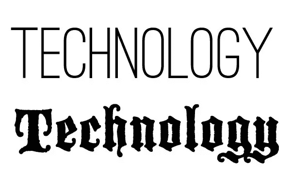
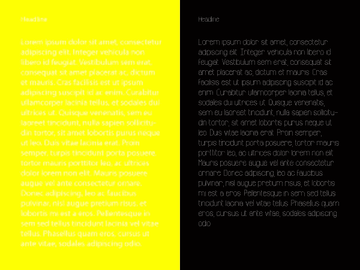

# 如何做出务实、有目的的排版选择

> 原文：<https://www.sitepoint.com/make-pragmatic-purposeful-typography-choices/>

心理学家已经证明，排版对你的书面文本的影响和解释有显著的可测量的效果。考虑到这一点，排版可能是任何设计中最重要的部分，应该有目的、务实地选择——而不是基于任何设计师的突发奇想或个人偏好。你可以有漂亮的图片和很棒的布局，但是如果你选择了错误的字体，它会毁了整个设计。

即使对排版一无所知的观众也会对选择不当的字体产生微妙的潜意识反应。难道你不会对一个通过漫画传达严肃主题的设计“再三考虑”吗？做出正确的字体选择并不是火箭科学，但是有一些通用的考虑因素可以帮助你在考虑设计的更大目的时做出实用的字体选择。

## 含义

字体必须与主题和整体背景相匹配，否则会在观众的头脑中造成混乱和不和谐。例如，如果你正在为一家尖端技术公司制作一本小册子，你显然不会使用旧的英文或黑色字体作为你的显示字体。这根本说不通。相反，你最有可能选择一种平滑的、无衬线的字体，可能是细笔画，它微妙地传达了公司的宗旨和原则:组织、效率、现代和创新。

## 效用

第二个同样重要的考虑是可读性。如果对可读性有丝毫怀疑，那就不要使用字体。对于每一个欣赏超风格但不实用的字体的观众来说，有更多的人只是没有从你精心制作的文字中获得预期的印象。如果你使用一种很难阅读的字体，大多数人不会费力去阅读它，而会把注意力转移到其他地方。选择一种字体，在正负空间之间达到一个稳固的平衡。如果你不这样做，部分文字会渗进其他人，文字很容易被误读，造成混乱。对于正文，不要使用过细的字体，过细的字体会使眼睛疲劳。阅读你的文章应该是轻松愉快的。

## 多样性

最好的字体选择有变化。不同的粗细和样式是重要而有用的工具，可以强化您的设计，突出各种标题、标题和标注之间的相对重要性。最好的字体(也是我最常用的字体)有斜体、粗体和粗斜体。我喜欢有轻体、中体或罗马体、半粗体或半粗体以及粗体的字体，所有的字体都有斜体的对应。这给了我很多选择，让我可以在需要的地方刻意强调。例如，如果我有几段正文，我可能会在设计中放置一段引语或感言来打破常规，增加设计的可信度，并为忙碌、分心或“略读”的读者提供摘录或摘要。这是一种常见的做法，尤其是在网站上。

在字体中使用不同的粗细可以为你的字体增加更多的深度和层次。在上图中，你可以看到使用粗体作为主标题，细字体作为副标题，然后中字体是一种实用的字体组织方式。它创造了视觉上多样化的布局，同时提供了大量的结构和组织。

## 空间

抵制填满所有可用空间的诱惑。我怎么强调都不为过，你需要给你的类型足够的呼吸空间。如果你有一个标题，在正文开始之前给它足够的空间。这传达了标题必要的重要性，就像艺术画廊和珠宝展览有大量的空间来展示他们的作品。同样，如果可能的话(有时我们确实有空间限制)，每行文本之间应该有足够的空间。这就叫领导。一般规则是:取文本的磅值，并在该值上增加 20%,以得出行距值。例如，如果你的字体是 12pt，那么你可以加上 2.4(12 的 20%)得到 14.4 作为你的行距值。

间距不应该只存在于字母、单词甚至文本行之间。您还需要给每个文本块留出足够的边距空间，即四周的空间。你不希望文本太靠近任何边缘，因为它可能会被切断(字面上)，尤其是在印刷设计中。如果您正在创建印刷设计，那么您的文本和设计的绝对边缘之间应该至少有四分之一英寸的边距空间。如果你的设计正在被修剪，你需要 1/8 英寸的空间来修剪。

## 颜色

颜色和类型通常被认为是两个完全不同的考虑因素，在不考虑其他因素的情况下，单独做出选择肯定会更容易。但是，一个精明的设计师会为每一个做出协调的决定。字体颜色选择最重要的方面是对比度。你不会把白色字体放在浅蓝色或黄色上面。您还必须考虑文本背后的任何图像，这些图像会根据覆盖图的位置提供各种各样的对比度(和对比度问题)。您可能需要给文本添加阴影，以使其从对比度不足的背景图像中突出出来。(不是所有的投影都必须是黑色的。)这些技术可以追溯到前面的易读性讨论；如果你的读者看不懂，那么做出不提高可读性的文体选择又有什么意义呢？

## 结论

如果你在选择字体时牢记这些实用的指导方针，你的作品会变得更好，你可能会避免因不完美的排版而沮丧，你的客户的信息会得到更有力和有效的传达。我不会认为它们是约束；相反，我认为它们是一条通向成功排版的直接途径，而不是在漫长、不必要的试错过程后偶然发现的。拥有所有这些原则的良好组合将确保你的设计在尽可能少的迭代中表现良好。

你有什么技巧可以让你有目的、实际地选择字体吗？如果是这样，请在下面的评论区留下你的想法。

## 分享这篇文章