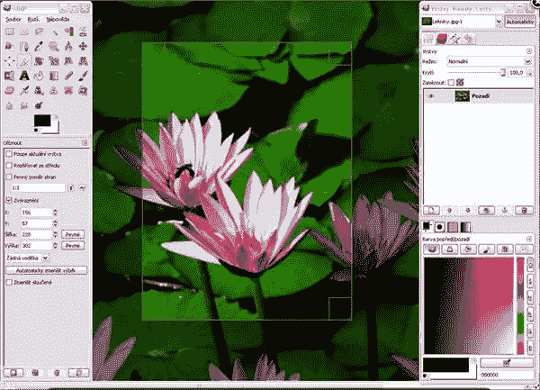
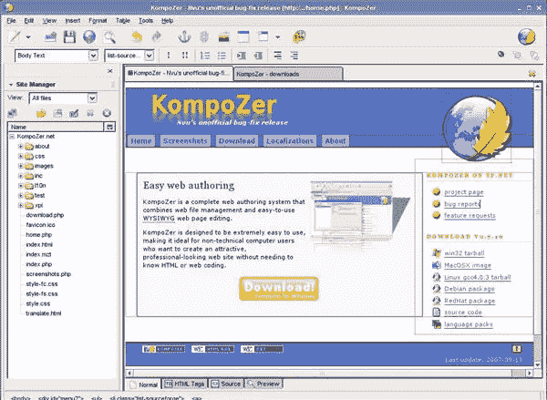
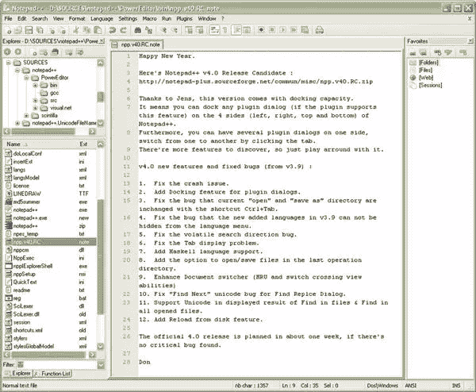
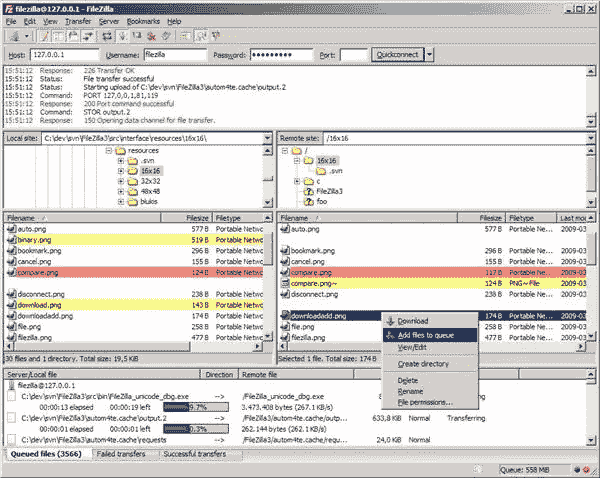
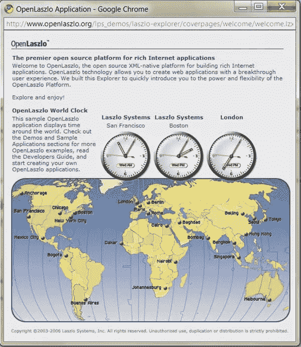
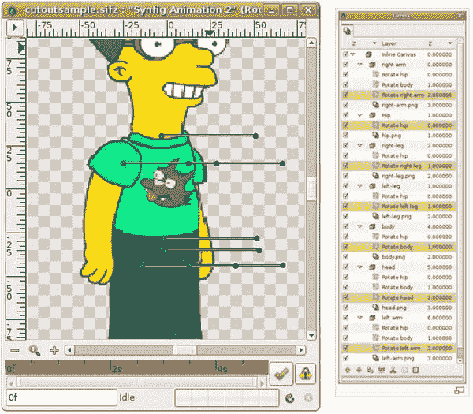
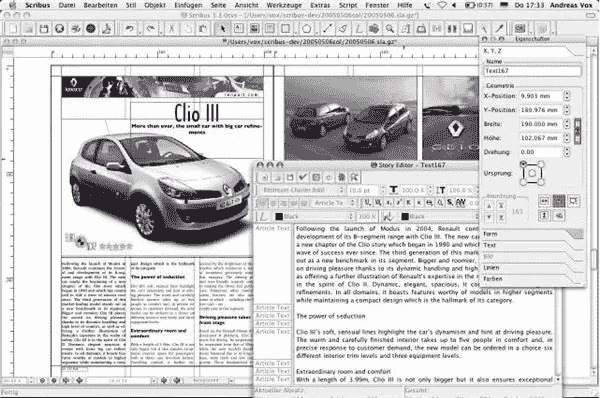

# 使用免费开源软件制作您自己的创意套件

> 原文：<https://www.sitepoint.com/make-your-own-creative-suite-with-free-open-source-software/>

当你开始网页设计时，行业标准软件如 Adobe 的 Creative Suite 通常会超出你的预算。幸运的是，有许多开源替代方案，它们对构建一套可靠的设计工具大有帮助。

**Photoshop 的替代品:GIMP**

GIMP 或 GNU 图像处理程序始于 1995 年，可能是最著名的开源图像编辑器。它有强大的绘画工具，层和通道支持，多个撤消/重做，可编辑的文本层。围绕 GIMP 有一个巨大的支持社区，它有许多插件，可以方便地扩展它的功能。Gimp 可以导入原生 Photoshop 文件，并且可以读取可缩放矢量图形(SVG)文件。

另请参见 [Aviary 的凤凰图像编辑器](http://aviary.com/tools/image-editor)进行在线图像编辑。

Dreamweaver 的替代品:Kompozer

[Kompozer](http://www.kompozer.net/) 是一个所见即所得(所见即所得)的编辑器。它有一个 HTML 编辑器和一个 CSS 编辑器，允许你在设计网页时完全控制布局。

还应该考虑一下 [Notepad ++](http://notepad-plus.sourceforge.net/uk/site.htm) 这种受编码员欢迎的。它不仅适用于 HTML 和 CSS，还支持四十多种语言。

对于 [FTP FileZilla 客户端](http://filezilla-project.org/)是一个快速可靠的跨平台 FTP、FTPS 和 SFTP 客户端，具有许多有用的功能和直观的图形用户界面。

**Illustrator 的替代品:Inkscape**

[Inkscape](http://www.inkscape.org/) 是一个 2D 矢量图形编辑器。它支持贝塞尔曲线，线条，手绘，渐变填充，位图跟踪。所有文件处理都以 SVG 文件格式在本地执行。

另请参见 [Aviary's Raven 矢量图形编辑器](http://aviary.com/)进行在线图像编辑。

**闪光灯的替代品:**

好吧，这有点棘手。有几个可用的开源应用程序在功能和用户界面方面并不真正与 Flash 相抗衡，但它们仍然是创建富媒体动画和 2D 矢量图的一个非常好的起点。

Open Laszlo 是一个包，让你写一次就能编译成 flash 和 DHTML。它支持丰富的图形模型，包括位图、矢量、动画、电影、字体和音频，以及界面小部件和图形编辑工具。有几个用 Laszlo 和[创建的应用程序的好例子，源代码可以在这里下载。](http://www.openlaszlo.org/node/409)

Synfig 是一个强大的、工业级的基于矢量的 2D 动画软件包，是为制作电影质量的动画而设计的。它有一个很好的社区，在 wiki 上有很多关于 T2 的教程。

InDesign 的替代方案:Scribus

Scribus 是一个桌面出版工具包，适用于 Windows、Mac 和 Linux。它支持许多专业页面布局出版功能，如 CMYK 色彩、分色、ICC 色彩管理和多功能 PDF 创建。它有矢量绘图工具，并支持开放式字体。

你还会推荐其他哪些开源必备软件？

## 分享这篇文章