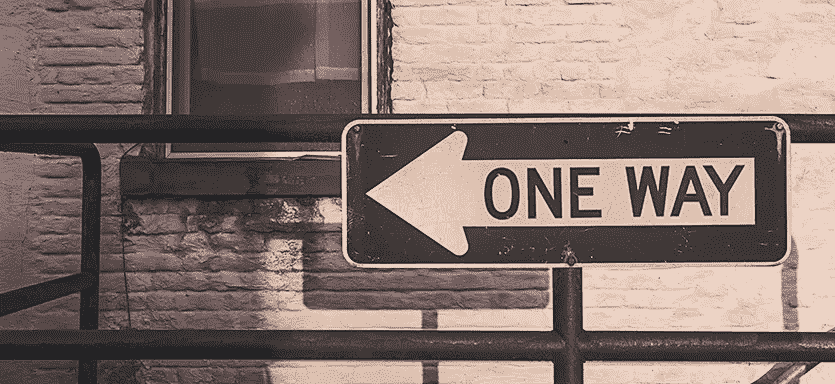

# 让敏捷回顾富有成效

> 原文：<https://www.sitepoint.com/making-agile-retrospectives-productive/>

他们说无视历史的人注定会重蹈覆辙。当你的历史出现在两周的冲刺中时，这同样适用，当你衡量文化革命之间的时间时也是如此。如果你不注意什么有效，什么无效，不决定采取什么行动来改进，你会很快发现自己一遍又一遍地面临同样的问题。

敏捷工作流的最大优势之一是，它为有意的反思留出时间，以鼓励不断的改进。回顾仪式，传统上在 sprint 结束时举行，给团队一个机会来讨论在之前的 sprint 中突出的所有事情。这包括查看哪些进展顺利，哪些进展不顺利，并进行过程修正。

但是，在一个快节奏、竞争激烈的行业中，从繁忙的生产计划中挤出时间来参加一个没有产品特色的回顾会议可能会很难。这里有一些值得注意的可能的异议，以及解决它们的方法。

## “回顾是浪费时间”

刚接触敏捷的人经常担心的一个问题是遵循过程的仪式所花费的时间。让人们参与一个计划会议并不困难，甚至是一个简短的日常谈话(只要确保你的谈话不会让你慢下来就行了)。但是当你遇到像 sprint 回顾会这样听起来很敏感的事情时，可能会有为了效率而试图偷工减料的倾向。

结构化规划有助于解决这一问题。提前计划团队如何确保所有问题都被提出并得到认可。考虑周全，确保回顾会议保持在规定的范围内。当你完成你为会议计划的步骤时，不断跟踪进展，让人们知道你进行了多少。

一定要为这个仪式预留足够的时间，让每个人都在自己的日历上划出这段时间，这样你就可以完全参与进来。回顾会议的好时机可能就在 sprint 演示之后，这时团队中的每个人都已经在思考他们在 sprint 期间完成了什么。通过遵循一个预先计划好的结构，让每个人都参与进来，产生一个清晰的结果，并提供所发生的事情的记录，你可以让回顾会的成效更加清晰。

## “我们不想再有一次抱怨”

没有人喜欢坐在房间里听人们抱怨。当回顾开始感觉像一个抱怨的会议，而不是对问题的公开讨论，这可能意味着这个过程在提高积极成就和感受的可见性方面做得不够好。

在一个有问题的团队中，一个无组织的讨论可能无处可去，只会陷入指控和抱怨的漩涡。主持会议的 scrum master 需要确保有时间留给人们回忆和分享积极的事情。有时不是每个人都有积极的话要说，但是每个人都应该有机会，因为团队从工作中学习的和从他们认为可能需要改变的事情中学到的一样多。

确保在行动项目和事后与团队分享的回顾笔记中，积极和消极的方面都得到公平的关注。通过在这个过程中投入时间来引出积极的反馈，有可能将回顾会的情绪从好斗转变为建设性的，而不会扼杀对任何严肃问题的讨论。

## “没有什么真正改变”

当团队不熟悉回顾过程时，最常见的一个问题是不能从回顾中提出的问题中学习。当从一次会议到下一次会议提出的问题看起来都一样时，这可能是没有足够的学习和迭代发生的迹象。

在会议开始时花点时间看看上次会议的行动项目是避免这个问题的好方法。一旦团队被提醒某个问题已经被提出，讨论就可以从重提旧事转向关注为什么行为上没有任何改变。以回顾团队在之前的回顾会上决定采取的行动开始会议，会后一定要发送笔记，提醒每个人他们刚刚讨论和决定了什么。

不要在没有团队同意尝试的行为列表的情况下结束回顾会议，并确保该列表是您在下一次回顾会议开始时拿出的第一件事情。如果有帮助的话，使用 Atlassian 的 Confluence 包中提供的[回顾蓝图](https://confluence.atlassian.com/display/DOC/Retrospectives+Blueprint)这样的模板来保持一致的格式，并保持笔记可见和可访问。如果团队对这个想法感到满意，你甚至可以将列表张贴在单口相声表演的地方，这样每个人都可以在任何偏差开始发生时就注意到它们。迟早，人们会开始意识到这些是他们对彼此做出的真实承诺。

## “我们只是做我们被告知的”

在一些回顾中，如果经理和高级人员过于积极地参与，或者试图让他们的意见超过团队的声音，团队可能会感到害怕。虽然管理层通常有很好的理由来为团队制定政策，但是这些政策对团队以敏捷方式操作和取得进展的能力的影响应该是回顾会议上公开和平衡讨论的一部分。如果团队被提供了一个安全的空间，并且人们对提出他们的关注感到舒服，那么最大的价值就来自于过程。

有时可能需要创建一个流程，允许个人匿名提交他们的负面和正面评论。如果是这样的话，scrum 大师应该注意会议中的对话动态，看看是否有个人或等级问题阻碍了团队讨论。

管理通常为团队定下基调，一个不喜欢听到批评的经理会抑制回顾过程，以至于它不再增加价值。对于一个遵循敏捷过程的团队的经理来说，重要的是要接受倾听人们所说的价值，并以迭代的方式对尝试旧问题的新方法保持开放。当敏捷与一个支持性的管理结构和谐地运行时，它工作得最好，这个支持性的管理结构认识到为团队中的每个人维护一个安全和透明的工作环境所带来的好处。

## “我们已经学会了一切”

在一个团队一起工作了几个 sprints 之后，他们可能会停止回顾，或者团队的一些成员可能不经常参加。在某些方面，当有人提出回顾会因为没什么可抱怨的而感到无关紧要时，这可以被看作是一个好迹象。但是遵循这些仪式对于防止问题从裂缝中渗透出来是至关重要的。

停止进行回顾的建议可能是回顾会议本身变得无聊的一个迹象，并且需要一个大变动。网上有一些很棒的资源，比如[回顾维基](http://retrospectivewiki.org/)，它可能会给你一些新的方法来组织回顾，让它更吸引人，更有成效。改变回顾的运行方式，并使之变得有趣，是值得付出额外努力的。

让一个团队将回顾作为敏捷过程的一部分，会停止学习，让曾经敏捷的东西变成简单的策略。如果团队没有通过积极讨论每个 sprint 中哪些进展顺利，哪些进展不顺利而获得的自我意识，问题和怨恨就会悄悄地产生，破坏敏捷的透明度。

## “哦，对了，我们忘了这件事。”

回顾完成后，仪式的产品应该是一组清晰的行动项目，供团队在下一个冲刺阶段尝试。这些应该自然地从提出的话题和他们激发的讨论中产生。在会议结束时，scrum master 应该已经准备好了建议行动项目的完整列表，并且已经将它们提交给团队以获得普遍同意。

在冲刺阶段，每当出现相关情况时，提醒人们行动项目是很重要的。一些团队选择在他们举行每日站立会议的地方旁边的墙上张贴行动项目列表，这样他们就可以经常被看到。随着团队变得更加舒适，人们可能会开始使用温和的社会压力来倡导其他人坚持对他们来说最重要的行动项目，从而产生一种自然的同行压力来实现改进。

## 包扎

为回顾留出时间对于敏捷过程的迭代改进至关重要。如果你从来没有给团队一个机会去反思什么进行得好，什么进行得不好，以及他们如何改进，仅仅遵循每天的惯例是不够的。让每个人都积极参与回顾过程也很重要。那些安静地坐在一旁观察的人的观点有时比那些直言不讳的少数人的观点更能阐明一个问题。

进行一次有效的回顾应该是一次愉快的经历。想办法让它成为人们期待的东西。在冲刺阶段，提醒人们记住上一次回顾中的行动项目，并跟踪他们希望在下一次回顾中回顾的问题，包括积极的和消极的。

## 分享这篇文章