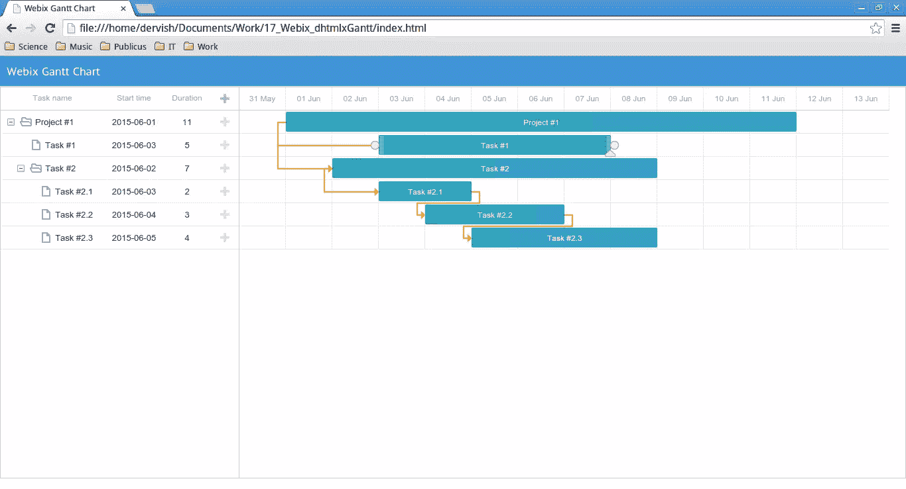
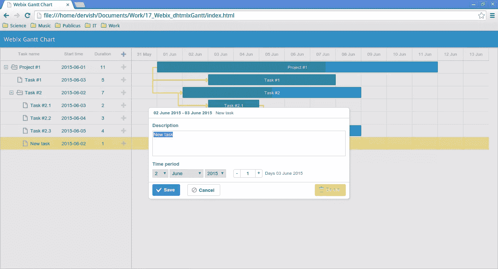
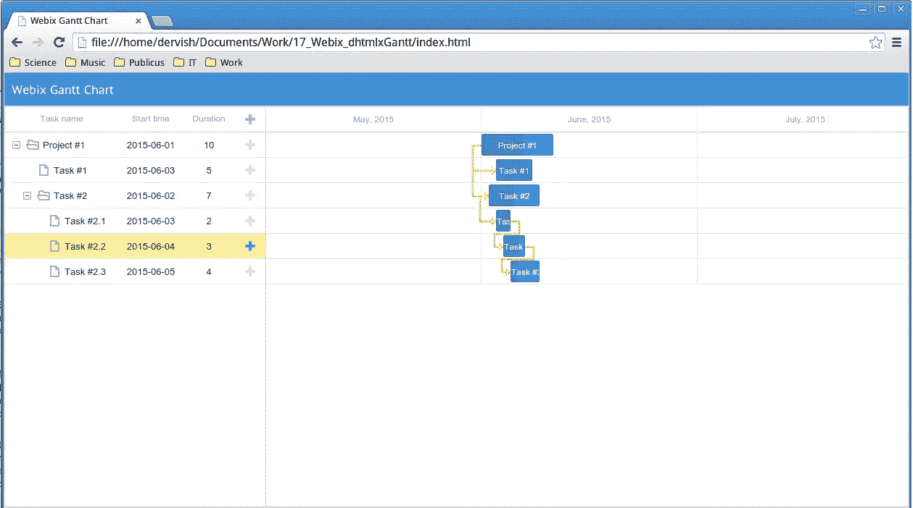

# 用 Webix 制作自己的甘特图

> 原文：<https://www.sitepoint.com/making-your-own-gantt-chart-with-webix/>

在我的[上一篇文章](https://www.sitepoint.com/introducing-webix-framework/ "Introducing the Webix Framework")中，我已经向您介绍了 Webix 框架。您已经发现了它的基本特性，并学习了如何用它创建一个非常好看的响应性 web 应用程序。现在是向前迈出一小步的时候了，看看我们还能利用这个有前途的框架做些什么。

在本文中，我将向您展示如何创建自己的甘特图应用程序，为了完成这项任务，我将结合使用 [Webix 框架](http://webix.com "Webix home page")和一个名为 [dhtmlxGantt](http://dhtmlx.com/docs/products/dhtmlxGantt/ "dhtmlxGantt home page") 的开源 JavaScript 甘特图。

但是你可能会问，为什么要用甘特图呢？毫无疑问，它有很多优点。首先，由于其直观的表现方式，这些图表被广泛用于可视化项目的工作过程。其次，dhtmlxGantt 是一个甘特图工具，它有很多功能，比如导出、可定制的时间刻度等等。最后，我在 Webix 开发者的博客中发现了一篇名为[DHTMLX Gantt Chart in Webix Web Apps](http://webix.com/blog/dhtmlx-gantt-chart-in-webix-web-apps/ "Webix blog")的文章，事实证明，只需几行代码就可以将甘特图添加到 Webix 应用程序中。所以，我认为他们可以很好地配合在一起。
如果你可能需要帮助，也有一些[分步指南](http://docs.dhtmlx.com/gantt/desktop__guides.html "dhtmlcxGantt guides")可用，所以如果有疑问，请随意使用。

## 创建基本甘特图

现在让我们创建我们的应用程序。首先，我们来看一个基本图表。然后，我们将添加一些特性来增加它的功能。

### 准备文件

首先我们需要[下载 dhtmlxGantt 库包](http://dhtmlx.com/docs/products/dhtmlxGantt/download.shtml "dhtmlxGantt download page")，将“codebase”文件夹解压到项目目录下。由于与 dhtmlxGantt 的集成不是 Webix 的内置特性，我们需要[从这个 GitHub 库](https://github.com/webix-hub/components "Webix additional components")下载所需的文件。我们感兴趣的是你应该放入你的项目目录的“甘特图”目录。
我已经使用 Webix CDN 将 Webix 包含到我的项目中，但是如果你愿意，你可以[下载完整的库](http://webix.com/download/ "Webix download page")。此外，我们需要允许我们使用导出特性的`api.js`文件。

所以，这是我目前的`index.html`文件:

```
<head>
   <title>Webix Gantt Chart</title>
   <!--Webix-->
   <script src="http://cdn.webix.com/edge/webix.js"></script>
   <link rel="stylesheet" href="http://cdn.webix.com/edge/webix.css" />
   <!--dhtmlxGantt-->
   <script src="codebase/dhtmlxgantt.js"></script>
   <link href="codebase/dhtmlxgantt.css" rel="stylesheet" />
   <!--dhtmlxGantt integration-->
   <script type="text/javascript" src="./gantt/gantt.js"></script>
   <!--export-->
   <script src="http://export.dhtmlx.com/gantt/api.js"></script>
</head>
```

完成后，我们可以创建一个基本的甘特图。

### 甘特图初始化

该图表提供了使用数据库存储数据的可能性(您可以查看[文档页面](http://docs.dhtmlx.com/gantt/desktop__how_to_start.html#step5createadatabase "Database usage")以了解它是如何工作的)。然而，在我们的实验中，我们将使用内联数据作为例子来关注 JavaScript 部分。在本教程中，我将假设使用第二个脚本，它的内容也被转换成了它的等效 JavaScript 对象:

```
var tasks = {
   data: [{
         id: 1,
         text: "Project #1",
         start_date: "01-06-2015",
         duration: 11,
         progress: 0.6,
         open: true
      }, {
         id: 2,
         text: "Task #1",
         start_date: "03-06-2015",
         duration: 5,
         progress: 1,
         open: true,
         parent: 1
      },
      /*some more tasks*/
      {
         id: 6,
         text: "Task #2.3",
         start_date: "05-06-2015",
         duration: 4,
         progress: 0.2,
         open: true,
         parent: 3
      }
   ],
   links: [{
         id: 1,
         source: 1,
         target: 2,
         type: "1"
      }, {
         id: 2,
         source: 1,
         target: 3,
         type: "1"
      },
      /*some more links*/
      {
         id: 5,
         source: 5,
         target: 6,
         type: "0"
      }
   ]
};
```

我们来讨论一下性质。`data`属性包含任务描述:任务名称、ID、开始日期、任务持续时间(默认为天)和当前进度(从 0 到 1 的数字)。它还包括定义任务分支是否打开的`open`属性和定义父任务的`parent`属性。`links`参数定义依赖关系链接，由以下值组成:任务 ID，依赖于`target`任务的`source`任务，依赖类型(0—‘完成到开始’，1—‘开始到开始’，2—‘完成到完成’)。

我们现在可以用这些数据初始化我们的图表:

```
webix.ui({
   rows: [
      //row_1: header
      {
         type: "header",
         template: "Webix Gantt Chart"
      },
      //row_2: gantt chart
      {
         view: "dhx-gantt",
         init: function() {
            gantt.config.order_branch = true;
         },
         ready: function() {
            gantt.parse(tasks);
         }
      }
   ]
});
```

`view:"dhx-gantt"`定义了一个 UI 组件类型，在这里是甘特图。`init`属性包含将在初始化之前运行的函数。我使用了`order_branch`选项来支持拖放任务的重新排序。`ready`属性定义了组件满载时触发的功能。在我们的例子中，它使用`gantt.parse()`方法用之前创建的数据初始化图表。

结果如下所示:



那么，我们有哪些特点呢？您可以重新定义现有的任务相关性，并创建新的任务相关性。您可以通过拖动任务边缘的圆圈来实现。可以用底部的三角形来改变进度状态。通过在水平方向拖动任务，可以更改任务的开始时间。至于持续时间，可以通过调整任务大小来设置。我们可以使用“+”按钮添加新的任务和子任务。

下面是新任务创建的样子:



此时我们可以创建一个图表，但是没有办法操作它。因此，让我们为此添加一些控件。

## Webix 带来更多控制

我们将使用一些 Webix UI 组件来控制我们的图表。

### “导出到…”菜单按钮

为了避免混乱的代码，我决定将 UI 组件初始化从布局代码中分离出来。

首先，让我们定义菜单按钮，它将允许我们将图表导出为不同的文件格式。为此，我们将使用 [Webix 菜单组件](http://docs.webix.com/desktop__menu.html "Menu documentation page")。

以下是菜单说明:

```
var menu = {
   view: "menu",
   openAction: "click",
   data: [{
      value: "Export to...",
      type: "icon",
      icon: "save",
      config: {
         on: {
            onItemClick: function(id) {
               switch (id) {
                  case "pdf":
                     gantt.exportToPDF();
                     break;
                  case "png":
                     gantt.exportToPNG();
                     break;
                  case "excel":
                     gantt.exportToExcel();
                     break;
                  case "ical":
                     gantt.exportToICal();
                     break;
                  default:
                     webix.message("Unknown file format");
               }
            }
         }
      },
      submenu: [{
         id: "pdf",
         value: "PDF",
         type: "icon",
         icon: "file-pdf-o"
      }, {
         id: "png",
         value: "PNG",
         type: "icon",
         icon: "file-image-o"
      }, {
         id: "excel",
         value: "Excel",
         type: "icon",
         icon: "file-excel-o"
      }, {
         id: "ical",
         value: "iCal",
         type: "icon",
         icon: "calendar"
      }]
   }]
};
```

默认情况下，当鼠标悬停在菜单按钮上时，菜单按钮被激活。属性重新定义了这种行为，所以菜单将只通过鼠标点击来打开它的子菜单。`data`参数定义菜单内容。这里有趣的是`type: "icon"`属性，它允许我们向菜单按钮添加一个图标。Webix 使用[字体牛逼图标集合](http://fortawesome.github.io/Font-Awesome/icons/ "Font Awesome icons")。如果你想应用你喜欢的图标，你必须使用图标的名称作为`icon`参数的值。
下一步是事件处理。当其中一个菜单项被点击时，触发`onItemClick`事件。我已经使用了`switch`语句来处理所选择的`id`值，因此您可以看到对于某种文件格式使用了什么方法。`submenu`参数包含菜单项定义。

### 工具栏

我们将工具栏放在页面的底部。它将包含控制元素，包括我们的菜单按钮。

工具栏组件将帮助我们做到这一点。但在此之前，让我们定义一下应该添加哪些选项。如果你想管理一个持续时间足够长的项目，你应该考虑规模变化特性。dhtmlxGantt 为您提供了多种可用的[刻度属性](http://docs.dhtmlx.com/gantt/desktop__configuring_time_scale.html "dhtmlxGantt scale documentation")。我们将使用日、周和月刻度。

让我们定义将启用月刻度的函数:

```
var scaleMonths = function() {
   gantt.config.scale_unit = "month";
   gantt.config.date_scale = "%F, %Y";
   gantt.parse(tasks);
};
```

`scale_unit`属性定义了刻度单位。它的可能值是“分”、“小时”、“天”、“周”、“季度”、“月”和“年”。为了设置时间刻度的正确格式，我们使用了`date_scale`属性。之后，我们应该用`gantt.parse(tasks)`刷新图表。

下面是我们使用该函数后的图表外观:



其他比例函数也以类似的方式工作，所以我不会描述它们。

现在我们可以定义`toolbar`变量:

```
var toolbar = {
   view: "toolbar",
   paddingY: 0,
   elements: [
      menu, {
         view: "segmented",
         on: {
            onChange: function(id) {
               switch (id) {
                  case "days":
                     scaleDays();
                     break;
                  case "weeks":
                     scaleWeeks();
                     break;
                  case "months":
                     scaleMonths();
                     break;
                  default:
                     webix.message("Wrong scale option");
               }
            }
         },
         options: [{
            id: "days",
            value: "Days"
         }, {
            id: "weeks",
            value: "Weeks"
         }, {
            id: "months",
            value: "Months"
         }]
      }
   ]
};
```

它看起来类似于我们以前创建的菜单。`paddingY`属性将顶部和底部填充值设置为 0。属性`elements`定义了工具栏的内容，就像菜单例子中的属性`data`一样。工具栏的第一个元素是我们的菜单，而第二个是一个[分段按钮](http://docs.webix.com/desktop__controls.html#segmented "Segmented button documentation")。当您想要在可用值之间切换时，如我们示例中的比例单位，这很有用。多了一个事件处理程序来管理用户的选择，但这次是`onChange`事件。它在当前选定的按钮被更改后激发。我们之前定义的函数将根据所选的按钮 ID 改变比例。属性定义了控件中的按钮(段)。

最后，是时候将工具栏添加到图表中了。为此，只需将`toolbar`变量添加到布局代码中:

```
webix.ui({
   rows: [
      //row_1: header
      {
         type: "header",
         template: "Webix Gantt Chart"
      },
      //row_2: gantt chart
      {
         view: "dhx-gantt",
         init: function() {
            gantt.config.order_branch = true;
         },
         ready: function() {
            gantt.parse(tasks);
         }
      },
      toolbar
   ]
});
```

结果如下:


我们的图表现在是可扩展的。菜单图标将帮助用户做出选择。

## 结论

在本文中，我们看到了如何构建一个基于 dhtmlxGantt 的甘特图应用程序，根据其总持续时间设置适当的比例，并将其导出到一个文件中以备不时之需。我们得到的是一个轻量级的在线图表创建工具。

目前只有几篇关于 Webix 与 dhtmlxGantt 集成的文章。然而，根据这篇题为[Webix UI 的使用案例-Gantt PRO](http://webix.com/blog/use-case-of-webix-ui-gantt-pro/ "Webix UI and GanttPRO")的帖子，最近 Webix 被用来创建[Gantt PRO](http://ganttpro.com/en/ "GanttPRO home page")-一个高级的在线甘特图应用程序。这让我猜测，通过使用帖子中描述的特性和 UI 组件，您将能够极大地扩展甘特图的功能。

如果你想查看源代码和演示，你可以访问 GitHub 页面。

## 分享这篇文章