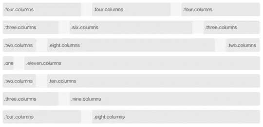
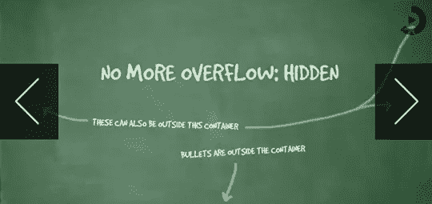
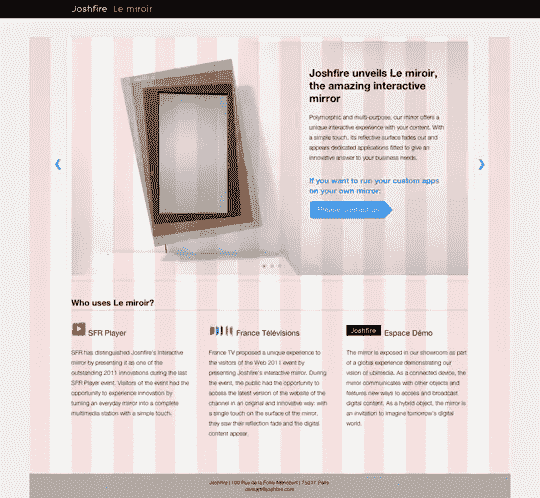
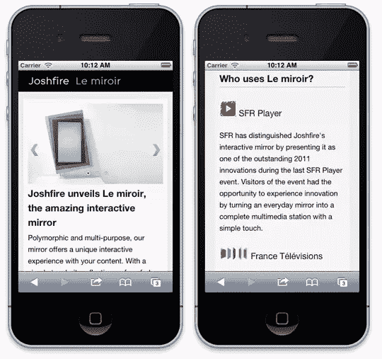

# 使用 Foundation 在几分钟内让您的网页设计变得移动友好

> 原文：<https://www.sitepoint.com/making-your-web-design-mobile-friendly-in-minutes-with-foundation/>

从个人客户到大公司，各种类型的客户对“手机友好型”网站的要求越来越普遍。随着每年售出数百万部智能手机和平板电脑，移动设计已经逐渐从一个“最好拥有”的外围功能变成了设计中“必须拥有”的核心组件。如果你没有从一开始就计划好移动友好，你可能需要对你的网站做一些大的修改以适应移动使用。如果从头开始设计，为更小的显示器、更少的带宽和基于触摸的交互性进行设计可能会非常乏味，但像 [Foundation](http://foundation.zurb.com/) 这样的移动框架可以让这些基本的移动住宿变得异常简单。

### 案例研究:Joshfire 的 Le Miroir

Joshfire 的设计师们在推出网站推广他们的互动镜子时，他们注意到了一个问题。当他们把网站放在 iPhone 上时，设计看起来并不出色。鉴于移动设备的普及及其产品的性质(高科技、交互式、基于触摸的镜子)，这是不可接受的。

问题是，该网站最初是从一个 PSD 文件构建的，该文件具有 960 像素的固定宽度。由于时间紧迫，他们决定只关注一个用例——它在台式机或笔记本电脑上的外观。然而，随着他们开发网站，他们最终意识到他们必须适应智能手机和平板电脑。如今，人们在手机和平板电脑上访问网站的频率不亚于在台式机上(如果不是更多的话)。事实上，到 2014 年，移动流量预计将超过桌面流量。

Joshfire 面临着一个问题。他们如何能在这么短的时间内建立一个在所有设备上都看起来不错的网站呢？进入[基金会](http://foundation.zurb.com/)，ZURB 的开源，响应原型框架。一些团队成员以前听说过 Foundation，但他们中没有人使用过它——直到现在。谢天谢地，ZURB 的人编写了关于 Foundation 的全面文档，这使得它非常容易使用。他们使网站响应迅速、移动友好所需的一切都很容易找到。基金会有四个特别重要的部分，这使得它非常有价值:

### 柔性网格

基础网格是完全基于百分比的和流动的，因此它自动适应不同的屏幕尺寸，这在为各种各样的移动屏幕宽度进行设计时尤其有用。对于更极端的变化，Foundation 使用 CSS3 媒体查询将网格调整为优化的移动表示。

[](https://www.sitepoint.com/wp-content/uploads/2012/02/grid1.png) 
[了解基金会的网格系统](http://foundation.zurb.com/docs/grid.php)

### 大量不同的按钮

Foundation 有许多不同大小和样式的按钮，有助于快速原型制作。这些按钮非常容易修改；它们基于简单的语义 CSS 类。

[](https://www.sitepoint.com/wp-content/uploads/2012/02/buttons1.png)

[了解基金会的按钮选项](http://foundation.zurb.com/docs/buttons.php)

### 响应图像滑块(动态观察)

[](https://www.sitepoint.com/wp-content/uploads/2012/02/no-more-overflow.png)

Orbit 是一个轻量级、无插件的图像滑块，它很好地利用了移动设备有限的屏幕尺寸和基于触摸的交互性。与基于 flash 的动态图像相比，这是一个更好的选择，因为基于 flash 的动态图像不会在 iPhones、iPods 和 iPads 等 iOS 设备上显示。就像基础列和按钮一样，动态观察是高度可配置的。

[看看轨道是如何工作的](http://foundation.zurb.com/docs/orbit.php)

### 移动可见性选项—在特定设备上显示和隐藏特定内容

最强的基础特性之一是内置的移动可见性选项——为某些移动设备打开或关闭功能的 CSS 类。简单的 CSS 类如“隐藏在手机上”和“显示在桌面上”是直观和非常方便的。

[了解如何控制在哪些设备上显示哪些内容](http://foundation.zurb.com/docs/layout.php)

Foundation 还有一个隐藏的瑰宝——没有固定宽度的可嵌套列。设计者可以任意深度地嵌套列，因为每个嵌入行最多可以包含 12 列。在设计各种屏幕尺寸时，灵活的宽度非常方便。这里有一个例子，说明了 Joshfire 如何使用网格来创建他们新产品的登录页面。

### 涂抹粉底

Joshfire 的设计(PSD)要求页面的主要内容出现在比页面其余部分窄的部分。以下是 PSD 的截图:

[](https://www.sitepoint.com/wp-content/uploads/2012/02/grid-design.png)

由于列没有固定的宽度，我们只是将内容放在用适当的类(“.十，“”。列，“和”。居中"):

```
<div id="mainwrapper"> <!-- global container -->
 <div> <!-- box with a gradient as background -->
  <div class="ten columns centered"> <!-- content goes here -->
   <div>
    CONTENT
   </div>
  </div>
 </div>
</div>
```

这种方法效果很好；他们编码了和上面的 PSD 一模一样的外观。一名设计师希望滑块中的第一个图像包括文本和一个行动号召按钮(就像上面的 PSD 中一样)。他们还想在切换到另一个图像之前隐藏文本。不幸的是，与 Foundation 捆绑在一起的滑块 Orbit 有一个“afterSlideChange”功能，但没有“beforeSlideChange”功能。因此，他们最终修改了轨道以适应他们的目的。

滑块工作后，移动网站开始运行，完全从零开始重建，最棒的是对移动设备友好。多亏了 Foundation 才花了一个小时。立即查看该网站在 iPhone 上的外观:

[](https://www.sitepoint.com/wp-content/uploads/2012/02/2-mobile-layouts.jpg)

你可能想知道，“为什么选择 Foundation 而不是 Twitter Bootstrap，这是一个类似的框架？”当时，Bootstrap 是一个固定的框架，所以选择 Foundation 是显而易见的。此后，Bootstrap 2.0 发布，完全响应。Bootstrap 现在拥有让设计在移动设备上看起来不错所需的一切，但 Foundation 有更好的特性、更大程度的控制和更完整的网格。

在为移动设备设计时，您是否使用类似 Foundation 的框架？

## 分享这篇文章