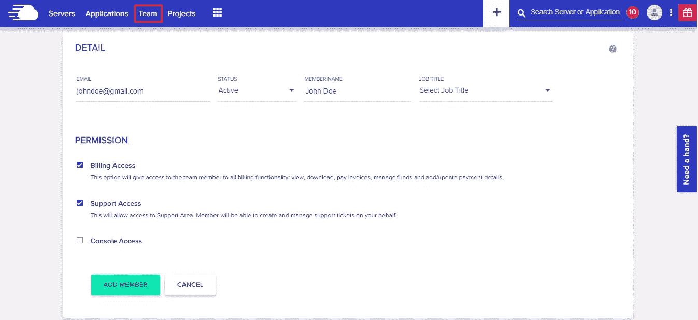
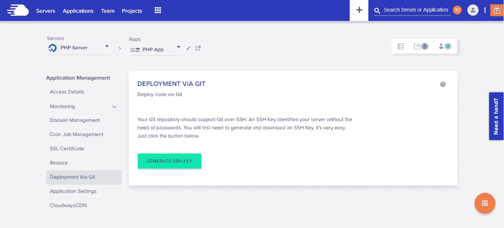

# 为什么您的机构应该向客户提供托管云托管

> 原文：<https://www.sitepoint.com/managed-cloud-hosting/>

*本文是与 [Cloudways](https://www.cloudways.com/) 合作创作的。感谢您对使 SitePoint 成为可能的合作伙伴的支持。希望与 SitePoint 合作？在这里获得[更多信息。](https://www.sitepoint.com/advertise/)*

谈到端到端服务，数字机构提供了令人印象深刻的范围。从需求分析到部署后的维护，这些机构竭尽全力确保他们的客户能够充分利用他们的项目来实现最大的业务效率。

在这种背景下，许多代理机构(尤其是那些处理基于网络的项目的代理机构)也将主机托管作为其客户服务的一部分。虽然小型和后起之秀的数字代理机构可能在他们的服务手册上没有托管，但中端和高端代理机构将托管视为向其客户提供的不可或缺的服务。

## 为客户设置主机

对于一个基于网络的项目来说，[虚拟主机](https://www.cloudways.com/en/)是决定项目成功(和失败)的重要组成部分。由于该机构开发了项目，许多客户信任该机构管理的项目托管。

高性能应用程序(尤其是在线商店和 CRM)需要一个能够跟上高请求量和大量并发连接的托管解决方案。拥有这些项目的客户不能牺牲应用程序的部署后性能。因此，机构更喜欢内部托管设置，以满足项目的具体要求。

## 机构从内部托管中受益

在探讨机构从内部托管设置中获得什么好处之前，了解高性能项目的主要要求是很重要的。无需过多讨论细节，内部托管解决方案旨在确保定制项目继续按照以下参数运行:

*   每小时/每天/每月的游客数量
*   同时来访的人数
*   允许的最大连接数
*   同时请求/订单的数量
*   产品目录的规模和复杂程度(产品数量、产品类别、属性)
*   博客等内容资产的内容需求和流量
*   网站上的搜索查询量
*   数据库的大小和连接

借助内部托管解决方案，代理机构(及其客户)将获得一系列好处，如下所述。

**到 2019 年 12 月 4 日， [Cloudways](https://www.cloudways.com/) 正在为所有托管计划提供为期 3 个月的黑色星期五六折优惠。当[在 Cloudways](https://platform.cloudways.com/signup) 注册时，使用促销代码“BFCM40”。**

### 定制硬件和软件

定制、高性能项目的硬件需求一般包括三个组件: **CPU** 、 **RAM** 和**磁盘空间**。由于每个项目都有市场上现成的托管解决方案通常不具备的定制需求，代理机构选择为其客户建立内部硬件平台。

定制硬件设置通常比传统的、商业上可用的主机硬件架构成本更高。设置和维护托管架构的成本通常是开发机构的责任，开发机构通常会向客户收取这些服务的费用。

这些项目的另一个相关的(在我看来，更重要的)需求是一个定制环境，它包括一个 OS 层和一个由服务器和缓存组成的促进层。定制环境允许机构构建他们的项目，而不用担心与执行代码库所需的操作系统和服务器软件的冲突。由于内部托管，数字机构可以根据项目规格完全定制操作系统和服务器层。

### 项目托管的端到端管理

项目需求会发生变化，客户通常会修改他们的需求和范围。这些变化也会影响托管需求和规范。由于托管流程是在内部管理的，该机构可以采取主动措施来改进托管设置规范，并确保应用程序的持续性能。

### 被动收入流

几乎在所有情况下，代理管理的托管解决方案都是用客户的钱来构建和维护的。该机构提出托管设置规范，并在客户付款后进行设置。一旦设置被激活，客户支付托管解决方案的维护和保养费用。这是一个被动的收入渠道，通常是机构收入的重要补充。

## 机构内托管的挑战

尽管有这些好处，管理一个内部托管设置可以证明是一个机构运作的拖累。特别是，代理管理的托管会给业务流程带来以下挑战。

### 托管架构需要持续关注

由于这是一个内部托管解决方案，很明显，该机构负责保持硬件和软件层的运作。虽然硬件层(物理服务器和网络设备)的故障率较低，但需要注意的是，托管解决方案的软件组件需要精心维护和保养。

硬件和软件供应商都会定期发布补丁来修复缺陷和增强产品功能。在许多情况下，这些补丁是关键任务，对于项目托管的持续性能至关重要。在内部托管中，这是一个专门团队的责任，不执行其他职能。

### 对安全的持续需求

Web 服务器是网络犯罪分子的主要目标，因为上面有大量的信息和用户数据。服务器安全的问题是，它是一个全职的功能，需要团队中的专家。这同样适用于客户端的应用程序([像 WordPress 这样的 CMS 特别容易受到攻击](https://www.zdnet.com/article/wordpress-accounted-for-90-percent-of-all-hacked-cms-sites-in-2018/))，它们可能会在服务器和应用程序安全方面打开安全漏洞。没有多少机构能负担得起一个专门的信息安全专家。因此，客户的应用程序总有被黑客攻击的危险，因为代理管理的主机无法维持所需的安全标准。

### 系统管理员被证明是一种开销

系统管理员是 ICT 行业中收入最高的职业之一，的确如此！他们管理整个数据中心，处理托管服务器从供应到维护的所有方面。系统管理员的问题是这些专业人员的高招聘和运营成本。因此，雇佣一个系统管理员来管理内部托管是一个严重的决定，超出了许多开发机构的预算。

### 偏离核心业务

数字机构的业务是构建应用程序和定制项目，为客户创造价值。内部托管解决方案需要超出开发机构正常范围的能力。此外，管理托管解决方案需要大量开支，这些开支消耗了利润，却没有产生足够的收入来证明将其包含在业务产品中的合理性。

## 共享主机是一个错误的开始

好消息是，许多代理机构已经意识到内部代理托管的问题，并开始意识到这不是管理客户托管期望的理想解决方案。

然而，由于客户的要求不断增长，对定制开发应用程序托管解决方案的需求也在增加，许多机构已经转向共享托管，作为机构管理的内部托管解决方案的替代方案。

当选择共享托管解决方案时，代理机构试图降低托管解决方案的成本，同时向客户提供可比的托管解决方案。

在解释为什么共享主机解决方案实际上对开发机构不利之前，理解共享主机解决方案如何工作是很重要的。

### 简而言之，共享主机

顾名思义，共享主机是一种将多个网站/应用程序托管在一台物理服务器上的解决方案。这意味着物理资源(CPU、RAM、磁盘空间和带宽(在某些情况下)在服务器上托管的网站之间共享。

虽然这本身并不是一个糟糕的解决方案，但它并不适合高性能应用程序。这些应用程序的最低服务器资源要求通常会超过共享托管服务器分配的“配额”。

许多数字机构试图将共享托管解决方案集成到他们以客户为中心的服务中，方法是将系统管理员排除在外，让开发人员为客户管理托管服务器。

### 共享主机导致更多的麻烦

虽然共享主机解决方案在纸面上看起来很有吸引力(成本低，设置简单，主机提供商处理所有的维护和安全问题)，但实际上，它并不像宣传的那样工作。

共享服务器上托管的每个应用程序只有在应用程序资源需求保持在限制范围内时才能运行。随着需求接近极限，性能开始下降。此后不久，托管层无法支持应用程序，访问者无法查看内容或与 UI 进行交互。

可以想象，对于处理任务关键型工作负载的高流量应用程序来说，这是一个噩梦般的场景。

然而，对于开发机构来说，一切都没有失去！

## 托管云托管拯救世界

代理机构不能忽视客户的托管相关要求。然而，由于内部代理托管和共享托管解决方案达不到标准，托管云托管是代理机构满足这些要求的绝佳方式。

### 云托管如何运作

云托管是一个非常强大的托管解决方案，提供了最好的共享和专用托管解决方案。您的应用程序所消耗的资源分散在一个物理机器网络中。但是，出于托管应用程序的目的，用户看到的是一个虚拟服务器，它提供了一个安全的环境，用户可以自定义和管理该环境以获得最佳的应用程序性能。

### 托管云托管的便利性

对于云托管的所有优势和功能，云托管的日常管理需要机构员工投入时间和精力。虽然云托管确实为用户解决了问题，但开发机构继续投入人力和资金来为他们的客户管理应用程序托管。

这就是托管云托管真正超越所有其他解决方案的地方。

托管云托管提供商在云 IaaS 提供商提供的服务器之上添加自己的层。这一层通过平台自动化处理大部分服务器管理任务。因此，数字机构只需提供服务器和应用程序的详细信息，托管服务提供商负责服务器供应、应用程序设置和持续的服务器维护任务。

很容易看出托管云托管为开发机构增加了多少价值(就节省的时间和客户可用的服务水平而言)。特别是，托管云托管会影响开发机构的以下运营和要求。

#### 服务器和应用性能

托管云托管提供商对服务器性能承担全部责任。在许多情况下，它们还负责直接受底层服务器层影响的应用程序性能参数。

在传统的托管云托管设置中，应用程序托管在优化的服务器和集成的缓存选项的组合上，这两者共同提高了用户对应用程序的体验。

#### 安全性和更新

服务器安全性是托管云托管提供商的主要责任，该提供商在各种平台级别部署安全措施。在所有情况下，平台都受到 IDS 和防火墙的保护，它们可以在恶意流量破坏应用程序和服务器之前将其过滤掉。

修补是增强托管云托管解决方案安全性的另一个方面。供应商定期发布修补程序，修复已知缺陷并扩展软件/硬件模块的功能。供应商发布补丁后，提供商的管理团队会立即应用补丁。

最后，服务器备份是从许多灾难中恢复的唯一方法。托管云托管提供商支持按需(手动)和自动备份流程，可拍摄服务器数据的快照(或“副本”)，并将其存储在单独的安全位置。

#### 以开发为中心的功能

一些托管云托管解决方案致力于简化开发机构的工作流程。因此，他们提供了一些功能和工具，确保开发机构可以与这些提供商合作，为客户端应用程序提供可靠的托管解决方案。

## Cloudways 简介

当机构决定用托管云托管解决方案替换他们的内部托管时，他们遇到了一个有趣的问题:选择最适合他们需求的提供商。

Cloudways 是托管云托管行业中的一个重要参与者，它有助于机构更轻松地做出选择。凭借接管服务器和托管麻烦的核心业务主张，Cloudways 无缝取代了内部代理管理的托管解决方案，而不会中断客户项目和网站的运营。

在不涉及太多细节的情况下，让我们看看 Cloudways 为代理商增加价值并确保代理商及其客户获得顺畅体验的主要运营领域。

### 表演

网站性能是所有 Cloudways 服务的核心属性。因此，所有 Cloudways 托管服务器都预装了优化的缓存组件(选择包括 Varnish、Memcached 和 Redis ),可以提高服务器和应用程序的性能。本质上，当服务器上线时，一切都已经就绪。用户只需通过切换 Cloudways 面板中的开关来启用(或者如果他们愿意，禁用)缓存组件。

### 安全性

安全性并不是事后才想到的，而是构建在 Cloudways 平台的基础上。该平台受到防火墙的保护，在可疑流量造成任何伤害之前不断过滤掉它们。所有帐户都受到 2FA 流程的类似保护，增加了额外的安全层。所有试图访问用户帐户的未识别设备都会被阻止和记录。

没有一款软件是 100%安全的，开发者会定期发布补丁来修复已知的安全漏洞。在 Cloudways 平台上对补丁的性能进行广泛测试后，将补丁应用于堆栈。

### 小组管理

数字机构有一个分布式团队，为客户提供开发和营销活动。因此，他们需要对托管客户端应用程序的服务器进行不同级别的访问。

Cloudways 允许机构在不影响性能和操作能力的情况下维护这种团队架构。可以将每个员工添加为团队成员，为其分配单独的服务器访问权限。此外，一旦项目移交给客户，代理商也可以将服务器的所有权(和计费)转移给客户。这简化了客户端开具发票，因为 Cloudways 为 IaaS 服务器和 Cloudways 服务器管理服务生成一张发票。

### 开发人员关注的功能

Cloudways 旨在简化开发人员的工作流程。这个过程从提供最新的 PHP 7 就绪服务器的平台开始。这意味着代理商可以为他们的客户开发应用程序，并可以绝对放心地将它们托管在 Cloudways 托管的 PHP 托管服务器上。这个堆栈的另一个伟大成果是 Cloudways 可以支持几乎所有 PHP 驱动的应用程序，从而大大增加了代理的视野。

Cloudways 开发友好性的另一个例子是 Git 的本机集成。有了它，开发人员可以直接从他们的 GitHub 库推送和拉取代码，而无需离开平台。这使得开发人员可以利用和集成 GitHub 上大量可用的库和工具。

## 包扎

从表面上看，对于为客户开发、部署和处理应用程序和项目的机构来说，内部的、由机构管理的托管可能看起来工作得很好。然而，一旦他们深入研究，问题和挑战将远远超过收益。因此，托管云托管提供了一个伟大的双赢解决方案，消除了机构在为客户管理服务器时面临的所有麻烦。

如果你是一家机构，并且有兴趣为你的客户尝试托管云托管解决方案，Cloudways 是一个很好的起点。

*到 2019 年 12 月 4 日， [Cloudways](https://www.cloudways.com/) 正在为所有托管计划提供为期 3 个月的黑色星期五六折优惠。当[在 Cloudways](https://platform.cloudways.com/signup) 注册时，使用促销代码“BFCM40”。*

## 分享这篇文章