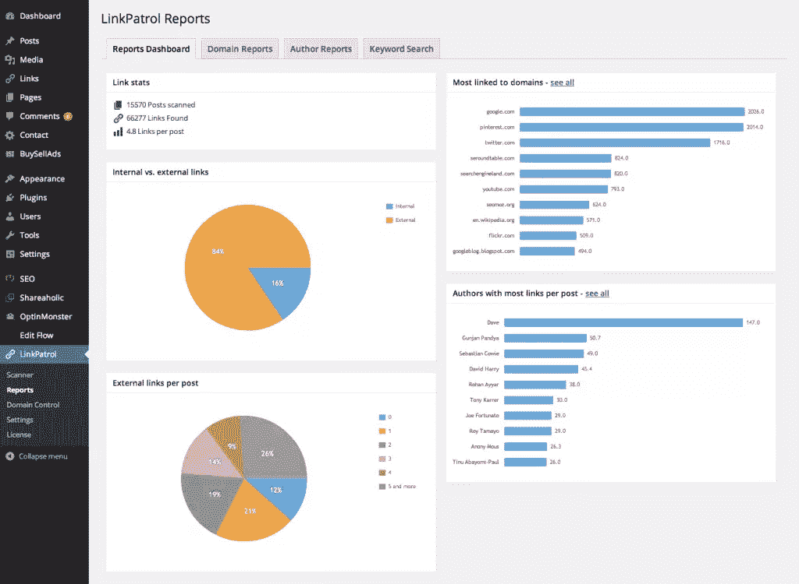
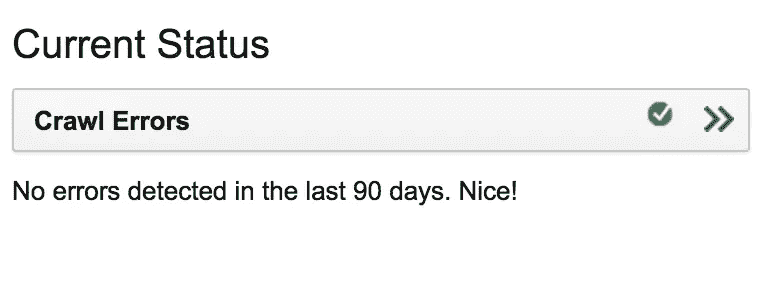
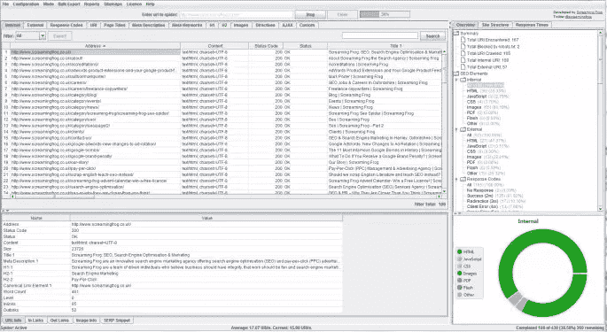
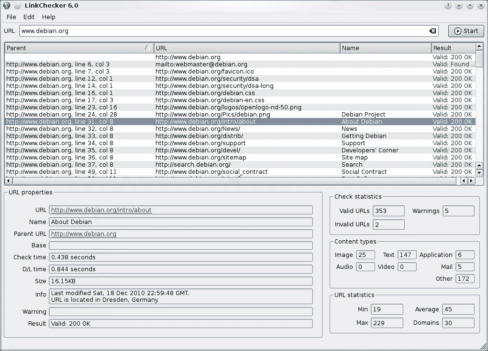
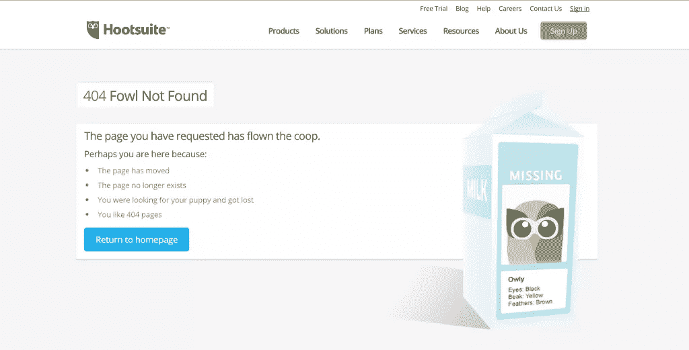
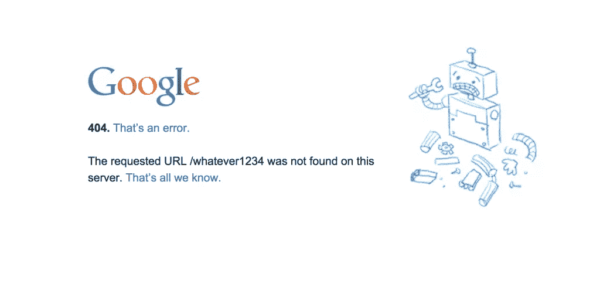
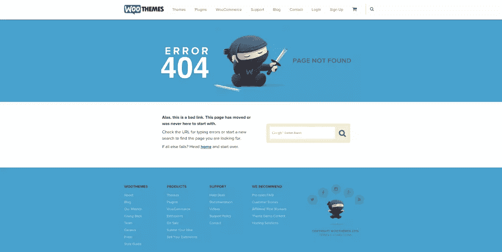
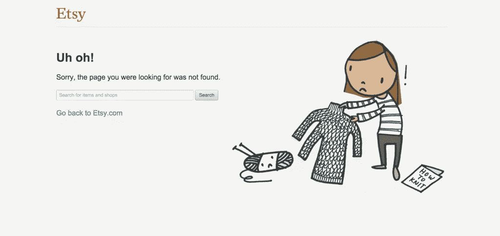
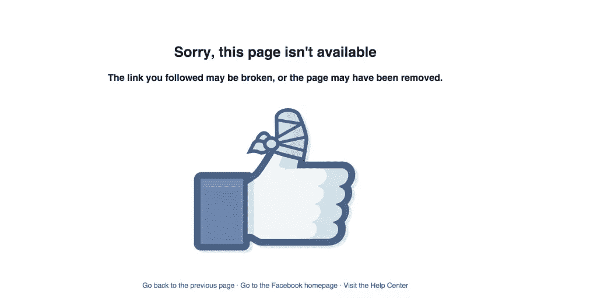
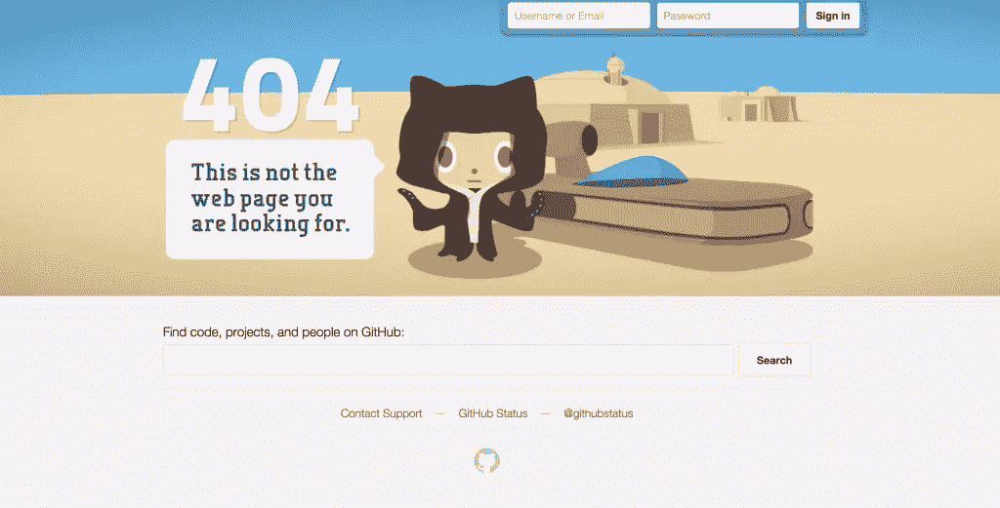

# 在 WordPress 中管理断开的链接和 404

> 原文：<https://www.sitepoint.com/managing-broken-links-404s-wordpress/>

断开的链接会造成糟糕的用户体验。谁想点击一个链接，却发现它无处可去？你们要读的那篇精彩的文章其实并不存在？

不幸的是，链路的自然衰退(也经常被称为 ***链路衰退*** )发生得太频繁了。链接腐烂发生的原因有很多:域名过期，网站被放弃，使用不正确的网址，以及网站使用新的网址进行重组。出站和入站链路都会发生这种情况。而且，即使最佳实践规定在网站重组的情况下使用 301 重定向，也不是每个人都设置它们。或者，如果有的话，它们通常设置不正确。

这不应该阻止你链接到其他网站。链接到其他网站是网络的一个重要组成部分。有些人倾向于认为链接到第三方网站会导致访问者离开他们的网站，减少他们的访问者统计，但链接正是网站设计的目的。你不应该害怕它，相反，你应该接受丰富你的内容所提供的价值。为你的访问者提供相关的内容或者一个给定主题的更深层次的探索是一个比把用户扔进死胡同更好的用户体验。这只是我的看法，我知道有不同的学校的思想当谈到出站链接的话题。

所以，如果你不能控制其他人的网站，你不应该停止链接到其他网站，那么你能做些什么来确保你没有把人送到不存在的页面呢？嗯，这真的很简单:你可以通过定期维护链接和检查你的出站链接来控制你自己的网站。

断链的管理是好的 WordPress 维护的一个组成部分。而且，多亏了大量的插件和工具，现在链接维护的自动化变得越来越容易了。所以，事不宜迟，让我们来看看其中的一些工具。

## 链接检查 WordPress 插件

### [断链检查器](https://wordpress.org/plugins/broken-link-checker/)

顾名思义，这个插件被设计用来检查你的 WordPress 网站上的所有内容(来自你的帖子和页面，以及评论)是否有断开的链接和丢失的图片。当你第一次在你的网站上安装这个插件时，它会检查你所有的链接。根据网站的大小，这可能需要一段时间。这个插件有很多配置选项，你可以通过你的 WordPress 仪表盘或电子邮件设置自动通知，甚至可以设置它以不同的方式显示断开的链接。它还可以防止搜索引擎跟踪您的网站上可能存在的任何断开的链接，这在您有大量用户生成的内容时非常方便。

一旦你安装并配置了这个插件，你可以在插件界面中管理任何断开的链接。你的 WordPress 仪表盘中的“断开的链接”标签将包含所有问题链接的列表。每个链接将有四个不同的可用选项:

*   **编辑 URL** :让你改变断开链接的 URL，包括整个网站的所有实例。这是一个非常方便的选项，可以用来纠正打字错误或小错误(比如使用。com 或. com.au)。
*   **解除链接**:这允许你在你的网站页面上留下网址，但是要去掉超链接(这样你的网站用户实际上就不能点击链接了)。
*   **未断开**:这允许您手动更改链接的分类。如果您知道某个链接实际上并没有断开，这将非常有帮助。例如，如果一个网站因为维护而暂时关闭，或者系统出现故障。
*   **解除**:这将从“断开的链接”标签中移除链接，并检查它是否正常。如果您想确认某个链接已断开，但暂时不做任何事情，可以使用它。

拥有超过 400，000 的活跃下载量(总计超过 320 万)，以及 4.1 星的评级，这是市场上最受欢迎的断开链接检查插件。

不过，根据一些用户的说法，这个插件可能会导致服务器端的高负载。事实上，WP Engine 把它放在了他们的[禁止插件](http://wpengine.com/support/disallowed-plugins/)列表中，因为它需要大量的 HTTP 请求。如果你检查这个，确保你正在监视你的服务器资源。

### [LinkPatrol](http://www.linkpatrolwp.com)

名单上的下一个，我们有 LinkPatrol，一个清理你的外发链接档案的插件。LinkPatrol 是由《搜索引擎杂志》的团队创建的，它基于一个简单的三步流程:

1.  **扫描**:插件会扫描你网站上的所有内容。这可能需要几秒钟才能完成，但一旦完成，您就不必再做了。该插件将自动扫描任何新创建的帖子和页面。
2.  **查看**:然后插件会给出一份关于你所有链接的报告，让你可以根据域名、作者甚至你使用过的锚文本进行排序。您甚至可以将报告导出为 CSV 文件。
3.  **采取行动**:根据你的综合报告中包含的信息，你可以快速、轻松地决定你需要做什么。例如，您可以从特定的域中删除或取消所有链接。选择真的非常多。

LinkPatrol 不是免费选项；有三种不同的价位:

*   blogger:50 美元的一次性费用，允许你在一个网站上使用插件，并附带一年的支持和更新
*   顾问:100 美元一次性费用，允许你在五个网站上使用插件，并附带一年的支持和更新
*   代理:200 美元的一次性费用，允许你在 20 个网站上使用插件，并附带一年的支持和更新

## 其他链接检查工具

当检查 WordPress 网站上的所有链接时，上面的两个插件是很好的选择，如果你不想安装额外的插件，还有很多独立的选项。所以，这里有一些链接检查工具，你可以在任何网站上使用。

### [谷歌搜索控制台(原谷歌站长工具)](https://www.google.com/webmasters/tools/)

谷歌自己提供了一个很好的工具来检查你网站上断开的链接:谷歌搜索控制台。谷歌搜索控制台是你可能已经知道的谷歌站长工具的新名称。谷歌搜索控制台非常容易使用，你所需要做的就是[登录你的谷歌账户，然后点击这里](https://www.google.com/webmasters/tools/)。在主页上，你会看到你的网站的仪表板。在“当前状态”标题下，您会看到一个名为“爬网错误”的部分。如果谷歌搜索你的网站时发现你有任何断开的链接，它们会显示在这里，这样就可以快速轻松地找到(然后修复)大多数断开的链接。

### [尖叫青蛙 SEO 蜘蛛](http://www.screamingfrog.co.uk/)

尖叫青蛙 SEO Spider(通常简称为尖叫青蛙)是一个流行的桌面蜘蛛/网络爬虫。因为它是一个桌面应用程序，你需要把程序直接下载到你的电脑上。然后它会抓取你网站的所有方面。然后，它将从用户和 SEO 的角度进行分析(顾名思义)。它使您能够快速方便地抓取、分析和审核您网站的内容，所有这些都是从 SEO 的角度来看的。它提供了详细的报告，您可以按照自己喜欢的任何方式对其进行分割。当然，它包括了大量关于断开链接的细节。

《尖叫的青蛙》有不同的版本，适用于 Windows、OS X 和 Linux:

*   标准/精简版:完全免费下载和使用。然而，它确实有一些局限性。在任何一个项目中，它只能抓取 500 个 URL，并且您不能完全访问配置选项。例如，你不能保存你的抓取。
*   个人许可证:每年花费 99 英镑，你可以增加赌注，获得配置的所有方面，并摆脱 500 个 URL 抓取的限制。作为一个长期客户，这是一个伟大的工具，我强烈推荐。

尖叫青蛙经常被用作断开链接检查器，提供详细的[用户说明](http://www.screamingfrog.co.uk/broken-link-checker/)如何单独使用它。

流行的尖叫青蛙也有一些竞争对手，其中一些是基于网络的应用程序，它们都有自己的优缺点。网络应用程序确实要多花一点钱，但是如果你需要一些体力来处理更大的项目，这是值得的。

*   [WildShark SEO Spider](http://www.wildshark.co.uk/seo-spider/) (目前仅适用于 Windows)
*   [Botify](https://www.botify.com/) (web app)
*   深度抓取(网络应用)

也有一些桌面工具专门用于链接检查，而不是上面列出的多用途 SEO 爬虫。我敢肯定还有更多，但这些似乎是我迄今为止遇到的最受欢迎的:

*   [Xenu 的链接侦探](http://home.snafu.de/tilman/xenulink.html)(仅限 Windows)
*   [完整性](http://peacockmedia.software/mac/integrity/)(仅限 OS X)

### [链接检查器](http://wummel.github.io/linkchecker/)

LinkChecker 是 GitHub 上的开源项目，值得一提。这是一个免费的网站验证器，支持递归网站抓取、cookies、链接检查限制和 URL 的正则表达式过滤器。考虑到它的技术性，如果你是 WordPress 初学者，那么它可能不适合你。对于高级用户或开发者来说，绝对值得一试。

## 404s–最后一招

有了市场上的所有这些工具，其中许多可以免费下载和使用，你的网站上没有理由出现断开的链接。但是，正如我前面提到的，你不能阻止人们在地址栏中输入的内容，或者人们用来链接到你的网站的内容。另外，我们都会犯错，对吧？所以知道这一点，至少确保你有一个辉煌的 404 错误页面设置在你的网站上。“404”是当一个页面找不到时收到的 HTTP 响应代码，这通常是一个平淡无奇的服务器默认错误消息。一个出色的 404 登陆页面将有助于获得网站用户的一点点原谅(或者至少你的用户有幽默感！).

在你的 WordPress 主题文件夹中，你可能会找到一个可以编辑的`404.php`模板，但是你需要检查你的主题设置和文档。你可以在 WordPress Codex 找到更多关于[如何处理 WordPress 404 页面的信息。你也可以修改你的网络服务器配置，比如你的`.htaccess`用 404 做一些有趣的事情。](https://codex.wordpress.org/Creating_an_Error_404_Page)

如果您正在寻找具有更多选项的产品，这里有一些用于监控和管理您的 404 的有用插件:

*   [404 页](https://wordpress.org/plugins/404page/)
*   [404 通知器](https://wordpress.org/plugins/404-notifier/)
*   [404 到 301](https://wordpress.org/plugins/404-to-301/)
*   [404 开始](https://wordpress.org/plugins/404-to-start/)
*   [重定向](https://wordpress.org/plugins/redirection/)

如果您在抑制错误，那么要格外小心，确保一切正常运行。重定向 404 可能是一把双刃剑，至少，确保您的日志记录错误，以便您知道什么时候出错。

我在下面列出了一些有趣的 404 页的例子，给你一些想法(你也可以[在这里](https://www.sitepoint.com/20-creative-unusual-404-pages/)和[这里](https://www.sitepoint.com/craft-perfect-404-page/)找到更多)。像往常一样，如果你知道任何其他有用的工具或技巧与这个话题有关，请随时将你的意见和建议写在下面。

* * *

* * *

* * *

* * *

* * *

* * *

## 分享这篇文章