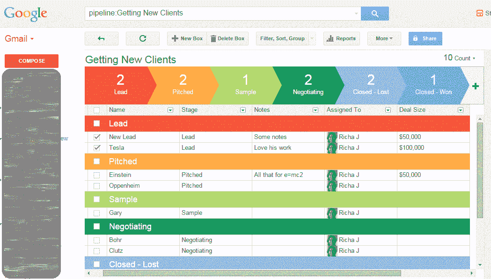
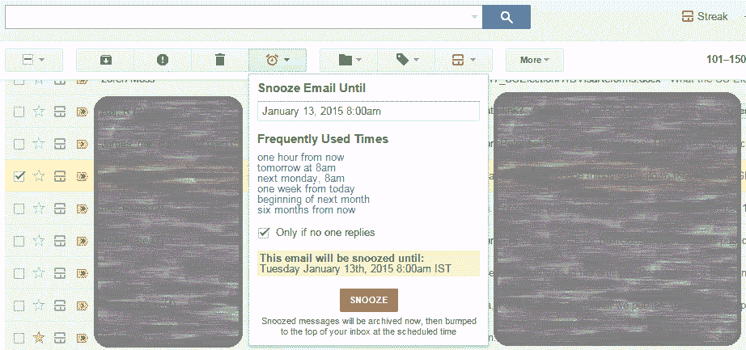
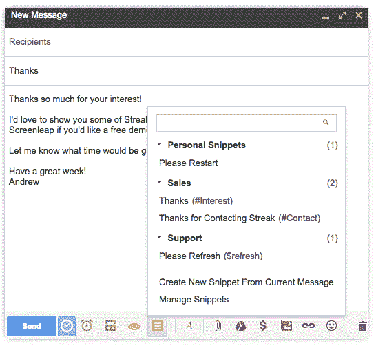
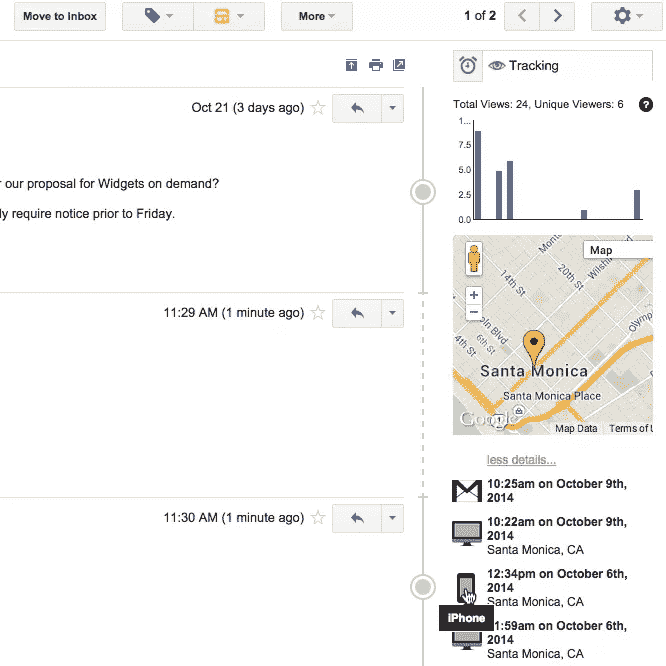
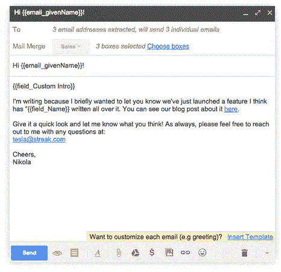

# 从您的收件箱开始管理潜在客户、客户和项目

> 原文：<https://www.sitepoint.com/managing-leads-clients-projects-with-streak/>

当你转行做一名自由职业者时，几乎每个人都会想到的一件事就是不得不自己管理一切。仅仅专注于你的手艺并为你的客户提供惊人的结果是不够的。你实际上必须先找到那些客户！

我以为我已经准备好了，毕竟，在我早期的工作中，我管理过多个项目和跨职能团队，有一百万件事情是悬而未决的。会有多难呢？

很快我发现自己很难跟上。开始的时候，我每天会寄出 10-15 封邮件，几天后我就失去了联系。

随着客户开始到来，我努力跟踪可交付成果。我曾希望自由职业会比我的公司工作压力更小，压力更小……事实并非如此。现在，我很难同时跟踪来自 4 个不同客户端的临时请求。那是一场噩梦。我花在跟踪推销和客户上的时间比我做实际工作的时间还多。有些事情必须改变！

> 我花在跟踪推销和客户上的时间比我做实际工作的时间还多。

我试图建立一个复杂的过滤和标签系统。那不太管用。我用 Excel 处理多个表格、过滤器等。那没用。我尝试了一些项目管理工具——我发现这毕竟只是项目管理。我试验了一些声称非常适合追踪自由职业者或小时工的应用程序和程序。它们还不够——它们有助于跟踪现有的工作，但无助于跟踪新的项目。此外，我讨厌把邮件地址和笔记从 Gmail 复制到这些应用程序中。

然后我偶然发现了 [Streak](https://www.streak.com) 。

冒着听起来像是我在他们的书上的风险，自从发现 Streak 以来，我已经成为一个冷静得多的人。我的收件箱不再乱七八糟。我确切地知道我有多少线索和项目在进行中，这周安排了多少可交付成果，以及每个项目处于哪个阶段。我觉得一切都在掌控之中。找到关于客户、推介或我的下一篇文章的信息要容易得多。但是我想得太多了。让我们再多谈谈 Streak。

## 什么是 Streak？

Streak 自称是一个在 Gmail 内部工作的 CRM 工具。尤其对于自由职业者来说，我们大部分的工作讨论和交易都是通过电子邮件进行的。将这些信息复制到另一个工具中进行跟踪和管理是一个没有人会喜欢的过程。它增加了那些讨厌的非计费时间。Streak 的目标是让你直接从 Gmail 收件箱中管理所有的邮件，只需最少的开销。对我来说，这是一个巨大的胜利。

## 使用 Streak 管理球场

也许其他 CRM 工具对我不太适用，因为我在销售漏斗中工作还是个新手。有了 Streak，我发现它很容易理解、设置和跟踪，因为它与 Gmail 配合得非常好。在 Streak 中，您设置管道来跟踪不同种类的进程。例如，推销和争取新客户可以成为你的销售渠道。你正在做的项目可能是另一个管道。对我来说——和许多其他人一样——推销和成交新客户的过程通常是这样的:

1.  投
2.  寄样品
3.  协商细节
4.  关闭

所以我在 Streak 中设置了一个简单的管道。当我获得一个新的销售线索时，我会创建一个“盒子”,里面有我目前掌握的该销售线索的详细信息。我可以设置它，以便所有进一步的电子邮件往来于这个新的线索将显示在这个框中。当我向这个线索发出第一个推介时，我只需将这个框标记为“已推介”,然后继续跟进，经历不同的阶段，直到我结束这个线索。顶部的彩色摘要栏让我可以快速查看我已经发送了多少个项目，以及它们的进度。最好的部分是界面非常容易学习。

本例显示了对 10 个潜在客户的跟踪:其中 2 个在我第一次推介后仍未回复我，1 个正在仔细考虑我发送的样本，我正在与另外 2 个潜在客户协商细节，并且我已经赢得了 1 个新客户。还要注意最右边的“交易规模”栏，这确实有助于跟踪哪些客户更有可能获得更好的回报。一旦我赢得了一个客户，我们已经记下了项目时间表，我就把盒子移到我的“预定项目”管道中。

## 管理客户和交付物

我已经开始使用类似的方法来跟踪我的可交付成果。与 Excel 或其他项目管理工具相比，我更喜欢它，因为它与 Gmail 配合得非常好。所有的信息，邮件线索和讨论都在一个地方。例如，对于我的写作工作，我建立了一个简单的管道，涵盖了推介->研究->草稿->写作->编辑->提交->出版->计费。

在每一个阶段，我只需点击一下就可以移动盒子。只需点击一下鼠标，我就可以轻松跟踪自己的工作量、日程安排和账单。同样，顶部丰富多彩的总结让我知道我有多少文章写作任务在进行中，这样我就可以避免过度安排。

## 忍者电子邮件工具

除了有助于工作流程的管道和盒子之外，Streak 还为你的标准 Gmail 添加了一些很好的电动工具。这比安装一堆插件或使用 Gmail 实验室工具要好。这里有一些我经常使用的:

*   **[贪睡](https://www.streak.com/email-snooze-in-gmail)** :我可能用得最多的工具就是贪睡按钮(是的，我的早晨闹钟也是一样！).当您想要跟进反馈或稍后回复邮件时，按下暂停按钮就像设置了一个提醒。Streak 会在预设时间自动将邮件弹出到收件箱的顶部。还有一个漂亮的选项——“只有在没有人回复的情况下”——这可以帮助你确保线索不会变冷。

    

*   **[片段](https://www.streak.com/canned-gmail-snippets)** :我下一个最常用的工具。如果有一封你经常发送的电子邮件，或者你经常在邮件中使用的几行文字，比如你的作品集或客户推荐的链接，你可以将它们保存为“片段”，并为它们设置一个快捷方式。当你写电子邮件时，只需输入快捷方式，你的摘录就会被粘贴进来。工具栏上靠近“发送”的位置还有一个“摘录”按钮。

*   **[邮件查看追踪](https://www.streak.com/email-tracking-in-gmail)** :当你已经使用 Gmail 和 Outlook 十年的时候，这个感觉有点像魔法。在电子邮件线程旁边的右侧栏中，您可以看到有多少收件人查看了您的邮件，以及查看时间。虽然我还没怎么用过它，但这是一个很好的方法来检查你发送的那些潜在客户是否真的打开了你的邮件。或者，如果你真的想让他们认真对待你(或者吓唬他们)，那就密切关注邮件跟踪器，一旦他们读了你的邮件，就给他们打电话。好吧，肯定先等一会儿。

*   **[邮件合并](https://www.streak.com/mail-merge-using-gmail)** :如果你需要发送一封邮件给很多人，这是很方便的，但也可以为每个人定制。也许你想宣布你的新个人网站，或者你是《企业家》的主角；邮件合并功能允许您创建一个邮件模板，并根据您已填充的字段(如客户名称、简介等)对其进行自定义。Streak 将它作为单独的电子邮件发送给每个收件人，而不是将它们打包成抄送或密件抄送。

这些只是我最喜欢的 Streak 电子邮件工具中的一些，但还有更多[供你探索自己](https://www.streak.com/)。

## 你还在等什么？

好吧，我知道我一直在说连胜有多棒，但这只是一个无负担的自由职业者的兴奋之情。如果你认为我上面概述的能帮你一把，那就开始吧，试试看。

有一个[免费计划让你开始](https://www.streak.com/pricing)，所以你不会有任何损失。准备好告别自由职业者的压力吧！

## 分享这篇文章