# 远程管理 WordPress 更新

> 原文：<https://www.sitepoint.com/managing-wordpress-updates-remotely/>

我们之前已经介绍过如何通过备份、优化、更新和使用集中的 WordPress 管理面板来维护 WordPress。

今天我们将更详细地看一些 WordPress 管理面板，看看它们如何帮助 WordPress 保持最新。

## 什么是集中的 WordPress 管理仪表板？

一个集中的 WordPress 管理面板允许你从一个单一的中央界面管理几个 WordPress 网站。你不必去每个 WordPress 网站的管理界面更新你的主题和插件，你可以从一个界面在你所有的 WordPress 网站上执行所有这些操作。

## 集中式仪表板如何与我的 WordPress 网站通信？

几乎所有的 WordPress 管理面板都要求你安装一个 WordPress 插件，并使用 API 密匙安全地读取你的 WordPress 主题和插件信息。这个相同的机制被用来告诉 WordPress 更新它的主题和插件。

我们今天要讨论的所有解决方案都使用这种方法进行通信:WP Remote、iThemes Sync 和 ManageWP。还有其他的，但这些是一些更受欢迎的选择。

### WP 遥控器

WP Remote 免费为无限数量的 WordPress 网站提供监控。

#### 登记

要注册 WP Remote，请访问 [WP Remote](https://wpremote.com) ，点击*添加你的第一个站点*选项。然后，输入您的姓名、电子邮件地址和密码:

#### 设置

一旦你注册了，你将自动被带到 WP 远程仪表板。在这里，让我们通过单击“添加站点”选项来添加我们的第一个站点:

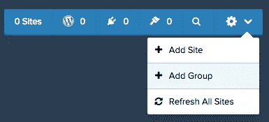

在出现的模式框中，输入网站的名称和 URL。
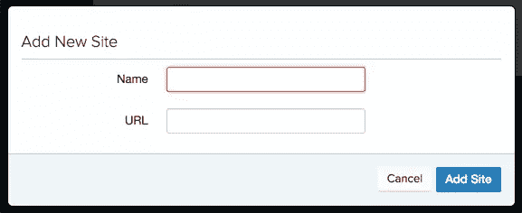

过一会儿，你会在屏幕上看到一些说明，包括如何在你的网站上安装 WP 远程 WordPress 插件。这允许 WP Remote 与您的网站通信，检查您的主题和插件的更新，并从中央仪表盘更新这些主题和插件。
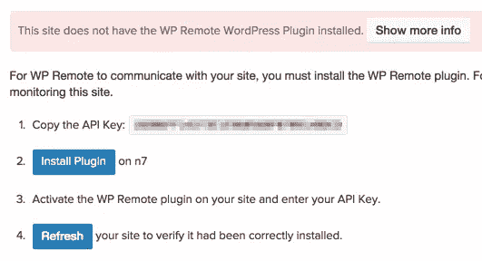

记下 API 密钥，然后单击“安装插件”按钮。

这将在一个新的浏览器窗口/标签中加载你的 WordPress 管理界面，你可以在那里登录。一旦登录，你会看到熟悉的*添加插件*屏幕，带有 WP 远程 WordPress 插件。点击*现在安装*按钮:

安装完成后，点击*激活插件*:

屏幕上会出现一个通知，要求您输入 API 密钥。如果您没有从 WP 远程仪表板复制它，请打开仪表板获取您的 API 密钥。

输入 API 密钥后，点击*保存 API 密钥*:

如果一切正常，你会在 WordPress:
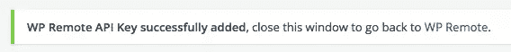看到一个成功通知

回到 WP Remote 仪表板，点击*刷新*按钮，这样 WP Remote 就可以开始管理你的 WordPress 网站了。

#### 更新

当你登录到你的 WP 远程仪表板，你将能够看到主题和插件更新的数量概览:
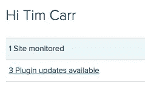

要更新您的主题或插件，请单击通知或更新选项卡。在这里，您有两种选择:

*   所有网站上的&主题:这是一个真正的一键选项，告诉 WP Remote 更新你所有 WordPress 网站上的所有主题和插件。
*   所有网站上的所有插件。这是一个点击选项，告诉 WP Remote 更新你所有 WordPress 网站上的所有插件。
    

要更新单个站点的主题或插件，请单击左侧边栏中的单个站点。

然后你会看到特定 WordPress 安装的主题和插件的更新列表，有更精细的控制来更新所有的主题，所有的插件或者单独的主题和插件。
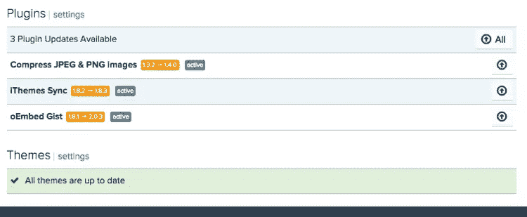

#### 利弊

优点:

*   简单、快速的注册流程
*   免费提供给无限数量的 WordPress 网站
*   一键更新所有网站的所有主题和插件

缺点:

*   一个漫长的过程来设置，虽然这只是一个网站一次
*   与同步相比，有时很难在侧边栏看到一个网站是否有任何更新

### 信息同步

iThemes Sync 为多达 10 个 WordPress 网站提供免费监控。可以购买额外的站点。

#### 登记

注册 iThemes Sync 需要几个步骤。

首先，访问 [iThemes Sync](https://ithemes.com/sync/) ，点击*免费管理 10 个站点！*按钮。
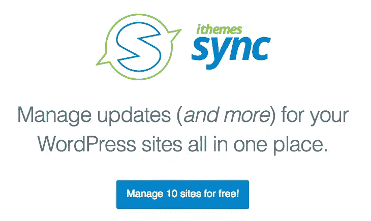

然后你会被带着通过一个结帐过程(但不要担心，没有什么要支付的)。点击 *Checkout* 按钮，然后输入您的详细信息，注册 iThemes 账户。

一旦完成，你会看到确认感谢您的付款(虽然没有什么可支付的，所以不要惊慌！).虽然你可以点击*登录*链接登录，但我发现这实际上并没有让你登录到 iThemes Sync，而是让你登录到你的帐户，在那里你可以看到你以前的订单。

相反，现在让我们导航到 [iThemes Sync Dashboard](https://sync.ithemes.com) ，在这里您可以使用结账过程中使用的用户名和密码登录:
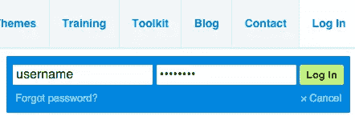

#### 设置

登录后，点击右上方的*添加站点*按钮:

输入你的 WordPress 站点地址，管理员用户名和密码，点击*添加站点*:

iThemes Sync 将尝试使用提供的详细信息登录，如果成功，将自动安装 iThemes Sync WordPress 插件，以便它可以与您的 WordPress 网站通信，远程更新其主题和插件。

#### 更新

通过使用屏幕上方的相应按钮，你可以查看 WordPress 网站的核心更新(WordPress 自身的更新)、插件更新、主题更新或所有更新。
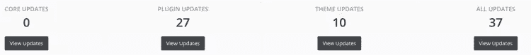

单击更新按钮，您可以查看将要执行的更新。默认情况下，所有站点的所有项目都被选中，因此如果您想更新所有内容，只需单击*更新选中的*按钮:

或者，选择要应用的更新，然后单击按钮。您可以使用此选项为每个站点选择更新，或者为特定的主题或插件选择更新。

iThemes Sync 的另一个特性是支持双因素认证(2FA)。出于安全考虑，这一点很重要，如果你的 iThemes Sync 用户名和密码被泄露，黑客就有可能管理你所有的 WordPress 网站(尽管他们只能执行更新)。

#### 利弊

优点:

*   快速建立一个新的网站-它将处理插件同步安装等。
*   多达 10 个 WordPress 站点免费
*   很容易看出哪些网站需要更新
*   双因素认证(SMS)

缺点:

*   注册过程有点混乱

### 管理工作

ManageWP 提供多达 5 个域的免费监控。

#### 登记

注册 ManageWP，访问[https://managewp.com](https://managewp.com)，点击*让我们开始*按钮。然后，输入您的姓名、电子邮件地址和密码:

#### 设置

注册后，您将自动进入 ManageWP 控制面板。从这里，让我们通过输入想要管理的 WordPress 网站的域名来添加我们的第一个站点。确保你也选择*是的，为我安装并激活工人插件。*选项，然后输入你的 WordPress 管理员用户名和密码:

注意:如果你已经用 HTTP 认证保护了你的 WordPress 管理登录，ManageWP 有一个非常有用的特性，你可以指定那些凭证。点击*高级*选项，输入附加登录详情:

#### 更新

当您登录到 ManageWP 仪表板时，您将能够在概览面板中看到主题和插件更新数量的概览:
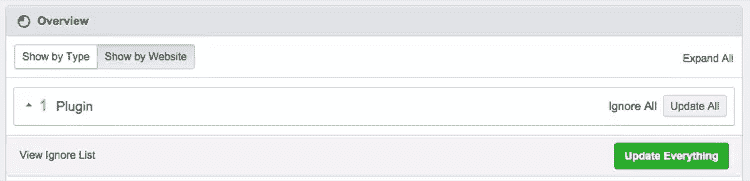

要更新你所有的主题和插件，点击*更新一切*按钮:

要查看特定站点的可用更新，请单击左侧边栏中的站点域。

然后，您可以使用总览面板来更新该特定站点的所有主题和插件:
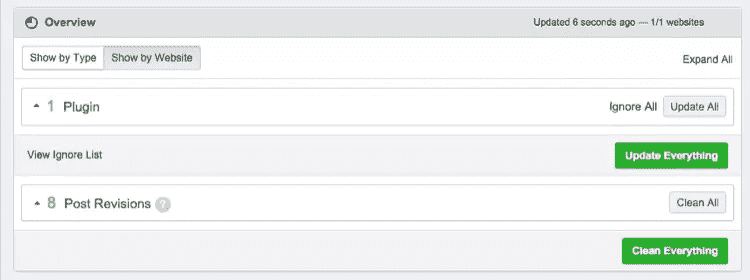

#### 利弊

优点:

*   简单、快速的注册流程
*   最多 5 个 WordPress 网站免费
*   支持 HTTP 身份验证
*   一键更新所有网站的所有主题和插件

缺点:

*   网站注册过程需要一个额外的步骤

## 结论

我们今天讨论的 WordPress 仪表盘都提供了一键插件和主题更新，使得管理 WordPress 变得轻而易举。

WP Remote 允许你管理无限数量的 WordPress 网站，但是需要一个手动过程来设置 WordPress 插件以连接每个网站到 WP Remote。

iThemes Sync 为多达 10 个 WordPress 网站提供支持。虽然最初的注册过程有几个步骤，但是将每个 WordPress 站点添加到 iThemes Sync 是很快的，WordPress 插件是由 iThemes 自动安装的。它的用户界面是最简单易用的界面之一，清晰地显示了可用的更新数量。

最后，ManageWP 提供了多达 5 个 WordPress 网站的支持。通过快速注册和 WordPress 网站设置过程，以及 HTTP 认证支持，它是那些想最快开始的人的理想选择。然而，UI 有时会令人困惑，因为它提供了大量的信息和选项。

## 分享这篇文章