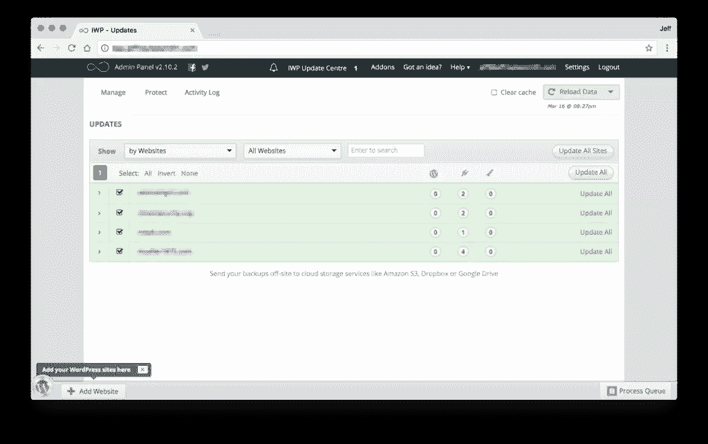
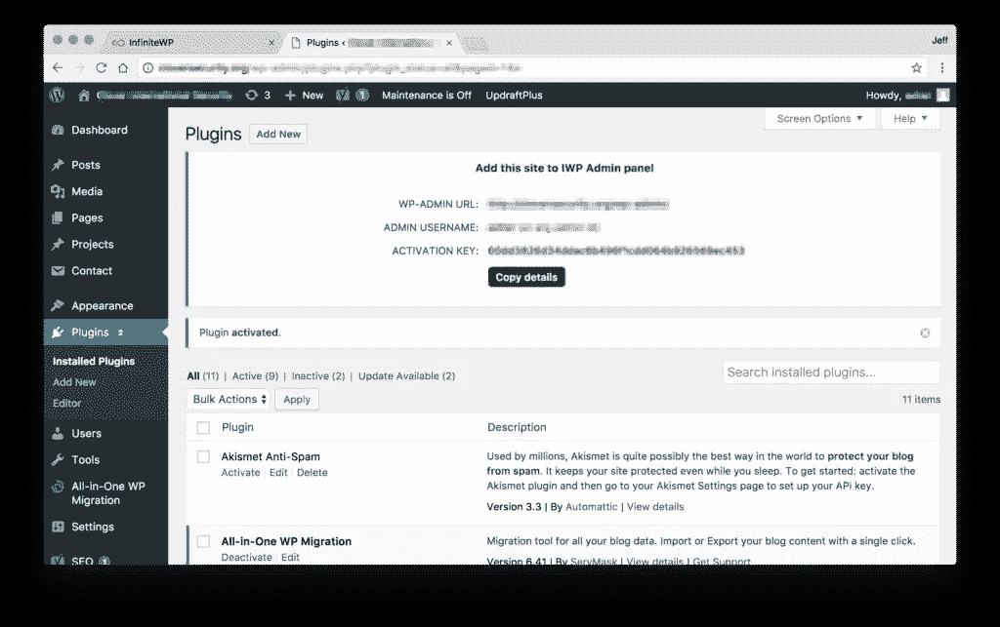
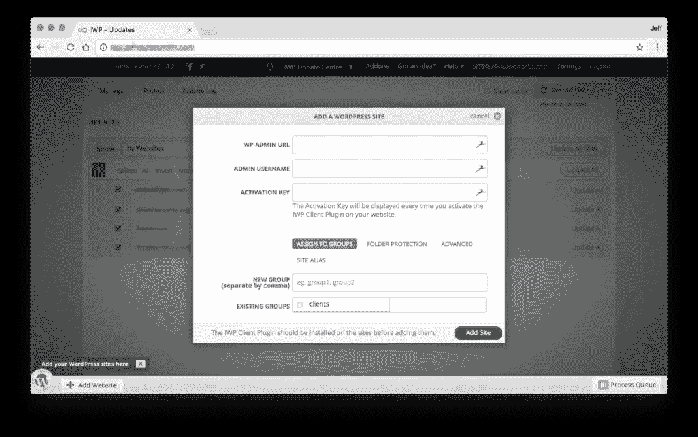
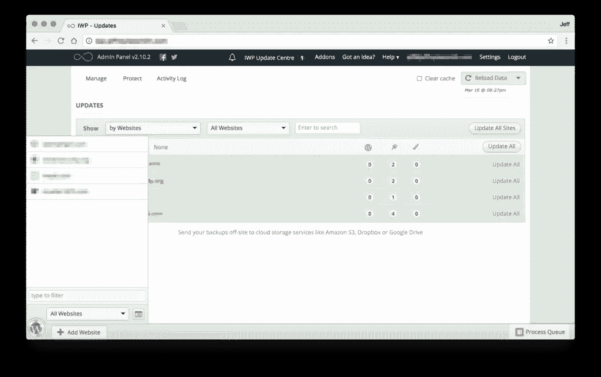
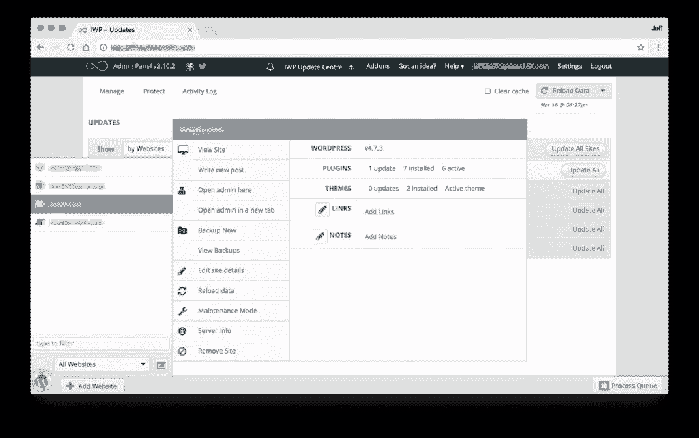
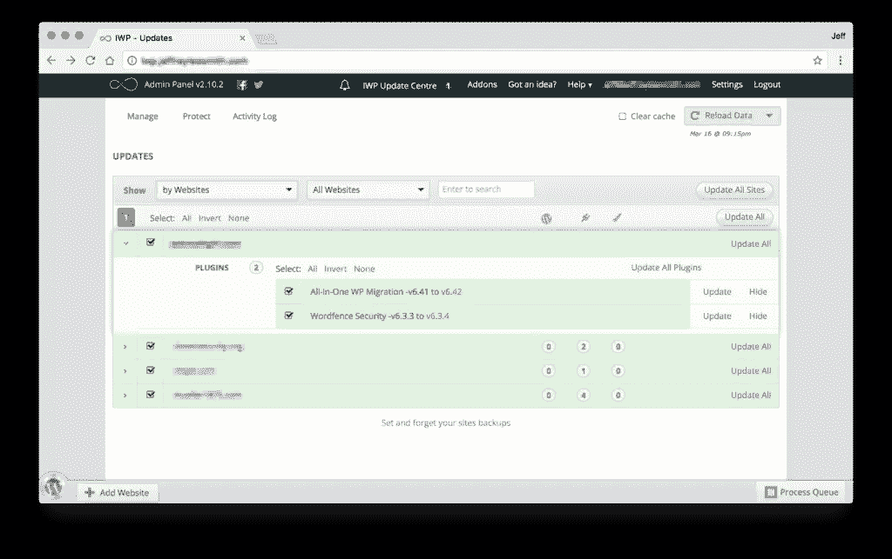
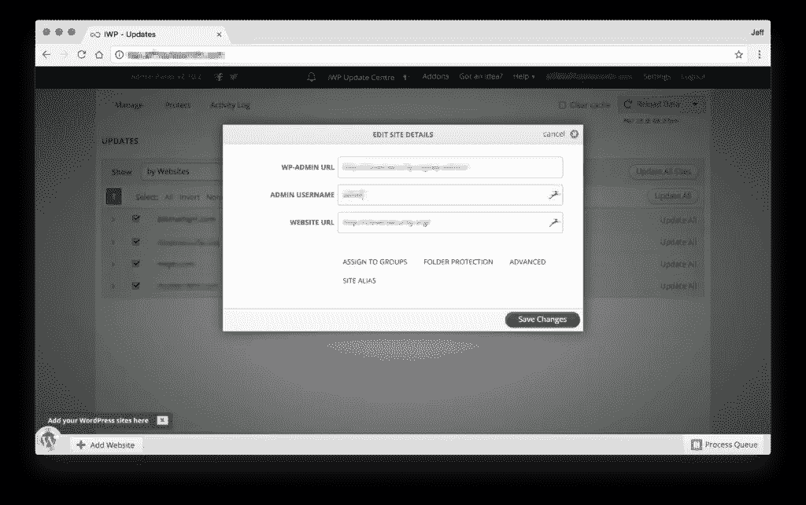

# 用 InfiniteWP 管理 WordPress 更新

> 原文：<https://www.sitepoint.com/managing-wordpress-updates-with-infinitewp/>

*本文是与 [SiteGround](https://www.siteground.com/go/infinitewp) 合作创作的系列文章的一部分。感谢您对使 SitePoint 成为可能的合作伙伴的支持。*

InfiniteWP 是一个管理面板，几乎可以轻松管理多个 WordPress 网站。

你为你的组织管理一个以上的 WordPress 网站吗？你是 WordPress 网站的宿主，还是为客户维护网站的开发者？如果是这样，这就是你的完美工具！

## 它解决什么问题？

*   **插件更新**——跟踪部署在你的 WordPress 站点上的每一个插件的无止境的安全更新、漏洞修复和新功能更新是非常乏味的，尤其是如果你有多个站点需要管理的话。这些插件更新可以通过点击 InfiniteWP 上的一个按钮来完成。
*   另外，WordPress 平台的更新也可以从这个中心位置进行。你熟悉新版本的变化吗？如果是这样，你可以很容易地更新你所有的网站。
*   主题更新–那些用于构建网站用户界面的主题(或父主题)的更新呢？这些也可以从管理面板更新，无论你是在多个网站上使用相同的主题，还是所有独特的主题。如果它在 WordPress 中是可更新的，那么使用 InfiniteWP 它也是可更新的。
*   **备份**-除了所有的更新功能，InfiniteWP 还允许您备份您附加的网站、文件和数据库。这使您可以放心地进行更新。有一些未测试的插件需要更新吗？首先备份网站！

## 设置 InfiniteWP

安装和设置可以通过以下三种方式之一完成:

1.  [通过 WordPress 插件安装](https://infinitewp.com/installing-options/)
2.  [通过 cPanel 安装](https://infinitewp.com/cpanel-installation/)
3.  [手动安装](https://support.infinitewp.com/support/solutions/articles/216109-how-to-install-the-admin-panel-manually)

这种选择的混合意味着无论你是在 cPanel 的共享主机上，在 VPS 上，还是在任何其他主机选项上，你都有可能找到满足你需求的解决方案，并部署 InfiniteWP 来管理你的 WordPress 站点！

## 在 InfiniteWP 上建立站点

一旦你安装了 InfiniteWP 并成功登录到管理面板，你会看到仪表板屏幕。

将网站连接到 InfiniteWP 仪表板的下一步是将 InfiniteWP 插件添加到你想用 InfiniteWP 管理的 WordPress 网站。你可以通过进入你的插件菜单，选择添加一个插件，然后搜索 InfiniteWP 来很容易地做到这一点。

一旦完成，插件被激活，你会在 WordPress 中看到一个警告面板，向你传达重要的 InfiniteWP 信息。

现在，回到 InfiniteWP 面板，点击左下角的“添加网站”按钮。这将把你带到一个新的网站表单。

您可以将网站信息粘贴到此表单中。现在你的 WordPress 网站已经连接到管理面板了！

检查连接轻而易举。你可以点击左下角的 WordPress 图标拉出网站抽屉。这将包含你链接到 InfiniteWP 管理面板的 WordPress 网站列表。

将鼠标悬停在列表中某个站点的名称上，旁边会弹出一个信息面板。在这里，你会看到几个链接。一个让你直接进入那个站点的 WordPress 管理面板，一个开始发帖，一个更新那个站点，等等。您也可以选择“重新加载数据”，并在管理面板右下角的进程队列中查看该操作的进度，以及它是成功还是失败。如果成功了，一切都很好！

## 运行更新或备份

使用 InfiniteWP 运行更新和备份轻而易举。您可以选择在特定站点上运行特定的更新，将它们作为组运行，或者运行所有可用的更新。

### 特定更新

特定的更新可以从管理面板的仪表板运行。您将看到一个列表，其中列出了需要您关注的网站更新。如果你点击一个，它会分解成一个必要的更新列表。

这使得从列表中挑选特定的更新变得容易，并且只对选定的站点进行那些更新，一次一个。

### 批量更新

您还可以批量更新——例如，如果您希望简单地更新每个站点上可以更新的所有内容，您只需点击仪表板上的“更新所有站点”, InfiniteWP 将尝试更新每个已连接站点的平台、插件和主题，并在进程队列中报告其成功或失败。

### 组

还可以将网站添加到组中，以便进一步细分您的托管站点。这可以通过进入抽屉，悬停在你的站点上，并选择“编辑站点细节”来完成。在此屏幕上，您会看到一个“分配到组”选项。

将网站分配到组后，您可以从仪表板中选择显示特定的组，而不是“所有网站”，然后使用“全部更新”来更新该特定组中的所有网站。

有很多原因让你希望有小组——这里有一些想法:

*   生产和分段组。如果您的网站管理规定您的每个站点都有临时环境，您可能希望先对临时环境进行批量更新，以确保更新没有兼容性或其他问题，然后再将相同的更新部署到生产站点。
*   项目类型是另一个可能有用的组。例如，区分你自己的项目和付费客户可能是有用的。
*   另一个有用的组可能是客户端类型。您可能有每月维护客户端、每季度维护客户端、只需要关键安全更新的客户端等。可能性是无限的！

## 设置

InfiniteWP 有几个不同的功能，可以在设置面板中自定义。

*   帐户设置允许您更改管理员电子邮件，并设置电子邮件通知(如果设置了 cron 作业)
*   应用程序设置包含请求限制、日志记录和基本应用程序级请求等内容
*   安全设置允许您锁定 InfiniteWP，只允许来自某些 IP 的访问，以及一些其他选项。
*   电子邮件设置允许您从管理面板设置警报和消息的电子邮件提供商。
*   Cron 设置允许您设置 cron 作业来按计划运行更新
*   最后，您也可以从应用程序更新设置中更新 InfiniteWP 应用程序本身

## 结论

当你在寻找一种简单的方法来管理多个 WordPress 安装时，看看 InfiniteWP。当你批量更新时，它会节省你大量的时间，你管理的站点越多，它就越有价值。你唯一需要投资的是开始时的一点点设置时间，然后你就可以开始更有效地管理你的 WordPress 多站点了！

或者，你可以让你的主机提供商负责 WordPress 的维护。SiteGround 提供自动 WordPress 核心和插件更新，以及自动每日备份。SiteGround 还会在每次自动更新前进行备份，并在更新后进行检查，这样，如果出现问题，您可以轻松恢复到最新的工作版本。

## 分享这篇文章