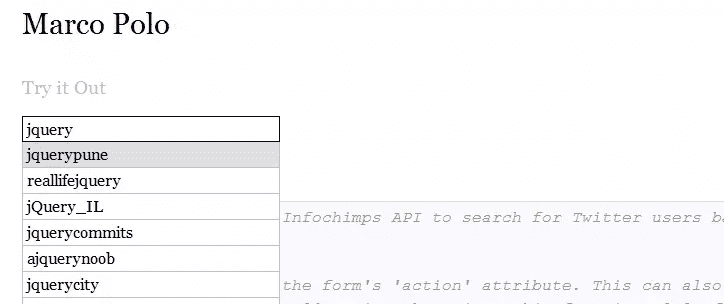

# 马可波罗，jQuery 自动完成插件

> 原文：<https://www.sitepoint.com/marco-polo/>

今天，我们有一篇贾斯汀·斯泰顿的客座博文。他谈到了他的新开发，包括 Marco Polo，一个 jQuery 自动完成插件和 Manifest，一个 jQuery 插件，增加了为输入选择多个值的乐趣。

让我给你搜索一下:“ [jQuery 自动完成插件](http://lmgtfy.com/?q=jQuery+autocomplete+plugin)”。在过去的四年里，我在谷歌上搜索过这个短语十几次。然而，结果并没有改变太多:有很多选项，但没有一个能激发我足够的信心，让我在制作 web 应用程序时有所依赖。

对于我选择的 jQuery 插件，我非常挑剔。如果我的用户对一个插件有问题，那是我的责任。我真的不想担心系统中的第三方代码，所以我开发了一个石蕊测试，jQuery 插件必须通过这个测试才能获得我的考虑。没有特定的顺序:该插件必须有良好的文档记录和代码注释，在过去六个月内进行了更新，有很少(如果有的话)的已知问题，遵循现代 jQuery 编码模式，并且足够灵活，能够满足我 80%的需求，没有无数我永远不会使用的附加功能。我在过去四年中尝试过的 jQuery 自动完成插件都没有通过这个测试。

## 马可·波罗




所以，我决定自己写。来认识一下[马可波罗](https://github.com/jstayton/jquery-marcopolo)，一个为有眼光的开发者设计的 jQuery 自动完成插件。我想你会喜欢它的，特别是如果你像我一样在选择 jQuery 插件时有选择性的话。但是，不要只相信我的话:使用[实例](http://jstayton.github.com/jquery-marcopolo/)，通读文档，并尝试在您自己的系统中实现马可波罗。这里有一个如何做到这一点的快速概述。

[演示](http://justinstayton.com/jquery-marcopolo/)

## 入门指南

首先，确保 jQuery 和 Marco Polo 都包含在 HTML 中:

接下来，添加一个文本输入，如果您还没有:

```
<input type="text" name="userSearch" id="userSearch"> 
```

然后将马可波罗附加到 JavaScript 中的文本输入中:

```
$('#userSearch').marcoPolo({
  url: '/users/search',
  formatItem: function (data, $item) {
    return data.first_name + ' ' + data.last_name;
  },
  onSelect: function (data, $item) {
    window.location = data.profile_url;
  }
}); 
```

当一个搜索发生时，一个 GET 请求被发送到 *url* ，其中 *q* (搜索值)被添加到查询字符串中。假设搜索的是*巴特勒*。向 */users/search 发出 GET 请求？q =巴特勒*。然后，您的后端代码必须使用 *q* 参数来查找并返回 JSON 格式的匹配用户:

```
[
  {
    first_name: 'James',
    last_name: 'Butler',
    profile_url: '/users/78749',
    …
  },
  {
    first_name: 'Win',
    last_name: 'Butler',
    profile_url: '/users/41480',
    …
  },
  …
] 
```

每个 JSON 用户对象都被传递给 *formatItem* 回调选项，以便显示在结果列表中。当用户从结果列表中被选中时，他们的 JSON 对象被传递给 *onSelect* 回调选项以完成浏览器重定向。

就是这样！虽然这个例子演示了一些基本概念，但可能性远远超出了这里所示的简单的*搜索、点击、重定向*设置。亲自尝试一下，我想你会对马可波罗的灵活性感到惊讶。

## 显示

一个 jQuery 插件，增加了为一个输入选择多个值的乐趣。电子邮件应用程序中的收件人字段就是一个完美的例子。您可以只提供一个纯文本输入，要求用户用逗号手动分隔每个收件人。然而，删除收件人是一件痛苦的事情:用户必须精确地选择适量的文本，确保不要意外地删除太多或太少。作为一个有眼光的开发者，你知道用户体验应该更好。这是可能的。
[德莫斯](http://justinstayton.com/jquery-manifest/)

## 关于作者

Justin Stayton 是德克萨斯州奥斯汀 Monk Development 公司的首席开发人员。你可以在 [GitHub](https://github.com/jstayton) 和 [Twitter@jstayton](https://www.twitter.com/jstayton) 上找到他。

## 分享这篇文章