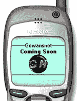

# WML(无线标记语言) :简介

> 原文：<https://www.sitepoint.com/markup-language-introduction/>

WML(无线标记语言)是在手机上制作网站的新网络语言。在过去的几个月里，新的 WAP(无线应用协议)手机变得非常流行，许多大型网站已经创建了他们网站的特殊“移动”版本。许多人预测，在接下来的几年里，WAP 网站将会变得非常流行，通过手机进行电子商务将会得到广泛应用。

##### 我为什么要使用 WML？

尽管你可能没有立即创建 WAP 版网站的计划，但涉足新技术总是一个好主意。你所需要做的就是做一个小网站(甚至是一页),让人们了解你的网站。将来，你可以进一步开发网站，为人们提供电子邮件和信息，让他们可以直接通过手机访问。

将从 WAP 中受益的主要网站是那些提供电子邮件、实况体育比分或日历服务等服务的网站。但是还有很多其他的用途。例如，一个提供音乐评论的网站可以把他们的评论放在 WAP 网站上。人们可以在商店浏览 CD 时，在手机上阅读评论。

##### 我没有 WAP 电话！

要创建 WAP 网站，您不需要支持 WAP 的电话。你可以得到一个适用于个人电脑的 WAP 模拟器。这是一个能让你在桌面上使用 WAP 电话的软件。然后你可以输入 WAP 网站的网址，然后在你的电脑上查看。你可以从 YourWAP.com 得到一个非常好的免费 WAP 模拟器

##### WAP 网站与普通网站相比如何？

WAP 网站一点也不像标准的网站。举个例子，你正在看 Gowansnet 网站的一部分。


正如你所看到的，用 WML 编写的网站是单色的，非常有限，屏幕空间非常小。因此，当你设计一个 WAP 网站时，你必须非常小心，因为它一点也不像一个网站。

##### 现在怎么办？

请继续阅读，了解如何使用 WML 创建 WAP 网站。如果你知道 HTML，这是一个很大的优势，因为 WML 很像它(事实上，WML 只是另一种网络语言 XML 的变体)。

##### 创建您的第一个 WAP 网站！

让我们直接进入如何创建一个网站。注意，HTML 的工作知识是有用的，你真的应该有一个 WAP 电话或 WAP 模拟器来查看你的网站。

##### 查找 WML 主机

遗憾的是，WML 不能在所有 web 主机上运行。要运行 WML 内容，web 主机必须对其 web 服务器的配置进行一些更改。

##### 声明 WML 文档

当你创建一个 WML 文档时，你所需要的只是一个记事本，就像 HTML 一样。你应该输入的第一件事是:

**T2？xml version="1.0 "?> <！DOCTYPE WML PUBLIC "-//WAP forum//DTD WML 1.1//EN " " http://www . WAP forum . org/DTD/WML _ 1.1 . XML "><WML>**

这告诉手机它正在解释一个 WML 文件，以及它正在使用的 WML 标准。

##### 卡片

WAP 网站没有页面，而是有卡片。这些是在任何时候显示在屏幕上的内容，就像一页纸一样。每个 WML 文档中可以插入多张卡片。要声明卡，请插入以下内容:

**<卡 id="index" title= "我的 WAP 站点" newcontext="true" >**

这将制作一张带有 ID 索引(用于链接)的卡片，并将显示文本:

```
My WAP Site
```

在屏幕的顶部。

##### 结束标签

与 HTML 不同，结束 WML 标签极其重要。如果你不这样做，一个网页肯定不会工作。您必须关闭<card>和<wml>标签:</wml></card>

**</卡>
< /wml >**

现在，我将向您展示如何插入文本以及如何设置文本格式。

##### 

标签

就像在 HTML 中一样,

标签用来显示段落的开始和结束。与 HTML 不同的是，WML 页面上的所有文本都必须包含在这些标签中。也不允许嵌套这些标签。关于 WML 要记住的一件重要的事情是，不像 HTML 那样，即使有错误的代码，页面仍然会显示，WAP 电话只会拒绝有它不理解的代码的页面。

与 HTML 一样，您可以按如下方式使用标签:

**< p >
信息
/p>**

##### 对齐文本

在 WML 中对齐文本几乎和在 HTML 中完全一样，除了不能使用 center 标签。必须使用以下

标签进行所有校准:

中心:
`<p align="center">`

右:
`<p align="right">`

##### 
标签

在 WML 中(如前所述),所有标签都必须关闭。这在使用没有结束标签的旧 HTML 标签(如
)时会产生问题。为了解决这个问题，一些标签在末尾加了一个/

```
<br/>
```

这就像在 HTML 中一样，会造成换行。

##### 文本

在 WML 中实际上没有字体标签(因为你只能用手机默认的黑色字体显示文本)。要显示文本，你需要做的就是把它放在

和

标签之间。下面是一个完整的 WML 文档示例:

**<？xml version="1.0 "?>T12！DOCTYPE WML PUBLIC "-//WAP forum//DTD WML 1.1//EN " " http://www . WAP forum . org/DTD/WML _ 1.1 . XML ">
<WML>
<card id = " index " title = "我的 WAP 站点" new context = " true ">
<p align = " center ">
欢迎来到我的新 WAP 站点。您可以在世界任何地方通过手机查看这些内容！<br/>简直太神奇了！
</p>
</卡>
< /wml >**

##### 超链接+图像

现在，我将向您展示如何通过添加额外的部分、链接到它们(和其他网站)以及如何向您的网站添加图像来使这一点变得更好。

##### 更多卡片

WAP 网站有卡片而不是页面。除了它们都可以被写入一个文件之外，它们实际上和页面是一样的。要添加另一张卡，您需要做的就是放入另一个 ID 不同的<card>标签。例如:</card>

**<卡 title= "关于我" id= "关于">
信息
</卡>**

将被添加到第一张卡片的下方，但在标签之前。

##### 连接

有三种方法链接到另一个 WAP 网站、文件或卡。就像在 HTML 中一样，这些既可以是文件的完整路径，也可以是相对链接。

要链接到 WAP 网站，您可以使用以下内容:

```
<a href="http://gowansnet.waphosts.net/">Gowansnet</a>
```

在你的短信里。要链接到您站点上的另一个文件，您可以使用:

```
<a href="links.wml">My Links</a>
```

要链接到您使用的同一页面中的另一张卡片:

```
<a href="#about">About Me</a>
```

##### 形象

不幸的是，由于 WAP 手机只有单色屏幕，图像在 WML 页面上不能很好地工作。他们也使用自己的图像格式:WBMP。当你创建一个图片在你的网站上使用时，你需要把它做得小一些(手机屏幕大约是 100×50 像素)。

将图像转换为 WBMP 格式的最简单的方法是将其创建为 GIF 或 JPG(如果你愿意，它可以是彩色的)，然后访问该网站将其转换为单色(黑白)WBMP 图像，然后你可以将它放在你的网站上。

WML 中的图像是使用标签插入的，就像在 HTML 中一样:

****

同样，您可以看到在结尾添加了一个/这是非常重要的，你也包括替代文本，因为它将显示图像下载。

##### 示例站点

下面是一个小型 WAP 网站的 WML 示例代码。它有两张卡片、一张图片和一个外部网站链接:

**<？xml version="1.0 "?>T25！DOCTYPE WML PUBLIC "-//WAP forum//DTD WML 1.1//EN " " http://www . WAP forum . org/DTD/WML _ 1.1 . XML ">
<WML>
<card id = " index " title = "我的 WAP 站点" new context = " true ">
<p align = " center ">
欢迎来到我的新 WAP 站点。您可以在世界任何地方通过手机查看这些内容！<br/>

</p>
<p>
下面是一些链接:<br/>
<a href = " # About ">关于我</a><br/>
<a href = " http 你不能在这里写太多，尽管因为没有太多的空间，你当然可以向下滚动屏幕。
</p>
<p align = " center ">
<a href = " # index ">Back</a>
</p>
</卡>
< /wml >**

##### 接下来呢？

如果你想了解更多关于 WML 和 WAP 标准的信息，你可以访问位于[www.wapforum.com](http://www.wapforum.com)的 WAP 论坛

## 分享这篇文章