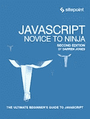
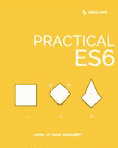
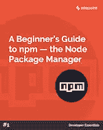
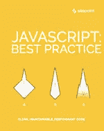
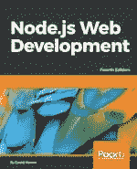
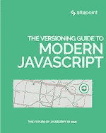

# 使用这个精选的阅读列表掌握现代 JavaScript

> 原文：<https://www.sitepoint.com/master-modern-javascript-with-this-curated-reading-list/>

你被 JavaScript 生态系统的复杂性吓倒了吗？你还在写 ES5，但是在找机会拥抱现代标准吗？或者，你是否被框架和构建工具的爆炸所迷惑，不确定先学什么？别担心，这里是我从 SitePoint Premium 精选的书籍，旨在帮助你在掌握现代 JavaScript 的道路上走得更好。

## JavaScript:忍者新手，第二版

我把这本书放在我清单的首位，因为它对几乎每个人都有意义。它从覆盖基础知识开始(因此很适合作为案头参考)，然后继续处理更高级的主题，如测试和函数式编程。

第二版已经过更新，涵盖了 ECMAScript 6，并且很好地向您介绍了它更常见的特性。在每一章的结尾，你还可以将你新学到的知识付诸实践，你可以开发一个测验应用程序，在阅读全书的过程中添加一些功能。我真的很喜欢这种基于项目的学习方法，并且认为这是提高编程技能的较好方法之一。

对于那些只想浅尝辄止的人，我推荐阅读[现代 JavaScript 开发](https://www.sitepoint.com/premium/books/javascript-novice-to-ninja-2nd-edition/?bookmark=div%5Bid%3D%27reeedr%27%5D%20%3E%20div%5Bid%3D%27reeedr-body%27%5D%20%3E%20div%3Anth-of-type(16)%20%3E%20p%3Anth-of-type(1)&from=mailer&utm_source=blog&utm_medium=SPnext&utm_campaign=24jul2019)章节。这将为您带来许多最新的发展，例如使用模块，以及如何和为什么转换您的代码。

➤ [读过书](https://www.sitepoint.com/premium/books/javascript-novice-to-ninja-2nd-edition/)

## 实用 ES6

这本选集从*新手到忍者*离开的地方开始，并允许你更深入地研究 JavaScript 语言的许多新增加的内容。它涵盖了许多基本语法(例如，常量、let、[箭头函数](https://www.sitepoint.com/javascript-arrow-functions/)等)，并提供了一种在特定领域提高速度的好方法。

还有关于 ES6 类和 ES6 模块等主题的更深入的文章，以及对 ES2017 和 ES2018 中出现的内容的了解。如果您开始对所有这些版本号的含义感到困惑，我们可以帮您解决。选集里有一章讲述了 JavaScript 版本控制和决定语言中加入什么的过程。

➤ [读过书](https://www.sitepoint.com/premium/books/practical-es6/)

## npm 初学者指南——节点包管理器

npm 是 JavaScript 的包管理器，类似于 PHP 的 composer，或者 Perl 的 CPAN。它允许你搜索软件包的在线数据库(也叫注册表)并把它们安装到你的机器上。npm 注册中心非常庞大——包含超过 600，000 个包——我认为公平地说，它彻底改变了 JavaScript 开发人员相互协作的方式。

这本来自我们的*开发者基础*系列的短文已经上榜，因为如果你在 2019 年认真编写 JavaScript，npm 是你不能忽视的东西。该指南将引导您完成 npm 的安装和配置(有时可能有点棘手),并在日常工作中有效地使用它。如果你打算在 2019 年只学习一个 JavaScript 工具，那就让它成为 npm。你会在任何地方的教程中遇到它，它是几乎所有现代 JavaScript 库的标准交付机制。

➤ [读过书](https://www.sitepoint.com/premium/books/a-beginner-s-guide-to-npm-the-node-package-manager/)

## JavaScript:最佳实践

现在我们已经了解了基础知识，是时候用一些 JavaScript 最佳实践来提升一下了。这本选集充满了帮助您编写高性能、可维护和可重用的现代 JavaScript 的提示和技巧。很难从这么多伟大的标题中挑出最喜欢的，但有两篇文章脱颖而出。

**剖析现代 JavaScript 应用**让我们看看如何在 2019 年构建一个 JavaScript 应用。它涵盖了从应用程序架构到部署的所有内容，并将帮助您整理您可能听说过的许多概念和术语。

**现代 JavaScript 中的流控制**向您介绍了在现代代码库中处理异步 JavaScript 的各种策略。它着眼于我最喜欢的语言新增功能之一——async await——并打破了编写 JavaScript web 应用程序会自动将您带入回调地狱的神话。

➤ [读过书](https://www.sitepoint.com/premium/books/javascript-best-practice/)

## Node.js Web 开发，第四版

如果不了解如何在服务器上运行现代 JavaScript，那么这个旅程就不完整。这本书为您提供了一个很好的起点，直接带您进入使用 Node.js 开发 web 应用程序的核心。

随着您的继续，您将构建并迭代笔记应用程序。这将为学习实时应用程序、数据存储、用户认证、Docker 部署等等奠定基础。即使你不喜欢服务器端开发，我仍然推荐你阅读前几章。这些将让您很好地了解 Node 在当今 JavaScript 环境中的位置。

➤ [读过书](https://www.sitepoint.com/premium/books/node-js-web-development-fourth-edition/)

## 现代 JavaScript 版本指南

最后，我们有了现代 JavaScript 版本指南，这是一个很大的链接集合，来自于被错过的版本时事通讯。我之所以包括这一点，是因为现代 JavaScript 开发领域发生了太多的事情，以至于我在这里只能触及皮毛。我相信这个指南会给你提供大量的想法和灵感，让你知道下一步该做什么。

➤ [读过书](https://www.sitepoint.com/premium/books/the-versioning-guide-to-modern-javascript/)

就这样结束了。我希望这个精选的列表能够帮助您在现代 JavaScript 开发的波涛汹涌的水域中航行。

## 分享这篇文章