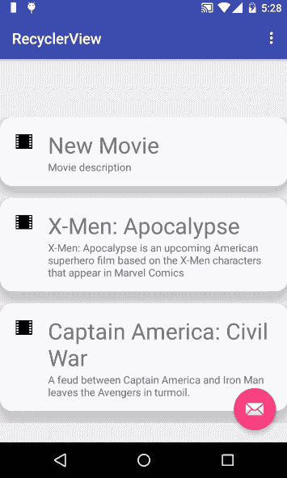
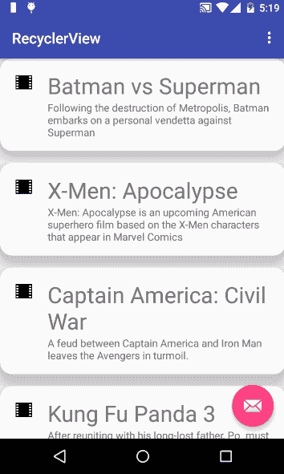
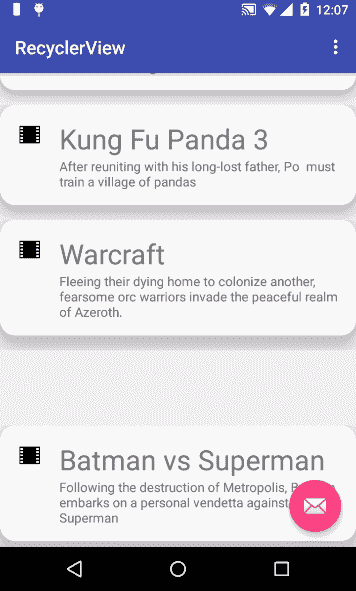

# 使用 Android RecyclerView 控制复杂列表

> 原文：<https://www.sitepoint.com/mastering-complex-lists-with-the-android-recyclerview/>

*本文更新于 2017 年 2 月 1 日，针对 Android 7.1 (API 等级 25)*

关于 Android 的更多信息，请观看我们的教程[将数据输出到你的 Android 应用程序的用户界面](https://www.sitepoint.com/premium/screencasts/outputting-data-to-your-android-app-s-user-interface)。

在 Android 5.0 Lollipop 中引入了 Google 的材质设计。

如果你正在开始 Android 开发，或者已经是一个有经验的开发者，那么`RecyclerView`是值得研究的东西。

视图回收的想法从版本 1 开始就以`ListView`的形式存在于 Android 中。这个想法很简单:通过回收和重新绑定这些视图，使用一个小的视图集合来呈现一个大的数据集合。

与`ListView`和`GridView`相比，`RecyclerView`是一种更加灵活的视图回收模式。`RecyclerView`与其前身的区别在于它只关注视图回收。创建视图所需的所有其他操作，如如何呈现数据集或放大视图，都委托给了可插入类，这就是它如此灵活的原因。困难的部分是设置这些类来创建一个全功能的`RecyclerView`，这也是我将在本文中讨论的内容。

要使用`RecyclerView`,您需要遵循以下步骤:

1.  添加支持库
2.  在布局 XML 文件中添加`RecyclerView`
3.  创建自定义行布局
4.  创建`RecyclerView.Adapter`以将数据填充到`RecyclerView`中
5.  创建`ViewHolder`为每个数据项提供视图引用
6.  将`Adapter`绑定到`Activity`中的`RecyclerView`

让我们从`RecyclerView`开始，你可以在 [GitHub](https://github.com/sitepoint-editors/Recycler-View-Example/tree/master/RecyclerView) 上找到最终项目的代码。

## 添加依赖关系

打开 *build.gradle (app)* 添加需要的依赖项。

```
dependencies {
    ...    
    compile 'com.android.support:cardview-v7:25.1.0'
    compile 'com.android.support:recyclerview-v7:25.1.0'
}
```

同步梯度和你都设置好了。

## 将 RecyclerView 添加到布局文件中

```
<RelativeLayout
...    
<android.support.v7.widget.RecyclerView
    xmlns:android="http://schemas.android.com/apk/res/android"
    android:id="@+id/recyclerview"
    android:layout_width="match_parent"
    android:layout_height="match_parent"/>

</RelativeLayout>
```

## 创建自定义行布局

行布局表示 RecyclerView 中显示的每个单个元素的布局。

创建一个名为 *row_layout.xml* 的文件，并向其中添加以下内容:

```
<android.support.v7.widget.CardView xmlns:android="http://schemas.android.com/apk/res/android"
    xmlns:app="http://schemas.android.com/apk/res-auto"
    android:id="@+id/cardView"
    android:layout_width="match_parent"
    android:layout_height="wrap_content"
    android:layout_marginBottom="@dimen/activity_vertical_margin"
    android:clickable="true"
    android:focusable="true"
    android:foreground="?android:attr/selectableItemBackground"
    app:cardCornerRadius="@dimen/activity_vertical_margin"
    app:cardElevation="@dimen/activity_vertical_margin">

    <RelativeLayout
        android:layout_width="match_parent"
        android:layout_height="wrap_content"
        android:padding="16dp">

        <ImageView
            android:id="@+id/imageView"
            android:layout_width="wrap_content"
            android:layout_height="wrap_content"
            android:layout_alignParentLeft="true"
            android:layout_alignParentTop="true"
            android:layout_marginRight="16dp" />

        <TextView
            android:id="@+id/title"
            android:layout_width="wrap_content"
            android:layout_height="wrap_content"
            android:layout_alignParentTop="true"
            android:layout_toRightOf="@+id/imageView"
            android:text="Title"
            android:textSize="30sp" />

        <TextView
            android:id="@+id/description"
            android:layout_width="wrap_content"
            android:layout_height="wrap_content"
            android:layout_below="@+id/title"
            android:layout_toRightOf="@+id/imageView"
            android:text="Description" />

    </RelativeLayout>

</android.support.v7.widget.CardView>
```

这里只需注意:当您创建 RecyclerView 的项目布局时，不要忘记在布局的 ViewGroup 容器中添加以下行。这几行代码将为 RecyclerView 元素添加涟漪效应。

```
 android:clickable="true"
    android:focusable="true"
    android:foreground="?android:attr/selectableItemBackground"
```

`RecyclerView`将是一个随机选择的电影列表和一个描述。我们需要一个表示单个`RecyclerView`项数据的类，创建一个名为【Data.java】T2 的文件，并添加以下内容:

```
public class Data {
    public String title;
    public String description;
    public int imageId;

    Data(String title, String description, int imageId) {
        this.title = title;
        this.description = description;
        this.imageId = imageId;
    }

}
```

## RecyclerView 适配器

`RecyclerView.Adapter`类似于`ListView`上使用的适配器，但需要一个`ViewHolder`来提高性能。一个`ListView`有不同来源的适配器，比如用于数组的`ArrayAdapter`和用于数据库结果的`CursorAdapter`。`RecyclerView.Adapter`需要一个定制的实现来向适配器提供数据。

适配器有三种方法。

*   `onCreateViewHolder()`放大行布局并初始化视图容器。一旦视图持有者被初始化，它就管理`findViewById()`方法，找到视图一次并回收它们以避免重复调用。
*   `onBindViewHolder()`使用在`onCreateViewHolder()`方法中构造的视图保持器用数据填充`RecyclerView`的当前行。

使用以下类创建一个名为*Recycler _ View _ adapter . Java*的新文件:

```
public class Recycler_View_Adapter extends RecyclerView.Adapter<View_Holder> {

    List<Data> list = Collections.emptyList();
    Context context;

    public Recycler_View_Adapter(List<Data> list, Context context) {
        this.list = list;
        this.context = context;
    }

    @Override
    public View_Holder onCreateViewHolder(ViewGroup parent, int viewType) {
        //Inflate the layout, initialize the View Holder
        View v = LayoutInflater.from(parent.getContext()).inflate(R.layout.row_layout, parent, false);
        View_Holder holder = new View_Holder(v);
        return holder;

    }

    @Override
    public void onBindViewHolder(View_Holder holder, int position) {

        //Use the provided View Holder on the onCreateViewHolder method to populate the current row on the RecyclerView
        holder.title.setText(list.get(position).title);
        holder.description.setText(list.get(position).description);
        holder.imageView.setImageResource(list.get(position).imageId);

        //animate(holder);

    }

    @Override
    public int getItemCount() {
        //returns the number of elements the RecyclerView will display
        return list.size();
    }

    @Override
    public void onAttachedToRecyclerView(RecyclerView recyclerView) {
        super.onAttachedToRecyclerView(recyclerView);
    }

    // Insert a new item to the RecyclerView on a predefined position
    public void insert(int position, Data data) {
        list.add(position, data);
        notifyItemInserted(position);
    }

    // Remove a RecyclerView item containing a specified Data object
    public void remove(Data data) {
        int position = list.indexOf(data);
        list.remove(position);
        notifyItemRemoved(position);
    }

}
```

## 创建视图保持器

`RecyclerView`使用一个`ViewHolder`来存储对`RecyclerView`中一个条目的相关视图的引用。这个解决方案避免了在适配器中调用所有的`findViewById()`方法来寻找要填充数据的视图。

使用以下类创建一个名为 *View_Holder.java* 的文件:

```
public class View_Holder extends RecyclerView.ViewHolder {

   CardView cv;
   TextView title;
   TextView description;
   ImageView imageView;

   View_Holder(View itemView) {
       super(itemView);
       cv = (CardView) itemView.findViewById(R.id.cardView);
       title = (TextView) itemView.findViewById(R.id.title);
       description = (TextView) itemView.findViewById(R.id.description);
       imageView = (ImageView) itemView.findViewById(R.id.imageView);
   }
}
```

## 布局经理

布局管理器实时附加、测量和布局`RecyclerView`的所有子视图。当用户滚动视图时，布局管理器确定何时添加新的子视图，以及何时分离和删除旧的子视图。

这些默认实现是可用的:

*   `LinearLayoutManager`–在垂直或水平滚动列表中显示项目。
*   `GridLayoutManager`–在网格中显示项目。
*   `StaggeredGridLayoutManager`–在交错网格中显示项目。

您可以通过扩展`RecyclerView.LayoutManager`或上面的一个实现并覆盖所需的方法来创建一个定制的`LayoutManager`。

现在`RecyclerView`已经完成，下一步是用一些数据填充它。在`MainActivity`类的`onCreate()`方法中，创建一个`Recycler_View_Adapter`的实例，并给这个适配器数据列表和上下文。`getApplication()`方法将提供应用程序上下文。

```
List<Data> data = fill_with_data();

RecyclerView recyclerView = (RecyclerView) findViewById(R.id.recyclerview);
Recycler_View_Adapter adapter = new Recycler_View_Adapter(data, getApplication());
recyclerView.setAdapter(adapter);
recyclerView.setLayoutManager(new LinearLayoutManager(this));
```

我们还需要样本数据，对于这个例子，我已经创建了一个默认的功能，在一个真正的应用程序，这可能来自一个数据源。

```
public List<Data> fill_with_data() {

    List<Data> data = new ArrayList<>();

    data.add(new Data("Batman vs Superman", "Following the destruction of Metropolis, Batman embarks on a personal vendetta against Superman ", R.drawable.ic_action_movie));
    data.add(new Data("X-Men: Apocalypse", "X-Men: Apocalypse is an upcoming American superhero film based on the X-Men characters that appear in Marvel Comics ", R.drawable.ic_action_movie));
    data.add(new Data("Captain America: Civil War", "A feud between Captain America and Iron Man leaves the Avengers in turmoil.  ", R.drawable.ic_action_movie));
    data.add(new Data("Kung Fu Panda 3", "After reuniting with his long-lost father, Po  must train a village of pandas", R.drawable.ic_action_movie));
    data.add(new Data("Warcraft", "Fleeing their dying home to colonize another, fearsome orc warriors invade the peaceful realm of Azeroth. ", R.drawable.ic_action_movie));
    data.add(new Data("Alice in Wonderland", "Alice in Wonderland: Through the Looking Glass ", R.drawable.ic_action_movie));

    return data;
}
```

你可以在这里找到上面提到的[按钮的图标文件。](https://github.com/sitepoint-editors/Recycler-View-Example/tree/master/RecyclerView/app/src/main/res)

这就完成了设置 RecyclerView 的所有步骤。

## 用 ItemAnimator 制作回收动画

到目前为止，我已经解释了创建你自己的`RecyclerView`所需要的一切，并且解释了`RecyclerView`结构的每一部分是做什么的。现在让我们用物品动画让事情变得更有趣。

`RecyclerView.ItemAnimator`是一个类，它定义了在项目上执行的动画，并将通知适配器的`ViewGroup`更改(如添加/删除/选择)制作成动画。`DefaultItemAnimator`是`RecyclerView`默认可用的基本动画。

要定制`DefaultItemAnimator`，给`RecyclerView`添加一个项目动画。这段代码减缓了在`RecyclerView`中添加和删除项目的过程。

在`onCreate`方法的最后一段代码后添加:

```
RecyclerView.ItemAnimator itemAnimator = new DefaultItemAnimator();
itemAnimator.setAddDuration(1000);
itemAnimator.setRemoveDuration(1000);
recyclerView.setItemAnimator(itemAnimator);
```





另一种制作`RecyclerView`项目动画的方法是使用 Android 插值器。根据[developer.android.com](http://developer.android.com/reference/android/view/animation/Interpolator.html)的说法，一个插值器定义了一个动画的变化率。

下面的例子代表了我用这些插值器实现的两个动画。将文件保存在项目资源文件夹的 */anim/* 中。

*prevent _ overshoot _ interpolator . XML*

```
<?xml version="1.0" encoding="utf-8"?>
<set xmlns:android="http://schemas.android.com/apk/res/android"
   android:interpolator="@android:anim/anticipate_overshoot_interpolator">
   <translate
       android:fromYDelta="-50%p"
       android:toYDelta="0"
       android:duration="2000"
       />
</set>
```

*bounce_interpolator.xml*

```
<?xml version="1.0" encoding="utf-8"?>
<set xmlns:android="http://schemas.android.com/apk/res/android"
   android:interpolator="@android:anim/bounce_interpolator">
   <translate
       android:duration="1500"
       android:fromYDelta="-150%p"
       android:toYDelta="0"
       />
</set>
```

现在让我们回到`RecyclerView`。在`RecyclerView`适配器类中添加以下函数。

```
public void animate(RecyclerView.ViewHolder viewHolder) {
   final Animation animAnticipateOvershoot = AnimationUtils.loadAnimation(context, R.anim.bounce_interpolator);
   viewHolder.itemView.setAnimation(animAnticipateOvershoot);
}
```

如果你仔细看看`loadAnimation()`方法，它需要一个上下文参数，这就是为什么适配器的构造函数首先被修改了。现在我们可以制作`RecyclerView`的动画了。在`onBindViewHolder()`方法中，调用`animate()`函数并传递`View_Holder`类的 holder 参数。

运行应用程序并测试动画。下面是`bounce_interpolator`动画的工作原理。



接下来让我们测试一下`anticipate_overshoot_interpolator`动画，但是首先我会在主活动的`onCreate()`方法中将`RecyclerView`的布局管理器设置为`StaggeredGrid`，具有 2 列跨度和垂直滚动。

```
recyclerView.setLayoutManager(new StaggeredGridLayoutManager(2,StaggeredGridLayoutManager.VERTICAL));
```


在`RecyclerView`中使用这种动画方法很容易。如果你想要新的动画，只需改变上面例子中的插值类型，根据你的喜好设置参数，你就会有一个新的动画风格。

## 将`onItemClickListener`项设置为`RecyclerView`项有问题？

尽管在性能方面，在`RecyclerView`中显示元素比它的前辈`ListView`和`GridView`要好。这些视图能够添加项目点击监听器来拦截列表中哪个元素被点击了。
这是它在`ListView`上的样子:

```
ListView listView = ...;
listView.setOnItemClickListener(new AdapterView.OnItemClickListener() {
    @Override
    public void onItemClick(AdapterView<?> parent, View view, int position, long id) {

    }
});
```

不幸的是，对于`RecyclerView` s 来说没有这样的事情，但是下面的解决方案可能会提供一个解决方案。

克里特岛的一个 Java `interface`如下。

```
public interface RecyclerViewItemClickListener {
    public void onClick(View view, int position);

    public void onLongClick(View view, int position);
}
```

正如你从这个`interface`中看到的，这个想法是为`RecyclerView` s 项目的`onClick`和`onLongClick`提供一个类似于`ListView`的解决方案。

为了检测被点击的`RecyclerView`的项目，我们需要一个助手类。

```
public class CustomRVItemTouchListener implements RecyclerView.OnItemTouchListener {

    //GestureDetector to intercept touch events
    GestureDetector gestureDetector;
    private RecyclerViewItemClickListener clickListener;

    public CustomRVItemTouchListener(Context context, final RecyclerView recyclerView, final RecyclerViewItemClickListener clickListener) {
        this.clickListener = clickListener;
        gestureDetector = new GestureDetector(context, new GestureDetector.SimpleOnGestureListener() {

            @Override
            public boolean onSingleTapUp(MotionEvent e) {
                return true;
            }

            @Override
            public void onLongPress(MotionEvent e) {
                //find the long pressed view
                View child = recyclerView.findChildViewUnder(e.getX(), e.getY());
                if (child != null && clickListener != null) {
                    clickListener.onLongClick(child, recyclerView.getChildLayoutPosition(child));
                }
            }
        });
    }

    @Override
    public boolean onInterceptTouchEvent(RecyclerView recyclerView, MotionEvent e) {

        View child = recyclerView.findChildViewUnder(e.getX(), e.getY());
        if (child != null && clickListener != null && gestureDetector.onTouchEvent(e)) {
            clickListener.onClick(child, recyclerView.getChildLayoutPosition(child));
        }
        return false;
    }

    @Override
    public void onTouchEvent(RecyclerView rv, MotionEvent e) {

    }

    @Override
    public void onRequestDisallowInterceptTouchEvent(boolean disallowIntercept) {

    }
}
```

基本上这个类所做的是，检测屏幕被点击的(X，Y)位置下的`RecyclerView`元素。这个类对界面创建的两种点击类型都有帮助。

最后，这里展示了这个新的点击监听器是如何为`RecyclerView`实现的。

```
recyclerView.addOnItemTouchListener(new CustomRVItemTouchListener(this, recyclerView, new RecyclerViewItemClickListener() {
    @Override
    public void onClick(View view, int position) {

    }

    @Override
    public void onLongClick(View view, int position) {

    }
}));
```

如您所见，自定义触摸监听器提供了被点击的`RecyclerView`项的引用及其在列表中的位置。

## 结论

`RecyclerView`是一种灵活的视图回收模式，通过使项目动画易于设置和重用，消除了对`ListView`和`GridView`的模仿。开始时，习惯使用`RecyclerView`进行开发可能需要一些工作，但这是值得的。

*如果您有任何问题或意见，请在下面*告诉我。

关于 Android 的更多信息，请观看我们的教程[将数据输出到你的 Android 应用程序的用户界面](https://www.sitepoint.com/premium/screencasts/outputting-data-to-your-android-app-s-user-interface)。

## 分享这篇文章