# 在 Photoshop 中掌握复杂选区

> 原文：<https://www.sitepoint.com/mastering-complex-selections-in-photoshop/>

能够有效地从背景中提取图像是任何设计师、摄影师或专业创意人员的基本技能。很多时候，当我们试图将一个主题从它的背景中分离出来时，我们会遇到独特的挑战。如果没有正确的技术，像对比度差或毛发形成的复杂形状这样的障碍几乎不可能完成这个过程。在第一部分[在 Photoshop](https://www.sitepoint.com/making-complex-selections-in-photoshop/ "Making Complex Selections in Photoshop") 中进行复杂选择中，我介绍了相当容易选择的对象，比如一个有几缕头发伸出来的女人，但是这次我们将介绍在 Photoshop 中进行更复杂的选择。

下面的例子图片可以在[这里](http://www.pixmac.com/picture/bedhead+cactus/000068819167)找到。用手去尝试和选择每一根单独的绳子将会是极其艰苦的，而且几乎是不可能的。你可能会花一整天的时间试图用套索工具来选择这种仙人掌，甚至用遮罩来显示每一根仙人掌都会产生很差的效果。手工制作每一缕面具需要几个小时。相反，选择快速选择工具，并通过在区域内单击和拖动来对对象进行宽松的选择。按住 Shift 键添加到选区，按住 Option/Alt 键从选区中减去。如果你发现做一个选择花费的时间太长，就像画笔工具一样，通过点击“**]”**键来增加快速选择工具的大小，直到你有一个合适大小的光标。点击**[**降低更多繁琐区域的尺寸。(如果你想了解更多有用的、节省时间的 Photoshop 按键，请查看 [30+节省时间的 Photoshop 键盘快捷键](https://www.sitepoint.com/keys-to-better-faster-photoshop-work-30-photoshop-keyboard-shortcuts/ "Keys To Better, Faster Photoshop Work: 30+ Time-​​Saving Photoshop Keyboard Shortcuts")。)

[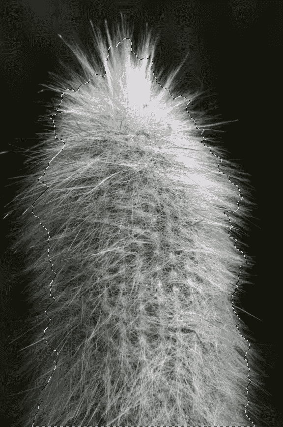](https://www.sitepoint.com/wp-content/uploads/2012/06/Picture-15.png)

从上图可以看出，选择非常宽松。选择处于活动状态时，转到选项栏并单击“优化边缘”。将出现“优化边缘”对话框，您可以在其中非常精确地优化和调整您的选择。点按“智能半径”选项以启用它，并将滑块移动到最右侧。在更坚实的物体上，使用这个的时候要小心，因为它会带走边缘周围与背景颜色混合的坚实的，连续的颜色区域。但是，这种设置非常适合纤细的头发或纤维。单击“净化颜色”,并将其滑块移动到最右侧。这将删除背景颜色可能在对象周围添加了不需要的细条纹的边缘。

[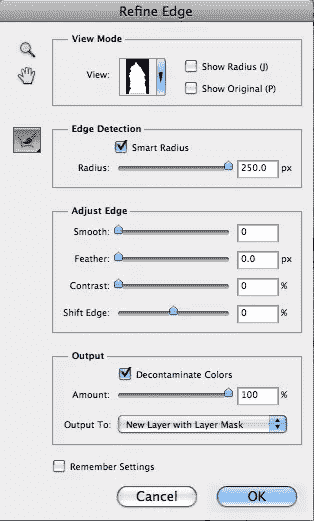](https://www.sitepoint.com/wp-content/uploads/2012/06/Picture-22.png)

你可以看到“细化边缘”菜单已经很好地提取了仙人掌周围的纤维边缘。按“F”键在视图之间切换，你可以看到选区的蒙版视图非常复杂和精确。

[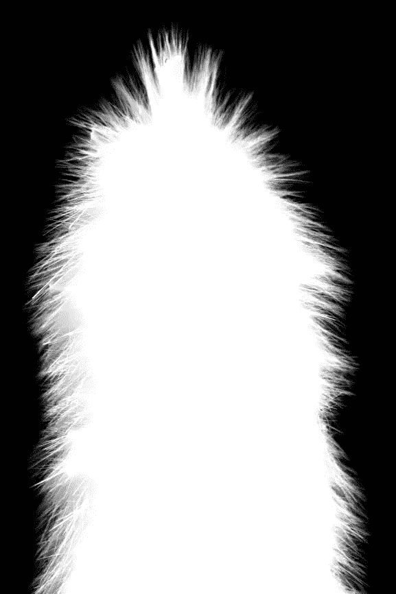](https://www.sitepoint.com/wp-content/uploads/2012/06/Picture-51.png)

使用图层蒙版选择输出到新图层。这将创建一个新的层以上的工作层为基础的面具，我们刚刚作出和完善。如果有任何问题领域，我们可以修复它们，但在这种情况下，我们没有任何问题。现在，你可以把你选择的对象放在任何你想要的东西上，没有颜色污染或任何其他问题。

[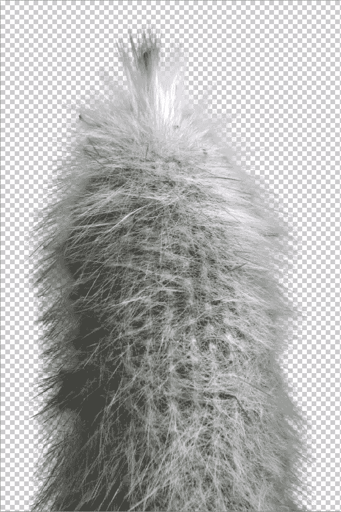](https://www.sitepoint.com/wp-content/uploads/2012/06/Picture-31.png)

模糊就像在原始图像中一样突出，但现在我们可以在对象后面滑动任何颜色或图像，并快速轻松地合成一个布局。下面，我添加了一个大胆的紫色，以显示这种选择技术的质量和精度。

[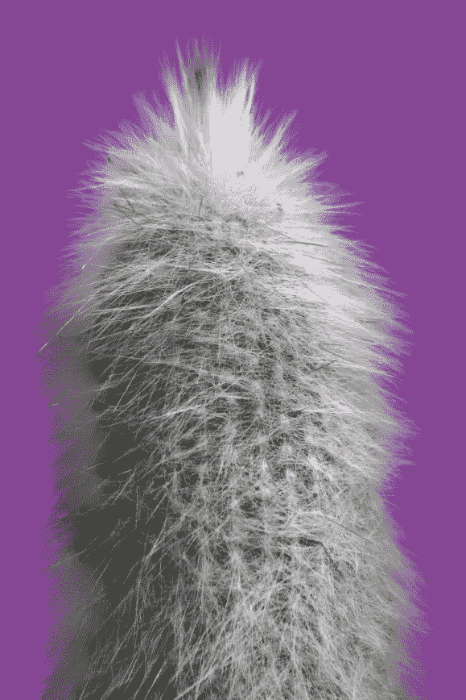](https://www.sitepoint.com/wp-content/uploads/2012/06/Picture-4.png)

下一个样本，你可以在这里下载，在主体和背景之间有相当大的对比度，但是皮毛又长又柔软，这几乎不可能用手来选择。选择快速选择工具，做一个宽松的选择，确保包括尽可能多的熊。

[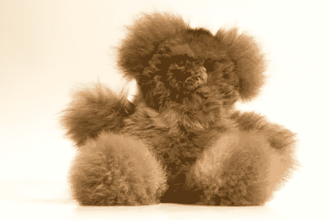](https://www.sitepoint.com/wp-content/uploads/2012/06/Screen-shot-2012-06-28-at-11.21.14-PM.png)

[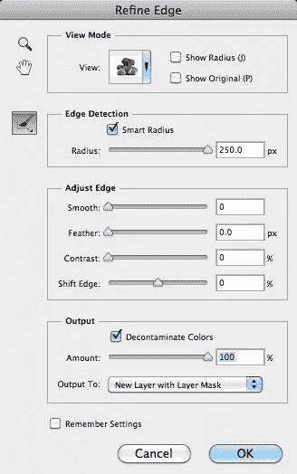](https://www.sitepoint.com/wp-content/uploads/2012/06/Screen-shot-2012-06-28-at-11.26.55-PM.png)

使用智能半径和去污颜色似乎可以瞬间完成，但在导出到新层之前，多次按“F”键来切换不同的背景以确保您没有错过任何东西总是一个好主意。下面的选择在白色上看起来不错…

[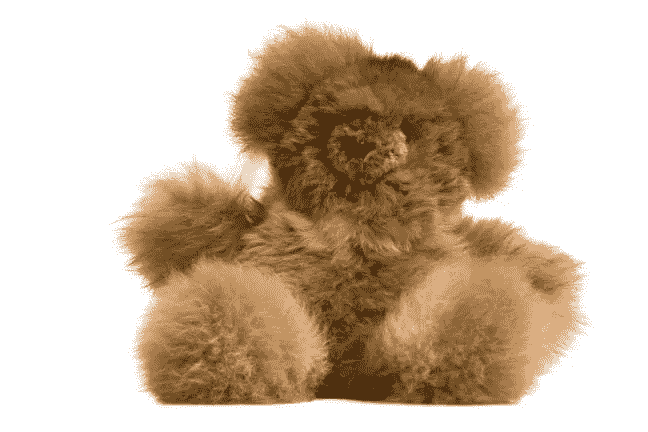](https://www.sitepoint.com/wp-content/uploads/2012/06/Screen-shot-2012-06-28-at-11.30.16-PM.png)

然而，当我们切换不同的视图时(使用“F”键)，当我们到达黑色背景时，我意识到我显然错过了一个点。注意头部左侧的白色区域。

[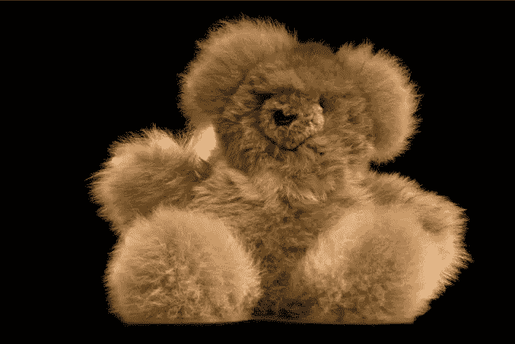](https://www.sitepoint.com/wp-content/uploads/2012/06/Screen-shot-2012-06-28-at-11.31.43-PM.png)

事实证明，笔刷工具不会移除这个区域。实际上，通过点击“取消”，然后按住 Alt/Option 键并使用快速选择工具单击以从选区中移除该区域，可以更快地退出“优化边缘”菜单。之后，我重新进入细化边缘菜单，使用智能半径和净化颜色选项，并导出图像到自己的图层与图层蒙版。结果如下。请注意，在熊的周围不再有白色的残余。

[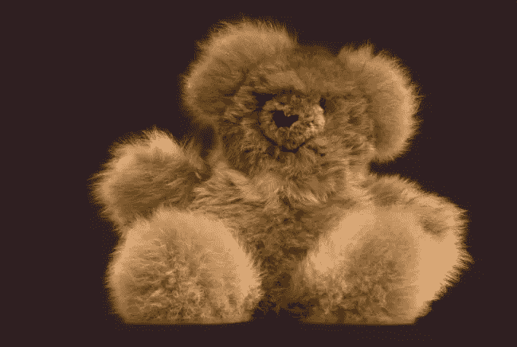](https://www.sitepoint.com/wp-content/uploads/2012/06/Screen-shot-2012-06-28-at-11.37.52-PM.png)

下一个例子更具挑战性，因为存在由水引起的背景干扰。你可以在这里找到样图[。就像之前的图像一样，使用快速选择工具进行粗略选择。](http://www.pixmac.com/picture/woman/000083320309)

[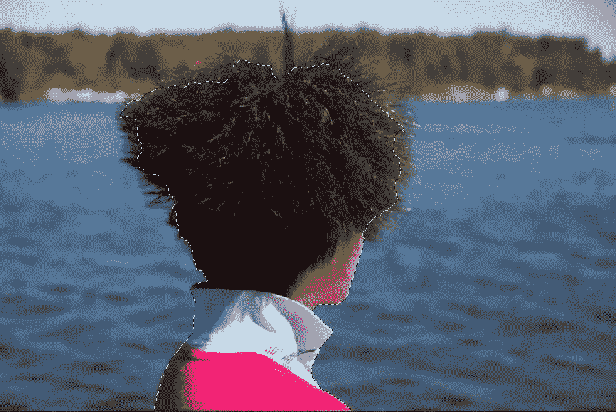](https://www.sitepoint.com/wp-content/uploads/2012/06/Screen-shot-2012-06-28-at-9.45.39-PM.png)

这个选择的困难之处在于，女人的头发在末端羽化，深色的羽毛末端融入背景中的树叶，使得精确的选择几乎不可能。单击选项栏中的“优化边缘”以打开“优化边缘”对话框。正是在这里，我们将结束我们的大部分改进。检查智能半径，并将滑块移动到最右侧。然后，单击净化颜色，并将滑块移动到最右侧。在下拉菜单中，选择图层蒙版新建图层，但是不要点击确定，因为我们的选择还没有达到预期的效果。你可以看到，它需要通过切换不同的视图(使用“F”键)，直到你的图像被放置在白色背景上，更完善。

[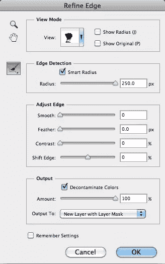](https://www.sitepoint.com/wp-content/uploads/2012/06/Screen-shot-2012-06-28-at-9.57.34-PM.png)

[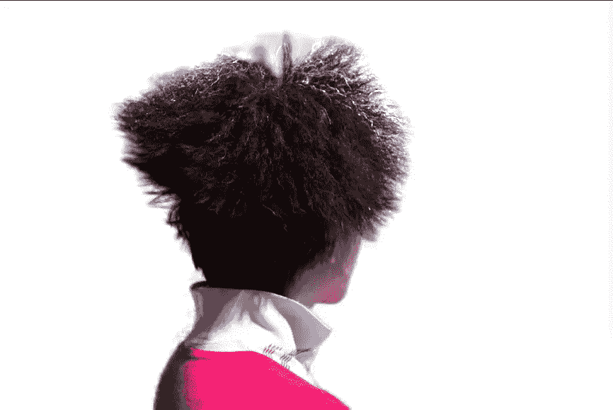](https://www.sitepoint.com/wp-content/uploads/2012/06/Screen-shot-2012-06-28-at-10.05.33-PM.png)

问题是顶部区域——头发与图像其余部分融合的地方——有很多额外的颜色信息。这不是一个干净的选择，因为它可以。

[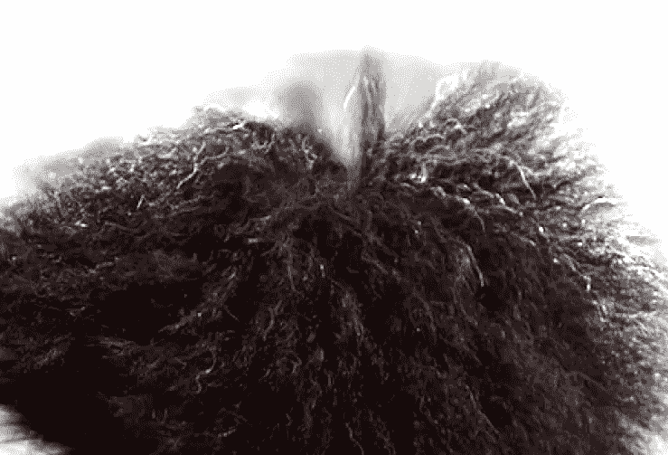](https://www.sitepoint.com/wp-content/uploads/2012/06/Screen-shot-2012-06-28-at-10.07.52-PM.png)

这个问题可以通过“优化边缘”对话框区域中的画笔工具来解决。您可以使用几种方法之一来操作您的选择。第一个选项是简单地单击应该包含在蒙版中的区域。Photoshop 将对选区重新取样，并尝试将其添加到原始选区。头发内的灰色区域需要去除；这是不需要包含在选择中的颜色信息。按住 Alt/Option 并在这些区域上单击会导致 Photoshop 重新计算选区，并从结果中删除这些不需要的灰色区域。按住 Alt/Option 键的同时，在笔直竖起的发束左右的灰色区域中进行两次恰当的单击，可以在这些区域中做出更好的选择。

[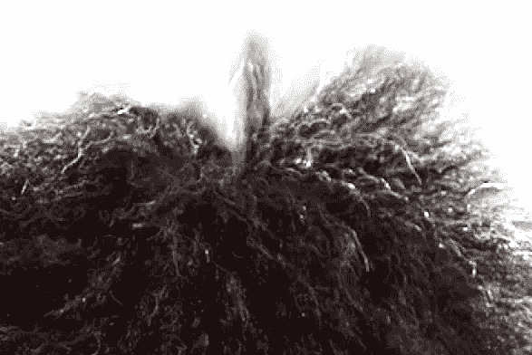](https://www.sitepoint.com/wp-content/uploads/2012/06/Screen-shot-2012-06-28-at-10.13.28-PM.png)

现在的问题是太多的头发被剪掉了。我们需要将图像信息添加回文档中，但是画笔不够精确，无法完成这项工作。要添加回这些信息，而不意外地添加回水和植物，请向右移动“移动边缘”滑块，将图像信息逐渐添加回选区。这里使用的值是 25。然后，将对比度滑块向右移动大约 10 点，你会得到一个更好的选择。单击“确定”让 Photoshop 复制图层，并将选区作为蒙版应用。

[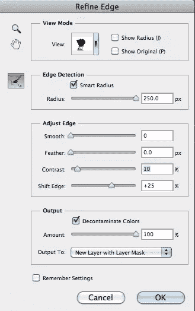](https://www.sitepoint.com/wp-content/uploads/2012/06/Screen-shot-2012-06-28-at-10.28.49-PM.png)

[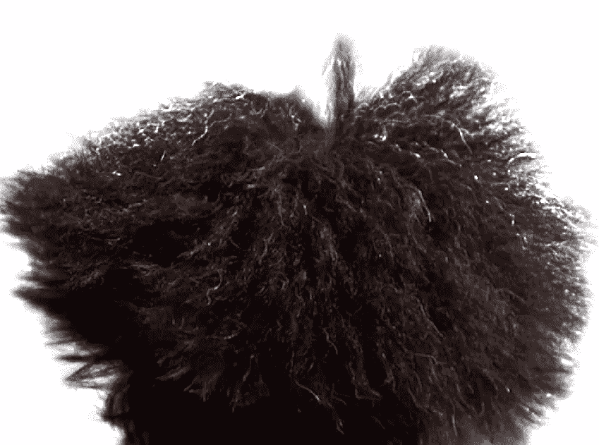](https://www.sitepoint.com/wp-content/uploads/2012/06/Screen-shot-2012-06-28-at-10.32.16-PM.png)

如果您需要做任何进一步的调整，您可以使用黑色涂掉图像中不需要的区域，您可以使用白色将它们涂回蒙版上。完成后，您可以将蒙版应用到图像，以便将它放在不同的背景上，或者您可以保留蒙版以便以后进行更多调整。这是在完全不同的背景下得到的结果:

[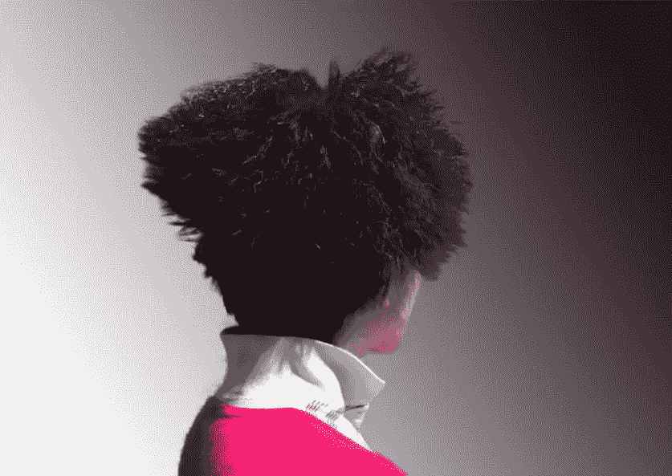](https://www.sitepoint.com/wp-content/uploads/2012/06/Screen-shot-2012-06-28-at-11.46.06-PM.png)

### 结论

在 Photoshop 中进行复杂的选择曾经是一个漫长而耗时的过程，需要花费数小时。有些图像被认为是不可能从背景中提取出来的，但使用“细化边缘”菜单，您可以快速细化您的选择，以包括精细的羽毛部分、动物皮毛和几乎无法用手处理的长纤维。结果是更好的 Photoshop 作品、更快乐的客户和同事，以及节省的大量时间。

对于复杂的选择，你有自己的选择技巧吗？你是否经常被要求在很短的时间内完成非常困难的 Photoshop？

## 分享这篇文章