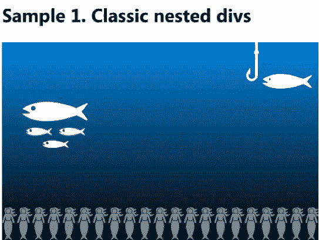
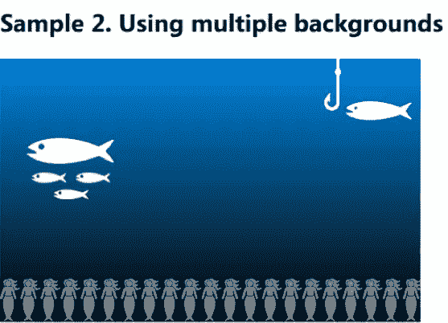

# 掌握 CSS3 多种背景

> 原文：<https://www.sitepoint.com/mastering-css3-multiple-backgrounds/>

我们的 CSS3 阴影世界之旅还在继续。今天我们将关注另一个有趣的特性——如何在 CSS3 中使用多种背景。

## 背景构图

您可能需要创建多个图像的组合来构建您的背景，原因有很多。我认为最重要的是以下几点:

*   当单独图像的文件大小之和小于合并图层图像的大小时(尤其是当您的图像包含重复图案时)，减少带宽使用，以及
*   提供一种独立操作不同层的方法(例如，如果您要实现视差效果)。

我相信你可能有其他合理的论点。:)

### 经典方法

所以我们需要建立一个多层的背景，将一些图片放在其他图片的上面。这个问题一般是怎么解决的？这真的很简单:只需为你拥有的每张图片创建一个容器(比如 div 元素),并使用 CSS 规则为其添加背景。接下来，将一个容器插入到另一个容器中，或者将它们放在一行中，并应用相应的 CSS 定位规则。我这里有一个简单的例子:

```
<div class="sample1">
  <div class="sea">
    <div class="mermaid"><div class="fishing"></div></div>                
    <div class="fish"></div>
  </div>
</div>
```

钓鱼类在美人鱼类中只是为了演示。

这里我们有一些 CSS 样式:

```
.sample1 .sea, .sample1 .mermaid, .sample1 .fishing {
   height: 300px;
   width: 480px;
   position: relative;
}

.sample1 .sea {
   background: url(media/sea.png) repeat-x top left;          
}

.sample1 .mermaid {
   background: url(media/mermaid.svg) repeat-x bottom left;
}

.sample1 .fish {
  background: url(media/fish.svg) no-repeat;
  height: 70px;
  width: 100px;
  left: 30px;
  top: 90px;
  position: absolute;
}

.sample1 .fishing {
  background: url(media/fishing.svg) no-repeat top right 10px;
}

```

结果:



在这个例子中，我有三个嵌套的 div 和背景图片，还有一个邻居`div`，fish。您可能会想象，可以使用 JavaScript 或 CSS3 过渡或动画来制作鱼的动画。

注意，对于 fishing 类，我使用新的[背景定位语法](https://www.w3.org/TR/css3-background/)，在 CSS3 中定义。但目前只有 IE9+和 Opera 11+支持；它还不能在 Firefox 10 或 Chrome 16 中运行。所以后两者的用户不能抓鱼。:(

我们继续。有可能简化这篇作文吗？

### 多重背景

这是多重背景出现的时候。这个特性允许你一次添加[多个背景](https://www.w3.org/TR/css3-background/#layering)到同一个元素。这是它的样子:

```
<div class="sample2">
  <div class="sea">                   
    <div class="fish"></div>
  </div>
</div>
```

以及风格:

```
.sample2 .sea {
  height: 300px;
  width: 480px;
  position: relative;
  background-image: url("media/fishing.svg"), url("media/mermaid.svg"), url("media/sea.png");  
  background-position: top right 10px, bottom left, top left;
  background-repeat: no-repeat, repeat-x, repeat-x ;
}

.sample2 .fish {
  background: url("media/fish.svg") no-repeat;
  height: 70px;
  width: 100px;
  left: 30px;
  top: 90px;
  position: absolute;
}

```

要定义多个背景，你应该使用`background-image`规则，枚举你的图像(用逗号分隔)。您还可以使用其他规则来设置每个图像的位置、重复模式和其他属性，只需使用相应规则的逗号分隔列表来编写它们。注意图像的顺序:它们从左到右排列，从最上面的开始，到最下面的结束。

结果是 100%相同:



### 有一条规则

如果你不需要你的鱼在一个独立的街区游泳，整个背景可以用一个简单的规则来写:

```
<div class="sample3">
  <div class="sea"></div>
</div>
```

样式:

```
.sample3 .sea {
  height: 300px;
  width: 480px;
  position: relative;
  background-image:  url("media/fishing.svg"), url("media/mermaid.svg"), url("media/fish.svg"), url("media/sea.png");  
  background-position: top right 10px, bottom left, 30px 90px, top left;
  background-repeat: no-repeat, repeat-x;
}
```

我不会再展示同一个图片了，但是相信我——它等同于上面的两张图片。再看一遍样式，尤其是关于`background-repeat`规则。根据规范，如果列表的一部分被省略，UA(浏览器)应该重复当前列表以填充剩余部分。

在我们的例子中，它等于以下定义:

```
background-repeat: no-repeat, repeat-x, no-repeat, repeat-x;
```

### 较短的版本

如果你还记得，在 CSS2.1 中，可以用一个简短的`background`规则来描述背景图像。多重背景呢？实际上，您也可以将`background`规则用于多种背景:

```
.sample4 .sea {
  height: 300px;
  width: 480px;
  position: relative;
  background: url("media/fishing.svg") top right 10px no-repeat,
              url("media/mermaid.svg") bottom left repeat-x,
              url("media/fish.svg") 30px 90px no-repeat,
              url("media/sea.png") repeat-x;                
}
```

但是请注意，除非值等于默认值，否则不能轻易省略参数。此外，如果你想定义背景的颜色，你应该在最后一层。

### 动态图像

下面是我们已经知道的:如果你的背景大部分是静态的——它可能取决于容器的大小(也就是说，如果你使用% length，那么一些层将在调整窗口大小时移动)——那么多背景的魔力是有用的，因为它确实简化了页面结构。但是，如果您需要使用 JavaScript 将一些层制作成动画(移动、旋转等)，该怎么办呢？

我有一个现实生活的样本——Yandex 网站(俄罗斯搜索提供商， [YNDX](https://www.bing.com/finance/search?q=YNDX&FORM=DTPFSA&qpvt=YNDX) )上的蒲公英主题:


如果您查看源代码(在 IE 中按下 [F12 打开 devtools](https://msdn.microsoft.com/en-us/ie/aa740478) )，您会发现如下代码:

```
<div class=b-skin-bg sizcache="272" sizset="0">
  ​<div class=b-fluff-bg sizcache="272" sizset="0">
​​    <div class=b-fluff__sky sizcache="272" sizset="0">
      ​​​<div style="background-position: 3244px 0px" class=b-fluff__cloud></div>
        ​​​<div style="width: 1200px" class=b-max-width sizcache="214" sizset="0">
          <div class=b-fluff__placeholder sizcache="302" sizset="0">
          <div style="bottom: 105px; display: none; left: 940px" class="b-fluff__item b-fluff_item_3" jQuery1328289994769="30"></div>
          ​​​​​<div style="bottom: 50px; display: none; left: 879px" class="b-fluff__item b-fluff_item_3" jQuery1328289994769="31"></div>
          ​​​​​<div style="bottom: 105px; display: none; left: 940px" class="b-fluff__item b-fluff_item_3" jQuery1328289994769="32"></div>
…
        ​​​​</div>
      </div>
    </div>
  </div>
</div>
```

具有 b-fluff-bg、b-fluff _ _ cloud&b-fluff _ _ 项目的`div`应用了 CSS 规则，添加了叠加的背景图像。云的背景从左向右滚动，蒲公英种子的背景在屏幕上飞舞。

有没有可能用 CSS3 多重背景改写这样的构图？实际上，可以，但前提是 1)它在所有目标浏览器中受支持，2)继续阅读；)

怎样才能让我们的多重背景更有动感？在内部，浏览器将每个`background`规则解析为每个属性的单独的`background-*`规则。如果您只需要更改其中一个属性，这将非常有用。例如，你可以使用`background-position`法则来移动你的图像。但是处理多个背景也有一些不利之处:如果你打算只移动一层，你仍然需要为所有层重写这个规则。

要制作我们的海洋背景动画，我们可以使用下面的 JavaScript 代码:

```
$(document).ready(function() {
  var sea = $(".sample5 .sea")[0];
  var fishesX = 30;
  var fishesY = 90;
  var fishX = 0;
  var fishY = 0;
  var mermaidX = 0;
  var t = 0;

  function animationLoop() {
      fishesY = 90 + Math.floor(30 * Math.sin(t++ / 180.0));
      if(--fishesX  480) mermaidX = 0;
      fishY = -10 + (10 * Math.cos(t * 0.091));
      fishX = 10 + (5 * Math.sin(t * 0.07));

      sea.style.backgroundPosition = "top " + fishY + "px right " + fishX + "px, " + mermaidX + "px bottom," + fishesX + "px " + fishesY + "px, top left";

      window.requestAnimFrame(animationLoop);
  }
  animationLoop();
});
```

其中:

```
window.requestAnimFrame = (function() {
  return
      window.requestAnimationFrame ||
      window.msRequestAnimationFrame ||
      window.mozRequestAnimationFrame ||
      window.oRequestAnimationFrame ||
      window.webkitRequestAnimationFrame ||
      (function(callback) { window.setTimeout(callback, 1000 / 60); });
})();
```

结果([视频](https://youtu.be/dqDDT4rHQEE)):


您也可以使用 CSS3 过渡或动画，但这是一个单独讨论的好话题。

### 视差和交互性

最后，使用类似的技术，你可以很容易地添加一些视差效果或其他交互式效果到你的背景中:

[https://www.youtube.com/embed/AzHb82fjpR8?rel=0](https://www.youtube.com/embed/AzHb82fjpR8?rel=0)

在这种情况下，多种背景很有用，虽然我们只讨论背景(而不是内容)，但使用它们绝对是避免复杂、不必要的元素污染 HTML 代码的好方法。但是正如我所说的，如果你需要构建一个复杂的动态背景，会有一些不利因素:你不能通过 id、类或任何其他参数访问一个单独的层。您应该记住代码中各层的顺序，如果只更改一层的属性，您需要为所有层构建一个描述该属性的字符串。要更新一个图层，您需要更新整个合成:

```
sea.style.backgroundPosition = "top " + fishY + "px right " + fishX + "px, " + mermaidX + "px bottom," + fishesX + "px " + fishesY + "px, top left";
```

我确信有可能构建一个好的、有用的 JavaScript 库，它将虚拟化所有这些层，并提供一种简单的方法来改变单独层的属性，保持 HTML 代码和 DOM 的整洁。

### 和睦相处

所有现代浏览器包括 [IE10 和 9 都支持](https://msdn.microsoft.com/en-us/ie)多背景。你也可以使用一些像 [Modernizr](https://www.modernizr.com/) 这样的工具来为旧的浏览器提供一定程度的兼容性，也就是说，通过提供一个可选择的背景。正如 Chris Coyier 在他的[文章中写的那样，你可以使用下面的方法:](https://css-tricks.com/stacking-order-of-multiple-backgrounds/)

```
.multiplebgs body {
  /* Awesome multiple BG declarations that transcend reality and impress chicks */
}

.no-multiplebgs body {
  /* laaaaaame fallback */
}
```

如果您对使用 JavaScript 为新的 CSS3 规则提供向后兼容性感到困惑，您可以只定义两次`background`属性(但是这种方法可能会导致现代浏览器不必要的下载，这取决于它们如何处理这样的规则):

```
/* multiple bg fallback */
background: #000 url(...) ...;
/* Awesome multiple BG declarations that transcend reality and impress chicks */
background: url(...), url(...), url(...), #000 url(...);
```

最后，如果你想知道:是的，你可以在用 HTML 和 JavaScript 构建的 Windows 8 metro 风格的应用程序中使用多种背景。

PS 查看这篇由 Alex Walker 撰写的关于蝉原理的惊人文章。

**注意**
本文讨论的 CSS 属性是在 [CSS3 背景和边框](https://www.w3.org/TR/css3-background/)模块中定义的，该模块目前处于工作草案状态。与此同时，它看起来很稳定，但在细节上仍有变化。

## 分享这篇文章