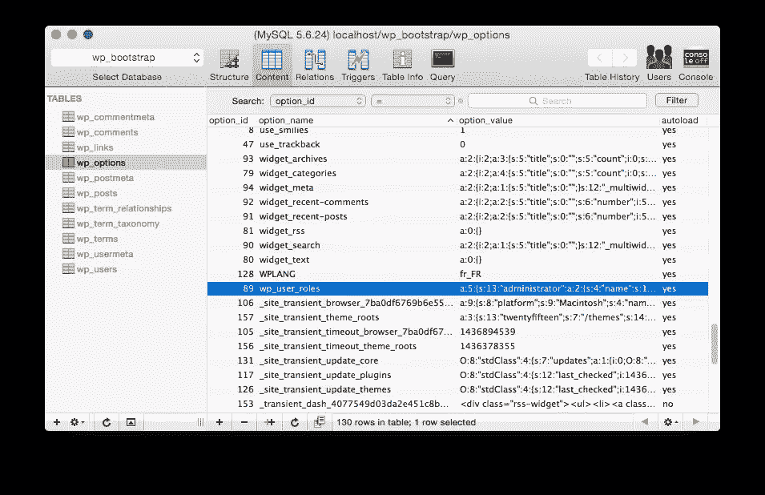
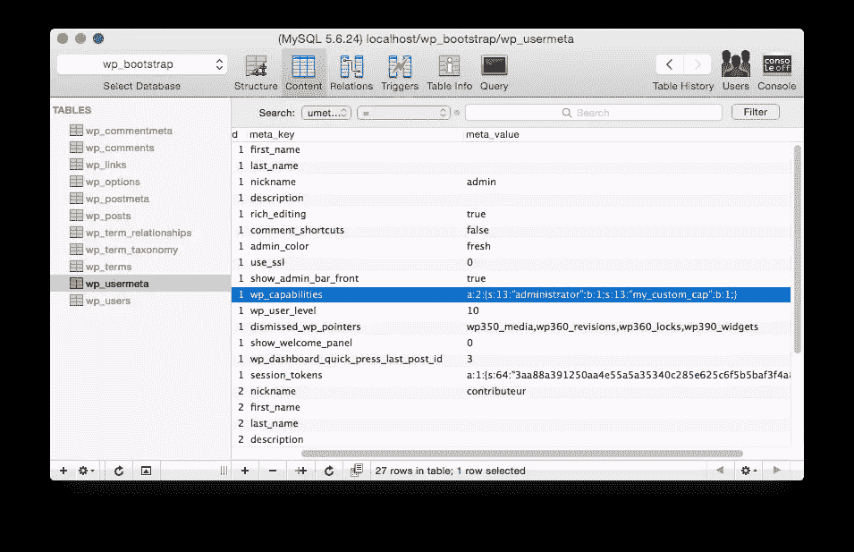
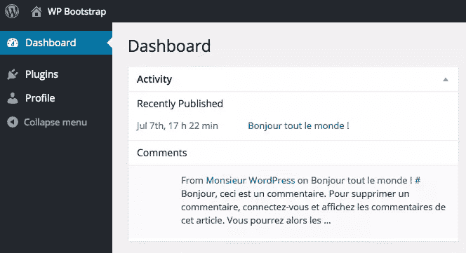

# 掌握 WordPress 的角色和功能

> 原文：<https://www.sitepoint.com/mastering-wordpress-roles-and-capabilities/>

WordPress 上的用户管理基于角色和能力。

角色是由唯一的名称和一组功能组成的实体。每个功能用于定义角色是否可以访问平台的特定功能。

让我们仔细看看 WordPress 角色和功能是如何工作的。

## 在后台

### 存储角色

默认角色和能力的列表可以在 [WordPress Codex](https://codex.wordpress.org/Roles_and_Capabilities) 上找到。

数据库将该列表存储在`wp_options`表中。

它使用序列化的`wp_user_roles`键。



未序列化的数据如下所示:

```
array(
    'administrator' => array(
        'name'         => 'Administrator',
        'capabilities' => array(
            'switch_themes'          => true,
            'edit_themes'            => true,
            'activate_plugins'       => true,
            'edit_plugins'           => true,
            'edit_users'             => true,
            // [...]
        )
    ),
    'contributor' => array(
        'name'         => 'Contributor',
        'capabilities' => array(
            'delete_pages'           => true,
            'delete_others_pages'    => true,
            'delete_published_pages' => true,
            'delete_posts'           => true,
            // [...]
        )
    ),
    // [...]
); 
```

当安装一个新的 WordPress 站点时，这个 meta 被自动设置。

当 WordPress 启动时，`WP_Roles`类从数据库加载列表。

这发生在`plugins_loaded`和`init`挂钩之间。

### 将用户链接到角色

WordPress 使用一个存储在`wp_usermeta`表中的`meta_key`，将用户和他的角色联系起来。


一旦未序列化，元看起来像这样:

```
array(
    'administrator' => true
) 
```

注意 WordPress 使用了一个数组，尽管一个用户一次只能有一个角色，我们稍后会看到原因。

另外，记住元键的`wp_`部分是当前博客的前缀。

(我们可以通过使用`$GLOBALS['wpdb']->get_blog_prefix()`函数来获取)。

在多站点安装中，这将允许用户在不同的实例上使用不同的角色:

*   `wp_capabilities => a:1:{s:13:"administrator";b:1;}`
*   `wp_10_capabilities => a:1:{s:11:"contributor";b:1;}`
*   `wp_15_capabilities => a:1:{s:10:"subscriber";b:1;}`
*   `[...]`

这条规则也适用于我们之前在`wp_options`表中看到的`wp_user_roles`条目。

最后，我们可以看到`wp_user_level`元和角色。

在旧的 WordPress 版本中，它被用来处理角色，现在[被弃用](http://codex.wordpress.org/User_Levels)。

### 使用核心功能

我们已经看到了角色是如何加载和链接到用户的；从那里，WordPress 能够在需要时获得给定用户的能力。

几个默认的功能被硬编码在 WordPress 核心中。

例如，当加载插件屏幕时，它将通过运行以下代码来检查当前用户是否可以管理插件:

```
if (!current_user_can('activate_plugins'))
{
    wp_die(__('You do not have sufficient permissions to manage plugins for this site.'));
} 
```

角色从来不是硬编码的；角色只是一个功能包装器，它只存在于数据库中。

## 使用角色和能力:WordPress API

### 访问 API

WordPress 提供了以下全局函数来帮助我们处理角色。

#### [当前用户 can()](https://developer.wordpress.org/reference/functions/current_user_can/)

检查当前用户是否拥有所需的权能。

```
add_action('init', function()
{
    if (current_user_can('install_plugins'))
    {
        echo 'you can install plugins';
    }
    else
    {
        echo 'You cannot install plugins';
    }
}); 
```

#### [WP_User::has_cap](https://developer.wordpress.org/reference/classes/wp_user/has_cap/)

检查特定用户是否拥有权能。

```
add_action('init', function()   
{
    $user = get_user_by('slug', 'admin');
    if ($user->has_cap('install_plugins'))
    {
        echo 'Admin can install plugins';
    }
    else
    {
        echo 'Admin cannot install plugins';
    }
}); 
```

我们可以注意到`current_user_can`使用了这个函数。

#### [get_editable_roles()](https://developer.wordpress.org/reference/functions/get_editable_roles/)

返回可用的角色。

```
add_action('admin_init', function()
{
    $roles = get_editable_roles();
    var_dump($roles);
}); 
```

列表可能会被`editable_roles`过滤器覆盖，所以我们不应该依赖这个函数来获得网站上完整的角色列表。

注意`admin_init`钩子的用法，因为功能还没有加载到`init`钩子上。

#### [get_role()](https://developer.wordpress.org/reference/functions/get_role/)

从 slug 中获取一个`WP_Role`对象。

```
add_action('init', function()
{
    $role = get_role('administrator');
    var_dump($role);
});

// This will print:
// WP_Role Object
// (
//     [name] => administrator
//     [capabilities] => Array
//         (
//             [switch_themes] => 1
//             [edit_themes] => 1
//             [activate_plugins] => 1
//             [edit_plugins] => 1
//             [...] 
```

#### [WP_Role::has_cap()](https://developer.wordpress.org/reference/classes/wp_role/has_cap/)

检查角色是否具有所需的能力。

```
add_action('init', function()
{
    $role = get_role('administrator');
    var_dump($role->has_cap('install_plugins')); // Prints TRUE
}); 
```

### 自定义 API

WordPress 还提供了一个完整的 API 来定制角色及其功能。

#### [add_role()](https://developer.wordpress.org/reference/functions/add_role/)

在数据库中注册新角色。

```
add_action('init', function()
{
    add_role('plugins_manager', 'Plugins Manager', array(
        'install_plugins',
        'activate_plugins',
        'edit_plugins'
    ));
}); 
```

#### [remove_role()](https://developer.wordpress.org/reference/functions/remove_role/)

从数据库中删除所需的角色(如果存在)。

```
add_action('init', function()
{
    remove_role('plugins_manager');
}); 
```

#### [WP_Role::add_cap()](https://developer.wordpress.org/reference/classes/wp_role/add_cap/)

向角色添加功能。

```
add_action('init', function()
{
    $role = get_role('contributor');
    $role->add_cap('install_plugins');
}); 
```

这可能是核心功能(`install_plugins`、`edit_posts`、…)或任何自定义字符串(`my_awesome_plugin_cap`)。

它允许我们为插件注册尽可能多的自定义功能。

#### [WP_Role::remove_cap()](https://developer.wordpress.org/reference/classes/wp_role/remove_cap/)

从角色中删除权能(如果存在的话)。

```
add_action('init', function()
{
    $role = get_role('contributor');
    $role->remove_cap('install_plugins');
}); 
```

#### [WP_User::add_role()](https://developer.wordpress.org/reference/classes/wp_user/add_role/)

向给定用户添加角色。

```
add_action('init', function()
{
    $user = get_user_by('slug', 'admin');
    $user->add_role('contributor');
}); 
```

该功能允许您在理论上为同一用户设置多个角色。

由于 WordPress 后端只显示和管理每个用户的一个角色，我们不应该为一个用户添加几个角色，并且在添加新角色之前总是使用`WP_User::remove_role()`。

#### [WP_User::remove_role()](https://developer.wordpress.org/reference/classes/wp_user/remove_role/)

从给定用户中删除角色。

```
add_action('init', function()
{
    $user = get_user_by('slug', 'admin');
    $user->remove_role('administrator');
}); 
```

#### [WP_User::add_cap()](https://developer.wordpress.org/reference/classes/wp_user/add_cap/)

向给定用户添加权能。

```
add_action('init', function()
{
    $user = get_user_by('slug', 'admin');
    $user->add_cap('my_custom_cap');
}); 
```



如果我们想向用户添加单个功能，而不必创建完整的角色，这可能会很有用。

#### [WP_User::remove_cap()](https://developer.wordpress.org/reference/classes/wp_user/remove_cap/)

从给定用户中删除权能。

```
add_action('init', function()
{
    $user = get_user_by('slug', 'admin');
    $user->remove_cap('my_custom_cap');
}); 
```

## WordPress API 的一些问题

除了一点:数据库访问和性能之外，我们看到的函数看起来都很好。

当使用角色和功能时，我们主要关心的是*何时*我们应该触发我们的代码？

为了解释这一点，我们来看看 WordPress 核心的代码。

首先，我们要添加一个新的空角色:

```
add_action('init', function()
{
    add_role('plugins_manager', 'Plugins Manager', array());
}); 
```

下面是 [`add_role`](https://developer.wordpress.org/reference/functions/add_role/) 函数的第一行(它实际上重定向到`WP_Roles::add_role`):

```
public function add_role( $role, $display_name, $capabilities = array() ) {
        if ( isset( $this->roles[$role] ) )
            return; 
```

如果我们添加一个新的角色， [`add_role`](https://developer.wordpress.org/reference/functions/add_role/) 函数运行一次，然后什么也不做。

接下来，假设我们想要为新创建的角色添加一项功能:

```
add_action('init', function()
{
    $role = get_role('plugins_manager');
    $role->add_cap('install_plugins');
}); 
```

WordPress 4.2.2 中的 [`WP_Role::add_cap()`](https://developer.wordpress.org/reference/classes/wp_role/add_cap/) 函数是这样的:

```
public function add_cap( $role, $cap, $grant = true ) {
    if ( ! isset( $this->roles[$role] ) )
        return;

    $this->roles[$role]['capabilities'][$cap] = $grant;
    if ( $this->use_db )
        update_option( $this->role_key, $this->roles );
} 
```

它更新了`$this->roles`对象，但是我们也可以看到，每次我们的代码运行时，数据库都会更新*，即使我们的新功能已经被注册了！*

这意味着，如果我们关心性能，我们为定制角色和功能而生成的所有代码都不应该在每次页面加载时运行。

## 变通办法

有几个选项可以避免这些数据库问题。

### 使用插件激活

WordPress 允许插件作者通过使用 [`register_activation_hook()`](https://developer.wordpress.org/reference/functions/register_activation_hook/) 功能，在插件从后端启用时触发代码。

让我们创建一个示例插件:

```
/*
Plugin Name: Our sample role plugin
*/
register_activation_hook(__FILE__, function()
{
    $role = add_role('plugins_manager', 'Plugins Manager', array());
    $role->add_cap('install_plugins');
}); 
```

当在网站上启用插件时，这段代码将只运行一次。

现在，我们必须记住，这个解决方案依赖于插件的激活和停用。

如果插件已经在生产中，或者在推送更新时忽略了它的重新激活，会发生什么？

事实上，这个解决方案也依赖于数据库，并且在推送代码时需要一个额外的步骤。

### 绕过 WordPress 数据库

还有第二种解决方案，没有记录在案，在某些情况下可以很好地工作。

让我们最后看一下 WordPress 核心，当 [`WP_Roles`](https://developer.wordpress.org/reference/classes/wp_roles/) 对象在 WordPress 启动时从数据库加载角色:

```
protected function _init() {
    global $wpdb, $wp_user_roles;
    $this->role_key = $wpdb->get_blog_prefix() . 'user_roles';
    if ( ! empty( $wp_user_roles ) ) {
        $this->roles = $wp_user_roles;
        $this->use_db = false;
    } else {
        $this->roles = get_option( $this->role_key );
    } 
```

在从数据库获取数据之前，WordPress 会检查`$wp_user_roles`全局变量。

如果设置，WordPress 将使用其内容，并通过将`$this->use_db`变量设置为`false`来阻止数据库的使用。

让我们尝试一下，只保留一个新的受限的`administrator`角色:

```
/*
Plugin Name: Our sample role plugin
*/
$GLOBALS['wp_user_roles'] = array(
    'administrator' => array(
        'name' => 'Administrator',
        'capabilities' => array(
            'activate_plugins' => true,
            'read' => true,
        )
    )
); 
```

当加载后端时，我们可以看到它保留了我们自定义角色的定义:



此解决方案解决了数据库问题，但可能会引入一些其他问题:

*   使用本机 API 的插件可能无法正常工作。
*   我们必须手动设置每个角色的定义，即使是我们不想更改的角色。

然而，当构建一个定制的 WordPress 应用程序需要一个定制的、静态的角色列表时，这可能是一个可行的解决方案:

*   角色定义可以用代码进行版本控制。
*   在环境中推出新代码会自动更新定义。
*   没有关于数据库的问题了。

## 结论

在这篇文章中，我概述了 WordPress 中的角色和功能。

尽管其完整的 API 允许我们做几乎任何我们想做的事情，但与数据库的关系仍然是主要关注点。

在开发我们的插件和主题时，我们必须记住这一点。

你怎么看待 WordPress 管理角色的方式？期待您的反馈！

## 分享这篇文章