# Maven 和 PHP

> 原文：<https://www.sitepoint.com/maven-and-php/>

Apache Maven 是一个构建自动化工具，其目的是构建、报告和创建项目文档。它使用项目对象模型(POM)和一组由所有使用 Maven 的项目共享的插件来构建项目，从而提供了一个统一的构建系统。一旦您熟悉了一个 Maven 项目是如何构建的，您就会自动知道所有 Maven 项目是如何构建的。这为您节省了大量的时间，使您不必试图浏览许多不同项目的构建过程。

通过本文，您将熟悉 Maven for PHP，以及如何从命令行和在 Eclipse 中安装和使用 PHP-Maven 插件。

## 安装 Maven

PHP-Maven 使用 Maven 的能力来构建、报告和创建 PHP 项目的文档。它使 Maven 构建生命周期适应 PHP 世界，同时完全支持 PHP 5。PHP-Maven 使用 [PHPUnit](https://github.com/sebastianbergmann/phpunit/ "sebastianbergmann/phpunit - GitHub") 进行单元测试，使用 [phpDocumentor](http://www.phpdoc.org/ "phpDocumentor 2") 创建项目文档。

要安装 Maven:

1.  从 http://maven.apache.org/download.cgi 下载 Maven。对于本文，版本是 3.0.4。
2.  在您希望存储二进制文件的任何地方解压归档文件，将会创建一个名为`apache-maven-<version>`的文件夹。
3.  将其`bin`文件夹添加到您的`PATH`中。
4.  确保`JAVA_HOME`设置为 JDK 的位置。

完成上述步骤后，要测试 Maven 是否安装正确，应该在命令提示符下运行`mvn --version`。

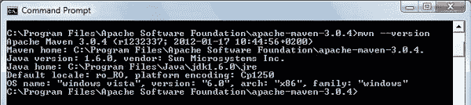

一旦 Maven 成功安装，转到`settings.xml`文件(在 Unix/Mac OS X 上可以在`~/.m2`中找到，在 Windows 上可以在`C:Documents and Settingsusername.m2`中找到)并添加 PHP for Maven 存储库。如果没有`settings.xml`文件，必须创建。

下面是一个示例`settings.xml`文件:

```
<settings>
 <profiles>
  <profile>
   <id>profile-php-maven</id>
   <pluginRepositories>
    <pluginRepository>
     <id>release-repo1.php-maven.org</id>
     <name>PHP-Maven 2 Release Repository</name>
     <url>http://repos.php-maven.org/releases</url>
     <releases>
      <enabled>true</enabled>
     </releases>
    </pluginRepository>

    <pluginRepository>
     <id>snapshot-repo1.php-maven.org</id>
     <name>PHP-Maven 2 Snapshot Repository</name>
     <url>http://repos.php-maven.org/snapshots</url>
     <releases>
      <enabled>false</enabled>
     </releases>
     <snapshots>
      <enabled>true</enabled>
     </snapshots>
    </pluginRepository>
   </pluginRepositories>

   <repositories>
    <repository>
     <id>release-repo1.php-maven.org</id>
     <name>PHP-Maven 2 Release Repository</name>
     <url>http://repos.php-maven.org/releases</url>
     <releases>
      <enabled>true</enabled>
     </releases>
    </repository>

    <repository>
     <id>snapshot-repo1.php-maven.org</id>
     <name>PHP-Maven 2 Snapshot Repository</name>
     <url>http://repos.php-maven.org/snapshots</url>
     <releases>
      <enabled>false</enabled>
     </releases>
     <snapshots>
      <enabled>true</enabled>
     </snapshots>
    </repository>
   </repositories>
  </profile>
 </profiles>

 <activeProfiles>
  <activeProfile>profile-php-maven</activeProfile>
 </activeProfiles>
</settings>
```

## 创建您的第一个项目

为了从命令行创建一个简单的项目，我将使用 [Maven 原型插件](http://maven.apache.org/archetype/maven-archetype-plugin/generate-mojo.html "archetype:generate")。原型插件允许用户从称为原型的现有模板中创建 Maven 项目。您可以使用`mvn archetype:generate`命令运行 Maven 原型插件，在对应于工件 ID 的文件夹中从原型生成一个新项目。

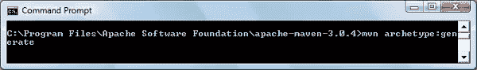

Maven 将开始下载所有需要的依赖项到您的计算机上。在某些时候，Maven 会要求您为`groupId`、`artifactId`、`version`和`package`定义一个值，如下所示:

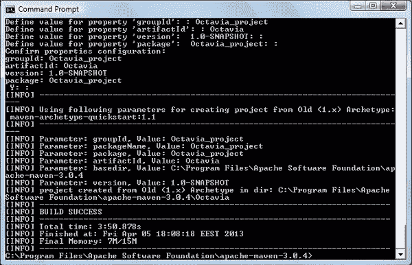

注意，在官方的 [Maven 原型插件页面](http://maven.apache.org/archetype/maven-archetype-plugin/generate-mojo.html "archetype:generate")上，你会找到所有可用的参数及其描述。

在成功创建您的第一个项目之后，您应该在相应的文件夹中找到以下内容，在我的例子中是`Octavia_project`:

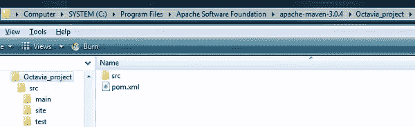

*   `src/main/php`–包含项目的源代码。
*   `src/test/php`–包含项目的测试代码。
*   `src/site`–包含项目的站点描述符。
*   `pom.xml`–包含项目的 POM 描述。

`pom.xml`的内容看起来是这样的:

```
<?xml version="1.0" encoding="UTF-8"?>
<project  
 xmlns:xsi="https://www.w3.org/2001/XMLSchema-instance" 
 xsi:schemaLocation="http://maven.apache.org/POM/4.0.0 http://maven.apache.org/xsd/maven-4.0.0.xsd">

 <parent>
  <groupId>org.phpmaven</groupId>
  <artifactId>php-parent-pom</artifactId>
  <version>2.0.2</version>
 </parent>

 <modelVersion>4.0.0</modelVersion>
 <groupId>org.phpsample</groupId>
 <artifactId>Octavia_project</artifactId>
 <packaging>php</packaging>
 <version>1.0-SNAPSHOT</version>
 <build>
  <plugins>
   <plugin>
    <groupId>org.phpmaven</groupId>
    <artifactId>maven-php-plugin</artifactId>
    <extensions>true</extensions>
   </plugin>

   <plugin>
    <groupId>org.apache.maven.plugins</groupId>
    <artifactId>maven-site-plugin</artifactId>
    <version>3.0</version>
    <configuration>
     <reportPlugins>
      <plugin>
       <groupId>org.phpmaven</groupId>
       <artifactId>maven-php-plugin</artifactId>
       <reportSets>
        <reportSet>
         <reports>
          <report>phpdocumentor</report>
          <report>phpunit-coverage</report>
          <report>phpunit</report>  
         </reports>
        </reportSet>
       </reportSets>
      </plugin>
     </reportPlugins>
    </configuration>
   </plugin>
  </plugins>
 </build>

 <dependencies>
  <!--  phpUnit for PHP 5 -->
  <dependency>
   <groupId>de.phpunit</groupId>
   <artifactId>PHPUnit</artifactId>
   <version>3.6.10</version>
   <type>phar</type>
  </dependency>
 </dependencies>
</project>
```

测试阶段在创建应用程序之后，为此您需要 PHPUnit 依赖项。如果它丢失了，请务必如上所示将其添加到您的`pom.xml`中。

PHPUnit 测试应该放在`src/test/php`文件夹中，一个测试应该被命名为`*Somthing*Test.php`，也就是说，后缀“Test.php”是必须的。我的测试，`MyTest.php`，如下所示:

```
<?php
class MyTest extends PHPUnit_Framework_TestCase
{
    public function testBar() {
        include "org/sample/app.php";
        $this->fail("we will fail");
    }	
}
```

使用命令`mvn test`执行测试。在官方文档中有一节[如何忽略失败的测试](http://www.php-maven.org/branches/2.0-SNAPSHOT/tut-lifecycle-testing.html "Maven for PHP - testing phase")，你可以在那里找到一些可以帮助你运行测试的命令。(唯一对我有效的命令是执行一个测试的命令。)

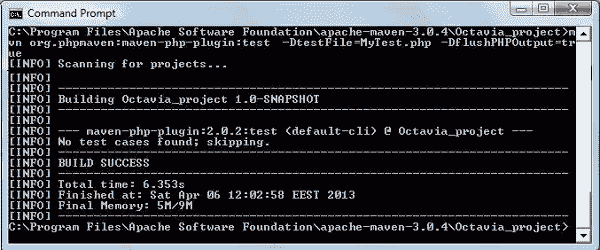

要构建新创建的 Maven 项目，您可以运行命令`mvn:package`。您将再次注意到 Maven 自动开始下载项目所需的任何依赖项。

下载完所有需要的依赖项并执行构建操作后，您应该会看到以下成功消息:


为了从项目中创建文档，您将需要 [phpDocumentor 2 PEAR 包](http://pear.phpdoc.org/ "phpDocumentor channel")。在`src/site`文件夹中，创建包含以下内容的`site.xml`文件:

```
<?xml version="1.0" encoding="ISO-8859-1"?>
<project name="Maven">
 <version position="left" />

 <skin>
  <groupId>org.apache.maven.skins</groupId>
  <artifactId>maven-stylus-skin</artifactId>
  <version>1.0</version>
 </skin>
 <body>
  <links>
   <item name="PHP-Maven" href="http://www.php-maven.org/" />
  </links>

  <menu name="Main">
   <item name="Welcome" href="index.html" />
  </menu>

  <menu ref="reports" />
 </body>
</project>
```

接下来运行`mvn site`命令，您将在`target/site`文件夹中找到结果。

## Eclipse 集成

php-maven 插件支持与 Eclipse IDE 的集成，但默认情况下它不包含 php-maven 插件。你需要手动集成它。为此，请按照下列步骤操作:

1.  从帮助菜单中，选择安装新软件选项，然后按“添加…”按钮。
2.  在添加存储库窗口中输入名称:“PHPMaven 更新站点”和 URL*http://www.php-maven.org/eclipse/update*。
3.  PHPMaven 更新站点已经列出，您可以选择 PHP-Maven 选项。
4.  点击下一步/完成安装插件。

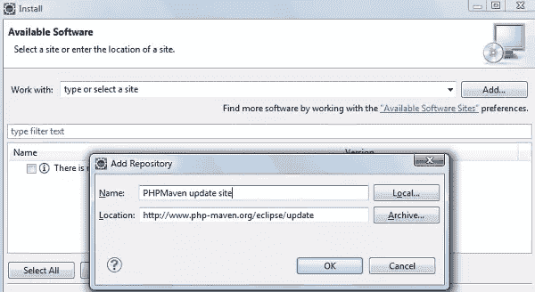

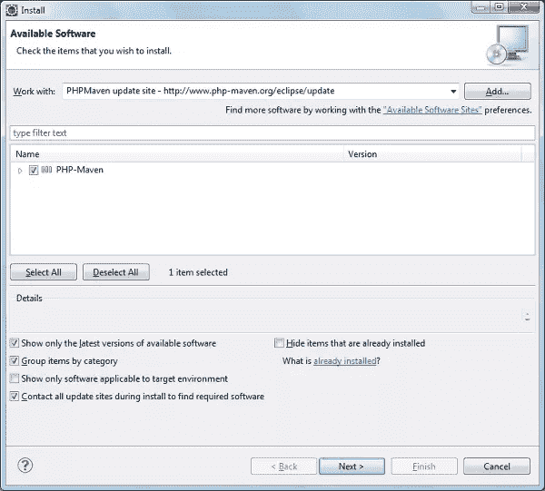

安装完成后，当您创建一个新项目时，您会发现 PHP-Maven 项目选项。选择它，然后按下一步以安装插件。

要在 Eclipse 中创建新项目，请选择 File > New > Other(或按 CTRL + N 组合键),您应该会看到类似下图的内容:

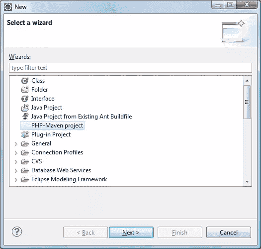

按下“下一步”按钮后，您将收到不同原型的列表。

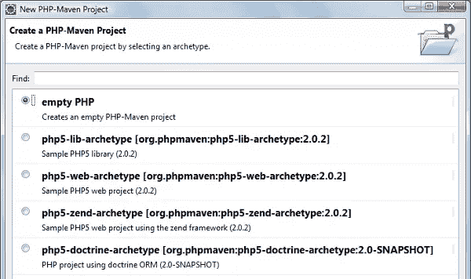

选择您的工件，您将被提示输入项目信息，就像前面的命令提示符一样。

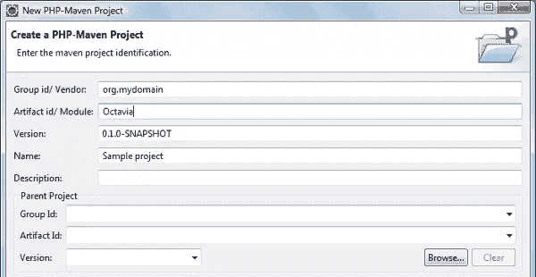

新项目将被添加到项目浏览器选项卡中。文件夹结构与从命令行创建的项目结构非常相似。

创建项目后，右键单击它，您会在菜单底部看到 PHP-Maven 选项，其子项目列出了 PHP-Maven 项目最重要的阶段。

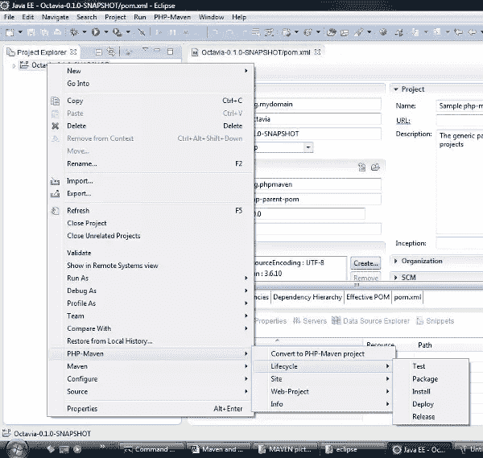

## 摘要

在本文中，您已经学习了如何从命令行和在 Eclipse 中安装和使用 PHP-Maven 插件。Maven for PHP 是一个强大的 PHP 平台构建自动化工具。使用 Maven，用户只需要为项目提供配置，而可配置的插件完成编译项目、运行单元测试、生成 API 文档等工作。Maven for PHP 将很快成为 PHP 开发者工具箱中的必备工具。

图片 via[Fotolia](http://us.fotolia.com/?utm_source=sitepoint&utm_medium=website_link&utm=campaign=sitepoint "Royalty Free Stock Photos at Fotolia.com")

## 分享这篇文章