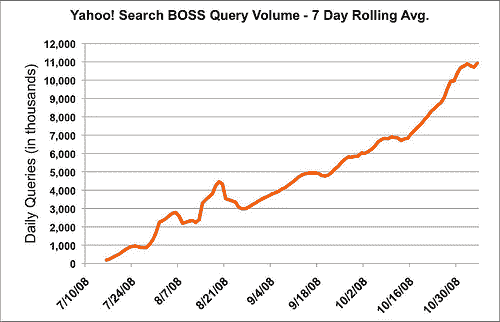

# 也许不要数雅虎！刚刚出来

> 原文：<https://www.sitepoint.com/maybe-dont-count-yahoo-out-just-yet/>

雅虎！经历了艰难的一年。在 3 月份拒绝了微软 450 亿美元的收购要约后，该公司的股票暴跌，市值损失了近 60%。最近，2007 年 6 月接任该公司首席执行官的联合创始人杨致远在带领该公司进入最困难的时期后辞职。

雅虎！在搜索方面面临两个主要问题:市场份额下降，无法像主要竞争对手谷歌那样有效地从搜索资源中赚钱(这就是为什么他们在夏天计划将搜索营销外包给谷歌，也是为什么微软可能仍然对类似的交易感兴趣)。如果我们抛开后一个问题，雅虎！可能正在修复前者。

2004 年，雅虎！谷歌的搜索市场份额为 32%，而谷歌为 35%。两年后，雅虎！略微下滑至约 29%，而谷歌增长至 44%，主要是以微软和美国在线为代价([来源](http://searchenginewatch.com/2156431))。“今天，雅虎！”美国在搜索市场的份额甚至更低，只有 20.5%。与此同时，谷歌的份额飙升至 63% ( [来源](http://www.comscore.com/press/release.asp?press=2601))。

但是这些数字没有考虑到的是通过雅虎进行的合作伙伴查询。该服务于 7 月份推出。当 BOSS 打开[时，我们想知道](https://www.sitepoint.com/can-a-million-niche-yahoos-beat-google/)是否有一个利基搜索引擎建立在雅虎之上。从长远来看可以与谷歌竞争。

早期结果似乎是积极的。在今天的一篇博客中，[雅虎！宣布五个月以来，BOSS 已经增长到每天超过 1000 万次搜索查询。据雅虎称，如果从整体来看。，BOSS 驱动的搜索引擎将排在 Ask.com 之后，成为第五大最常用的网络搜索引擎。对雅虎来说什么更重要？，是成长图(如上图)，看起来很梦幻。雅虎！随着搜索查询量每个月翻一番，已经看到了稳定的增长。](http://www.ysearchblog.com/archives/000666.html)

上个月雅虎！开启了 BOSS 驱动的网站搜索，这大大降低了任何想使用雅虎的人的门槛。s 搜索后端。

7 月份，我们沉思着 BOSS 可能最终会很好地为谷歌服务，因为雅虎！尚未透露计划如何让合作伙伴将搜索结果货币化。雅虎！仍然没有透露计划的细节，但指出货币化将通过雅虎！受控频道。这可能有助于解决我们提到的另一个搜索问题。

此外，什么可能最终成为雅虎真正的杀手级应用！这里，是老板基本上外包研究和开发给雅虎！对于任何想尝试调整当前搜索算法的人来说。正如我们在 7 月份所写的，很明显雅虎！凭借自己的搜索排名和显示算法，谷歌无法与谷歌竞争，因此开放其索引并让其他人试一试是一个明智之举。如果有人触及任何革命性的东西，以至于用户开始选择它而不是谷歌，雅虎！将处于收购的最佳位置，因为它已经使用了他们的索引和后端技术。

雅虎能不能？谷歌的 BOSS 战略是重回搜索份额竞争的后门吗？结果，他们真的能够反击谷歌吗？还是太少，太晚了？请在评论中分享你的想法。

## 分享这篇文章