# 你说的“着色器”是什么意思？如何用 HTML5 和 WebGL 创建它们

> 原文：<https://www.sitepoint.com/mean-shaders-create-html5-webgl/>

本文是微软网站开发技术系列的一部分。感谢您对使 SitePoint 成为可能的合作伙伴的支持。

你可能已经注意到，我们去年第一次谈论了很多关于 [babylon.js](http://babylonjs.com/?WT.mc_id=12833-DEV-sitepoint-othercontent) 的内容，最近我们发布了 [babylon.js v2.0](http://blogs.msdn.com/b/eternalcoding/archive/2015/02/18/what-s-new-in-babylon-js-v2-0.aspx?WT.mc_id=12833-DEV-sitepoint-othercontent) ，具有 3D 声音定位(带网络音频)和体积光散射功能。

如果您错过了 1.0 版的发布，首先您可以在这里赶上第二天的主题演讲，然后直接进入 2:24-2:28。在其中，微软福音传道者 Steven Guggenheimer 和 John Shewchuk 演示了如何将 Oculus Rift 支持添加到 Babylon.js 中。该演示的关键之一是我们对特定着色器所做的工作，以模拟镜头，如您在这张照片中所见:

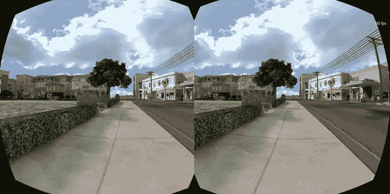

我还与弗兰克·奥利维尔和本·康斯特布尔就 IE 和 Babylon.js 上的[图形进行了一次会议](http://channel9.msdn.com/Events/Build/2014/3-558)

这让我想到了一个关于 babylon 的问题。js:你说的着色器是什么意思？所以今天我将试着向你解释着色器是如何工作的。

## 该理论

在开始实验之前，我们必须首先了解事物内部是如何工作的。

在处理硬件加速的 3D 时，我们讨论的是两个 CPU:主 CPU 和 GPU。GPU 是一种非常专业的 CPU。

GPU 是一个使用 CPU 设置的状态机。例如，CPU 将配置 GPU 来渲染直线而不是三角形。或者它将定义透明度是打开的等等。

一旦设置了所有状态，CPU 将定义要渲染的内容(几何图形，它由一系列点(称为顶点，存储在一个名为顶点缓冲区的数组中)和一系列索引(存储在一个名为索引缓冲区的数组中的面或三角形)组成)。

CPU 的最后一步是定义如何渲染几何图形，对于这个特定的任务，CPU 将为 GPU 定义着色器。着色器是 GPU 将为它必须渲染的每个顶点和像素执行的一段代码。

首先是一些词汇:把一个顶点(当有几个顶点时)想象成一个 3D 环境中的“点”,而不是 2D 环境中的点。

有两种着色器:顶点着色器和像素(或片段)着色器。

### 图形管道

在深入研究着色器之前，让我们后退一步。为了渲染像素，GPU 将采用 CPU 定义的几何图形，并将执行以下操作:

*   使用索引缓冲区，收集三个顶点来定义一个三角形:索引缓冲区包含一个顶点索引列表。这意味着索引缓冲区中的每个条目都是顶点缓冲区中一个顶点的编号。这对于避免重复顶点非常有用。例如，下面的索引缓冲区是两个面的列表:[1 2 3 1 3 4]。第一个面包含顶点 1、顶点 2 和顶点 3。第二个面包含顶点 1、顶点 3 和顶点 4。所以在这个几何图形中有 4 个顶点:

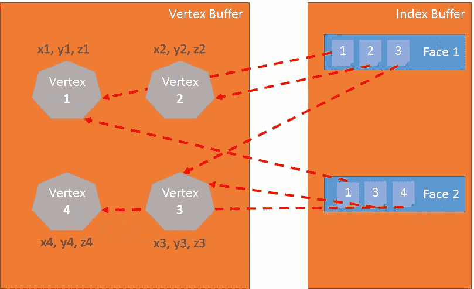

*   顶点着色器应用于三角形的每个顶点。顶点着色器的主要目标是为每个顶点(3D 顶点在 2D 屏幕上的投影)生成一个像素:

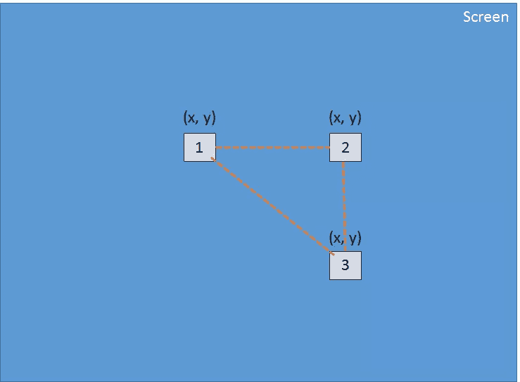

*   使用这 3 个像素(它们在屏幕上定义了一个 2d 三角形)，GPU 将对附加到像素(至少是其位置)的所有值进行插值，像素着色器将应用于 2d 三角形中包含的每个像素，以便为每个像素生成一种颜色:

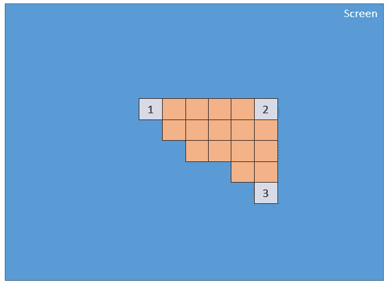

*   对索引缓冲区定义的每个面都执行该过程。

显然，由于其并行性，GPU 能够同时处理许多人脸的这一步，然后实现非常好的性能。

### GLSL

我们刚刚看到，为了渲染三角形，GPU 需要两个着色器:顶点着色器和像素着色器。这些着色器是使用一种称为 GLSL(图形库着色器语言)的语言编写的。看起来像 c。

对于 Internet Explorer 11，我们开发了一个编译器来将 GLSL 转换为 HLSL(高级着色器语言)，这是 DirectX 11 的着色器语言。这使得 IE11 可以确保着色器代码是安全的(你不想在使用 WebGL 时重置电脑):

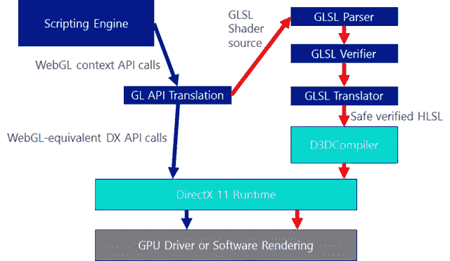

```
precision highp float;

// Attributes
attribute vec3 position;
attribute vec2 uv;

// Uniforms
uniform mat4 worldViewProjection;

// Varying
varying vec2 vUV;

void main(void) {
    gl_Position = worldViewProjection * vec4(position, 1.0);

    vUV = uv;
}
```

### 顶点着色器结构

顶点着色器包含以下内容:

*   **属性**:一个属性定义了顶点的一部分。默认情况下，一个顶点至少应该包含一个位置(一个`vector3:x, y, z`)。但是作为开发人员，您可以决定添加更多信息。例如，在前一个着色器中，有一个名为`uv`的`vector2`(允许在 3D 对象上应用 2D 纹理的纹理坐标)
*   **制服**:制服是着色器使用的变量，由 CPU 定义。这里唯一的统一是一个矩阵，用于将顶点(x，y，z)的位置投影到屏幕(x，y)上
*   **变化**:变化的变量是由顶点着色器创建并传送到像素着色器的值。这里顶点着色器将把一个`vUV`(一个简单的`uv`副本)值传输到像素着色器。这意味着像素在这里用位置和纹理坐标来定义。这些值将由 GPU 进行插值，并由像素着色器使用。
*   **main** :名为 main 的函数是 GPU 为每个顶点执行的代码，至少要为 *gl_position* (当前顶点在屏幕上的位置)产生一个值。

我们可以在示例中看到顶点着色器非常简单。它生成一个名为`gl_position`的系统变量(以`gl_`开始)来定义相关像素的位置，并设置一个名为`vUV`的变量。

### 矩阵背后的伏都教

在我们的着色器中，我们有一个名为`worldViewProjection`的矩阵。我们使用这个矩阵将顶点位置投影到`gl_position`变量。这很酷，但是我们如何得到这个矩阵的值呢？它是统一的，所以我们必须在 CPU 端定义它(使用 JavaScript)。

这是做 3D 的复杂部分之一。你必须理解复杂的数学(或者你必须使用像 babylon.js 这样的 3D 引擎，我们将在后面看到)。

`worldViewProjection`矩阵是 3 种不同矩阵的组合:

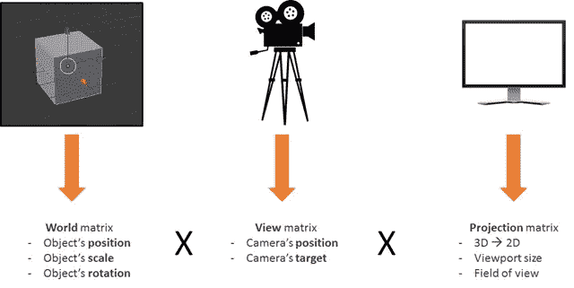

使用生成的矩阵，我们能够将 3d 顶点转换为 2d 像素，同时考虑视点以及与当前对象的位置/比例/旋转相关的一切。

作为一名 3D 开发者，这是你的责任:创建并更新这个矩阵。

### 回到着色器

一旦在每个顶点上执行了顶点着色器(三次)，我们就有了三个具有正确的`gl_position`和 _vUV _value 的像素。然后，GPU 将在这些像素生成的三角形中包含的每个像素上插值这些值

然后，对于每个像素，它将执行像素着色器:

```
precision highp float;
varying vec2 vUV;
uniform sampler2D textureSampler;

void main(void) {
    gl_FragColor = texture2D(textureSampler, vUV);
}
```

### 像素(或片段)着色器结构

像素着色器的结构类似于顶点着色器:

*   **变化**:变化的变量是由顶点着色器创建并传输到像素着色器的值。这里，像素着色器将从顶点着色器接收 vUV 值。
*   **制服**:制服是着色器使用的变量，由 CPU 定义。我们这里唯一的制服是一个取样器，它是一个用来读取纹理颜色的工具。
*   **main** :名为 main 的函数是 GPU 为每个像素执行的代码，必须至少为`gl_FragColor` (当前像素的颜色)产生一个值。

这个像素着色器相当简单:它使用来自顶点着色器的纹理坐标从纹理中读取颜色(顶点着色器又从顶点获取颜色)。

你想看看这样一个着色器的结果吗？这是:

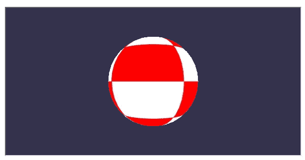

*(你可以在我的博客上看到完整的工作代码[这里](http://blogs.msdn.com/b/eternalcoding/archive/2014/04/17/learning-shaders-create-your-own-shaders-with-babylon-js.aspx?WT.mc_id=12833-DEV-sitepoint-othercontent) )*

为了达到这个结果，你将不得不处理大量的 WebGL 代码。事实上，WebGL 是一个非常强大但非常低级的 API，你必须自己做所有的事情，从创建缓冲区到定义顶点结构。你还必须做所有的数学计算，设置所有的状态，处理纹理加载等等…

## 太用力了？巴比伦。shader 救援物资

我知道你在想什么:着色器真的很酷，但我不想为 WebGL 内部管道甚至数学而烦恼。

你是对的！这是一个完全合理的要求，这也正是我创建 Babylon.js 的原因。

让我向您展示前面的 rolling sphere 演示使用的代码。首先，你需要一个简单的网页:

```
< !DOCTYPE html>
<html>
<head>
    <title>Babylon.js</title>
    <script src="Babylon.js"></script>

    <script type="application/vertexShader" id="vertexShaderCode"> precision highp float;

        // Attributes
        attribute vec3 position;
        attribute vec2 uv;

        // Uniforms
        uniform mat4 worldViewProjection;

        // Normal
        varying vec2 vUV;

        void main(void) {
            gl_Position = worldViewProjection * vec4(position, 1.0);

        vUV = uv;
        } </script>

    <script type="application/fragmentShader" id="fragmentShaderCode"> precision highp float;
        varying vec2 vUV;

        uniform sampler2D textureSampler;

        void main(void) {
            gl_FragColor = texture2D(textureSampler, vUV);
        } </script>

    <script src="index.js"></script>
    <style> html, body {
            width: 100%;
            height: 100%;
            padding: 0;
            margin: 0;
            overflow: hidden;
            margin: 0px;
            overflow: hidden;
        }

        #renderCanvas {
            width: 100%;
            height: 100%;
            touch-action: none;
            -ms-touch-action: none;
        } </style>
</head>
<body>
    <canvas id="renderCanvas"></canvas>
</body>
</html>
```

你会注意到着色器是由`script`标签定义的。使用 Babylon.js，您还可以在单独的文件中定义它们。fx 文件)。

你可以在这里或者在[我们的 GitHub repo](https://github.com/BabylonJS/Babylon.js) 上获得 babylon.js。您必须使用 1.11 或更高版本才能访问 BABYLON.StandardMaterial.

最后，主要的 JavaScript 代码如下:

```
"use strict";

document.addEventListener("DOMContentLoaded", startGame, false);

function startGame() {
    if (BABYLON.Engine.isSupported()) {
        var canvas = document.getElementById("renderCanvas");
        var engine = new BABYLON.Engine(canvas, false);
        var scene = new BABYLON.Scene(engine);
        var camera = new BABYLON.ArcRotateCamera("Camera", 0, Math.PI / 2, 10, BABYLON.Vector3.Zero(), scene);

        camera.attachControl(canvas);

        // Creating sphere
        var sphere = BABYLON.Mesh.CreateSphere("Sphere", 16, 5, scene);

        var amigaMaterial = new BABYLON.ShaderMaterial("amiga", scene, {
            vertexElement: "vertexShaderCode",
            fragmentElement: "fragmentShaderCode",
        },
        {
            attributes: ["position", "uv"],
            uniforms: ["worldViewProjection"]
        });
        amigaMaterial.setTexture("textureSampler", new BABYLON.Texture("amiga.jpg", scene));

        sphere.material = amigaMaterial;

        engine.runRenderLoop(function () {
            sphere.rotation.y += 0.05;
            scene.render();
        });
    }
};
```

你可以看到我使用了一个`BABYLON.ShaderMaterial`来摆脱所有编译、链接和处理着色器的负担。

*创建`BABYLON.ShaderMaterial`时，必须指定用于存储着色器的 DOM 元素或着色器所在文件的基本名称。如果你选择使用文件，你必须为每个着色器创建一个文件，并使用下面的模式`basename.vertex.fx`和`basename.fragment,.fx`。然后你将不得不创建这样的材料:*

```
var cloudMaterial = new BABYLON.ShaderMaterial("cloud", scene, "./myShader",{
            attributes: ["position", "uv"],
            uniforms: ["worldViewProjection"]
        });
```

您还必须指定您使用的属性和统一的名称。

然后您可以使用`setTexture`、`setFloat`、`setFloats`、`setColor3`、`setVector2`、`setVector3`、`setVector4`、`setMatrix functions`直接设置您的制服和采样器的值。

还记得之前的`worldViewProjection`矩阵吗？用 Babylon.js 和`BABYLON.ShaderMaterial`，就没什么好担心的了！`BABYLON.ShaderMaterial`会自动为你计算，因为你在制服列表中声明了。`BABYLON.ShaderMaterial`还可以为您处理以下矩阵:

*   世界
*   视角
*   推断
*   世界观
*   世界观投影

不再需要数学了。例如，每次你执行`sphere.rotation.y += 0.05`，球体的世界矩阵就会为你生成并传输到 GPU。

## CYOS:创建你自己的着色器

因此，让我们更大，并创建一个页面，您可以动态地创建自己的着色器，并立即看到结果。该页面将使用我们之前讨论过的相同代码，并将使用`BABYLON.ShaderMaterial`对象来编译和执行您将创建的着色器。

我为 CYOS 使用了 ACE 代码编辑器。这是一个不可思议的带有语法高亮的代码编辑器。请随意在这里看一看。你可以在这里找到 CYOS [。](http://www.babylonjs.com/CYOS?WT.mc_id=12833-DEV-sitepoint-othercontent)

使用第一个组合框，您将能够选择预定义的着色器。之后我们会一一介绍。

还可以使用第二个组合框更改用于预览着色器的网格(3D 对象)。

编译按钮用于从你的着色器创建一个新的`BABYLON.ShaderMaterial`。该按钮使用的代码如下:

```
// Compile
shaderMaterial = new BABYLON.ShaderMaterial("shader", scene, {
    vertexElement: "vertexShaderCode",
    fragmentElement: "fragmentShaderCode",
},
    {
        attributes: ["position", "normal", "uv"],
        uniforms: ["world", "worldView", "worldViewProjection"]
    });

var refTexture = new BABYLON.Texture("ref.jpg", scene);
refTexture.wrapU = BABYLON.Texture.CLAMP_ADDRESSMODE;
refTexture.wrapV = BABYLON.Texture.CLAMP_ADDRESSMODE;

var amigaTexture = new BABYLON.Texture("amiga.jpg", scene);

shaderMaterial.setTexture("textureSampler", amigaTexture);
shaderMaterial.setTexture("refSampler", refTexture);
shaderMaterial.setFloat("time", 0);
shaderMaterial.setVector3("cameraPosition", BABYLON.Vector3.Zero());
shaderMaterial.backFaceCulling = false;

mesh.material = shaderMaterial;
```

素材准备给你发三个预计算矩阵(`world`、`worldView`、`worldViewProjection`)。顶点将带有位置、法线和纹理坐标。已经为您加载了两个纹理:

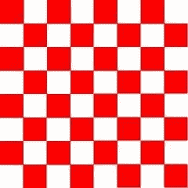

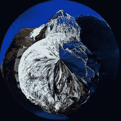

最后，这里是我更新两套便利制服的`renderLoop`:

*   一个叫做`time`是为了得到一些有趣的动画
*   一个名为`cameraPosition`的函数，用于将相机的位置放入你的着色器中(对光照方程很有用)

```
engine.runRenderLoop(function () {
    mesh.rotation.y += 0.001;

    if (shaderMaterial) {
        shaderMaterial.setFloat("time", time);
        time += 0.02;

        shaderMaterial.setVector3("cameraPosition", camera.position);
    }

    scene.render();
});
```

由于我们在 Windows Phone 8.1 上所做的工作，我们也可以在 Windows Phone 上使用 CYOS(这总是创建着色器的好时机):

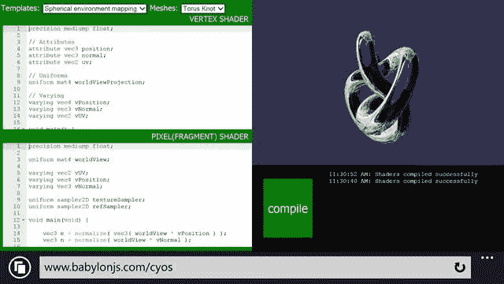

### 基本着色器

所以让我们从 CYOS 上定义的第一个着色器开始:基本着色器。

我们已经知道这个着色器。它计算`gl_position`并使用纹理坐标来获取每个像素的颜色。

为了计算像素位置，我们只需要`worldViewProjection`矩阵和顶点的位置:

```
precision highp float;

// Attributes
attribute vec3 position;
attribute vec2 uv;

// Uniforms
uniform mat4 worldViewProjection;

// Varying
varying vec2 vUV;

void main(void) {
    gl_Position = worldViewProjection * vec4(position, 1.0);

    vUV = uv;
}
```

纹理坐标(uv)被不加修改地传输到像素着色器。

*请注意，我们需要在顶点和像素着色器的第一行添加`precision mediump float;`，因为 Chrome 需要它。它规定，为了获得更好的性能，我们不使用全精度浮点值。*

像素着色器甚至更简单，因为我们只需要使用纹理坐标并获取纹理颜色:

```
precision highp float;

varying vec2 vUV;

uniform sampler2D textureSampler;

void main(void) {
    gl_FragColor = texture2D(textureSampler, vUV);
}
```

我们之前看到`textureSampler`制服填充了“amiga”纹理，因此结果如下:

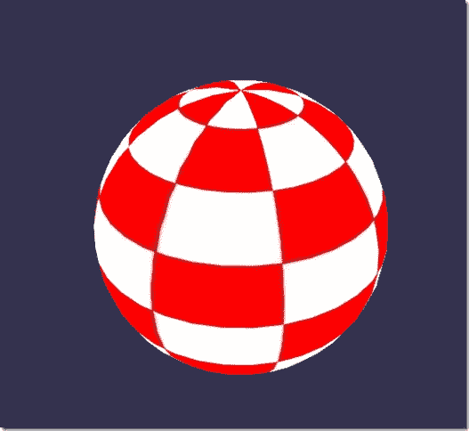

### 黑白着色器

现在让我们继续一个新的着色器:黑白着色器。

这个着色器的目标是使用前一个着色器，但只使用黑白渲染模式。

为此，我们可以保持相同的顶点着色器。像素着色器将略有修改。

我们的第一个选择是只拿一个组件，比如绿色的那个:

```
precision highp float;

varying vec2 vUV;

uniform sampler2D textureSampler;

void main(void) {
    gl_FragColor = vec4(texture2D(textureSampler, vUV).ggg, 1.0);
}
```

正如你所看到的。rgb(这个操作叫做[调酒](http://www.opengl.org/wiki/GLSL_Optimizations##Use_Swizzle?WT.mc_id=12833-DEV-sitepoint-othercontent))我们用的是`.ggg`。

但是，如果我们想要一个真正精确的黑白效果，计算亮度应该是一个更好的主意(它考虑了所有组件):

```
precision highp float;

varying vec2 vUV;

uniform sampler2D textureSampler;

void main(void) {
    float luminance = dot(texture2D(textureSampler, vUV).rgb, vec3(0.3, 0.59, 0.11));
    gl_FragColor = vec4(luminance, luminance, luminance, 1.0);
}
```

点运算(或点积)是这样计算的:

```
result = v0.x * v1.x + v0.y * v1.y + v0.z * v1.z
```

所以在我们的例子中:

```
luminance = r * 0.3 + g * 0.59 + b * 0.11 (This values are based on the fact that human eye is more sensible to green)
```

听起来很酷，不是吗？

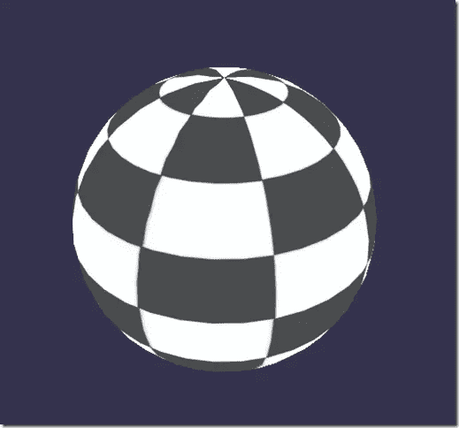

### 单元着色着色器

现在让我们来看一个更复杂的着色器:单元着色着色器。

这一个将需要得到顶点的法线和顶点在像素着色器中的位置。因此，顶点着色器将如下所示:

```
precision highp float;

// Attributes
attribute vec3 position;
attribute vec3 normal;
attribute vec2 uv;

// Uniforms
uniform mat4 world;
uniform mat4 worldViewProjection;

// Varying
varying vec3 vPositionW;
varying vec3 vNormalW;
varying vec2 vUV;

void main(void) {
    vec4 outPosition = worldViewProjection * vec4(position, 1.0);
    gl_Position = outPosition;

    vPositionW = vec3(world * vec4(position, 1.0));
    vNormalW = normalize(vec3(world * vec4(normal, 0.0)));

    vUV = uv;
}
```

请注意，我们也使用了`world`矩阵，因为位置和法向没有任何转换就被存储，我们必须应用世界矩阵来考虑物体的旋转。

像素着色器如下所示:

```
precision highp float;

// Lights
varying vec3 vPositionW;
varying vec3 vNormalW;
varying vec2 vUV;

// Refs
uniform sampler2D textureSampler;

void main(void) {
    float ToonThresholds[4];
    ToonThresholds[0] = 0.95;
    ToonThresholds[1] = 0.5;
    ToonThresholds[2] = 0.2;
    ToonThresholds[3] = 0.03;

    float ToonBrightnessLevels[5];
    ToonBrightnessLevels[0] = 1.0;
    ToonBrightnessLevels[1] = 0.8;
    ToonBrightnessLevels[2] = 0.6;
    ToonBrightnessLevels[3] = 0.35;
    ToonBrightnessLevels[4] = 0.2;

    vec3 vLightPosition = vec3(0, 20, 10);

    // Light
    vec3 lightVectorW = normalize(vLightPosition - vPositionW);

    // diffuse
    float ndl = max(0., dot(vNormalW, lightVectorW));

    vec3 color = texture2D(textureSampler, vUV).rgb;

    if (ndl > ToonThresholds[0])
    {
        color *= ToonBrightnessLevels[0];
    }
    else if (ndl > ToonThresholds[1])
    {
        color *= ToonBrightnessLevels[1];
    }
    else if (ndl > ToonThresholds[2])
    {
        color *= ToonBrightnessLevels[2];
    }
    else if (ndl > ToonThresholds[3])
    {
        color *= ToonBrightnessLevels[3];
    }
    else
    {
        color *= ToonBrightnessLevels[4];
    }

    gl_FragColor = vec4(color, 1.);
}
```

这个着色器的目标是模拟一个光，而不是计算一个平滑的阴影，我们将考虑根据特定的亮度阈值应用光。例如，如果光强度在 1(最大值)和 0.95 之间，对象的颜色(从纹理中获取)将被直接应用。如果强度介于 0.95 和 0.5 之间，颜色将衰减 0.8 倍，依此类推。

因此，这个着色器有四个步骤:

*   首先，我们声明阈值和水平常数
*   然后，我们需要使用 phong 方程来计算光照(我们认为光线没有移动):

```
vec3 vLightPosition = vec3(0, 20, 10);

// Light
vec3 lightVectorW = normalize(vLightPosition - vPositionW);

// diffuse
float ndl = max(0., dot(vNormalW, lightVectorW));
```

每个像素的光线强度取决于法线和光线方向之间的角度。

*   然后我们得到像素的纹理颜色
*   最后，我们检查阈值，并将色阶应用于颜色

结果看起来像一个卡通物体:

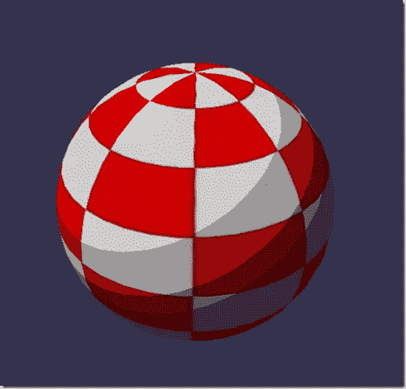

### 电话着色器

我们在前面的着色器中使用了 Phong 方程的一部分。所以我们现在就试着完全利用它吧。

这里的顶点着色器非常简单，因为所有的事情都将在像素着色器中完成:

```
precision highp float;

// Attributes
attribute vec3 position;
attribute vec3 normal;
attribute vec2 uv;

// Uniforms
uniform mat4 worldViewProjection;

// Varying
varying vec3 vPosition;
varying vec3 vNormal;
varying vec2 vUV;

void main(void) {
    vec4 outPosition = worldViewProjection * vec4(position, 1.0);
    gl_Position = outPosition;

    vUV = uv;
    vPosition = position;
    vNormal = normal;
}
```

根据等式，你必须使用光线方向和顶点的法线来计算[漫射](http://en.wikipedia.org/wiki/Diffuse_reflection?WT.mc_id=12833-DEV-sitepoint-othercontent)和[镜面部分](http://en.wikipedia.org/wiki/Specular_reflection?WT.mc_id=12833-DEV-sitepoint-othercontent):

```
precision highp float;

precision highp float;

// Varying
varying vec3 vPosition;
varying vec3 vNormal;
varying vec2 vUV;

// Uniforms
uniform mat4 world;

// Refs
uniform vec3 cameraPosition;
uniform sampler2D textureSampler;

void main(void) {
    vec3 vLightPosition = vec3(0, 20, 10);

    // World values
    vec3 vPositionW = vec3(world * vec4(vPosition, 1.0));
    vec3 vNormalW = normalize(vec3(world * vec4(vNormal, 0.0)));
    vec3 viewDirectionW = normalize(cameraPosition - vPositionW);

    // Light
    vec3 lightVectorW = normalize(vLightPosition - vPositionW);
    vec3 color = texture2D(textureSampler, vUV).rgb;

    // diffuse
    float ndl = max(0., dot(vNormalW, lightVectorW));

    // Specular
    vec3 angleW = normalize(viewDirectionW + lightVectorW);
    float specComp = max(0., dot(vNormalW, angleW));
    specComp = pow(specComp, max(1., 64.)) * 2.;

    gl_FragColor = vec4(color * ndl + vec3(specComp), 1.);
}
```

我们已经在前面的着色器中使用了漫反射部分，所以这里我们只需要添加镜面反射部分。维基百科文章中的这张图片很好地解释了着色器的工作原理:

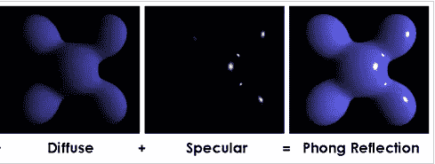

我们星球上的结果:

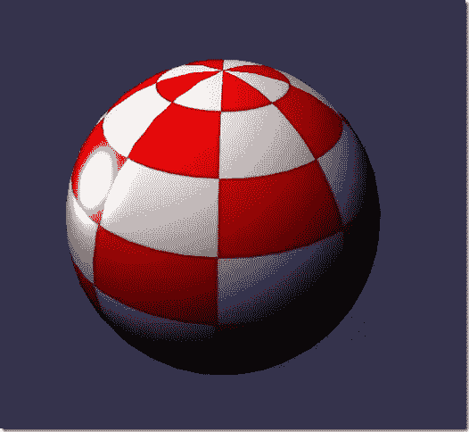

### 丢弃着色器

对于丢弃着色器，我想引入一个新概念:`discard`关键字。

这个着色器将丢弃每一个非红色的像素，并将创建一个挖掘对象的幻觉。

顶点着色器与基本着色器使用的相同:

```
precision highp float;

// Attributes
attribute vec3 position;
attribute vec3 normal;
attribute vec2 uv;

// Uniforms
uniform mat4 worldViewProjection;

// Varying
varying vec2 vUV;

void main(void) {
    gl_Position = worldViewProjection * vec4(position, 1.0);

    vUV = uv;
}
```

例如，当绿色成分太高时，像素着色器必须测试颜色并使用`discard`:

```
precision highp float;

varying vec2 vUV;

// Refs
uniform sampler2D textureSampler;

void main(void) {
    vec3 color = texture2D(textureSampler, vUV).rgb;

    if (color.g > 0.5) {
        discard;
    }

    gl_FragColor = vec4(color, 1.);
}
```

结果很有趣:

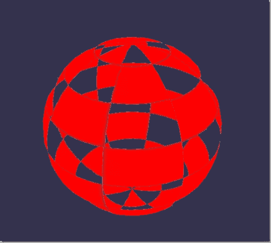

### 波浪着色器

我们已经玩了很多像素着色器，但我也想告诉你，我们可以用顶点着色器做很多事情。

对于波浪着色器，我们将重用 Phong 像素着色器。

顶点着色器将使用名为`time`的制服来获得一些动画值。使用这种统一，着色器将生成具有顶点位置的波:

```
precision highp float;

// Attributes
attribute vec3 position;
attribute vec3 normal;
attribute vec2 uv;

// Uniforms
uniform mat4 worldViewProjection;
uniform float time;

// Varying
varying vec3 vPosition;
varying vec3 vNormal;
varying vec2 vUV;

void main(void) {
    vec3 v = position;
    v.x += sin(2.0 * position.y + (time)) * 0.5;

    gl_Position = worldViewProjection * vec4(v, 1.0);

    vPosition = position;
    vNormal = normal;
    vUV = uv;
}
```

对`position.y`应用正弦，结果如下:

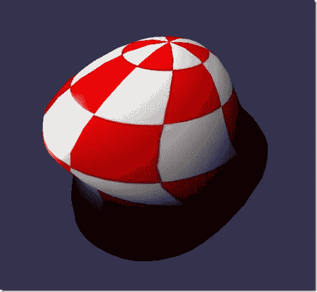

### 球形环境映射

这个很大程度上是受这个教程的启发。我将让您阅读这篇优秀的文章，并使用相关的着色器。

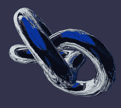

### Fresnel 明暗器

最后，我想用我最喜欢的菲涅耳着色器来结束这篇文章。

该着色器用于根据视图方向和顶点法线之间的角度应用不同的强度。

顶点着色器与单元着色着色器使用的相同，我们可以在像素着色器中轻松计算[菲涅耳项](http://en.wikipedia.org/wiki/Fresnel_term?WT.mc_id=12833-DEV-sitepoint-othercontent)(因为我们有法线和相机的位置，可用于评估视图方向):

```
precision highp float;

// Lights
varying vec3 vPositionW;
varying vec3 vNormalW;

// Refs
uniform vec3 cameraPosition;
uniform sampler2D textureSampler;

void main(void) {
    vec3 color = vec3(1., 1., 1.);
    vec3 viewDirectionW = normalize(cameraPosition - vPositionW);

    // Fresnel
    float fresnelTerm = dot(viewDirectionW, vNormalW);
    fresnelTerm = clamp(1.0 - fresnelTerm, 0., 1.);

    gl_FragColor = vec4(color * fresnelTerm, 1.);
}
```

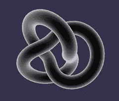

## 你的着色器？

现在，您可以更好地创建自己的着色器了。欢迎使用这里的评论或下面链接的 babylon.js 论坛来分享你的实验！

如果你想更进一步，这里有一些有用的链接:

*   [Babylon.js 回购](https://github.com/BabylonJS/Babylon.js)
*   [Babylon.js 论坛](http://www.html5gamedevs.com/forum/16-babylonjs/)
*   [CYOS](http://www.babylonjs.com/CYOS?WT.mc_id=12833-DEV-sitepoint-othercontent)
*   [维基百科上的 GLSL](http://en.wikipedia.org/wiki/OpenGL_Shading_Language)
*   [GLSL 文档](https://www.opengl.org/documentation/glsl/)

以及更多信息:

*   [web GL 3D 和 HTML5 以及巴比伦介绍。JS](http://www.microsoftvirtualacademy.com/training-courses/introduction-to-webgl-3d-with-html5-and-babylon-js/?WT.mc_id=12833-DEV-sitepoint-othercontent)
*   [HTML 中的前沿图形](http://channel9.msdn.com/events/Build/2014/3-558/?WT.mc_id=12833-DEV-sitepoint-othercontent)

或者，退一步讲，我们团队的 JavaScript 学习系列:

*   [让你的 HTML/JavaScript 更快的实用性能技巧](http://channel9.msdn.com/Series/Practical-Performance-Tips-to-Make-Your-HTMLJavaScript-Faster/06/?WT.mc_id=12833-DEV-sitepoint-othercontent)(从响应式设计到休闲游戏再到性能优化的 7 部分系列)
*   现代网络平台快速启动(HTML、CSS 和 JS 的基础)
*   [使用 HTML 和 JavaScript JumpStart 开发通用 Windows 应用](http://www.microsoftvirtualacademy.com/training-courses/developing-universal-windows-apps-with-html-and-javascript-jump-start?WT.mc_id=12833-DEV-sitepoint-othercontent)(使用您已经创建的 JS 来构建应用)

当然，我们随时欢迎您使用我们的一些免费工具来构建您的下一次网络体验: [Visual Studio 社区](http://www.asp.net/get-started/websites?WT.mc_id=12779-DEV-sitepoint-link)、 [Azure 试用版](http://azure.microsoft.com/en-us/develop/net/aspnet/?WT.mc_id=12779-DEV-sitepoint-link)和[用于 Mac、Linux 或 Windows 的跨浏览器测试工具](http://modern.ie/?utm_source=SitePoint&utm_medium=other&utm_campaign=SitePoint)。

本文是微软网站开发技术系列的一部分。我们很高兴与你分享斯巴达项目的[和它的](http://blogs.msdn.com/b/ie/archive/2015/01/22/project-spartan-and-the-windows-10-january-preview-build.aspx/?WT.mc_id=12833-DEV-sitepoint-othercontent)[新渲染引擎](http://blogs.msdn.com/b/ie/archive/2015/02/26/a-break-from-the-past-the-birth-of-microsoft-s-new-web-rendering-engine.aspx?WT.mc_id=12833-DEV-sitepoint-othercontent)。在 [modern 获得免费虚拟机或在您的 Mac、iOS、Android 或 Windows 设备上进行远程测试。即](http://modern.ie/?utm_source=SitePoint&utm_medium=other&utm_campaign=SitePoint)。

## 分享这篇文章