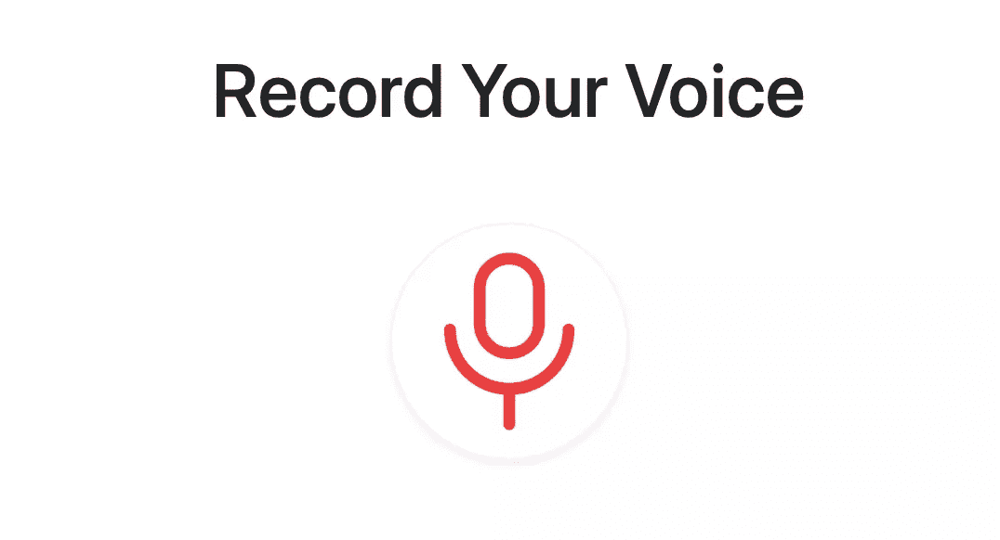
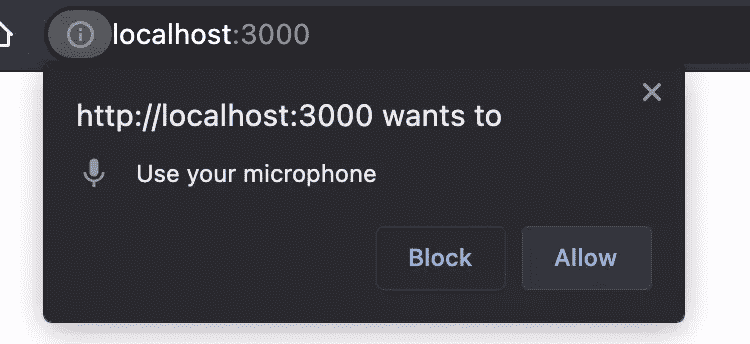
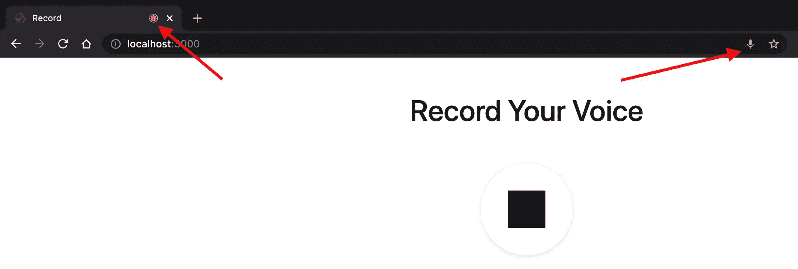
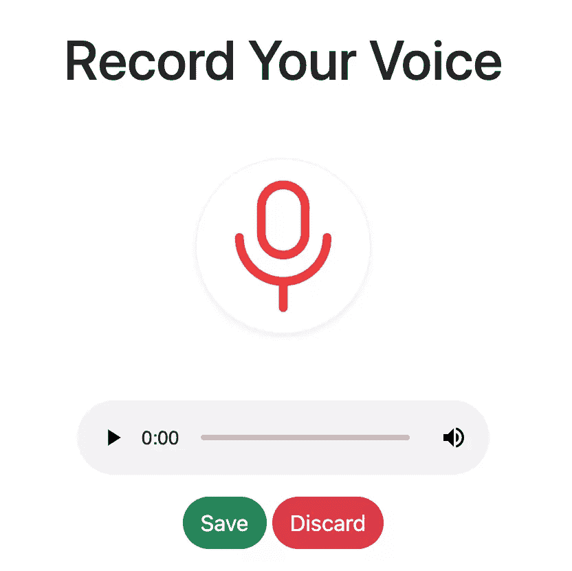
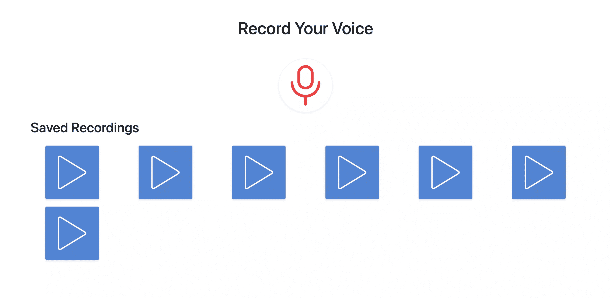

# 如何使用 MediaStream API 录制音频

> 原文：<https://www.sitepoint.com/mediastream-api-record-audio/>

**[Media Capture and Streams API](https://developer.mozilla.org/en-US/docs/Web/API/Media_Streams_API)(又名 MediaStream API)允许您从用户的麦克风中录制音频，然后获取录制的音频或媒体元素作为轨道。然后，您可以在录制后直接播放这些曲目，或者将媒体上传到您的服务器。**

在本教程中，我们将创建一个网站，该网站将使用媒体流 API 来允许用户录制一些东西，然后将录制的音频上传到服务器进行保存。用户还可以看到和播放所有上传的录像。

你可以在 GitHub 库中找到本教程的完整代码。

## 设置服务器

我们将首先创建一个 [Node.js](https://nodejs.org/en/) 和 [Express](https://expressjs.com) 服务器。因此，首先确保[下载并安装 Node.js](https://www.sitepoint.com/quick-tip-multiple-versions-node-nvm/) ，如果你的机器上没有的话。

### 创建目录

创建一个保存项目的新目录，并切换到该目录:

```
mkdir recording-tutorial
cd recording-tutorial 
```

### 初始化项目

然后，用 npm 初始化项目:

```
npm init -y 
```

选项`-y`用默认值创建`package.json`。

### 安装依赖项

接下来，我们将为我们正在创建的服务器安装 Express 和 [nodemon](https://www.npmjs.com/package/nodemon) 以在有任何更改时重启服务器:

```
npm i express nodemon 
```

### 创建 Express 服务器

我们现在可以从创建一个简单的服务器开始。在项目的根目录下创建`index.js`,内容如下:

```
const path = require('path');
const express = require('express');
const app = express();
const port = process.env.PORT || 3000;

app.use(express.static('public/assets'));

app.listen(port, () => {
  console.log(`App listening at http://localhost:${port}`);
}); 
```

这创建了一个将在端口`3000`上运行的服务器，除非在环境中设置了端口，并且它公开了一个目录`public/assets`——我们将很快创建它——它将保存 JavaScript 和 CSS 文件和图像。

### 添加脚本

最后，在`package.json`中的`scripts`下添加一个`start`脚本:

```
"scripts": {
  "start": "nodemon index.js"
}, 
```

### 启动 web 服务器

让我们测试我们的服务器。运行以下命令启动服务器:

```
npm start 
```

服务器应该从端口 3000 开始。您可以尝试在`localhost:3000`访问它，但是您会看到一条消息说“无法获取/”，因为我们还没有定义任何路线。

## 创建录制页面

接下来，我们将创建将成为网站主页的页面。用户将使用此页面来录制、查看和播放录制内容。

创建`public`目录，并在其中创建一个包含以下内容的`index.html`文件:

```
<!DOCTYPE html>
<html lang="en">
<head>
  <meta charset="UTF-8">
  <meta http-equiv="X-UA-Compatible" content="IE=edge">
  <meta name="viewport" content="width=device-width, initial-scale=1.0">
  <title>Record</title>
  <link href="https://cdn.jsdelivr.net/npm/bootstrap@5.1.0/dist/css/bootstrap.min.css" rel="stylesheet"
    integrity="sha384-KyZXEAg3QhqLMpG8r+8fhAXLRk2vvoC2f3B09zVXn8CA5QIVfZOJ3BCsw2P0p/We" crossorigin="anonymous">
  <link href="/css/index.css" rel="stylesheet" />
</head>
<body class="pt-5">
  <div class="container">
    <h1 class="text-center">Record Your Voice</h1>
    <div class="record-button-container text-center mt-5">
      <button class="bg-transparent border btn record-button rounded-circle shadow-sm text-center" id="recordButton">
        
      </button>
    </div>
  </div>
</body>
</html> 
```

该页面使用 [Bootstrap 5](https://www.sitepoint.com/bootstrap-5-new-features-examples/) 进行样式设计。目前，该页面只显示了一个按钮，用户可以使用它来进行录制。

请注意，我们对麦克风使用了图像。你可以在 [Iconscout](https://iconscout.com/icon/microphone-2666576) 上下载图标，也可以在[的 GitHub 库](https://github.com/sitepoint-editors/mediastream-tutorial/blob/master/public/asseimg/microphone.png)中使用修改后的版本。

下载图标并将其放在名称为`microphone.png`的`public/assets/images`中。

### 添加样式

我们还链接了样式表`index.css`，因此创建一个包含以下内容的`public/assets/css/index.css`文件:

```
.record-button {
  height: 8em;
  width: 8em;
  border-color: #f3f3f3 !important;
}

.record-button:hover {
  box-shadow: 0 .5rem 1rem rgba(0,0,0,.15)!important;
} 
```

### 创建路线

最后，我们只需要在`index.js`中添加新的路线。在`app.listen`前增加以下内容:

```
app.get('/', (req, res) => {
  res.sendFile(path.join(__dirname, 'public/index.html'));
}); 
```

如果服务器还没有运行，用`npm start`启动服务器。然后在浏览器中进入`localhost:3000`。您会看到一个录制按钮。



目前，这个按钮没有任何作用。我们需要绑定一个点击事件来触发记录。

用以下内容创建一个`public/assets/js/record.js`文件:

```
//initialize elements we'll use
const recordButton = document.getElementById('recordButton');
const recordButtonImage = recordButton.firstElementChild;

let chunks = []; //will be used later to record audio
let mediaRecorder = null; //will be used later to record audio
let audioBlob = null; //the blob that will hold the recorded audio 
```

我们正在初始化稍后会用到的变量。然后创建一个`record`函数，它将是`recordButton`上的 click 事件的事件监听器:

```
function record() {
  //TODO start recording
}

recordButton.addEventListener('click', record); 
```

我们还将这个函数作为事件监听器附加到 record 按钮上。

### 媒体录制

为了开始记录，我们需要使用[media devices . getuser media()](https://developer.mozilla.org/en-US/docs/Web/API/MediaDevices/getUserMedia)方法。

这种方法允许我们获得一个流，并记录用户的音频和/或视频，只有当用户为网站提供许可这样做。`getUserMedia`方法允许我们访问本地输入设备。

`getUserMedia`接受 [MediaStreamConstraints](https://developer.mozilla.org/en-US/docs/Web/API/MediaStreamConstraints) 的对象作为参数，该对象包含一组约束，这些约束指定我们将从`getUserMedia`获得的流中的预期媒体类型。这些约束可以是带有布尔值的音频和视频。

如果该值为假，则意味着我们对访问该设备或录制该媒体不感兴趣。

`getUserMedia`回报承诺。如果用户允许网站记录，promise 的实现处理器会收到一个 [MediaStream](https://developer.mozilla.org/en-US/docs/Web/API/MediaStream) 对象，我们可以用它来媒体捕获用户的视频或音频流。

#### 媒体捕获和流

为了使用 MediaStream API 对象来捕获媒体轨道，我们需要使用 [MediaRecorder](https://developer.mozilla.org/en-US/docs/Web/API/MediaRecorder) 接口。我们需要创建一个新的接口对象，它接受构造函数中的 MediaStream 对象，并允许我们通过它的方法轻松控制录制。

在`record`函数中，添加以下内容:

```
//check if browser supports getUserMedia
if (!navigator.mediaDevices || !navigator.mediaDevices.getUserMedia) {
  alert('Your browser does not support recording!');
  return;
}

// browser supports getUserMedia
// change image in button
recordButtonImage.src =img/${mediaRecorder && mediaRecorder.state === 'recording' ? 'microphone' : 'stop'}.png`;
if (!mediaRecorder) {
  // start recording
  navigator.mediaDevices.getUserMedia({
    audio: true,
  })
    .then((stream) => {
      mediaRecorder = new MediaRecorder(stream);
      mediaRecorder.start();
      mediaRecorder.ondataavailable = mediaRecorderDataAvailable;
      mediaRecorder.onstop = mediaRecorderStop;
    })
    .catch((err) => {
      alert(`The following error occurred: ${err}`);
      // change image in button
      recordButtonImage.src =img/microphone.png';
    });
} else {
  // stop recording
  mediaRecorder.stop();
} 
```

#### 浏览器支持

我们首先检查`navigator.mediaDevices`和`navigator.mediaDevices.getUserMedia`是否被定义，因为有像 Internet Explorer、Android 上的 Chrome 或其他[不支持它的浏览器](https://developer.mozilla.org/en-US/docs/Web/API/MediaRecorder#browser_compatibility)。

此外，使用`getUserMedia`需要[安全网站](https://developer.mozilla.org/en-US/docs/Web/API/MediaDevices/getUserMedia#privacy_and_security)，这意味着要么使用 HTTPS、`file://`加载页面，要么来自`localhost`。因此，如果页面加载不安全，`mediaDevices`和`getUserMedia`将无法定义。

#### 开始录音

如果条件为假(也就是说，`mediaDevices`和`getUserMedia`都被支持)，我们首先将录制按钮的图像更改为`stop.png`，您可以从 [Iconscout](https://iconscout.com/icons/stop) 或[GitHub 库](https://github.com/sitepoint-editors/mediastream-tutorial/blob/master/public/asseimg/stop.png)下载并将其放在`public/assets/images`中。

然后，我们检查在文件开头定义的`mediaRecorder`是否为空。

如果为空，则意味着没有正在进行的记录。因此，我们使用`getUserMedia`获得一个媒体流实例来开始记录。

我们传递给它一个只有键`audio`和值`true`的对象，因为我们只是记录音频。

这是浏览器提示用户允许网站访问麦克风的地方。如果用户允许，将执行实现处理程序中的代码:

```
mediaRecorder = new MediaRecorder(stream);
mediaRecorder.start();
mediaRecorder.ondataavailable = mediaRecorderDataAvailable;
mediaRecorder.onstop = mediaRecorderStop; 
```

这里我们创建了一个新的`MediaRecorder`，将其分配给我们在文件开头定义的`mediaRecorder`。

我们将从`getUserMedia`接收的流传递给构造函数。然后，我们使用 [mediaRecorder.start()](https://developer.mozilla.org/en-US/docs/Web/API/MediaRecorder/start) 开始录制。

最后，我们将事件处理程序(我们将很快创建)绑定到两个事件，`dataavailable`和`stop`。

我们还添加了一个`catch`处理程序，以防用户不允许网站访问麦克风或任何其他可能抛出的[异常。](https://developer.mozilla.org/en-US/docs/Web/API/MediaDevices/getUserMedia#exceptions)

#### 停止录制

如果`mediaRecorder`不为空，这一切都会发生。如果它是空的，这意味着有一个正在进行的记录，用户正在结束它。因此，我们使用 [mediaRecorder.stop()](https://developer.mozilla.org/en-US/docs/Web/API/MediaRecorder/stop) 方法来停止记录:

```
} else {
  //stop recording
  mediaRecorder.stop();
} 
```

### 处理媒体录制事件

到目前为止，我们的代码在用户单击 record 按钮时开始和停止记录。接下来，我们将为`dataavailable`和`stop`添加事件处理程序。

#### 根据现有数据

当完整记录完成时，或者基于传递给`mediaRecorder.start()`的可选参数`timeslice`来指示该事件应该被触发的毫秒数，触发`dataavailable`事件。传递时间片允许对记录进行切片并以块的形式获得它。

创建`mediaRecorderDataAvailable`函数，该函数将通过将接收到的 [BlobEvent](https://developer.mozilla.org/en-US/docs/Web/API/BlobEvent) 参数中的 [Blob](https://developer.mozilla.org/en-US/docs/Web/API/Blob) 音轨添加到`chunks`数组中来处理`dataavailable`事件，该数组是我们在文件开头定义的:

```
function mediaRecorderDataAvailable(e) {
  chunks.push(e.data);
} 
```

该块将是用户录音的音频轨道的阵列。

#### 停止时

在我们创建将处理停止事件的`mediaRecorderStop`之前，让我们首先添加 HTML 元素容器，它将保存带有按钮**保存**和**丢弃**的录音。

在结束标签`</body>`之前的`public/index.html`中添加以下内容:

```
<div class="recorded-audio-container mt-5 d-none flex-column justify-content-center align-items-center"
  id="recordedAudioContainer">
  <div class="actions mt-3">
    <button class="btn btn-success rounded-pill" id="saveButton">Save</button>
    <button class="btn btn-danger rounded-pill" id="discardButton">Discard</button>
  </div>
</div> 
```

然后，在`public/assets/js/record.js`的开头，添加一个变量，该变量将成为`#recordedAudioContainer`元素的节点实例:

```
const recordedAudioContainer = document.getElementById('recordedAudioContainer'); 
```

我们现在可以实现`mediaRecorderStop`。该函数将首先移除先前记录的且未保存的任何音频元素，创建新的音频媒体元素，将`src`设置为记录流的 Blob，并显示容器:

```
function mediaRecorderStop () {
  //check if there are any previous recordings and remove them
  if (recordedAudioContainer.firstElementChild.tagName === 'AUDIO') {
    recordedAudioContainer.firstElementChild.remove();
  }
  //create a new audio element that will hold the recorded audio
  const audioElm = document.createElement('audio');
  audioElm.setAttribute('controls', ''); //add controls
  //create the Blob from the chunks
  audioBlob = new Blob(chunks, { type: 'audio/mp3' });
  const audioURL = window.URL.createObjectURL(audioBlob);
  audioElm.src = audioURL;
  //show audio
  recordedAudioContainer.insertBefore(audioElm, recordedAudioContainer.firstElementChild);
  recordedAudioContainer.classList.add('d-flex');
  recordedAudioContainer.classList.remove('d-none');
  //reset to default
  mediaRecorder = null;
  chunks = [];
} 
```

最后，我们将`mediaRecorder`和`chunks`重置为初始值，以处理接下来的记录。有了这段代码，我们的网站应该能够录制音频，当用户停止时，它允许他们播放录制的音频。

我们需要做的最后一件事是链接到`index.html`中的`record.js`。在`body`的末尾加上`script`:

```
<script src="/js/record.js"></script> 
```

### 测试记录

现在就来看看吧。在浏览器中转至`localhost:3000`，点击**记录**按钮。您将被要求允许网站使用麦克风。



*确保你在本地主机或 HTTPS 服务器上加载网站，即使你使用的是支持的浏览器。MediaDevices 和`getUserMedia`在其他情况下不可用。*

点击**允许**。然后，麦克风图像将变为停止图像。此外，您应该会在基于浏览器的地址栏中看到一个录音图标。这表示麦克风当前正被网站访问。



尝试录制几秒钟。然后点击**停止**按钮。按钮的图像会变回麦克风图像，音频播放器会出现两个按钮——**保存**和**丢弃**。



接下来，我们将实现**保存**和**放弃**按钮的点击事件。**保存**按钮应该将音频上传到服务器，而**丢弃**按钮应该将音频移除。

### 放弃 click 事件处理程序

我们将首先实现**丢弃**按钮的事件处理程序。单击该按钮应该首先向用户显示一个提示，以确认他们想要丢弃该记录。然后，如果用户确认，它将删除音频播放器并隐藏按钮。

将保存**丢弃**按钮的变量添加到`public/assets/js/record.js`的开头:

```
const discardAudioButton = document.getElementById('discardButton'); 
```

然后，将以下内容添加到文件的末尾:

```
function discardRecording () {
  //show the user the prompt to confirm they want to discard
  if (confirm('Are you sure you want to discard the recording?')) {
    //discard audio just recorded
    resetRecording();
  }
}

function resetRecording () {
  if (recordedAudioContainer.firstElementChild.tagName === 'AUDIO') {
    //remove the audio
    recordedAudioContainer.firstElementChild.remove();
    //hide recordedAudioContainer
    recordedAudioContainer.classList.add('d-none');
    recordedAudioContainer.classList.remove('d-flex');
  }
  //reset audioBlob for the next recording
  audioBlob = null;
}

//add the event listener to the button
discardAudioButton.addEventListener('click', discardRecording); 
```

你现在可以试着记录一些东西，然后点击**放弃**按钮。音频播放器将被移除，按钮将被隐藏。

## 上传到服务器

### 保存单击事件处理程序

现在，我们将实现**保存**按钮的点击处理程序。当用户点击**保存**按钮时，该处理程序将使用[获取 API](https://developer.mozilla.org/en-US/docs/Web/API/Fetch_API) 将`audioBlob`上传到服务器。

如果你不熟悉 Fetch API，你可以在我们的"[Fetch API 简介](https://www.sitepoint.com/introduction-to-the-fetch-api/)"教程中了解更多。

让我们从在项目根目录下创建一个`uploads`目录开始:

```
mkdir uploads 
```

然后，在`record.js`的开头，添加一个保存**保存**按钮元素的变量:

```
const saveAudioButton = document.getElementById('saveButton'); 
```

然后，在结尾添加以下内容:

```
function saveRecording () {
  //the form data that will hold the Blob to upload
  const formData = new FormData();
  //add the Blob to formData
  formData.append('audio', audioBlob, 'recording.mp3');
  //send the request to the endpoint
  fetch('/record', {
    method: 'POST',
    body: formData
  })
  .then((response) => response.json())
  .then(() => {
    alert("Your recording is saved");
    //reset for next recording
    resetRecording();
    //TODO fetch recordings
  })
  .catch((err) => {
    console.error(err);
    alert("An error occurred, please try again later");
    //reset for next recording
    resetRecording();
  })
}

//add the event handler to the click event
saveAudioButton.addEventListener('click', saveRecording); 
```

请注意，一旦上传了录音，我们将使用`resetRecording`为下一次录音重置音频。稍后，我们将获取所有记录，并向用户展示。

### 创建 API 端点

我们现在需要实现 API 端点。端点会将音频上传到`uploads`目录。

为了在 Express 中轻松处理文件上传，我们将使用库 [Multer](http://expressjs.com/en/resources/middleware/multer.html) 。Multer 提供了一个中间件来处理文件上传。

运行以下命令进行安装:

```
npm i multer 
```

然后，在`index.js`中，将以下内容添加到文件的开头:

```
const fs = require('fs');
const multer = require('multer');

const storage = multer.diskStorage({
  destination(req, file, cb) {
    cb(null, 'uploads/');
  },
  filename(req, file, cb) {
    const fileNameArr = file.originalname.split('.');
    cb(null, `${Date.now()}.${fileNameArr[fileNameArr.length - 1]}`);
  },
});
const upload = multer({ storage }); 
```

我们使用`multer.diskStorage`声明了`storage`，我们将它配置为将文件存储在`uploads`目录中，并且我们将基于当前时间戳和扩展名保存文件。

然后，我们声明了`upload`，它将是上传文件的中间件。

接下来，我们想让`uploads`目录中的文件可以公开访问。因此，在`app.listen`前添加以下内容:

```
app.use(express.static('uploads')); 
```

最后，我们将创建上传端点。这个端点将使用`upload`中间件上传音频并返回一个 JSON 响应:

```
app.post('/record', upload.single('audio'), (req, res) => res.json({ success: true })); 
```

中间件将处理文件上传。我们只需要将上传文件的字段名传递给`upload.single`。

请注意，通常情况下，您需要对文件执行[验证，并确保正在上传正确的、预期的文件类型。为了简单起见，我们在本教程中省略了它。](https://www.sitepoint.com/file-upload-form-express-dropzone-js#handlinguploaderrors)

### 测试上传

让我们来测试一下。再次进入浏览器的`localhost:3000`，记录一些东西，点击**保存**按钮。

请求将被发送到端点，文件将被上传，并且将向用户显示一个警告，通知他们记录已被保存。

您可以通过检查项目根目录下的`uploads`目录来确认音频确实上传了。你应该在那里找到一个 MP3 音频文件。

## 显示录像

### 创建 API 端点

我们要做的最后一件事是向用户显示所有记录，以便他们可以播放它们。

首先，我们将创建用于获取所有文件的端点。在`index.js`中的`app.listen`前增加以下内容:

```
app.get('/recordings', (req, res) => {
  let files = fs.readdirSync(path.join(__dirname, 'uploads'));
  files = files.filter((file) => {
    // check that the files are audio files
    const fileNameArr = file.split('.');
    return fileNameArr[fileNameArr.length - 1] === 'mp3';
  }).map((file) => `/${file}`);
  return res.json({ success: true, files });
}); 
```

我们只是读取`uploads`目录中的文件，过滤它们只得到`mp3`文件，并给每个文件名附加一个`/`。最后，我们返回一个带有文件的 JSON 对象。

### 添加录制容器元素

接下来，我们将添加一个 HTML 元素，它将是我们要显示的记录的容器。在正文末尾的`record.js`脚本之前添加以下内容:

```
<h2 class="mt-3">Saved Recordings</h2>
<div class="recordings row" id="recordings">

</div> 
```

### 从 API 获取文件

还要在`record.js`的开头添加保存`#recordings`元素的变量:

```
const recordingsContainer = document.getElementById('recordings'); 
```

然后，我们将添加一个`fetchRecordings`函数来调用我们之前创建的端点，然后使用`createRecordingElement`函数来呈现音频播放器的元素。

我们还将为播放音频的按钮上的点击事件添加一个`playRecording`事件监听器。

在`record.js`的末尾增加以下内容:

```
function fetchRecordings () {
  fetch('/recordings')
  .then((response) => response.json())
  .then((response) => {
    if (response.success && response.files) {
      //remove all previous recordings shown
      recordingsContainer.innerHTML = '';
      response.files.forEach((file) => {
        //create the recording element
        const recordingElement = createRecordingElement(file);
        //add it the the recordings container
        recordingsContainer.appendChild(recordingElement);
      })
    }
  })
  .catch((err) => console.error(err));
}

//create the recording element
function createRecordingElement (file) {
  //container element
  const recordingElement = document.createElement('div');
  recordingElement.classList.add('col-lg-2', 'col', 'recording', 'mt-3');
  //audio element
  const audio = document.createElement('audio');
  audio.src = file;
  audio.onended = (e) => {
    //when the audio ends, change the image inside the button to play again
    e.target.nextElementSibling.firstElementChild.src = 'images/play.png';
  };
  recordingElement.appendChild(audio);
  //button element
  const playButton = document.createElement('button');
  playButton.classList.add('play-button', 'btn', 'border', 'shadow-sm', 'text-center', 'd-block', 'mx-auto');
  //image element inside button
  const playImage = document.createElement('img');
  playImage.src =img/play.png';
  playImage.classList.add('img-fluid');
  playButton.appendChild(playImage);
  //add event listener to the button to play the recording
  playButton.addEventListener('click', playRecording);
  recordingElement.appendChild(playButton);
  //return the container element
  return recordingElement;
}

function playRecording (e) {
  let button = e.target;
  if (button.tagName === 'IMG') {
    //get parent button
    button = button.parentElement;
  }
  //get audio sibling
  const audio = button.previousElementSibling;
  if (audio && audio.tagName === 'AUDIO') {
    if (audio.paused) {
      //if audio is paused, play it
      audio.play();
      //change the image inside the button to pause
      button.firstElementChild.src = 'images/pause.png';
    } else {
      //if audio is playing, pause it
      audio.pause();
      //change the image inside the button to play
      button.firstElementChild.src = 'images/play.png';
    }
  }
} 
```

注意，在`playRecording`函数中，我们使用`audio.paused`来检查音频是否正在播放，如果此时音频没有播放，它将返回 true。

我们还使用了[播放](https://iconscout.com/icons/play)和[暂停](https://iconscout.com/icons/pause)图标，这些图标将显示在每个记录中。你可以从[图标侦察](https://iconscout.com)或者 [GitHub 库](https://github.com/sitepoint-editors/mediastream-tutorial/tree/master/public/assets/images)获得这些图标。

当页面加载和新记录上传时，我们将使用`fetchRecordings`。

因此，调用在`record.js`末尾和`saveRecording`中的实现处理器内部的函数来代替`TODO`注释:

```
.then(() => {
  alert("Your recording is saved");
  //reset for next recording
  resetRecording();
  //fetch recordings
  fetchRecordings();
}) 
```

### 添加样式

我们需要做的最后一件事是给我们正在创建的元素添加一些样式。将以下内容添加到`public/assets/css/index.css`:

```
.play-button:hover {
  box-shadow: 0 .5rem 1rem rgba(0,0,0,.15)!important;
}

.play-button {
  height: 8em;
  width: 8em;
  background-color: #5084d2;
} 
```

### 测试一切

现在都准备好了。在浏览器中打开`localhost:3000`上的网站，如果您之前上传过任何录像，您现在就可以看到它们。你也可以试着上传新的，看看列表更新。

用户现在可以记录他们的声音，保存或丢弃它们。用户还可以查看并播放所有上传的录像。



## 结论

使用 MediaStream API 允许我们为用户添加媒体功能，例如录制音频。MediaStream Web API 还允许录制视频、截图等等。遵循本教程中给出的信息，以及由 [MDN](https://developer.mozilla.org/en-US/docs/Web/API/WebRTC_API/Taking_still_photos#get_the_video) 和 [SitePoint](https://www.google.com/search?q=MediaStream+API+site:sitepoint.com) 提供的有用教程，你将能够在你的网站上添加其他所有的媒体功能。

## 分享这篇文章