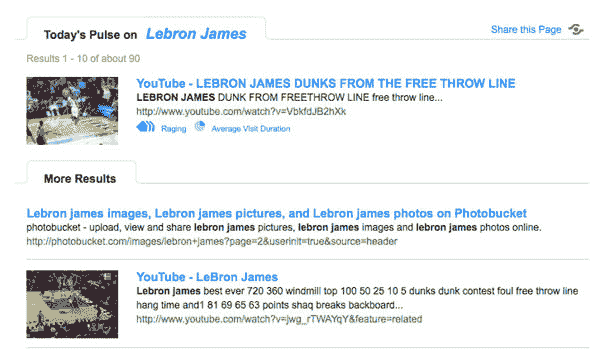

# Me.dium 重新推出社交搜索引擎 OneRiot

> 原文：<https://www.sitepoint.com/medium-relaunches-as-social-search-engine-oneriot/>

当 Me.dium 在 2007 年 2 月的演示上发布时，我承认我并没有真正理解它。该公司最初是一个“社交浏览”工具，允许人们在查看同一页面的同时与其他用户互动——本质上是通过浏览器插件在网页上添加一个聊天层。那从来都不是我真正感兴趣的东西。我宁愿看我正在浏览的网页，也不愿和陌生人谈论看网页的事。

我怀疑 Me.dium 的人最终开始意识到，他们从用户那里收集的关于浏览习惯的实时信息比他们提供的服务更有价值。这只是我的猜测，但在今年夏天，Me.dium 推出了一个基于雅虎的社交搜索引擎。从安装了社交浏览工具栏的 200 万人中收集数据。

medium 搜索产品通过一系列关于 medium 用户如何与该页面互动的指标来增强搜索结果，包括在该页面上花费的时间、访问者的频率和数量，以及最近一段时间流量是如何激增或持平的。结果是一个搜索引擎可以帮助人们从他们的查询结果中找到最受欢迎的内容。

本周，Me.dium 重新推出了 OneRiot T1，这是他们社交搜索产品的简化版。OneRiot 免除了详细的 buzz 指标，而是基于用户与网页的交互对结果进行重新排序。任何包含当前流行趋势的搜索结果都将被指定为“今天的脉搏”，并标有“新兴”、“激增”或“肆虐”图标，以及描述用户在该网站上花费的平均时间的图标。

“当你用 OneRiot 搜索时，你会发现网络的脉搏，”OneRiot 首席执行官金巴尔·马斯克在一份新闻稿中说。“OneRiot 社区有 200 多万人，他们在冲浪时分享对他们来说重要的东西。它们帮助我们找到与任何搜索查询相关的最新内容来阅读或观看。”

例如，搜索[ [乔治·布什](http://www.oneriot.com/search?q=George+Bush&st=) ]会返回一组当前流行的结果，包括 YouTube 上一段最近演讲的视频和两篇最近的新闻文章。在谷歌上，同样的搜索会出现美国总统的维基百科页面和白宫的官方页面——这是很好的信息，但如果你在寻找更近一点的信息，就没什么帮助了。

OneRiot 正在推动一个名为 PulseChecker 的 Firefox 插件，它将给出网络上任何页面的流行度和持续时间。想必这也是他们继续收集用户数据的方式，因为现在媒体已经过时了。

OneRiot 有点像网络上的尼尔森电视收视率系统。这是一种有趣的搜索方式，有些人可能会觉得有用，但它很难成为游戏规则的改变者。OneRiot 可能能够比主要搜索引擎更好、更快地为搜索者突出显示热门内容，但对这家总部位于科罗拉多州博尔德的初创公司来说，坏消息是主要搜索引擎可以访问相同的数据(甚至更好的数据)。

如果这种类型的搜索引擎最终吸引了消费者，谷歌从他们的谷歌工具栏产品中转换受欢迎程度指标并不困难——谷歌工具栏产品比 OneRiot 的用户多得多。事实上，我们[在 7 月](https://www.sitepoint.com/microsofts-answer-to-pagerank-browserank/)报道称，微软的研究人员正在研究一种搜索排名算法，该算法正是这样做的——根据用户当前的互动方式对页面进行排名。

## 分享这篇文章