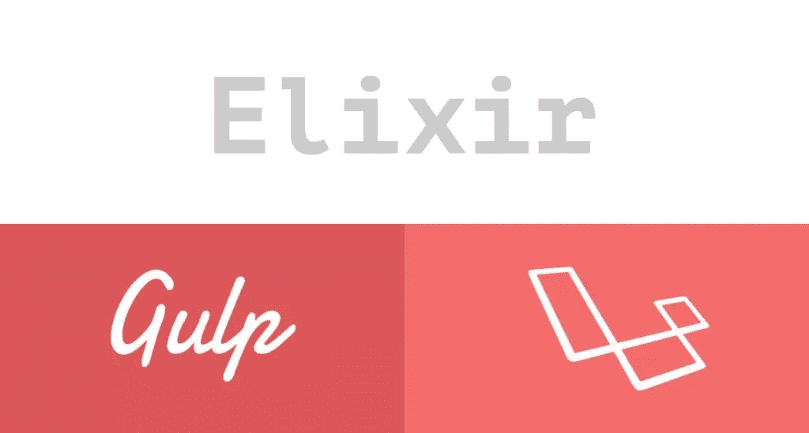

# 见见 Elixir，汇编资产的 Laravel 方法

> 原文：<https://www.sitepoint.com/meet-elixir-the-laravel-way-of-compiling-assets/>

非常感谢[贾德·茹布兰](https://github.com/jadjoubran)、[加布里埃尔·泽比布](https://github.com/gabrielzerbib)、[安东尼·钱伯斯](https://github.com/Antnee)和[斯科特·莫利纳里](https://github.com/smolinari)对[这篇文章进行了同行评审](https://www.sitepoint.com/introduction-to-sitepoints-peer-review/)，也感谢 SitePoint 的所有同行评审人员使 SitePoint 的内容尽可能地做到最好！

* * *

在今天的 web 应用程序中，我们使用各种各样的工具来加速开发工作流，同时尽可能保持代码库的精简。然而，这些工具可能会减慢这个过程，因为其中一些工具需要编译代码，这需要时间。

一种这样的工具是 CSS 和 JavaScript 的预处理程序。它们减少了样式表和 JavaScript 文件中的代码量，但我们仍然需要通过运行正确的编译器将它们编译成普通的 CSS 和 JavaScript。一段时间后，这将成为一个无聊的任务，我们忘记运行一些东西的机会将会增加。

除了预处理程序，我们作为开发人员也经常要做很多工作，包括林挺 JS 文件、测试、连接、缩小等等。

所有这些导致了基于 JavaScript 的任务运行器的产生，比如 [Grunt](http://gruntjs.com/) 和 [Gulp](http://gulpjs.com/) 。这些应用程序的目的是自动化我们在开发工作流程中需要重复执行的任务。

Gulp 语法简洁易用，但总有余地用更简单的方式做事。Laravel 5 推出了 **Elixir** :由 [Jeffrey Way](https://twitter.com/jeffrey_way) 开发的基于 Node.js 的工具，它以简单的方式管理我们的吞咽任务。



在本教程中，我们将学习如何使用 Elixir 通过几行代码来管理我们的 Gulp 任务。本文主要关注 Laravel 环境中的资产编译，尽管我们也将尝试涵盖其他环境中的使用。

## 要求和安装

要运行 Elixir，我们需要在机器上安装以下工具:

1.  [Node.js](https://nodejs.org/)
2.  [一饮而尽](http://gulpjs.com/)
3.  [Laravel 酏剂](https://github.com/laravel/elixir)

### 节点. js

因为 Gulp 是在 Node.js 内部运行的，所以我们需要确保 Node.js 已经安装。如果我们正在使用[家园改进版](https://www.sitepoint.com/quick-tip-get-homestead-vagrant-vm-running/)，那么我们已经准备好了，否则我们必须[安装 Node.js](https://nodejs.org/) 。

### Gulp.js

如前所述，Elixir 是 Gulp 的包装器，所以我们也需要运行 Gulp。

如果它还没有安装(如果我们使用的是[家园改进版](https://www.sitepoint.com/quick-tip-get-homestead-vagrant-vm-running/)，它已经安装了)，我们可以通过`npm`安装它:

```
npm install --global gulp 
```

### 拉勒维尔酏剂

在 Laravel 的根目录中，有一个`package.json`文件，该文件已经将`laravel-elixir 3.0.0,`作为依赖项。为了安装它，我们从那个目录中运行`npm install`。

#### 在其他环境中安装 Elixir

要在 Laravel 以外的环境中安装 Elixir 3:

```
npm install laravel-elixir --save 
```

## 开始之前

了解 Elixir 假设所有的源文件(`.less`、`.sass`、`.coffee`等)是有用的。)位于`./resources/assets/`。默认情况下，输出文件会被复制到`./public`目录下:

| 文件类型 | 基本源路径 | 输出路径 |
| --- | :-: | --: |
| 较少的 | 。/资源/资产/更少 | 。/public/css |
| 厚颜无耻 | 。/资源/资产/sass | 。/public/css |
| 咖啡脚本 | 。/资源/资产/咖啡 | 。/public/js |

为了创建一个 Elixir 任务，我们需要调用我们的`gulpfile.js`文件中的`elixir`函数。这个函数接受一个回调，并以一个对象作为参数。这个名为`mix`的对象公开了 Elixir 提供的所有现成可用的方法。

```
// ...
elixir(function(mix) {
  mix.less('styles.less');
}); 
```

如果我们传递一个文件数组或者一个匹配一组文件的通配符，所有的文件都会被编译并且**连接**成一个**单个**文件。CSS 和 JavaScript 文件的输出文件名分别是`app.css`或`app.js`。

如果我们将一个文件名传递给某个方法，它将被编译成一个同名的文件。例如，如果我们传递`styles.less`，输出文件名将是`styles.css`。

然而，所有这些缺省值都可以通过方法的参数或 Elixir 的`config`对象进行定制，我们稍后将对此进行讨论。

## 让我们看看一些行动

Elixir 提供了现成的基本任务，包括编译、连接、缩小、运行测试套件等任务。

### 编译较少的文件

为了编译更少的文件，我们需要调用`mix`对象的`less()`方法:

```
elixir(function(mix) {
    mix.less("styles.less");
}); 
```

在上面的任务中，Elixir 假设`styles.less`位于`resources/assets/less`路径下。编译完成后，它会将输出文件保存为`public/css/styles.css`。

对于`.sass`文件也是如此，我们只需要将方法改为`sass()`，如下所示:

```
elixir(function(mix) {
    mix.sass("styles.sass");
}); 
```

请注意，默认情况下，Elixir 假定 Sass 文件位于`resources/assets/sass`中。

很高兴知道 Elixir 也将在我们的样式表中处理**供应商前缀**，所以我们只需要编写标准语法。

### 编译 CoffeeScript 文件

好了，现在让我们看看 CoffeeScript 文件是如何编译的:

```
elixir(function(mix) {
    mix.coffee(['controllers.coffee', 'services.coffee']);
}); 
```

同样，Elixir 查看`resources/assets/coffee/`内部，将所有的`.coffee`文件编译成 JavaScript 代码，并将它们作为`app.js`复制到`public/js`目录中

就这么简单！

## 更深入

### 编译多个文件

像`sass()`、`less()`、`coffee()`这样的仙丹方法都遵循同样的原型。我们既可以传递单个文件名、通配符、文件名数组，也可以不传递任何参数。

要编译多个 Less 文件:

```
elixir(function(mix) {
  mix.less([
  'base.less',
  'styles.less',
  'custom.less'
  ]);
}); 
```

因此，输出将被编译到`public/css/app.css`。

其他方法也是如此，如`sass()`、`coffee()`等。

### 不同的源和输出目录

如果我们的源或输出路径不同于默认路径，我们可以用三种方法改变它们以与我们的目录布局兼容。

#### 使用参数

所有方法都接受第二个参数，它定义了基本的**输出**目录:

```
elixir(function(mix) {
  mix.less([
  'base.less',
  'styles.less'
  'custom.less'
  ], 'resources/build/css');
}); 
```

因此，上面的任务会将较少的文件编译到`resources/build/css/app.css`。

要更改输出**文件名**，我们可以在参数中包含文件名:

```
elixir(function(mix) {
  mix.less([
  'base.less',
  'styles.less'
  'custom.less'
  ], 'resources/build/css/styles.css');
}); 
```

#### 提供完整路径

除了定制基本的源和输出路径，我们还可以传递带有前缀`./`的文件的完整路径。如果给定的路径以句点为前缀，Elixir 将假设用户希望从项目的根目录开始。

```
elixir(function(mix) {
  mix.less(['./resources/assets/src/less/base.less']);
}); 
```

#### 使用配置对象

定制默认基本源和输出路径的首选方式是更改 Elixir 的`config`对象中的`css.output`和`js.output`设置。我们将在*配置药剂*一节中讨论。

### 串联文件

Elixir 提供了几种连接样式表和 JavaScript 文件的方法，使用`scripts()`连接 JavaScript，使用`styles()`连接 CSS 文件。

```
elixir(function(mix) {
  mix.styles(['base.css', 'customized.css'])
     .scripts(['app.js', 'code.js']);
}); 
```

#### 用于连接的基本源和输出路径

方法`scripts()`和`styles()`默认假设源文件位于`public/js`和`resources/assets/css`中。编译后，串接的版本将被复制到`public/js`和`public/css`:

| 类型 | 基本源路径 |
| --- | --- |
| 半铸钢ˌ钢性铸铁(Cast Semi-Steel) | 。/资源/资产/css |
| Java Script 语言 | 。/public/js |

对于基本输出路径和基本源路径，这两个方法还接受第二个和第三个参数。

#### 基本输出路径

要改变输出路径，我们可以这样做:

```
elixir(function(mix) {
  mix.styles(['base.css', 'customized.css'], 
              'public/build/css')

     .scripts(['app.js', 'code.js'],
               'public/build/js')
}); 
```

默认情况下，CSS 的串联输出文件名为`all.css`，JavaScript 文件的串联输出文件名为`all.js`。我们可以通过在参数中包含文件名来改变这一点:

```
elixir(function(mix) {
  mix.styles(['base.css', 'customized.css'], 
              'public/build/css/application.css')

     .scripts(['app.js', 'code.js'],
               'public/build/js/application.js');
}); 
```

因此，输出将被保存为`application.js`和`application.css`。

#### 基本源路径

我们可以通过第三个参数来更改基**源**路径:

```
elixir(function(mix) {
  mix.styles(['base.css', 'customized.css'],          
                'public/build/css/application.css',
                'public/css')

  .scripts(['app.js', 'code.js'],
            'public/build/js/application.js',
            'public/js');
}); 
```

#### 连接所有文件

如果我们需要连接**某个目录下的所有**文件，我们可以使用`scriptsIn()`和`stylesIn()`快捷方式:

```
elixir(function(mix) {
  mix.scriptsIn('public/js')
     .stylesIn('public/css')
}); 
```

### 玉刃编译

本节将介绍如何将 Jade 文件编译成刀片模板。

仙丹不支持玉刃开箱编译。然而，这可以通过使用名为`laravel-elixir-jade`的`npm`包来实现。它将`jade`文件编译成`.blade.php`文件。

要安装`laravel-elixir-jade`:

```
npm install laravel-elixir-jade@0.1.8 --save-dev 
```

因此，`laravel-elixir-jade`将被安装并添加到我们的`package.json`文件中的`devDependencies`中。

Elixir 假设`jade`文件位于`resources/jade`中，它会将输出文件复制到`resources/views`。

为了编译`.jade`文件，我们使用了`jade`方法:

```
var elixir = require('laravel-elixir');
require('laravel-elixir-jade');

elixir(function(mix) {
    mix.jade({
        search: '**/*.jade'
        });
}); 
```

`jade()`期望一个包含所有可能选项的对象:

```
{
    baseDir: './resources',
    blade: true,
    dest: '/views/',
    pretty: true,
    search: '**/*.jade',
    src: '/jade/'
} 
```

所有选项都是不言自明的:`baseDir`、`dest`、`search`和`src`定义了源和输出目录。

`pretty`指示 Elixir 保留所有换行和缩进。默认是`true`。

通过将`blade`设置为`false`，我们指示 Elixir 编译为`.php`文件，而不是`.blade.php`文件。

还有一个由 [@franzose](https://github.com/franzose) 开发的[玉石混合料](https://gist.github.com/franzose/280218e54f559040039f)的有用集合。

### 文件版本控制

Elixir 还提供了一个版本控制特性，可以在文件名后面附加一个惟一的散列。这将阻止浏览器从其缓存中加载资源文件。过去，我们必须以查询字符串(？v=2)，但现在不是了！

通过使用长生不老药的`version()`方法，事情现在变得简单多了。我们唯一需要传递给`version()`方法的是文件的**完整**路径:

```
elixir(function(mix) {
    mix.version("./public/build/js/all.css");
});

// We can also pass an array to the version method.
elixir(function(mix) {
    mix.version(['./public/build/js/all.js', 
                 './public/build/js/code.js']);
}); 
```

这样一来，文件名就会变成类似于:`styles.all-16d570a7.css`的东西。然而，记住这个名字是另一个问题。好的一面是，我们不需要自己处理这个问题，因为 Laravel 已经帮我们处理好了。

在我们的刀片视图中，我们可以使用`elixir()`辅助函数来引用散列文件:

```
@block('stylesheets')
    <link rel="stylesheet" type="text/css" href="{{ elixir("styles.all.css") }}">
@endblock 
```

我们只需要传递原始文件名，就像我们不需要散列一样。

从 Elixir 3.0 开始，我们需要提供文件的完整路径。这意味着我们甚至可以对项目中的所有其他文件使用`version()`。

### 配置药剂

关于 Elixir 的一个好处是它可以通过它的 config 对象进行配置。所有可用的选项都存在于`node_modules/laravel-elixir/Config.js`中。如果我们打开文件，我们会看到有一个`config`对象包含了定义 Elixir 行为的所有设置。如果我们在 Laravel 环境中使用 Elixir，我们不需要修改大部分选项，因为它们已经与 Laravel 的目录布局兼容。

设置被分组到`config`对象中的嵌套对象内(根据它们的用途)。例如，与`.css`文件相关的设置在`css`对象中定义:

```
// ...

css: {  
  folder: 'css',
  outputFolder: 'css',
  autoprefix: {
    enabled: true,
    // https://www.npmjs.com/package/gulp-autoprefixer#api
    options:  {
      browsers: ['last 2 versions'],
      cascade: false
    }
  }
} 

// ... 
```

要查看所有可用选项，请检查`Config.js`文件。

要覆盖默认设置，我们可以通过`gulpfile.js`中的`elixir.config`对象来访问它们:

```
//...

elixir.config.assetsPath = 'resources/assets/src/'; 
```

要配置一组选项，我们可以在项目根目录中创建一个`elixir.json`文件，并声明一个包含我们需要覆盖的设置的对象:

**elixir.json**

```
{
    "assetsPath": "resources/assets/src",

    "css": {
        "outputFolder": "stylesheets"
      }
} 
```

我们在该对象中添加的任何内容都将覆盖主`config`对象中的默认设置。

## 真实世界的例子

让我们在一个真实世界的例子中看看长生不老药的威力。我们将在 Laravel/Angular 项目中管理我们的资产。

### 资产目录布局

假设我们的`resources`目录布局是:

```
.
.
.
resources
├── assets
│   └── src
│       ├── coffee
│       │   ├── app.coffee
│       │   ├── base.coffee
│       │   ├── controllers.coffee
│       │   ├── directives.coffee
│       │   └── services.coffee
│       └── less
│           ├── base.less
│           ├── bootstrap
│           ├── footer.less
│           ├── header.less
│           ├── styles.less
│           ├── typography.less
│           └── Bootstrap
│               └── ...
├── jade
│   ├── dashboard.jade
│   ├── incs
│   │   ├── footer.jade
│   │   └── navbar.jade
│   ├── layouts
│   │   ├── base.jade
│   │   └── master.jade
│   ├── list.jade
│   └── login.jade
.
.
. 
```

所有的资产档案都位于`./resources/assets/src`中。

请注意，在`less`目录中，我们只需要编译`styles.less`，因为其他所有的`.less`文件都已经导入其中:

```
/* resources/assets/src/less/styles.less */
@import "bootstrap/bootstrap.less"; 
@import "base.less";
@import "typography.less";
@import "header.less";
@import "footer.less"; 
```

将 Bootstrap `mixins`和变量导入`styles.less`的原因是为了使用 Bootstrap 提供的已有的`mixins`和变量。输出将是一个定制的引导文件。然而，这只是编写样式表的一种方式，不同的项目可能会有所不同。

让我们列出资产汇编必须采取的步骤:

*   **第一步:**将药剂和其他需要的模块装入我们的`gulpfile.js`

*   **步骤 2:** 使用`elixir.json`配置药剂

*   **第三步:**将`styles.less`文件编译成`public/build/styles.css`

*   **第四步:**将所有的`.coffee`文件编译成 JavaScript 代码，并将输出保存为`public/build/js/app.js`。

*   **第五步:**将`.jade`文件编译成`.blade.php`模板，这样就可以用 Laravel 的 blade 引擎渲染了。

*   **步骤 6:** 对文件进行版本控制，以进行缓存破坏。

### 编写任务

长生不老药的妙处在于，无论我们做什么，它都被定义在`gulpfile.js`中。这意味着我们可以混合使用 Elixir 和 Gulp 的语法，尤其是在扩展 Elixir 的时候。

#### 步骤 1:加载所需的模块

在我们的`gulpfile.js`中，我们编写了以下代码:

```
var elixir = require('laravel-elixir');
require('laravel-elixir-jade'); 
```

首先，我们加载了`Elixir`并将其放入`elixir`变量中，以备后用。然后，我们加载了用于编译我们的`jade`文件的`laravel-elixir-jade`包。

#### 第二步:配置

由于我们的源文件位于一个不同于默认基本路径的路径下，我们需要定制一些默认值。

为此，我们在项目根目录下创建一个名为`elixir.json`的文件，内容如下:

```
{
  assetsPath: 'resources/assets/src',
  publicPath: 'public/build'
} 
```

#### 步骤 3:编译更少的文件

```
elixir(function(mix) {
    mix.less('styles.less');
}); 
```

#### 步骤 4:编译 CoffeeScript 文件

```
elixir(function(mix) {
    mix.coffee([
    'app.coffee',
    'base.coffee',
    'controllers.coffee',
    'directives.coffee',
    'services.coffee'
  ]);
}); 
```

上述任务会将所有的`.coffee`文件编译到`public/build/js`目录下，命名为`app.js`。

#### 步骤 5:编译 Jade 文件

在我们的`resources/jade`目录中，我们有两个子目录，`incs`和`layouts`，包含布局文件和一些导航栏和页脚部分。我们还有一些视图文件，包括登录页面、仪表板页面和列表。

为了编译`.jade`文件，我们像这样使用`jade`方法:

```
elixir(function(mix) {
    mix.jade({
        search: '**/*.jade'
        });
}); 
```

上述任务将查看`./resources/jade`目录**和**子目录，并将所有的`.jade`文件编译成`.blade.php`文件。

#### 步骤 6:对文件进行版本控制

在我们的最后一步，让我们对文件进行版本控制，以解决缓存破坏问题:

```
elixir(function(mix) {
  mix.version([
      './public/css/styles.css',
      './public/js/app.js'
    ]);
}); 
```

这就是全部了。我们的`gulpfile.js`准备好了！

这是完整的代码:

```
var elixir = require('laravel-elixir');

require('laravel-elixir-jade');

elixir(function(mix) {
      mix.less('styles.less')    

     .coffee([
    'app.coffee',
    'base.coffee',
    'controllers.coffee',
    'directives.coffee',
    'services.coffee'
   ]);

     .jade({
      search: '**/*.jade'
     })

     .version([
      'build/css/styles.css',
      'build/js/app.js'
     ]);
}); 
```

Elixir 允许*方法链接*，如上面的最终代码所示。

## 运行任务

要运行任务，我们只需要调用`gulp`:

```
gulp 
```

这将运行向 Elixir 注册的所有任务。

我们还可以对文件进行`watch`更改，以自动运行任务，这样，每当我们对文件进行更改时，就不必运行`gulp`:

```
gulp watch 
```

### 运行单个任务

每当我们在 Elixir 中添加一个任务时，在幕后都会有一个同名的任务向 Gulp 注册。作为一个例子，如果我们使用 Elixir 的`less()`方法，吞咽任务的名称将是`less`。这意味着我们将能够单独运行任务，就像我们通常使用 Gulp 一样。

```
gulp less 
```

### 缩小呢？

Grunt 或 Gulp 等任务运行器的一个常见用途是缩小文件内容，使其更小并节省带宽。通过使用 Elixir，我们唯一需要做的事情就是在运行`gulp`命令时发送`--production`选项:

```
gulp --production 
```

## 前进

### 自定义任务和扩展

酏剂提供了开箱即用的基本任务。在大多数情况下，这些已经足够了。然而，我们可能会遇到现有任务无法处理特定操作的情况，这意味着是时候扩展 Elixir 了！

为此，Elixir 公开了`extend`方法。`extend`方法接受两个参数。第一个是定制任务的名称，第二个是回调，在回调中我们编写一个 Gulp 任务。

为了让事情尽可能简单，让我们创建一个基本任务，将文本消息打印到控制台:

```
var   elixir = require('laravel-elixir'),
      gulp   = require('gulp'),
      shell  = require('gulp-shell');

 Elixir.extend('saysHi', function(message) {

        new Elixir.Task('saysHi', function() {
            return gulp.src('').pipe(shell('Hi, I am a custom task!'));
        })
        .watch('./app/**');

 }); 
```

注册一个观察者。因此，当我们编辑任何匹配正则表达式的文件时，任务就会运行。

我们可以将这个块放在`gulpfile.js`文件的顶部，或者放在一个外部文件中，并将其导入我们的`gulpfile.js`:

```
var elixir = require('laravel-elixir');
require('./elixir-extensions'); 
```

现在可以通过`mix`对象访问自定义任务:

```
elixir(function(mix) {
  mix.saysHi();
}); 
```

现在，每次我们运行`gulp saysHi`，屏幕上会显示以下文本:

```
gulp custom Task

[01:10:57] Using gulpfile ~/www/sites/elixir/gulpfile.js
[01:10:57] Starting 'saysHi'...
Hi, I am a custom task!
[01:10:57] Finished 'saysHi' after 370 μs 
```

## 使用刀片模板中的资产

为了使用编译后的文件，我们使用了`elixir`助手函数，该函数在所有视图中都可用。

```
@block('scripts')
<link rel="stylesheet" type="text/css" href="{{ elixir('css/styles.all.css') }}">
@stop

@block('styles')
<script src="{{ elixir('css/scripts.all.js') }}">
@stop 
```

现在我们对版本放心，可以专注于项目了！

## 包扎

Elixir 是 Gulp.js 的包装器，提供了各种各样的功能来帮助我们进行资产编译。除了 Gulp 的标准任务之外，它还提供了几种版本控制、测试和复制文件的方法。仙丹非常灵活。我们可以配置它，扩展它，甚至将它与 Gulp 的标准语法结合起来。

本教程的主要焦点是资产编译。然而，Elixir 还有几个功能我们在本教程中没有涉及，比如复制文件、测试，甚至运行 Laravel Artisan 命令的任务。要了解更多信息，请参考 [Elixir 的官方文档](http://laravel.com/docs/5.0/elixir)。

对于那些总是喜欢使用 PHP 解决方案来完成这类任务，并且不喜欢在 JavaScript 和 PHP 语法之间顺序切换上下文的人来说，可以看看我们的文章关于在不使用 Node 的情况下将 PHP 解决方案用于前端工作流。

感谢阅读。请在下面留下您的问题和评论！

## 分享这篇文章