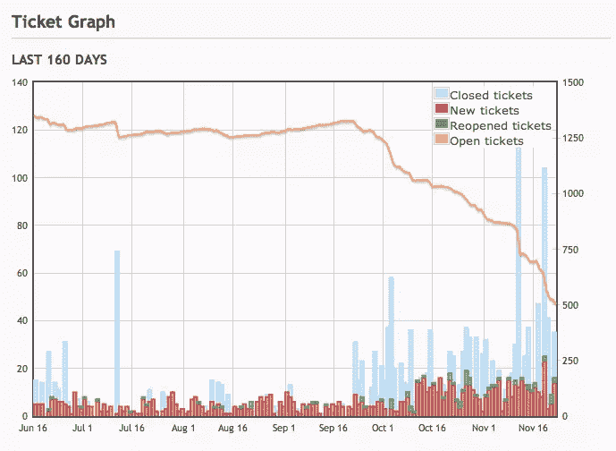

# 会见 jQuery Bug 分类小组

> 原文：<https://www.sitepoint.com/meet-jquery-bug-triage-team/>

我们有一些好消息给你们 jQuery 开发人员！jQuery Bug 修复团队表现非常好，他们的统计数据令人印象深刻！

## jQuery.com 博客上的一篇文章

在过去的 60 天里，bug 分类小组处理了一大堆棘手的问题，并一一解决了。

是的，没错。目前，jQuery 问题跟踪器中没有未审查的票据。最后一个被关闭的是一个相当恶臭的 bug。

jQuery Bug Triage 团队是一组 jQuery 核心和社区成员，他们积极帮助缩小和修补在 [jQuery bug tracker](http://bugs.jquery.com/) 上提交的 Bug。这个团队在调试和修复 JavaScript 和 jQuery 问题方面拥有多年的经验。当您向项目提交 bug、特性请求或增强请求时，他们就是查看您的票证的团队。

团队成员包括:

*   [Dave Methvin](http://methvin.com/) 是 PC Pitstop 的联合创始人，自 2005 年以来一直使用 jQuery，并且是 jQuery 核心团队的成员。
*   科林·斯诺弗是明尼阿波利斯的一名独立软件设计师和开发者。
*   Rick Waldron 是马萨诸塞州波士顿 Bocoup 公司的研发主管
*   Addy Osmani 是一名伦敦的 JavaScript 开发人员，项目经理&博主。
*   亚历克斯·塞克斯顿是德克萨斯州奥斯汀 Bazaarvoice 的实验室工程师，也是 yayQuery 播客的主持人之一。
*   Adam J Sontag 是 Bocoup 的纽约开发者，也是 yayQuery 播客的主持人之一。
*   迈克·泰勒为 Opera 软件公司工作，有时会被骑自行车的汽车撞上。
*   [Anton Matzneller](https://github.com/jitter) 是奥地利维也纳的一名计算机科学学生和开发人员。

我们都欠这些人很多感谢。他们为 jQuery 做了大量的工作。

[阅读全文](http://blog.jquery.com/2010/11/23/team-spotlight-the-jquery-bug-triage-team/)

## 分享这篇文章