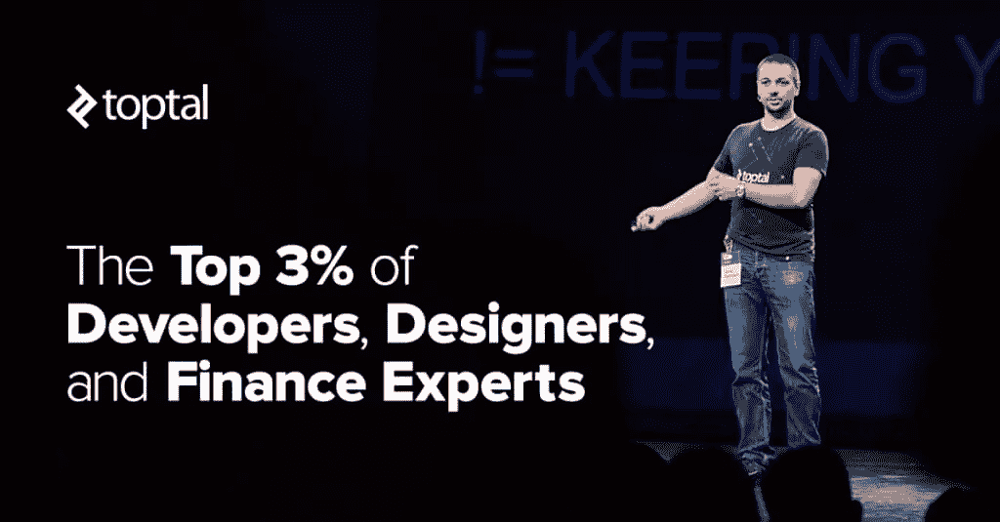
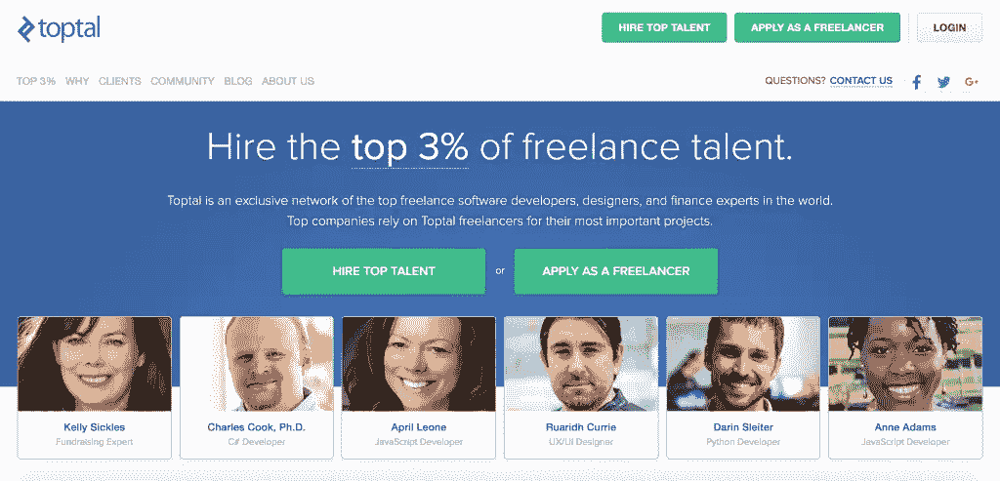

# 遇见扰乱自由职业者行业的前 3%

> 原文：<https://www.sitepoint.com/meet-the-top-3-disrupting-the-freelance-industry/>

*本文由 [Toptal](http://bit.ly/2kWQd0E) 赞助。感谢您对使 SitePoint 成为可能的合作伙伴的支持。*

随着自由职业者人数的持续快速增长，公司寻找合适人才以高效完成工作的难度也在加大。

考虑到寻找一名优秀的自由职业者所需的时间、精力和金钱，难怪如此多的雇主害怕做这项工作。简而言之，这不再是为一份工作找到一个好的候选人，而是找到一个最好的候选人——一个拥有合适的经验、知识和技能，能够满足你的项目需求的候选人。

提示:Toptal 是一个独家的精英网络，已经将世界上最顶尖的 3%的自由软件开发人员、UX/UI 设计师和金融专家作为其人才进行了策划。换句话说，他们是拥挤行业中的一股新鲜空气，让行业变得更好。

当然，获得前 3%并非易事，也不是每个人都能加入 Toptal 的精英网络。Toptal 通过全面的五步筛选流程来审查潜在人才:

*   **语言与性格:**英语语言能力与沟通效率。
*   **技能复习:**技术知识和解题技巧。
*   **现场筛选:**现场测试旨在衡量经验、沟通和创造力的深度。
*   **测试项目:**场景给申请者，测试他们的知识和专业水平。
*   持续的卓越表现:顶尖的人才应该保持完美的记录。

只有四分之一的自由职业者通过了第一轮筛选测试，最终只有精英中的精英加入了 Toptal 网络。虽然筛选过程本身听起来可能很耗时，但 Toptal 的努力得到了回报——该公司有着为 Airbnb、Udacity、Artsy 和 Thumbtack 等初创公司以及包括阿联酋航空、摩根大通和辉瑞在内的财富 500 强公司解决问题的一贯记录。拥有如此多样化的客户名单，难怪他们赢得了世界上最好的自由职业者网络之一的声誉。

Toptal 的人才包括前首席技术官、工程副总裁以及领先的移动、web 和后端技术以及数据科学和机器学习等新兴领域的专家开发人员。与此同时，其高级设计师已经在包括迪士尼和漫威在内的公司证明了自己，擅长在移动应用程序、网站等领域创造世界级的用户界面和体验(UI/UX)。最后，其网络由精英金融专家提供支持，在筹资、金融建模和估值、定价和市场研究方面为客户提供顶级支持。

Toptal 为客户选择自由职业者提供了更加个性化的方法。在高级匹配人员的帮助下，客户会被匹配到具备项目所需特定技能的人才。招聘过程缩短了数周，因此客户可以专注于业务的成功，而不是评估几十名候选人。这不仅仅是淘汰不合格的候选人。例如，客户可以接触到精英设计师的整个网络，否则很难接触到他们。

对于那些想充分利用时间而又不想偷工减料的公司来说，Toptal 是最好的选择。除了为业内顶尖的自由职业者提供住宿，客户还可以享受 Toptal 的零风险模式。每个自由职业者都有试用期，如果你对结果满意，你才付钱。

无论你的项目处于哪个阶段——是设计、生产还是开发产品, [Toptal](http://bit.ly/2kWQd0E) 都以把客户放在第一位并让他们接触到世界上最好的自由职业者为荣。

## 分享这篇文章