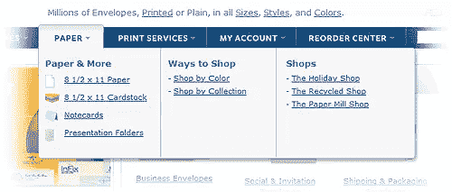

# 巨型菜单:下一个网页设计趋势

> 原文：<https://www.sitepoint.com/mega-drop-down-menus/>

巨型下拉菜单是一个相对较新的现象，但我预测它们将在六个月内随处可见。

## 超级什么？

导航大型网站一直是一个设计问题。你可以创建一个巨大的类似于网站地图的菜单，每个页面都有链接，但是它将变得无法浏览，并且随着页面的增加而变得越来越大。

一般来说，设计师会选择:

1.  一个简单的小菜单，当你深入研究时，它链接到带有附加导航的页面(Sitepoint 就是一个很好的例子)。这些工具易于使用和访问，但是需要多次点击才能到达您想要的内容。
2.  动态下拉菜单或扩展菜单使访问者无论身在何处都能访问大多数页面。虽然这提供了快速导航，但可访问性可能很差，没有 JavaScript 的用户可能永远看不到某些页面*。

*(*仅 CSS 下拉是可能的，但它们不提供鼠标悬停/弹出延迟或在每个浏览器中工作…猜猜是哪一个！)*

大型下拉菜单介于这两个概念之间，类似于 Microsoft Office 2007 中引入的功能区:

*(例子来自[actionenvelope.com](http://www.actionenvelope.com/))*

## 巨型下拉菜单的特点

通常，大型菜单:

*   是悬停时出现的一个下拉菜单
*   在一个大面板中显示所有选项
*   将选项分组到相关类别中
*   使用图标或其他图形来帮助用户。

## 为什么巨型菜单会流行

为什么大型下拉菜单会成为许多网站的主流功能有几个原因:

1.  它们在简单菜单和扩展菜单之间提供了一个很好的折衷。
2.  它们易于使用，并且应该很少遇到可访问性问题。
3.  它们看起来很棒，给设计师更多的空间来表达他们的艺术创造力！

也许最令人信服的理由是:雅各布·尼尔森赞成巨型菜单！这位网站可用性专家通常对大多数设计小工具持批评态度，但他认为巨型菜单是一个很好的想法，并建议设计师尝试使用它们来改善网站的导航。

你怎么想呢?巨型菜单会变得无处不在吗？你已经在用了吗？你会在你的网站上尝试吗？

## 分享这篇文章