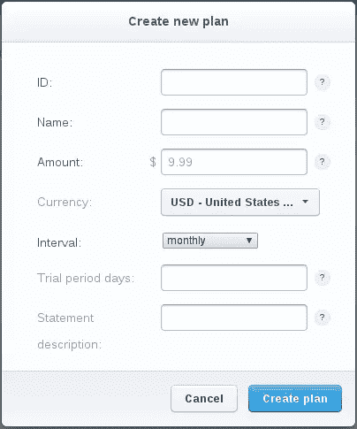
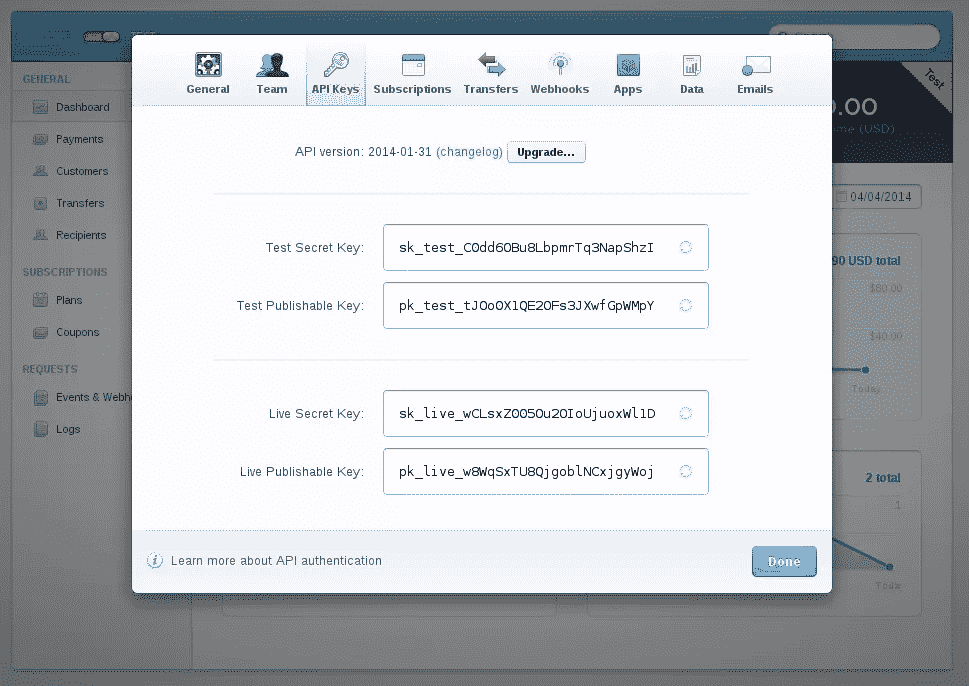
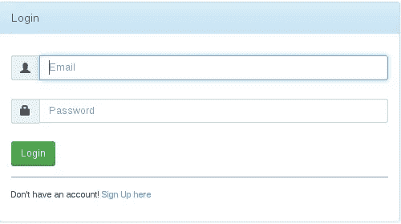
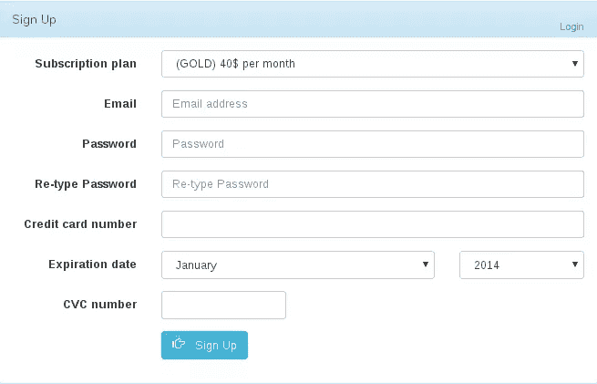
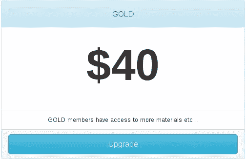
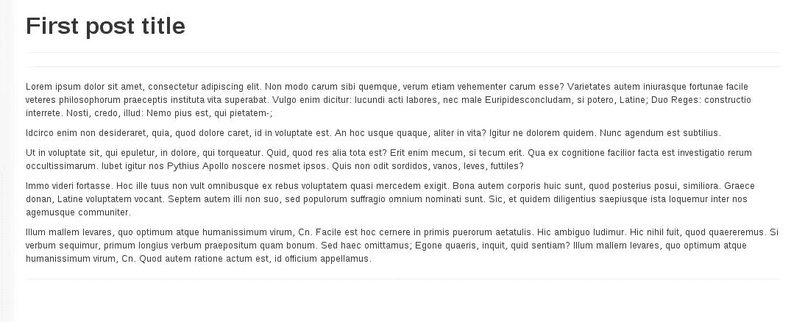

# Laravel 收银员的会员资格

> 原文：<https://www.sitepoint.com/memberships-laravel-cashier/>

在本教程中，我们将看到使用`Laravel Cashier`包创建一个基本的付费会员网站是多么容易。你可以在这里看到这个应用程序的演示，在这里下载源代码。

## 建立工作环境

我们需要创建一个样板项目来开始，我们可以通过两种不同的方式来完成:

*   我们可以将 Github [repo](https://github.com/laravel/framework) 克隆到我们的项目文件夹中。
*   假设你已经安装了`composer`(查看[安装指南](https://getcomposer.org/doc/00-intro.md)了解更多细节)。
    我们运行`composer create-project laravel/laravel laravel_membership --prefer-dist`，这将在我们的`laravel_membership`文件夹中创建一个 laravel 样板工程。

现在我们需要将`"laravel/cashier": "~1.0"`添加到`require`部分的`composer.json`中，并运行`composer update`来更新我们的依赖项，从而将`Laravel Cashier`包添加到项目中。

之后，我们需要告诉我们的应用程序加载`Cashier`服务提供者类。我们可以通过在`config/app.php`文件的`providers`数组中添加`"Laravel\Cashier\CashierServiceProvider"`来实现。

**注意**:你必须运行`composer dump-autoload`来更新`classMap package`。

## 使用迁移创建数据库

如果你是第一次接触`Laravel Migrations`，一定要查看[文档](http://laravel.com/docs/migrations)。
我们将使用两张桌子:

`posts`表:
–`INT id`
–`STRING title`
–`LONG_TEXT content`
–`BOOL is_premium`

`users`表:
–`INT id`
–`VARCHAR(60) email`–
–`VARCHAR(60) password`

Laravel `artisan`命令行工具使得创建和管理迁移类变得很容易。

```
php artisan migrate:make create_posts_table --create="posts" php artisan migrate:make create_users_table --create="users"
```

然后我们用必要的代码填充`Schema::create`回调函数参数，如下所示

```
Schema::create('posts',  function(Blueprint $table)  { $table->increments('id'); $table->string('title'); $table->longText('content'); $table->boolean("is_premium"); $table->timestamps();  });  Schema::create('users',  function(Blueprint $table)  { $table->increments('id'); $table->string('email',  100)->unique(); $table->string('password',  60); $table->timestamps();  });
```

为了让`Laravel Cashier`了解我们的收费表，我们需要为此创建一个特定的迁移。`Laravel Cashier`有一个用于此目的的内置命令。

```
php artisan cashier:table users
```

现在我们准备好迁移我们的数据库了

```
php artisan migrate
```

如果您打开您的`users`表，您会看到在执行包迁移时添加了一堆字段。
–`stripe_active`如果您有有效的套餐。
–`stripe_id`条带服务器上的用户 id。
–`stripe_plan`条纹认购计划。
–`last_four`信用卡最后四位数。
–`trial_ends_at`如果您指定了试用期，将存储结束日期。
–`subscription_ends_at`认购结束日期。

现在，我们将在数据库中植入一些虚拟数据作为开始；在 [GitHub](https://github.com/phpmasterdotcom/laravelCashier) 上查看最终结果。

## 条带计费流程

处理支付可能是一件痛苦的事情，Stripe 可以帮助你，他们使用`tokens`而不是卡号等..，这样您就可以确保客户在为您的服务付费时保持安全。

**注意:**检查 Stripe 在您的国家是否受[支持](https://stripe.com/global)，如果不支持，您仍然可以使用它进行测试。

开始之前，我们需要先获得一个帐户。Stripe 没有月费，你只需在收到钱的时候付费。

现在，获得帐户后，您需要为您的应用程序创建计划(每月，每年，银，金…)。



每个字段都是自解释的，所以让我们创建一个价格为 40 美元的`Gold`会员和一个价格为 10 美元的基本会员。他们每个月都会收到账单。

我们已经向我们的`users`表添加了必要的列，现在我们需要让`Laravel Cashier`知道我们将使用`User`类作为我们的计费类。

```
use  Laravel\Cashier\BillableInterface;  use  Laravel\Cashier\BillableTrait;  class  User  extends  Eloquent  implements  BillableInterface  {  use  BillableTrait;  protected $dates =  ['trial_ends_at',  'subscription_ends_at'];
```

**注意:**我们用的是`BillableTrait`，特征要求 PHP 5.4 或更高。

现在我们必须设置我们的 Stripe API 访问密钥，您可以从`Your account > Account settings > API Keys`中获取并复制您的`Test Secret Key`。



通过使用`BillableTrait`,我们可以访问`User::setStripeKey(key)`方法，它可以在我们的代码中的任何地方被调用，但是更好的方法是在你的`config`目录下创建一个`services.php`文件并返回一个数组，如下所示:

```
return  [  'stripe'  =>  [  'secret'  =>  'Your key'  ]  ];
```

当`getStripeKey`试图加载你的密钥时，它会寻找一个名为`stripeKey`的属性。如果没有找到，它会自动加载你的`services`文件。

## 创建我们的页面

为了简单起见，我们将只创建几个页面:
–注册:用户可以注册会员计划(基本，黄金)。
–登录:会员登录页面。
–升级:从基本会员升级至黄金会员。
–帖子:显示单个帖子页面。

为了加速这个过程，我们将使用[bootsinpp](http://bootsnipp.com/)。你可以从 GitHub [回购](https://github.com/phpmasterdotcom/laravelCashier)中获得最终代码。

### 登录页面:



登录页面有一个基本的电子邮件和密码字段，还有一个类似下面的`LoginController`页面:

```
public  function index(){  return  View::make('login');  }  public  function store(){  if(  Auth::attempt(  Input::only(  ['email',  'password']  ),  true)){  return  Redirect::to('/');  }  else{  return  Redirect::back()->withInput()->with(  'message',  'Email or password incorrect'  );  }  }  public  function destroy(){  Auth::logout();  return  Redirect::route("login");  }
```

### 注册页面:



注册页面有一个`Subscription plan`字段，用于将用户分配到计划中。
我们还有`Credit card number`、`Expiration date`、`CVC`。

正如我们前面所说的，我们将永远不必处理任何支付或验证过程，我们将这些值传递给 Stripe 服务器来处理收费和验证过程。如果成功，返回值是一个令牌，否则我们会得到一个错误消息，并显示给用户。

让我们看看前端代码是什么样子的:

```
<script  type="text/javascript"  src="https://js.stripe.com/v2/"></script>  <script>  Stripe.setPublishableKey('Your public key'); jQuery(function($)  { $('#subscription-form').submit(function(event)  {  var $form = $(this); $form.find('button').prop('disabled',  true);  Stripe.card.createToken($form, stripeResponseHandler);  return  false;  });  });  var stripeResponseHandler =  function(status, response)  {  var $form = $('#subscription-form');  if  (response.error)  { $form.find('.payment-errors').text(response.error.message); $form.find('button').prop('disabled',  false);  }  else  {  var token = response.id; $form.append($('<input type="hidden" name="stripeToken" />').val(token)); $form.get(0).submit();  }  };  </script>
```

首先我们包含 JavaScript API 文件，然后我们设置从 Stripe dashboard 设置中获取的公钥。

接下来，我们将一个回调函数附加到提交表单上(确保您的表单 ID 与事件处理程序中使用的 ID 相匹配)，为了防止重复提交，我们禁用了提交按钮。
`Stripe.card.createToken`接受两个参数，第一个是 JSON 对象，它有一些必需和可选的值。

**要求值:**

*   `number`:卡号为字符串，不带任何分隔符。
*   `exp_month`:两位数字，代表卡的到期月份。
*   `exp_year`:表示卡有效期的两位或四位数字。

**可选值:**

*   `cvc`:卡安全码作为一个字符串，`cvc`号是可选的，但建议用来帮助防止欺诈。
*   `name`:持卡人姓名。
*   `address_line1`:账单地址行 1。
*   `address_line2`:账单地址行 2。
*   `address_city`:账单地址城市。
*   `address_state`:账单地址状态。
*   `address_zip`:账单 zip 为字符串。
*   `address_country`:账单地址国家。
    你可以注意到我们传递的是一个表单对象，而不是 JSON 对象，你可以选择手动获取值，或者在你的输入中使用`data-stripe` html5 属性，Stripe 将使用一些帮助器方法为你自动获取这些值。例如:

```
 <input  data-stripe="number"  type="text">
```

传递给`Stripe.card.createToken`方法的第二个参数是一个处理响应的回调函数。

在失败的情况下，`stripeResponseHandler`将试图找到一个类为`payment_errors`的元素，向用户显示一些描述性错误。
如果成功，一个`stripeToken`隐藏输入将被添加到表单中，并在提交时可用。

#### 附加选项

*   正如我们之前所说的，当你创建一个新的计划时，你可以选择为用户指定一个试用期来测试你的产品，在指定的期限过去之前，他们不会被收费。
*   你可以通过你的仪表盘菜单来创建优惠券，在那里你可以指定一个固定的金额或百分比，以及一些其他有用的选项。

现在让我们来看看我们将如何处理这个问题。

```
public  function store(){ $user =  new  User; $user->email =  Input::get(  'email'  ); $user->username =  Input::get(  'username'  ); $user->password =  Hash::make(  Input::get(  'password'  )  ); $user->save(); $user->subscription(Input::get(  'subscription'  ))->create(  Input::get(  'stripeToken'  )  );  return  'you are now registred';  }
```

为了简单起见，我们将跳过验证过程。

创建新的`User`并保存后，我们现在可以选择为用户订阅新的会员计划。`subscription`方法接受一个已经注册的计划作为参数，它可以是一个`PlanInterface`或一个`String`并返回一个`StripeGateway`。
`create`方法接受一个令牌作为参数；我们传递名为`stripeToken`的新的隐藏输入值。

### 升级页面:



升级页面将提交给`UpgradeController`,如下所示:

```
public  function store(){  if(  !Auth::check()  )  return  Redirect::route("login");  Auth::user()->subscription('gold')->swap();  return  'You are now a GOLD member';  }
```

我们首先检查用户是否登录，然后我们用新的计划创建一个新的`subscription`，我们调用`swap`方法，显然在一个真实的项目中，你会有一些费用调整和降级选项，但它应该以同样的方式工作。

### 帖子页面:



`PostController`检查帖子是否`is_premium`，如果是，我们测试用户是否是可以看到帖子的黄金会员，否则我们返回一个简单的错误消息。

```
public  function show( $id ){ $post =  Post::find( $id );  if( $post->is_premium &&  Auth::user()->stripe_plan !=  'gold'  )  return  View::make('error',  [  'message'  =>  'Only GOLD members can read this post, <a href="/upgrade">upgrade</a> your membership to get access'  ]  );  return  View::make('post',  [  'post'  => $post ]  );  }//show
```

当然，在我们的`routes.php`文件中，我们需要添加一个`auth`过滤器来防止未经认证的用户访问页面。
我们的 routes 文件将如下所示:

```
Route::get('/',  function()  { $posts =  Post::all();  return  View::make('index',  [  'posts'  => $posts ]);  })->before('auth');  Route::get('/post/{id}',  [  'as'  =>  'post',  'uses'  =>  'PostsController@show'  ])->before('auth');  Route::resource('login',  'LoginController',  [  'only'  =>  [  'index',  'store',  'destroy'  ]  ]);  Route::resource('signup',  'SignupController',  [  'only'  =>  [  'index',  'store'  ]  ]);  Route::resource('upgrade',  'UpgradeController',  [  'only'  =>  [  'index',  'store'  ]  ]);
```

## 其他有用的方法

*   `withCoupon`:我们之前说过，我们可以创建折扣券，在我们的示例中，我们可以这样做:

```
$user->subscription(Input::get(  'subscription'  ))->withCoupon('coupon code')->create(  Input::get(  'stripeToken'  )  );
```

*   `cancel`:使用这种方法，你可以很容易地取消订阅，但是你必须检查用户是否是`onGracePeriod`，以确保你没有立即阻止他们:

```
User::find(1)->onGracePeriod();
```

*   `onPlan`:查看用户是否在某个计划中。
*   `onTrial`:查看用户是否仍在试用期。
*   `canceled`:如果用户取消了订阅。
*   `getLastFourCardDigits`:获取用户卡最后四位数字。
*   `getSubscriptionEndDate`:获取订阅结束日期。
*   `getTrialEndDate`:获取试用结束日期。
*   `invoices`:获取用户发票列表。
*   `findInvoice`:根据 id 查找发票。
*   `downloadInvoice`:根据 id 生成可下载的发票。

## 结论

在本教程中，我们探讨了`Laravel Cashier`如何简化计费流程，并帮助您更轻松地管理客户。

我们当然没有涵盖这里的所有内容，但这是一个开始，让您深入研究源代码，探索您还能做什么。如果你想看这个应用的 Nitrous 演示，请点击这里。

## 分享这篇文章