# 10 大流行地铁鞋带

> 原文：<https://www.sitepoint.com/metro-bootstraps/>

如果你正在寻找使用新的 Windows 8 Metro a look 设计你的下一个网站或网络应用程序，这些 **10 Metro 引导和模板**可以帮助你开始！几乎是我目前能在网上找到的最好的了。随着越来越多的开发，请添加一个链接的评论，这样我就可以将它们添加到列表中。享受吧。

另见: **[10 个高级 JQUERY METRO 插件](http://www.jquery4u.com/plugins/premium-metro-plugins/)。**

**2013 年 11 月 4 日更新:**新增 11 条。jquit–jQuery UI Metro 主题生成器，12。Metro UI 模板

## 1.BootMetro

简单灵活的 HTML、CSS 和 Javascript，适用于希望使用“Windows 8 应用商店”风格的 web 应用，无需在 Windows 8 上运行。
[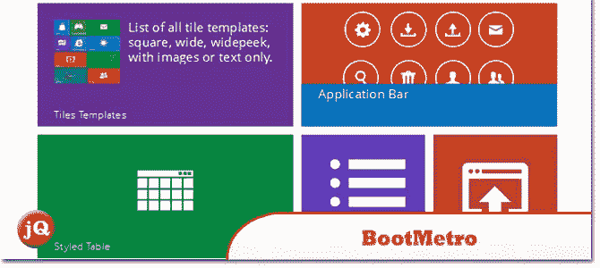](http://aozora.github.com/bootmetro/)

[来源](http://aozora.github.com/bootmetro/) [演示](http://aozora.github.com/bootmetro/hub.html)

## 2.bootswatch–Cosmo

Bootstrap 的免费地铁主题。

[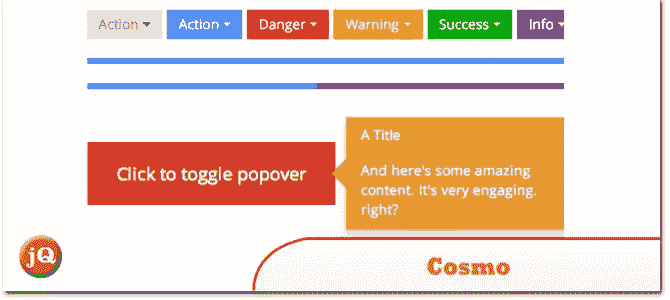](http://bootswatch.com/cosmo/) 
[源+演示](http://bootswatch.com/cosmo/)

## 3.地铁自举

来自 Twitter 的简单引导，带有 Metro 风格。

[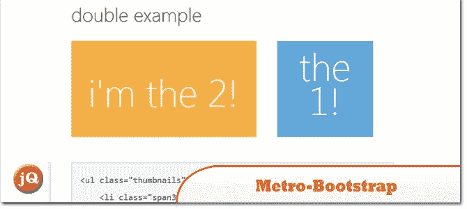](https://github.com/TalksLab/metro-bootstrap#readme) 
[来源](https://github.com/TalksLab/metro-bootstrap#readme) [演示](http://talkslab.github.com/metro-bootstrap/components.html)

## 4.Metro UI CSS

在微软的建议下开发来构建用户界面。

[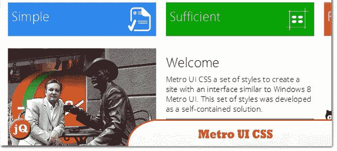](http://metroui.org.ua/) 
[源+演示](http://metroui.org.ua/)

## 5.地铁热

一个多合一的、专业的、反应灵敏的地铁自举主题。自带 60 页，6 种颜色(紫色、红色、浅蓝色、蓝色、绿色、橙色)。

[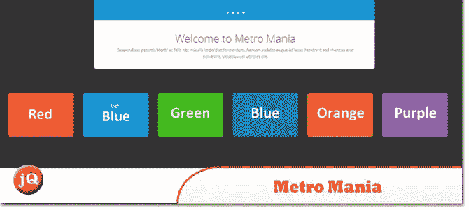](https://wrapbootstrap.com/theme/metro-mania-no.1-metro-bootstrap-theme-WB07F9G8L) 
[来源](https://wrapbootstrap.com/theme/metro-mania-no.1-metro-bootstrap-theme-WB07F9G8L) [演示](http://responsivewebinc.com/premium/metro/)

## 6.脚手架-地铁风格模板

用 Twitter bootstrap+metro 风格设计的现代和新鲜的 HTML 站点模板。这个模板看起来很适合现代企业商务网站或用于网页设计代理。

[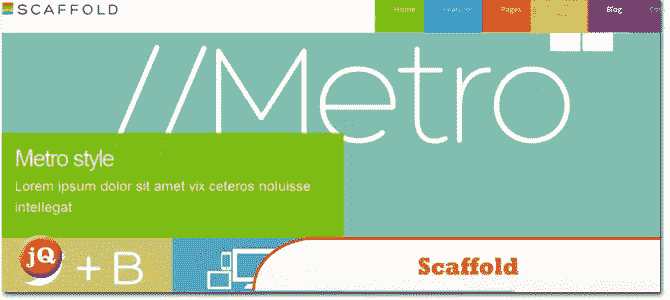](https://wrapbootstrap.com/theme/scaffold-metro-style-template-WB013995G) 
[来源](https://wrapbootstrap.com/theme/scaffold-metro-style-template-WB013995G) [演示](http://wrapbootstrap.com/preview/WB013995G)

## 7.mad min–管理主题

一个受 Metro 启发的流体自适应管理主题，试图尽可能轻，并把你的数据和控制放在焦点上，而不是主题铬。

[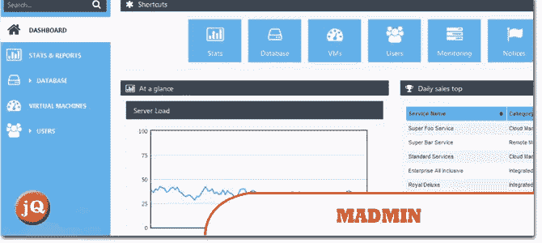](https://wrapbootstrap.com/theme/madmin-admin-theme-WB042R743) 
[来源](https://wrapbootstrap.com/theme/madmin-admin-theme-WB042R743) [演示](http://wrapbootstrap.com/preview/WB042R743)

## 8.地铁柔性导航

它可以定制为水平或垂直布局。它可以同时滚动和拖动，并且包含有用的滑动控件。图标可以改变，有一个大集合可用。

[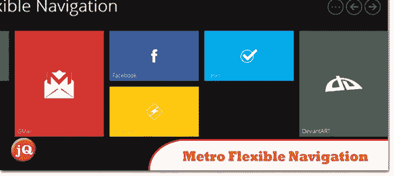](http://codecanyon.net/item/-metro-flexible-navigation/2796746?ref=sdeering) 
[来源](http://codecanyon.net/item/-metro-flexible-navigation/2796746?ref=sdeering) [演示](http://codecanyon.net/item/-metro-flexible-navigation/full_screen_preview/2796746)

## 9.melon html 5–Metro UI

它完全由 HTML5、CSS3 和 JavaScript 支持，有大量选项供您配置以满足自己的需求。

[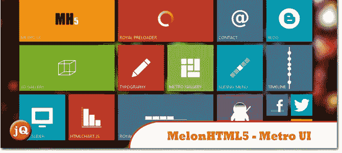](http://codecanyon.net/item/melonhtml5-metro-ui/2986068?ref=sdeering) 
[来源](http://codecanyon.net/item/melonhtml5-metro-ui/2986068?ref=sdeering) [演示](http://codecanyon.net/item/melonhtml5-metro-ui/full_screen_preview/2986068)

## 10.地铁服务台支持票

默认带有集成的 FAQ 和手册系统，因此允许工作人员减少响应时间并提高效率。

 
[来源](http://codecanyon.net/item/metro-help-desk-support-tickets/3281394?ref=sdeering) [演示](http://codecanyon.net/item/metro-help-desk-support-tickets/full_screen_preview/3281394)

## 11.jQuery UI Metro 主题生成器

使用 jQUIT Builder，您可以基于 Metro UI 构建定制的 jQuery UI 主题。

[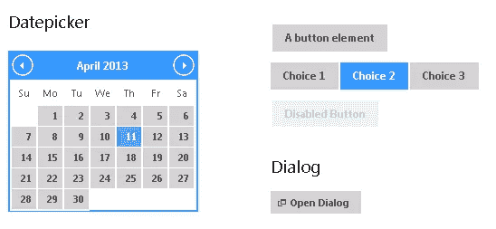](http://jquit.com/builder/) 
[源+演示](http://jquit.com/builder/)

## 12.Metro UI 模板

轻松构建 Windows 8 风格的网站。

[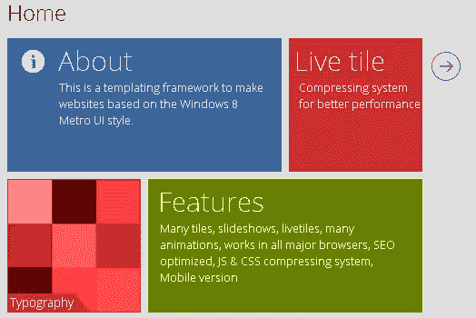](http://metro-webdesign.info/) 
[源+演示](http://metro-webdesign.info/)

## 分享这篇文章