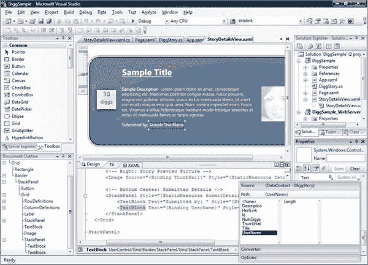

# 微软:4 周内 1 亿次 Silverlight 下载

> 原文：<https://www.sitepoint.com/microsoft-100-million-silverlight-downloads-in-4-weeks/>

在微软和 Adobe 之间日益激烈的口水战中，两家公司似乎分别选择了发布 Silverlight 和 Flash 的时机，试图抢走对方的风头。昨晚，在禁令解除前几个小时，Adobe 在年度 MAX 大会上发布了一系列声明。NET 开发者部门 Scott Guthrie [在他的博客上发布了一篇关于 Silverlight 状态的文章](http://weblogs.asp.net/scottgu/archive/2008/11/16/update-on-silverlight-2-and-a-glimpse-of-silverlight-3.aspx),并暗示了 Silverlight 3 即将推出的特性，该特性将于明年发布。

Guthrie 显然对 Silverlight 和微软在 2008 年将浏览器插件发布到消费者机器上所取得的进步非常积极。据 Guthrie 称，自从 Silverlight 2 上个月[发布以来，该插件已经被下载了超过 1 亿次，每 4 台联网计算机中就有 1 台安装了 Silverlight 的某个版本。对于一项在 20 个月前首次亮相的技术来说，这已经相当不错了。](https://www.sitepoint.com/silverlight-20-expands-net-support-adds-controls/)

格思里还对 Adobe 的竞争对手 Flash 技术进行了一些直接的抨击。他写道:“在 2008 年 8 月出版的《Web Designer》杂志(一份荷兰出版物)中，一位[荷兰电视网]代表报告称，他们使用 Silverlight 和 40 台 Windows Media 服务器能够同时为 100，000 名用户提供服务，而如果他们使用 Flash Media 服务器，则需要 270 台服务器。”Guthrie 还特别提到，在 Blockbuster 的 MovieLink 应用程序中，Flash 正在被 Silverlight 取代。

微软能够与 Adobe 的 Flash 竞争的原因之一是该公司在企业中的实力，Adobe 的 Flash 已经领先了 11 年，几乎无处不在。微软已经能够依靠其公司合作伙伴很快获得一些引人注目的 Silverlight 部署，包括在 NBC、网飞、AOL、丰田和 Akamai。没有多少公司能做到这一点，并如此迅速地推出一个新插件。(谷歌是另一个有实力做到这一点的公司——史蒂夫·吉尔默最近暗示,他们实际上也可能会加入竞争。)

在他的帖子中，Guthrie 还暗示了 Silverlight 即将发布的第 3 版中的一些功能，这些功能应该会在明年推出。根据 Guthrie 的说法，Silverlight 3 将包括:

*   主要的媒体增强(包括 H.264 视频支持)[注:我们在 9 月份的 Silverlight 中报道了对 H.264 视频和 AAC 音频支持的报道]
*   主要显卡改进(包括 3D 支持和 GPU 硬件加速)
*   主要的应用程序开发改进(包括更丰富的数据绑定支持和附加控件)

Guthrie 说，更多的新功能将在临近发布时宣布。此外，Guthrie 指出，明年推出的新版 Visual Studio(如下图)和 Visual Web Developer Express 将包括完全可编辑的交互式 Silverlight 设计工具，以及新的数据绑定工具。虽然很难说，但看起来 Visual Studio 可能继承了 Microsoft Blend 的一些功能。

Blend 是一个用于 WPF 和 Silverlight 项目的 UI 设计工具，可以被视为微软今天推出的 Adobe Flash Catalyst 工具的等价物([我们的报道](https://www.sitepoint.com/adobe-debuts-flash-catalyst-at-max-conference/))，尽管在我看来它似乎不那么完美，尽管它比较老。(不过，我是一名作家，不是一名程序员或设计师，所以随便你怎么看。)Blend 已经支持在 it 和 Visual Studio 之间无缝转换代码，但微软可能会进一步将类似 Blend 的 UI 设计工具直接集成到 Visual Studio 中。

**更新:**一如既往，当我写这篇文章的时候，Adobe 的公关部门发电子邮件告诉我，美国职业棒球大联盟已经签署了一份为期两年的协议，从 2009 年开始通过其网站使用 Flash 播放视频。MLB 目前使用 Silverlight 来传输直播视频，尽管他们的[系统要求](http://mlb.mlb.com/mlb/help/faq_system_requirements.jsp)也将 Flash player 列为必要的，所以很难判断这是否是向 Flash 的全面转移。

不管怎样，今天的口水战正如火如荼(没有双关语的意思)。

**更新#2:** 我刚和 Adobe 公司的简·泰勒通过电话，她证实 MLB。从明年开始，电视将改用 Flash 进行视频直播。MLB.com 系统需求页面同时列出 Flash 和 Silverlight 的原因是，美国职业棒球大联盟已经将 Flash 用于其他多媒体内容交付(只是不用于 MLB)。电视直播流媒体服务，去年它利用了 Silverlight)，而需求页面可能覆盖了整个 MLB 网站。

## 分享这篇文章