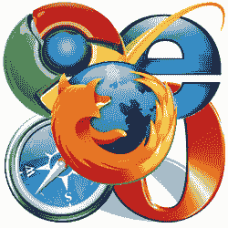

# 微软同意浏览器投票条款

> 原文：<https://www.sitepoint.com/microsoft-browser-ballot-screen/>

欧盟委员会已经撤销了对微软的反垄断指控，此前围绕在 Windows 内提供 Internet Explorer 的合法性展开了冗长的争论。根据协议条款，2010 年 3 月，欧洲将有大约 1 亿台个人电脑显示浏览器投票屏幕。

在 XP、Vista 和 7 的 Windows 更新过程中，如果用户将 IE 作为默认浏览器，将会出现投票屏幕。那些购买新电脑的人将在第一次上网时看到这个屏幕。

将提供 12 种浏览器。是的——你没看错——将有 12 种浏览器可供选择:

*   5 个最受欢迎的浏览器将随机出现:IE、Firefox、Opera、Safari 和 Chrome
*   另外 7 款浏览器也将出现在不太显眼的位置:美国在线、傲游、K-Meleon、Flock、Avant 浏览器、斯雷普尼尔和 Slim 浏览器。

浏览器列表将至少每六个月更新一次，选择随着软件的流行程度而变化。

该裁决将至少在五年内有效，并适用于所有欧盟成员国。欧洲监管机构警告微软，如果该公司在此期间没有完全遵守交易条款，可能会被处以高达全球年营业额 10%的罚款。[电影下载量](http://moviedl.net/ "movie downloads")

欧盟竞争专员 Neelie Kroes 指出:

> 数百万欧洲消费者将从这一决定中受益，他们可以自由选择使用哪种网络浏览器。
> 
> 这项裁决将激励竞争对手继续开发和改进他们的产品。

虽然我很高兴用户能够了解替代方案，但我不相信投票屏幕会对浏览器市场份额产生重大影响。12 个选项的选择会让许多新手感到困惑。那些不知情或随机选择的人仍然有 50%的机会选择基于 IE 的浏览器！

你认为浏览器投票屏幕会有所不同吗？微软应该在全球范围内推广它吗？使用*“选票”*这个词会让你烦恼吗？是不是头韵压倒了口译？！

[moviedl](http://moviedl.net/ "moviedl")

## 分享这篇文章