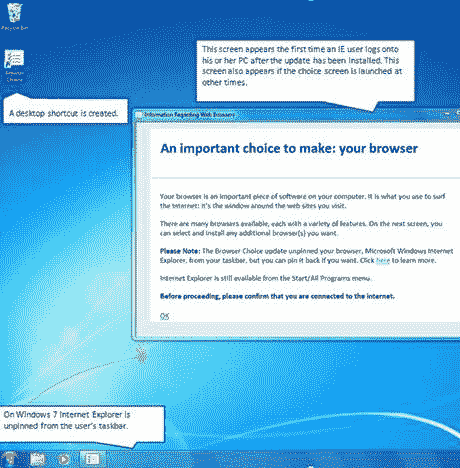
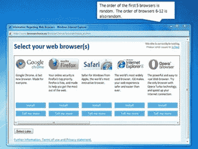

# 微软开始欧洲浏览器选择更新

> 原文：<https://www.sitepoint.com/microsoft-european-browser-choice/>

继[微软与欧盟委员会](https://www.sitepoint.com/microsoft-browser-ballot-screen/)达成法律协议后，所有欧洲的 Internet Explorer 用户将在 2010 年 3 月 1 日或之后不久被提供竞争浏览器的选择。

“浏览器选择”屏幕(幸好从 [*“浏览器投票”*](https://www.sitepoint.com/microsoft-windows-browser-ballot/) )比约定的时间提前了几周出现，测试已经在英国、法国和比利时开始。微软已经透露了关于更新的以下细节:

1.浏览器选择屏幕将在 Windows XP、Vista 和 7 中提供给将 IE 设置为默认浏览器的用户。它将通过标准的自动更新系统安装。

2.安装完成后，一个新的“浏览器选择”图标将出现在桌面上，IE 图标将从 Windows 7 任务栏中移除。将出现一个介绍屏幕，解释什么是浏览器:

3.用户可以选择稍后选择或继续浏览浏览器选择屏幕:

五个最受欢迎的浏览器以随机顺序显示——即 Firefox、Chrome、Safari 和 Opera。如果用户移动水平滚动条，还有 7 个随机排序的浏览器可用。

4.该系统可以下载并安装任意数量的浏览器。

最精彩的是:IE6 和 IE7 用户将被提示升级到 IE8！

## 赢家和输家

有一个明显的输家:浏览器选择屏幕肯定会减少 IE 的市场份额。对微软来说幸运的是，任何对自己的选择不确定的人都会因为那个蓝色的大“e”图标而放心。

Firefox 可能是最熟悉的，在整个欧洲已经拥有 40%的市场份额。它有可能超过 IE 45%的市场份额。

谷歌 Chrome 的使用正在稳步增长，该公司一直在报纸和广告牌上大力宣传他们的浏览器。许多人会认出这个标志，谷歌的名字会使它成为一个大赢家。

同时拥有 Mac 或 iPhone 的 Windows 用户可能会选择 Safari。然而，苹果似乎并不太关心在 Windows 上推广他们的浏览器。

具有讽刺意味的是，反垄断案的始作俑者 Opera 可能不会出现大幅增长。根据 StatCounter European statistics 的统计数据，其使用率已经从 2009 年 6 月的峰值 9%下降了一半。Chrome 和 Safari 似乎已经蚕食了它的市场份额。我也怀疑 Opera 的名字和标志在面临选择时会吸引很多用户。

在接下来的几个月里，看看浏览器市场会受到怎样的影响将会很有趣。

IE 是你的默认浏览器吗？不— *说真的*？！！当面对选择屏幕时，你会尝试另一种浏览器吗？

## 分享这篇文章