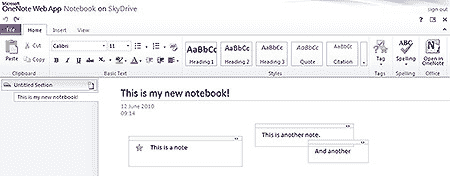

# Microsoft Office Online:重新审视

> 原文：<https://www.sitepoint.com/microsoft-office-online-word-excel-powerpoint-onenote/>

我最近在 Docs.com 评测了[微软 Office Online。这是该套件的第一个公开版本，面向想要共享文档的脸书用户。](https://www.sitepoint.com/microsoft-office-online-review/)

微软最近在 office.live.com[发布了 Office Online 的官方版本*。您需要一个 Windows Live ID 和密码，但 Hotmail 用户已经有了。您的文件被保存到 SkyDrive 空间，该空间提供 25GB 的免费存储空间:对于最多产的作者来说肯定足够了。*](http://office.live.com/)

请注意，Office Online 仅在美国、英国、加拿大和爱尔兰可用。如果你住在别处，你可以[尝试这个链接](http://office.live.com/?docsf=1%20)，但是应用程序可能不会以你的语言出现。

## 虫子走开

如果你对 Docs.com 的漏洞感到失望，你会很高兴听到 Office Live 要好得多。它们显然是相同的应用程序，但 Office Live 是一个更新的版本，我没有遇到我在第一次评测中注意到的 JavaScript 错误和奇怪的行为。它仍然有一些奇怪的地方——比如 Word 的保存图标和 Excel 中没有公式帮助——但是它更有用。

不幸的是，速度仍然是一个问题。Office Online 比 Google Docs 慢得多，这在你使用 Internet Explorer 时尤为明显。Chrome 提供了最好的体验。

## 精彩的 OneNote？

OneNote 是被低估的 Office 应用程序之一。我断断续续用了好几年了，但我不知道还有谁用它？这是一个笔记应用程序，可以让你随意输入便利贴、图片、片段或手写内容(如果你有平板电脑的话)。

这是一个很棒的应用程序，但在某种程度上被在线替代品和 Evernote 盖过，Evernote 将数据保存到云中，让你可以从任何地方访问你的笔记。幸运的是，OneNote 的铁杆用户现在可以上传他们的笔记本并在线编辑。它也是套件中更有用的应用程序之一。

OneNote online 还允许您创建新笔记本、添加页面和分区，以及插入笔记、表格、图片和链接。它保留了所有更改的历史记录，因此您可以跳回到以前的修订。像其他应用程序一样，它提供了一个有点奇怪的阅读视图，除了你不能改变任何东西之外，它几乎与编辑视图相同。

最后，可以实时共享笔记本电脑并与其他人协作。OneNote 和 Excel 是仅有的提供这种功能的 Office Online 应用程序，但我怀疑 Word 和 PowerPoint 会很快赶上来。

## 应用增强

Office Online 的真正功能是留给那些使用桌面应用程序的人的。可以导入 Word、Excel、PowerPoint 和 OneNote 文档，Office 2010 提供了“保存到 web”选项。与竞争对手不同，Office Online 将处理巨大的文件并保留所有格式。当你在桌面版本中使用了一个特殊的功能时，在线应用程序中也会出现一些额外的功能。

Office Online 不应该与 Google Docs、Zoho 和类似的提供基于网络的文档创建和实时协作的应用程序相提并论。他们在与微软 Office 竞争:Office Online 只是该套件的附加功能。

实际上，Office Online 是一个编辑功能有限的文档阅读器。在这方面，它非常强大，对于运行 SharePoint 2010 Server(附带应用程序副本)的企业尤其有用。跨 Windows、Mac 和 Linux 平台共享文档的公司可能会从中受益。

希望更换昂贵办公套房的个人和小企业主将会失望。Office Online 是为现有的 Microsoft Office 用户设计的。可以理解的是，微软永远不可能提供一个强大的桌面套件在线版本，阻止他们第二大收入流的流动。

## 分享这篇文章