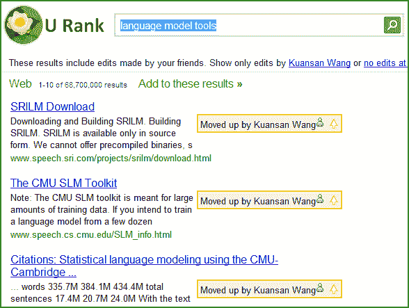

# 微软研究院开放社交搜索引擎

> 原文：<https://www.sitepoint.com/microsoft-research-opens-social-search-engine/>

随着名为 [U Rank](http://research.microsoft.com/projects/urank/) (通过 [LiveSide](http://www.liveside.net/main/archive/2008/10/09/new-from-ms-research-urank-search-gets-organized.aspx) 找到)的实验性搜索引擎的发布，微软研究院在[社交搜索](https://www.facebook.com/sitepoint/)游戏中抛出了他们的帽子。U Rank 只对美国开放，允许用户分享、编辑、注释和重新排列搜索结果。

“我们相信，在网上找到一些东西只是许多任务的第一步，”U Rank page 说。“为了更好地支持人们探索某个主题、比较信息、跟踪他们正在学习的内容以及与他人协作，U Rank 为组织、注释、记忆和共享搜索结果提供了全面支持。”

因为 U Rank 只是一个研究原型，它似乎忽略了社交搜索中出现的潜在隐私问题。因此，任何打算测试它的人都应该意识到，他们的搜索结果可能会与朋友分享。

U Rank 项目主页列出了实验软件的许多用例，包括共享搜索结果推荐，保持事物列表有序，最有趣的是，合作研究。后者很有意义——U Rank 在学术和企业环境中肯定会有有用的应用，在这些环境中，通过共享和评估搜索结果，可以更容易地在网上进行群体研究。

不幸的是，我一直无法真正尝试 U Rank，这似乎产生了一个错误的想法，即我位于美国境外，并将我锁在了外面。

我们很想听听你对 U Rank 的看法。如果你有机会尝试一下，请在下面的评论中告诉我们你的想法。

## 分享这篇文章