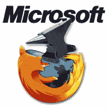
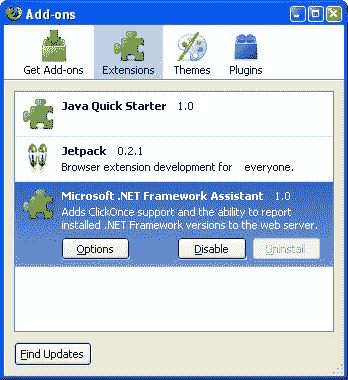

# 微软:停止鬼祟的火狐破坏！

> 原文：<https://www.sitepoint.com/microsoft-sabotage-firefox/>

我们都体验过*有用的*提供安装浏览器工具栏和扩展的软件产品，这将*增强*我们的网络体验。在大多数情况下，你可以礼貌地拒绝该插件或稍后卸载它(如果你碰巧错过了讨厌的 6pt 选择框)。

不幸的是，偷偷安装 Firefox 插件的公司正在开创一个危险的先例。罪魁祸首是微软和微软。NET 框架 3.5 服务包 1。大多数人会收到 SP1 作为自动更新，所以没有明显的下载或安装。在幕后，更新将安装一个名为“微软”的火狐插件。NET 框架助手”。微软——这看起来很糟糕。非常糟糕…

**1。无信息**
在安装之前、期间或之后，用户不会被告知该附加组件。

**2。没有授权**
用户不能拒绝安装插件。

**3。不卸载**
插件不能通过火狐插件对话框卸载。根据布拉德·艾布拉姆斯的博客，这是一个错误而不是恶意的选择，但它让你想知道他们在代码中还犯了什么错误？[下载电影](http://moviedl.net/ "download movies, movies, movie downloads, free movies")

(注意 Brad 的帖子链接到了一个补丁。还提供了手动删除说明，尽管这涉及到危险的注册表篡改。)

**4。附加安全风险**
该扩展启用 ClickOnce 支持。这允许在最少的用户干预下安装额外的软件。用户切换浏览器的主要原因之一是为了避免困扰 IE 的恶意软件问题；有多少人想要一个绕过火狐安全的插件？

**5。微软充其量是竞争对手**
，这是无能。在最坏的情况下，这是一个严重的利益冲突。虽然我不认为微软打算破坏火狐，这个插件可以做任何事情。微软有机会让竞争对手的浏览器变得缓慢、不稳定或不可靠——即使这不是他们的本意。

我怀疑这是开发人员天真的一个例子，只能假设附加组件绕过了质量保证检查，因为很少有人知道它的存在。该公司一直在努力重建用户的信任，但像这样的行动将无济于事。

不幸的是，微软不是唯一的罪犯。再看一下上面的附加对话框——Sun*用 Java VM 安装了一个“Java 快速入门”扩展。安装时没有任何信息，无法拒绝，也无法从火狐附加对话框*卸载(一个选项深藏在 Java 控制面板小程序中——高级>杂项> Java 快速入门)*。*

微软和 Sun——尽一切办法创建 Firefox 扩展，但没有必要肆无忌惮。告诉用户，提供选择退出，或者简单地通过正常的 [Mozilla 渠道](https://developer.mozilla.org/en/Submitting_an_add-on_to_AMO)发布。

另见:[什么是网络浏览器？没人知道！](https://www.sitepoint.com/what-is-a-web-browser)

## 分享这篇文章