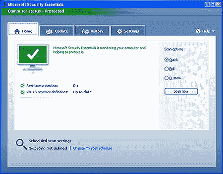
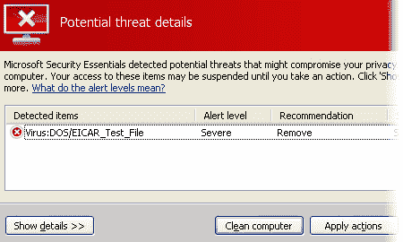

# 微软安全基础:回顾

> 原文：<https://www.sitepoint.com/microsoft-security-essentials-review/>

Security Essentials 是微软向拥挤的安全软件市场发布的反病毒软件包。该产品是免费的，但它与竞争对手相比如何呢？

## 下载和安装

该软件可从[微软安全基础网站](http://www.microsoft.com/security_essentials/)下载。版本可用于 32 位和 64 位安装的 Windows XP 和 Vista/7。

Vista 安装程序小于 5Mb，而 XP 安装程序略大于 8Mb。安装的软件仅使用 11Mb 的磁盘空间。微软终于证明了它是可能的，创造一个反病毒产品，不需要 3 天下载和填补你的硬盘！

安装快速且无痛苦。在快速检查以确保 Windows 是正版之后，该产品将在一两分钟内安装完毕。然后，Security Essentials 会继续下载最新的病毒签名，并对您的硬盘进行快速扫描。在新安装的 XP 系统上，扫描大约需要 12 分钟——这可能不是最快的，但完全扫描很少是必要的。

## 界面和选项

主界面干净整洁。任何使用 Windows Defender 的人都会立即熟悉它:

微软使用标准的 Windows 界面来完成这项工作。它可能没有竞争产品漂亮，但是一个反病毒包真的需要花哨的图形、主题选项和其他不必要的小部件吗？

有四个主要选项卡:

*   **主页**:显示防护设置的摘要，并允许您开始全面的系统扫描。
*   **更新**:允许您手动下载病毒签名更新(更新是自动下载的，因此很少需要这样做)。
*   **历史记录**:显示检测到的项目以及您已经隔离或允许的项目的列表。
*   **设置**:预设扫描、实时防护、排除的文件或进程以及处理措施的配置选项。

该产品还在右键菜单中添加了“使用 Microsoft Security Essentials 扫描”选项，尽管实时保护对于大多数用户来说已经足够了。

配置很简单，默认选项适合大多数用户。即使是新手也会理解大部分设置，从来不需要更改。Security Essentials 比其他一些产品提供的复杂和令人困惑的设置更好。

## 病毒检测

Security Essentials 检测到了我扔进去的所有病毒。当遇到病毒时，会出现一个大的系统托盘弹出窗口，以便您可以删除受感染的文件、隔离它、查看进一步的详细信息或允许它。

您也可以选择向 Microsoft 发送病毒信息(这些数据不会用于识别您的身份或与您联系)。

我不能保证 Security Essentials 能够识别所有已知的病毒，或者比其他产品具有更高的检测率。然而，保护水平似乎很好，其他测试人员也对结果印象深刻。

## 资源使用

在完全扫描期间，Security Essentials 使用大约 80-100MB 的 RAM 和 75%的 CPU 时间。在正常活动期间，应用程序使用不到 8MB 的 RAM，并且很少注册任何 CPU 活动。

其他反病毒软件制造商应该注意。许多商业和免费产品是资源消耗大户，会使较慢的系统无法使用。微软的解决方案几乎没有明显的效果。

## 判决

Microsoft Security Essentials 是防病毒软件包应有的一切。它使用简单，运行良好，不会损害您的系统。微软的竞争对手会说它不太安全，功能也不多，但他们应该担心。总的来说，Security Essentials 非常优秀，我强烈推荐它。

**优点:**

*   良好的病毒、恶意软件和间谍软件防护。
*   整洁的界面。
*   易于使用和理解。
*   轻巧不张扬。
*   快速且使用最少的资源。
*   它是免费的。

**缺点:**

*   没有其他一些软件包那么多功能。
*   病毒编写者可能更倾向于攻击安全要素，因为它来自微软。

链接:[微软安全基础网站](http://www.microsoft.com/security_essentials/)

参见:[微软发布免费防病毒包](https://www.sitepoint.com/microsoft-security-essentials-free-anti-virus)

## 分享这篇文章