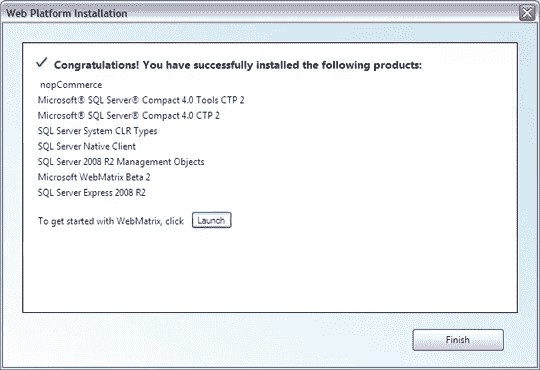
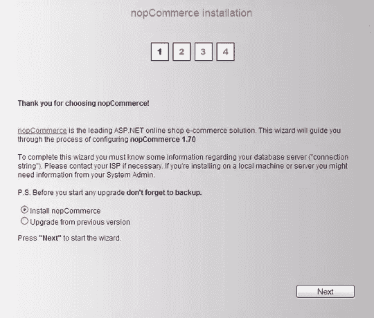
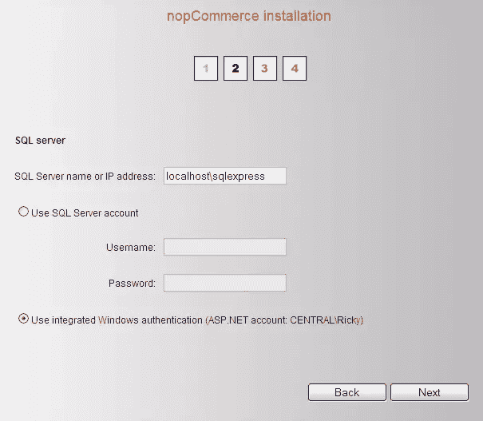
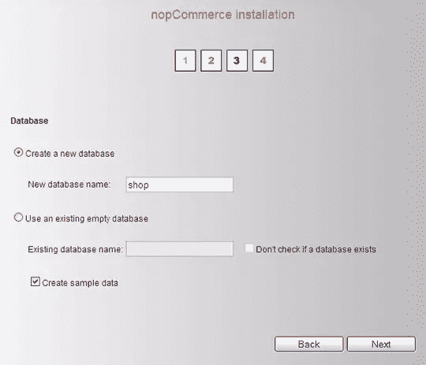
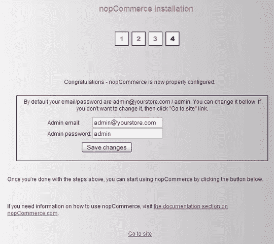
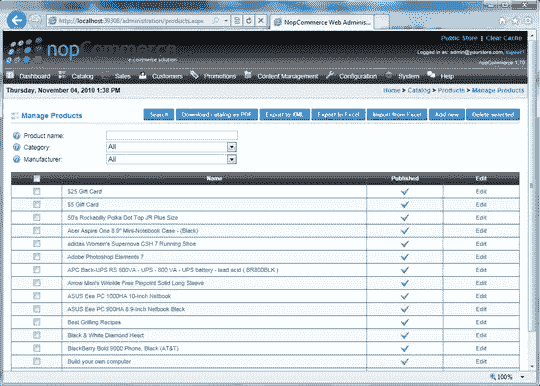
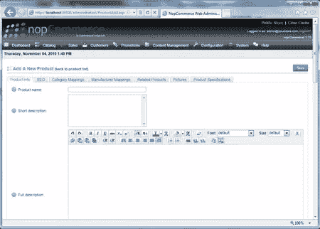

# Web 应用程序库，第 1 部分

> 原文：<https://www.sitepoint.com/microsoft-web-app-gallery-part-1/>

今年 7 月，微软发布了一个测试版的 WebMatrix，这是一套工具，旨在让不一定有太多经验或技术技能的人也能进行 web 开发。为了进一步激励初学者变得有创造性和功能性，微软已经将 WebMatrix Beta 2 作为[免费下载](https://www.sitepoint.com/blog/)。WebMatrix 不仅是一个功能强大的网站编辑器，易于使用，重量轻，不会因为很少使用的功能而过载，还集成了一系列 web 应用程序，为您的网站添加了一些令人印象深刻的功能。Windows Web App Gallery 包括博客、CMS、论坛、图库、工具和维基，但今天我想把重点放在电子商务应用上，因为这个话题已经出现了很多次。事实上，所有其他类别也是如此，但他们可以等待另一天。今天，我要追踪钱的去向。的确，电子商务是一个正在发展的领域，网站所有者、设计者和开发者对此越来越感兴趣。为什么不利用新兴技术省去中间商，通过自己的网站直接销售呢？如图[图 1，“WebMatrix Web 应用程序库”](#fig_appgallery "Figure 1. The WebMatrix Web App Gallery")所示，Windows Web 应用程序库在电子商务下面列出了三个选项: [nopCommerce](https://www.sitepoint.com/blog/) 、 [mojoPortal](https://www.sitepoint.com/blog/) 和 [Kartris](https://www.sitepoint.com/blog/) 。

**图一。WebMatrix 网络应用程序库**

今天，我要看看 nopCommerce 能为我做些什么。提供的描述似乎涵盖了我正在寻找的大部分要点。顺便说一句，所有这三个应用程序都是在 ASP.NET 编写的，至少 WebMatrix 方法的一部分目的是鼓励更多的人熟悉 ASP.NET。有趣的是，这些应用中的两个——以及许多其他应用——是开源的，并且代表了几种编程语言。然而，如果你想让你的 nopCommerce 商店上线，你必须把它安装在 Windows 服务器上。

## 安装

不过，在此之前，我将在我的本地计算机上进行设置。首先，我需要下载 nopCommerce。WebMatrix 作为依赖管理器、下载管理器和安装器，使这变得容易。请注意，您不需要使用 WebMatrix:您也可以使用 Microsoft Web Platform Installer 或直接从 nopCommerce 网站下载。我正在探索 WebMatrix 的集成方法，因此我将选择 nopCommerce，输入一个**网站名称**，然后单击**下一步**。您将看到最终用户许可协议、每个要下载的组件的特定 EULA 条款和条件的链接以及总下载文件大小。如果您没有安装 SQL Server 的版本，您会在 nopCommerce 的下载列表中找到一个。如果你对 EULA 满意，点击**我接受**。然后 WebMatrix 会为你安装 nopCommerce，如图[图 2，“WebMatrix 安装 nop commerce”](#fig_install "Figure 2. WebMatrix installs nopCommerce")。

**图二。WebMatrix 安装 nopCommerce**

点击**完成**，WebMatrix 将展开[图 3 中的屏幕，“WebMatrix 站点管理屏幕”](#fig_admin "Figure 3. The WebMatrix site administration screen")，其中总结了一些站点管理选项。

**图 3。WebMatrix 网站管理屏幕**

稍后还有很多东西要看，但现在我们想完成 nopCommerce 的安装。在**网站名称**的正下方，你会看到你网站本地版本的 URL。点击那个网址。这将启动您的默认浏览器(或一个新的选项卡或窗口，如果您已经打开了浏览器)，并启动 nopCommerce 安装向导，如图[图 4，“nopCommerce 安装屏幕 1”](#fig_wizard1 "Figure 4. nopCommerce Installation Screen 1")所示。

**图 4。nopCommerce 安装屏幕 1**

点击**下一个**。在下面的屏幕上，您可以输入您的服务器详细信息，如图[图 5，“nopCommerce 安装屏幕 2”](#fig_wizard2 "Figure 5. nopCommerce Installation Screen 2")所示。我们将处理站点的本地副本，因此我们将输入 **`localhost/sqlexpress`** 作为 SQL Server 名称。nopCommerce 背后的人特别推荐登录服务器时使用 Windows 身份验证。这允许登录到 Windows 帐户的状态作为访问服务器的授权。

**图 5。nopCommerce 安装屏幕 2**

点击**下一个**。nopCommerce 安装过程的第三页，如图 6[“nop commerce 安装屏幕 3”](#fig_wizard3 "Figure 6. nopCommerce Installation Screen 3")所示，允许您输入数据库信息。

**图 6。nopCommerce 安装屏幕 3**

创建数据库名称，勾选**创建样本数据**框，点击**下一步**。安装向导的最后一步，如图 7[“no commerce 安装屏幕 3”](#fig_wizard4 "Figure 7. nopCommerce Installation Screen 3")所示，让您将默认的管理员电子邮件地址和密码更改为您自己选择的，或者您现在可以接受默认选项**admin@yourstore.com**和**管理员**。

**图 7。nopCommerce 安装屏幕 3**

点击屏幕底部的**转到网站**链接。现在，你看到了吗？就在那里吗？那个是你刚刚建立的电子商务网站。[图 8，“默认的 nopCommerce 前端”](#fig_frontend "Figure 8. The default nopCommerce front end")说明了我的意思。

**图 8。默认的 nopCommerce 前端**

在这一过程的这一点上出现这一结果有点儿神来之笔。前一分钟，您还在努力回忆您是否安装了 SQL Server，下一分钟，您就看到了一台完全配置好、预先安装好、运行正常、外观漂亮的在线销售机器。你可以看到为什么微软发现这个应用程序适合包含在其网络画廊。它非常符合这份简报:通过让潜在的 web 开发人员根据自己的需求修改现有的框架，而不是从头开始构建一个框架，来增强他们的能力。而且它不需要很强的技术知识，尽管你对它了解得越多，你就能做得越多。以工作格式呈现草稿网站，可以让您真正探索网站访问者可以使用的功能。当你探索刚刚创建的网站的结构时，你会注意到 nopCommerce 为我们提供了许多挖掘社交网络商业力量的方法。通过脸书、推特等分享；愿望清单；对比列表；给朋友发电子邮件；客户评级；和用户评论都为网站访问者提供了帮助推销你的产品的途径——而且它们都是内置的。现在，很好地把这些放在一起，毫无疑问你会想要定制你自己的视觉设计。在本文的开始，我提到 WebMatrix 是一个非常有用的网站编辑器，这就是它作为一个理想的工具在发布前编辑网站前端的 HTML 和 CSS 的地方。这本身就是一整篇文章，所以现在我们将把重点放在后端管理上。决定暂时使用默认的视觉设计后，我们将了解如何设置 nopCommerce。

## 管理

要到达后端，像用户一样登录网站，通过主页顶部的**登录**链接。如果您在安装的第 4 步中设置了新的管理员电子邮件和密码，请使用它，否则请使用默认登录。登录后，你会看到一个名为**管理**的链接被添加到顶部工具栏。此链接仅对以管理员权限登录的用户显示。点击**管理**链接显示 nopCommerce 后端仪表板，如图[图 9 所示，“nopCommerce 仪表板”](#fig_dashboard "Figure 9. The nopCommerce Dashboard")。

**图 9。nopCommerce 仪表板**

当金钱受到威胁时，网站管理需要清晰有力，使网站所有者能够维持他们的在线状态，管理订单和销售。在这方面，nopCommerce 表现突出。简单、清晰的布局和逻辑结构增强了功能性。让我们快速浏览一下显示屏顶部的工具栏。**目录**这组字段定义了您的库存:类别和子类别、产品、这些产品可能具有的属性(如颜色和尺寸)以及产品制造商的详细信息。**销售**这些字段涵盖如何处理交易细节，包括管理订单、定期支付、礼品卡和销售报告。您可以在这里管理您的新客户和老客户，为他们分配有助于您向他们营销的角色，并分析他们在线行为的统计数据。**促销**此区域可让您为代销商销售您的产品、产品销售和营销活动、折扣优惠、价目表和促销提供商做出安排。**内容管理**这些字段代表了您可以使用附加内容来增加网站对潜在客户的价值的方式。可供您配置和自定义的选项有投票调查、新闻条目列表、补充博客、专家页面中使用的主题(如常见问题解答)、产品、类别和制造商的模板、给站点访问者的自定义消息，以及设置站点语言选项的方法。**配置**在这里，您可以找到微调客户体验和您满足其需求的能力的设置，包括全球设置、黑名单、支付方式、税务设置、运输选项、以用户为中心的本地化设置，例如您的产品可以销售到的国家、与州和省相关的任何限制或条件、您的客户可以将关键内容翻译成的语言、您将接受的货币，以及将库存分配给特定物理仓库或分销商的选项。**系统**系统菜单包括管理站点日志、消息队列和一般站点维护任务的选项。网站管理支持有两个主要来源:由 nopCommerce 维护的用户论坛，旨在让有经验的用户为有疑问的用户解决问题；和用户指南，可从 nopCommerce 网站付费下载。以上是概述。让我们把手弄脏吧。

## 添加产品

返回到**目录**菜单，将光标悬停在**产品**上以显示弹出菜单。点击**管理产品**，如图[图 10，“管理产品”](#fig_manageproducts "Figure 10. Manage Products")。

**图 10。管理产品**

主显示屏是您所有产品的列表，按标题的字母顺序排列。有三种方式过滤该显示:按产品名称、类别和制造商，或使用**搜索**按钮应用选定的过滤器。还可以下载 PDF 格式的目录，将其导出到`.xml`文件，导出到 Excel 电子表格，从 Excel 电子表格导入产品数据，以及删除选定的产品。这些都是强有力的工具，让你以最少的忙乱保持股票控制，但我们现在想要的选项是**添加新的**。

**图 11。添加新产品**

添加新产品窗口顶部的三个选项卡如图[所示图 11，“添加新产品”](#fig_addnew "Figure 11. Add a New Product")代表与您的产品相关的信息类别。并非所有这些都必须完成，但有些是电子商务设置必须完成的。

**Product Info**This page has fields that accept information describing the product itself. Easy to browse through with little tool tips to guide you, these fields range from the obvious (short description, long description, price) to the highly flexible, powerful, and clever.For example, you can enter a figure reflecting stock levels for a product. This figure decreases as you sell your product. When stock gets low, you can opt to disable the **Buy** button (continuing to display the product but not allowing orders), unpublish the product (remove it from display), or do nothing (allow it to sell out). You can choose to be notified when stock quantity reaches a certain point, and you can allow orders to be placed even though the product is out of stock.Really, just browsing these fields will give you ideas about how to sell online. Note that some of the fields offer drop menus of available options. These options can be set by you in the Catalog and Configuration administration.**SEO**nopCommerce keeps your search engine optimizations simple and purposeful. For each product, you can set a list of meta keywords, a meta description, a meta title, and a search engine-friendly page name.How useful these are depends on how well you use them as part of an overall SEO strategy. The good news is that a setup like this lets you experiment easily.**Category Mappings**This is a very powerful part of nopCommerce. Naturally, you can give your products categories and subcategories that you define yourself — you’d expect that. But nopCommerce lets you map your products to multiple categories and subcategories. This gives you great flexibility in the way you market your products. It’s another area that will make think seriously about your product.**Manufacturer Mappings**Another key way in which consumers go about searching out desirable products is by searching for the manufacturer. Given that, it makes sense to categorize your product by manufacturer. Once again, nopCommerce allows you to map one product to multiple manufacturers, which can in turn be subcategorized.**Related Products**Once you’ve saved your product details, you can use this page to relate it to other products, allowing you to display the kind of “If you like that, you might like this” functionality that has become very popular.**Pictures**This is where you’ll be able to add the images that you display for each product. You can upload your pictures and set an order for their display.**Product Specifications**Here you can select from pre-configured product specification attributes and the options for each attribute, as well as add your own to the current record only, on the fly. So if you were selling computers and this product record was for a notebook, you could specify here the screen size as an attribute and the available sizes as a list of attribute options. You can then choose to allow your customers to filter the display of products by each attribute. You can also choose whether or not to display these attributes on the product page, and in which order.If you’re at all familiar with ecommerce systems, you’ll probably have recognized a lot of the features and facilities in nopCommerce. At this point, I’d ask you to consider whether you’ve ever seen all of those options providing such powerful functionality laid out in such an easy-to-use, point-and-click kind of way, for free?Speaking of money, it’s time we took a look at the business end of nopCommerce.

## 支付整合

支付集成是 nopCommerce 的真正优势。36 个支付提供商选项包括 PayPal、Google Checkout、Worldpay 和 2Checkout。与这么多支付提供商达成协议是一个明智的举动，让 nopCommerce 领先于许多竞争对手。让我们设置我们的网站接受通过贝宝支付。PayPal 提供了一个选项，在通过您的网站付款时通知您，所以让我们这样做吧。您必须在您的 PayPal 帐户资料中激活 PDT 和自动返回，并获得 PDT 身份令牌，您将在 nopCommerce 后端的相应字段中输入该令牌。此令牌用于您发送给 PayPal 的所有 PDT 通信。按照以下步骤配置您的 PDT 帐户:

1.  登录你的 PayPal 账户，点击**个人资料**子标签，在**卖家偏好**栏，点击**网站支付偏好**。
2.  在**网站付款自动返回**下，将上的单选按钮切换到**。**
3.  在**返回 URL** 字段中，输入客户付款后将接收 PayPal 发布的交易 ID 的网站的 URL，`http://www.yourstore.com/PaypalPDTHandler.aspx`。
4.  在**支付数据传输**下，将上的单选按钮切换到**，点击**保存**按钮。**
5.  现在再次点击**网站支付偏好**，向下滚动到**支付数据传输**。你会看到你的**身份令牌**。
6.  回到你的 nopCommerce 管理页面，从**配置**菜单中，选择**支付**，然后选择**支付方式**。您将看到可能的支付方式和提供商的完整列表。
7.  点击**编辑 PayPal 标准**。
8.  切换到**配置**选项卡，向下滚动到页面底部。
9.  你现在需要做的就是输入一个有效的电子邮件地址，并将你的 PayPal 身份令牌复制到 **PTI 身份令牌**字段。
10.  切换回**系统信息**选项卡，勾选标题为**激活**的复选框。
11.  点击蓝色**保存**按钮，就大功告成了。

现在，如果你在 localhost 上打开网站的草稿版，像购买产品一样点击，直到进入选择支付方式页面，你会看到 PayPal Standard 现在作为一种支付方式出现在其他支付方式旁边。当然，该列表与 nopCommerce administration 支付方式页面上标记为 **Active** 的支付方式相关。这是管理在线支付的一种非常简单的方式。

## 摘要

这是一个强大的小应用 nopCommerce 的衡量标准，一方面，它可以如此快速地构建一个草稿网站，并毫无痛苦地添加一种支付方法，另一方面，它足够复杂，可以接受与产品和如何购买有关的 50 多个变量。正如我们在添加产品记录时看到的，充分利用 nopCommerce 这样的应用程序的关键是做好功课。你——或者你的客户，或者雇主——对那些可能影响潜在客户购买你的产品的决定的变量了解得越多，你的网站就能为完成销售做得越多。

**SitePoint Content Partner**

本教程是在微软的支持下完成的。我们与微软合作，由 SitePoint 独立编写，努力共同开发对您最有用、最相关的内容。

这种复杂的 web 开发现在几乎每个人都可以使用，因为它几乎不需要任何类型的代码知识。微软在拥抱开源社区方面做得很好，因为它填充了它的 Web 应用程序库。像 [nopCommerce](https://www.sitepoint.com/blog/) 这样强大、智能且易于使用的网络应用，由活跃的开发者社区支持，并通过 [WebMatrix](https://www.sitepoint.com/blog/) 这样的工具免费提供，将会赢得很多朋友。介意测试一下你对这篇文章的了解吗？继续，[参加测验](https://www.sitepoint.com/quiz/microsoft/web-app-gallery-part-1/)！

## 分享这篇文章